# Documentación del Ciclo 1 — Plataforma FashionStore

**Proceso Unificado de Desarrollo de Software (PUDS) + UML 2.5+** · Grupo #29 · Sistemas de Información II

Este documento reúne **toda** la documentación del **Ciclo 1** (primer examen parcial) en un
solo archivo: captura de requisitos, análisis, diseño, implementación y pruebas, organizados
según los cinco flujos de trabajo del PUDS (antes repartidos en once archivos `*_ciclo1.md`,
ahora consolidados aquí).

**Documentos que se mantienen aparte** (son de todo el proyecto, no solo del Ciclo 1):
`Contexto.md` (perfil, marco teórico, requisitos, lista maestra de 40 CU),
`PaquetesUML.md` (diagrama de paquetes de los 8 paquetes / 40 CU),
`BaseDeDatos.md` (diseño físico completo de la base de datos).

---

## Índice

- **0. Resumen del Ciclo 1**
- **1. Captura de Requisitos**
  - 1.1 Identificación de actores y casos de uso
  - 1.2 Priorización de casos de uso
  - 1.3 Detallar casos de uso (15 fichas + notas CU12/CU13 + estereotipos)
  - 1.4 Prototipado de interfaz de usuario
  - 1.5 Estructurar el modelo de casos de uso
- **2. Análisis**
  - 2.1 Análisis de arquitectura
  - 2.2 Analizar casos de uso — Diagramas de comunicación
  - 2.3 Análisis de clases (Interfaz / Control / Entidad)
  - 2.4 Análisis de paquete — Acoplamiento y cohesión
- **3. Diseño**
  - 3.1 Diseño de arquitectura (lógico en 4 capas + físico de despliegue)
  - 3.2 Diseño de casos de uso (secuencia + navegación + estado/tiempo)
  - 3.3 Diseño de datos
- **4. Implementación**
  - 4.1 Selección de la plataforma de software
  - 4.2 Implementación de la arquitectura del sistema principal
  - 4.3 Implementación de la arquitectura de los subsistemas (paquetes)
- **5. Pruebas**
- **6. Trazabilidad**

---

## 0. Resumen del Ciclo 1

### 0.1 Alcance

El Ciclo 1 implementa **15 casos de uso** (numeración: lista maestra de 40 CU de `Contexto.md`):

> **CU01, CU02, CU03, CU04, CU05, CU06, CU07, CU08, CU09, CU10, CU11, CU14, CU36, CU37, CU38.**

Cubre la **infraestructura base** del sistema: seguridad y usuarios, catálogo y sucursales,
proveedores e ingreso de mercadería, **valoración de inventario por costo promedio ponderado**,
**ajustes de inventario (mermas)**, consulta del catálogo por el cliente (**catálogo enriquecido:
galería de fotos, prendas multicolor, categorías con imagen, oferta directa por prenda y vista de
detalle**), **reseñas y favoritos de prendas (CU14, versión ligera)** y bitácora de auditoría.

> **CU14 se adelanta al Ciclo 1 en versión ligera:** el cliente con sesión califica (1–5★) y
> comenta una prenda (una reseña por prenda, editable, sin moderación) y marca prendas como
> favoritas (♥). La wishlist con listas múltiples y las reseñas con moderación quedan para el
> Ciclo 2. La **oferta directa por prenda** (`compare_at_price`) es un adelanto puntual del
> ámbito de CU13 y se documenta **dentro de CU07** (no cuenta como CU nuevo).

### 0.2 Arquitectura de paquetes (los 8 paquetes del sistema)

El sistema completo se modela en **8 paquetes lógicos** con nombres en español (`snake_case`),
idénticos en documentación y en código. El Ciclo 1 tiene código en 4 de ellos.

| # | Paquete | Propósito | CU del Ciclo 1 |
| :- | :--- | :--- | :--- |
| 1 | `seguridad_y_usuarios` | Autenticación JWT, RBAC, perfiles/roles/clientes, auditoría | CU01, CU02, CU03, CU04, CU05, CU36 |
| 2 | `catalogo_y_tiendas` | Sucursales físicas, su personal, el catálogo unificado de prendas y la tienda del cliente (detalle, reseñas y favoritos) | CU06, CU07, CU09, CU11, CU14 |
| 3 | `inventario_y_proveedores` | Stock real por sucursal, proveedores, abastecimiento, valoración y ajustes | CU08, CU10, CU37, CU38 |
| 4 | `ventas_y_pagos` | Carrito, checkout, POS, facturación IVA 13 % | *(solo modelos base en Ciclo 1)* |
| 5 | `reservas_y_citas` | Flujo online-to-offline para probarse ropa | — (Ciclo 3) |
| 6 | `envios_y_logistica` | Delivery, método de envío/recojo, zonas y tarifas, tracking | — (Ciclo 3) |
| 7 | `inteligente_y_analitica` | Realidad Aumentada, IA, chatbot, NLP por voz, reportes, dashboard | — (Ciclo 3) |
| 8 | `notificaciones` | Alertas en tiempo real y correos transaccionales | — (Ciclo 3) |

El diagrama de paquetes completo del sistema (con los 40 CU y las dependencias entre paquetes)
está en `PaquetesUML.md`; la vista del Ciclo 1 está en la §2.1 de este documento.

### 0.3 Alcance por canal (Móvil vs Web)

> - **App Móvil (Flutter):** exclusiva para el **cliente final** (autenticación, consulta de
>   catálogo, vista de detalle de prenda, reseñas y favoritos). No incluye funciones
>   administrativas.
> - **Frontend Web (Angular):** atiende **dos audiencias** en el mismo sitio, separadas por rol
>   tras el inicio de sesión:
>   - **Personal** (`SUPERADMIN` / `ENCARGADO` / `CAJERO`) → **panel administrativo** (`/admin/...`).
>   - **Cliente** (`CLIENTE`) → **tienda del cliente** (`/tienda`).
> - **Separación cliente / administrador:** el registro público (`CU04`) **siempre** crea rol
>   `CLIENTE`; las cuentas de personal solo las crea un `SUPERADMIN` (CU05 / CU09).

| ID | Caso de uso | Móvil | Web | Backend | Paquete |
| :-- | :-- | :-: | :-: | :-: | :-- |
| CU01 | Iniciar sesión (cliente y personal) | ✅ | ✅ | ✅ | `seguridad_y_usuarios` |
| CU02 | Cerrar sesión | ✅ | ✅ | ✅ | `seguridad_y_usuarios` |
| CU03 | Recuperar credenciales (enlace por correo, 5 min) | ✅ | ✅ | ✅ | `seguridad_y_usuarios` |
| CU04 | Auto-registro de cliente | ✅ | ✅ | ✅ | `seguridad_y_usuarios` |
| CU05 | Gestionar perfiles, roles y clientes | ❌ | ✅ | ✅ | `seguridad_y_usuarios` |
| CU06 | Gestionar sucursales | ❌ | ✅ | ✅ | `catalogo_y_tiendas` |
| CU07 | Gestionar catálogo (galería, prendas multicolor, categorías con foto, oferta) | ❌ | ✅ | ✅ | `catalogo_y_tiendas` |
| CU08 | Gestionar proveedores | ❌ | ✅ | ✅ | `inventario_y_proveedores` |
| CU09 | Gestionar empleados | ❌ | ✅ | ✅ | `catalogo_y_tiendas` |
| CU10 | Registrar compras / ingresos de mercadería | ❌ | ✅ | ✅ | `inventario_y_proveedores` |
| CU11 | Consultar catálogo (cliente): categorías, grilla lookbook y detalle de prenda | ✅ | ✅ | ✅ | `catalogo_y_tiendas` |
| CU14 | Reseñas y favoritos de prendas (versión ligera) | ✅ | ✅ | ✅ | `catalogo_y_tiendas` |
| CU37 | Consultar valoración de inventario / capital invertido | ❌ | ✅ | ✅ | `inventario_y_proveedores` |
| CU38 | Gestionar ajustes de inventario (mermas, daños, pérdidas) | ❌ | ✅ | ✅ | `inventario_y_proveedores` |
| CU36 | Consultar bitácora de auditoría | ❌ | ✅ | ✅ | `seguridad_y_usuarios` |

---

# 1. Captura de Requisitos

## 1.1 Identificación de actores y casos de uso

### Actores del Ciclo 1

| # | Actor | Tipo | Interviene en |
| :-- | :--- | :--- | :--- |
| 1 | **Visitante** (usuario anónimo, no autenticado) | Humano primario | CU11 |
| 2 | **Cliente** (rol `CLIENTE`) | Humano primario | CU01, CU02, CU03, CU04, CU11, CU14 |
| 3 | **Superadmin** (rol `SUPERADMIN`) | Humano primario | CU01, CU02, CU05, CU06, CU07, CU08, CU09, CU10, CU36, CU37, CU38 |
| 4 | **Encargado de sucursal** (rol `ENCARGADO`) | Humano primario | CU01, CU02, CU10, CU37, CU38 |
| 5 | **Cajero** (rol `CAJERO`) | Humano primario | CU01, CU02 |
| 6 | **Proveedor** | Humano de apoyo | Entidad registrada por el personal (CU08) y referenciada en CU10; no inicia sesión en el Ciclo 1 |
| 7 | **Servicio de correo (SMTP)** | Sistema externo | CU03 (entrega del enlace de recuperación) |
| 8 | **Reloj del sistema / Temporizador** | Actor "Tiempo" | CU02 (expiración del JWT y del token de recuperación, cierre por inactividad) |

**Herencia de actores** (generalización): `Usuario` ⭅ `Cliente` / `Empleado`;
`Empleado` ⭅ `Superadmin` / `Encargado` / `Cajero`.

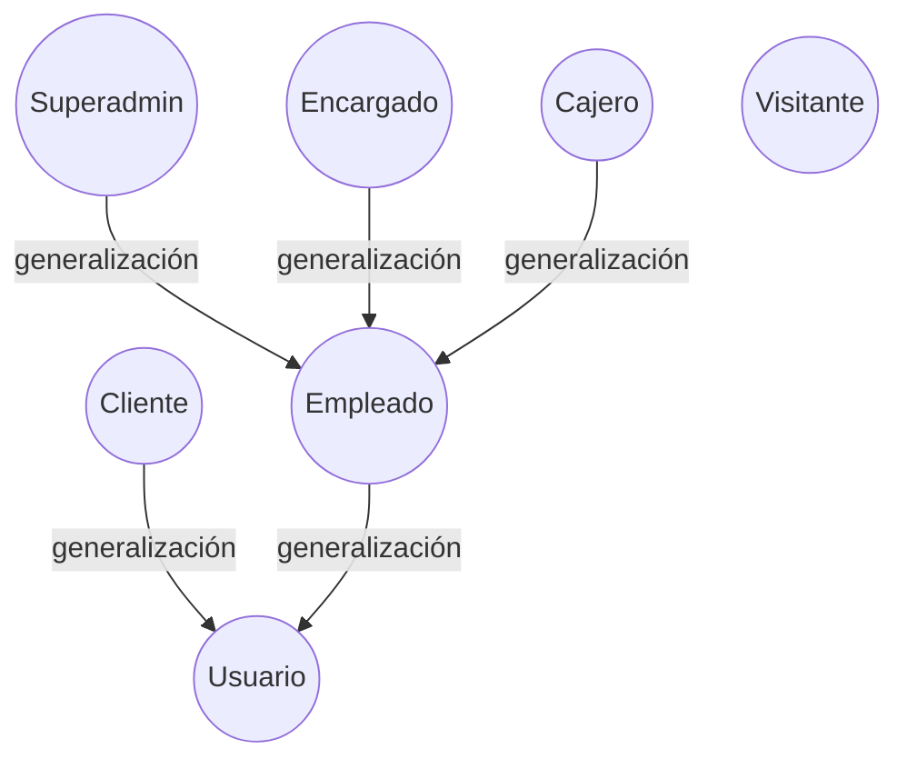

* **Visitante** no hereda de `Usuario`: solo consulta el catálogo público (CU11). Al
  registrarse (CU04) se convierte en **Cliente**.

> **Separación cliente / personal:** el auto-registro (CU04) **siempre** crea el rol `CLIENTE`;
> el formulario no permite elegir rol y el backend lo fuerza. Nadie se auto-registra como
> administrador.

### Matriz Actor ↔ Caso de uso (Ciclo 1)

| Caso de uso | Visitante | Cliente | Superadmin | Encargado | Cajero |
| :--- | :---: | :---: | :---: | :---: | :---: |
| CU01 Iniciar sesión | | ✅ | ✅ | ✅ | ✅ |
| CU02 Cerrar sesión | | ✅ | ✅ | ✅ | ✅ |
| CU03 Recuperar credenciales | ✅¹ | ✅¹ | ✅¹ | ✅¹ | ✅¹ |
| CU04 Auto-registro de cliente | ✅ | | | | |
| CU05 Gestionar perfiles, roles y clientes | | | ✅ | | |
| CU06 Gestionar sucursales | | | ✅ | | |
| CU07 Gestionar catálogo | | | ✅ | | |
| CU08 Gestionar proveedores | | | ✅ | | |
| CU09 Gestionar empleados | | | ✅ | | |
| CU10 Registrar ingresos de mercadería | | | ✅ | ✅ | |
| CU37 Consultar valoración de inventario | | | ✅ | ✅ | |
| CU38 Gestionar ajustes de inventario | | | ✅ | ✅ | |
| CU11 Consultar catálogo | ✅ | ✅ | ✅ | ✅ | ✅ |
| CU14 Reseñas y favoritos de prendas | | ✅ | | | |
| CU36 Consultar bitácora de auditoría | | | ✅ | | |

¹ CU03 siempre lo inicia un **usuario no autenticado** (olvidó su contraseña), sin importar el rol de esa cuenta.

---

## 1.2 Priorización de casos de uso

| ID | Caso de uso | Móvil | Web | Prioridad | Esfuerzo | Tipo |
| :-- | :-- | :-: | :-: | :-- | :-- | :-- |
| CU01 | Iniciar sesión | ✅ | ✅ | Alta | Medio | Transacción de seguridad |
| CU02 | Cerrar sesión | ✅ | ✅ | Alta | Bajo | Transacción de seguridad |
| CU03 | Recuperar credenciales | ✅ | ✅ | Media | Medio | Transacción de seguridad |
| CU04 | Auto-registro de cliente | ✅ | ✅ | Alta | Medio | Registro (base) |
| CU05 | Gestionar perfiles, roles y clientes | | ✅ | Alta | Medio | Registro (base) |
| CU06 | Gestionar sucursales | | ✅ | Alta | Bajo | Registro (base) |
| CU07 | Gestionar catálogo | | ✅ | Alta | Alto | Registro compuesto (prenda → variantes + galería + oferta) |
| CU08 | Gestionar proveedores | | ✅ | Media | Bajo | Registro (base) |
| CU09 | Gestionar empleados | | ✅ | Media | Medio | Registro compuesto (`«include»` CU05 + CU06) |
| CU10 | Registrar compras / ingresos de mercadería | | ✅ | Alta | Alto | **Transacción ACID** (stock + libro mayor + costo promedio) |
| CU11 | Consultar catálogo (cliente) | ✅ | ✅ | Alta | Medio | Consulta (categorías + grilla lookbook + detalle de prenda) |
| CU14 | Reseñas y favoritos de prendas (versión ligera) | ✅ | ✅ | Media | Medio | Registro simple (reseña *upsert* + toggle de favorito) |
| CU37 | Consultar valoración de inventario | | ✅ | Alta | Medio | Consulta con cálculo (prorrateo) |
| CU38 | Gestionar ajustes de inventario | | ✅ | Media | Medio | **Transacción ACID** (stock + libro mayor + auditoría) |
| CU36 | Consultar bitácora de auditoría | | ✅ | Media | Bajo | Consulta (solo lectura) |

Se difieren al **Ciclo 2**: CU12 (buscar/filtrar avanzado por talla/color/precio/ocasión +
disponibilidad por sucursal), CU13 (**cupones y ofertas de temporada programadas** — la **oferta
directa por prenda** se adelanta dentro de CU07), la **wishlist avanzada y las reseñas con
moderación** (ampliación de CU14), y CU15–CU24 (inventario general, carrito, checkout, factura,
cotización, devoluciones, arqueo, historial). Al **Ciclo 3**: CU25–CU35, CU39, CU40.

---

## 1.3 Detallar casos de uso

> **Orden de documentación de cada CU (indicación de cátedra):**
> (1) **diseñar** el caso de uso (diagrama con actor + estereotipos → §1.5),
> (2) al lado el **prototipo de interfaz** (→ §1.4),
> (3) por último la **tabla de detalle** (esta sección).

### 1.3.1 · CU01: Iniciar sesión [Prioridad: Alta]

| Campo | Descripción |
| :--- | :--- |
| **Caso de Uso** | CU01 : Iniciar sesión |
| **Propósito** | Restringir y asegurar el acceso a la plataforma (Web / Móvil), autenticando la identidad del usuario. |
| **Descripción** | Un usuario registrado (Cliente o personal administrativo) ingresa sus credenciales; el sistema le asigna un token de sesión (JWT) y lo enruta según su rol: el personal al panel administrativo y el cliente a la tienda. |
| **Actores** | Cliente, Superadmin, Encargado, Cajero. |
| **Actor iniciador** | Usuario no autenticado (Cliente o empleado). |
| **Tablas** | `users`, `roles`, `user_roles`, `session_tokens`, `audit_logs` |
| **Precondición** | El usuario está registrado y su estado lógico es "Activo" (`is_active = true`). |
| **Flujo principal** | 1. El actor abre la app móvil o el sitio web.<br>2. El sistema muestra el formulario de inicio de sesión.<br>3. El actor introduce Correo y Contraseña y envía la petición.<br>4. El sistema **normaliza el correo a minúsculas** (es único e insensible a mayúsculas), verifica que el usuario exista y compara el hash de la contraseña (BCrypt).<br>5. El sistema genera un JWT único (con `jti` e `iat`) y expiración de 60 min, y guarda la sesión en `session_tokens`.<br>6. El sistema registra la acción `LOGIN` en `audit_logs` (usuario, IP).<br>7. El sistema devuelve el token y los roles; el frontend enruta: personal → `/admin/dashboard`, cliente → `/tienda`. |
| **Post condición** | El usuario queda autenticado hasta que expire o se revoque su JWT. El ingreso queda registrado en la bitácora. |
| **Reglas** | El correo se guarda y se busca **en minúsculas** en CU01, CU04 y CU05, de modo que registrarse desde la web e iniciar sesión desde el móvil (o viceversa) siempre coordinan. |
| **Excepciones** | **E1: Credenciales inválidas** (falla el paso 4): "Correo electrónico o contraseña incorrectos".<br>**E2: Usuario inactivo**: "Cuenta de usuario desactivada".<br>**E3: Sin conexión con el servidor:** el cliente muestra la URL del backend a la que intentó conectarse y cómo configurarla (`--dart-define=API_HOST` / `API_BASE_URL` en móvil). |

### 1.3.2 · CU02: Cerrar sesión [Prioridad: Media]

| Campo | Descripción |
| :--- | :--- |
| **Caso de Uso** | CU02 : Cerrar sesión |
| **Propósito** | Finalizar de forma segura la sesión activa de un usuario en su dispositivo. |
| **Descripción** | El usuario invalida su token de acceso actual para que nadie pueda operar a su nombre en ese dispositivo. También lo dispara el sistema por vencimiento o inactividad. |
| **Actores** | Cualquier usuario autenticado; Reloj del sistema (cierre automático). |
| **Actor iniciador** | Usuario autenticado (o el Temporizador del sistema). |
| **Tablas** | `session_tokens`, `audit_logs` |
| **Precondición** | El usuario tiene una sesión abierta con un JWT válido. |
| **Flujo principal** | 1. El actor pulsa "Cerrar sesión" (**web**: sidebar del panel o menú de la tienda; **móvil**: menú de la barra superior).<br>2. El sistema pide confirmación.<br>3. El sistema envía el token actual al servidor.<br>4. El sistema marca el token como revocado (`is_revoked = true`).<br>5. El sistema registra `LOGOUT` en `audit_logs`.<br>6. El sistema borra las credenciales del almacenamiento local y redirige al login. |
| **Post condición** | La sesión queda invalidada; todo intento futuro de usar el mismo JWT se rechaza (HTTP 401). |
| **Excepciones** | **E1: Token ya expirado o inválido:** el sistema solo limpia los datos locales y redirige al login.<br>**E2: Cierre automático:** al vencer el JWT (60 min) o tras 15 min de inactividad, el sistema revoca la sesión. |

### 1.3.3 · CU03: Recuperar credenciales [Prioridad: Media]

| Campo | Descripción |
| :--- | :--- |
| **Caso de Uso** | CU03 : Recuperar credenciales |
| **Propósito** | Permitir que un usuario restablezca su contraseña cuando la olvidó. |
| **Descripción** | El usuario solicita el restablecimiento con su correo; el sistema genera un token temporal y le envía **un enlace por correo electrónico**. La pantalla de "nueva contraseña" **solo se abre al tocar ese enlace** (con el token ya incluido en la URL) — **nunca se pide un token/código a mano**. El enlace vence a los 5 minutos y es de un solo uso. |
| **Actores** | Usuario no autenticado; Servicio de correo (SMTP). |
| **Actor iniciador** | Usuario no autenticado. |
| **Tablas** | `users` (`reset_token`, `reset_token_expires`), `audit_logs` |
| **Precondición** | El usuario conoce el correo con el que se registró. |
| **Flujo principal** | 1. El actor entra a "¿Olvidaste tu contraseña?" e ingresa su correo.<br>2. El sistema genera un token único con vencimiento de 5 minutos y envía por SMTP un correo con el enlace `<FRONTEND_URL>/recover?token=…`.<br>3. El sistema muestra **solo** la confirmación *"Si el correo está registrado, te llegó un enlace. Vence en 5 minutos."*<br>4. El actor abre el enlace desde su bandeja de entrada.<br>5. El enlace abre la página web "Nueva contraseña" **con el token ya aplicado**; el actor solo escribe y confirma la nueva contraseña.<br>6. El sistema valida el token y su vigencia, actualiza el hash y anula el token.<br>7. El sistema registra `RECOVER` / `RESET_PASSWORD` en `audit_logs` y redirige al inicio de sesión. |
| **Post condición** | La contraseña queda modificada y el token temporal queda inservible. |
| **Nota móvil** | En la app, el paso 1 llega hasta la confirmación "revisa tu correo". El restablecimiento se realiza en la **página web** que abre el enlace (responsiva); la app no tiene pantalla de "pegar token". |
| **Nota de desarrollo** | Si el backend corre **sin SMTP configurado**, la respuesta incluye `dev_reset_link` (y se imprime en la consola del servidor) para poder probar el flujo completo. En producción, con SMTP activo, nunca se expone. |
| **Excepciones** | **E1: Correo no registrado:** por seguridad el sistema no revela si el correo existe; responde siempre el mensaje neutro.<br>**E2: Token expirado o ya usado:** "El enlace es inválido o expiró (5 minutos)".<br>**E3: SMTP no disponible:** el token igualmente se genera; el enlace se registra en la consola. |

### 1.3.4 · CU04: Auto-registro de cliente [Prioridad: Alta]

| Campo | Descripción |
| :--- | :--- |
| **Caso de Uso** | CU04 : Auto-registro de cliente |
| **Propósito** | Permitir que una persona cree su propia cuenta de cliente, desde la app móvil o el sitio web. |
| **Descripción** | El visitante ingresa sus datos básicos; el sistema crea el usuario y le asigna automáticamente el rol `CLIENTE`. No es posible elegir otro rol. |
| **Actores** | Visitante (usuario nuevo). |
| **Actor iniciador** | Usuario no registrado (app móvil o sitio web). |
| **Tablas** | `users`, `roles`, `user_roles`, `audit_logs` |
| **Precondición** | El correo ingresado no está registrado previamente. |
| **Flujo principal** | 1. El actor entra a "Crear cuenta".<br>2. El sistema muestra el formulario (Nombres, Apellidos, Teléfono, Correo, Contraseña).<br>3. El actor completa el formulario, acepta los términos y envía.<br>4. El sistema **normaliza el correo a minúsculas**, valida su formato y que no exista.<br>5. El sistema valida la fortaleza de la contraseña (≥8, mayúscula, minúscula, número, carácter especial `@$!%*?&`).<br>6. El sistema encripta la contraseña (BCrypt), crea el usuario y le asigna el rol `CLIENTE`.<br>7. El sistema registra `REGISTER` en `audit_logs` y notifica el éxito.<br>8. El actor inicia sesión (CU01) — con el mismo correo, sin importar mayúsculas — y accede a la tienda. |
| **Post condición** | Se crea un usuario activo con rol `CLIENTE`. |
| **Excepciones** | **E1: Correo duplicado:** "El correo electrónico ya se encuentra registrado".<br>**E2: Contraseña débil:** el sistema indica los requisitos incumplidos.<br>**E3: Contraseñas no coinciden:** el sistema lo advierte antes de enviar. |

### 1.3.5 · CU05: Gestionar perfiles, roles y clientes [Prioridad: Alta]

| Campo | Descripción |
| :--- | :--- |
| **Caso de Uso** | CU05 : Gestionar perfiles, roles y clientes |
| **Propósito** | Administrar las cuentas del personal interno (y de clientes) y asignarles permisos mediante roles. |
| **Descripción** | El Superadmin crea cuentas para el personal (`ENCARGADO`, `CAJERO`) o para otros administradores, edita sus datos y roles, y los da de baja lógicamente. |
| **Actores** | Superadmin. |
| **Actor iniciador** | Superadmin. |
| **Tablas** | `users`, `roles`, `user_roles`, `audit_logs` |
| **Precondición** | El iniciador está autenticado con el rol `SUPERADMIN`. |
| **Flujo principal** | 1. El Superadmin entra al módulo "Usuarios y Roles".<br>2. El sistema muestra el listado de usuarios (filtro por rol y búsqueda).<br>3. El Superadmin pulsa "Nuevo Usuario" y completa el formulario, marcando uno o más roles.<br>4. El sistema valida el correo, encripta la contraseña, crea el usuario y le asigna los roles.<br>5. El sistema registra `INSERT` / `UPDATE` / desactivación en `audit_logs`.<br>6. El sistema actualiza el listado. |
| **Post condición** | Se crea, edita o desactiva la cuenta solicitada. |
| **Excepciones** | **E1: Correo existente:** "El correo electrónico ya existe".<br>**E2: Falta de permisos:** **HTTP 403** si el rol no es `SUPERADMIN`. |

### 1.3.6 · CU06: Gestionar sucursales [Prioridad: Alta]

| Campo | Descripción |
| :--- | :--- |
| **Caso de Uso** | CU06 : Gestionar sucursales |
| **Propósito** | Mantener el registro de las tiendas físicas de la cadena y su personal asignado. |
| **Descripción** | El Superadmin registra nuevas sucursales (nombre, dirección, teléfono, coordenadas, estado), las edita, las desactiva y asigna o retira empleados (`ENCARGADO` / `CAJERO`) de cada una. |
| **Actores** | Superadmin. |
| **Actor iniciador** | Superadmin. |
| **Tablas** | `branches`, `branch_employees`, `users`, `audit_logs` |
| **Precondición** | El Superadmin está autenticado. |
| **Flujo principal** | 1. El actor entra al módulo "Sucursales".<br>2. El actor pulsa "Nueva Sucursal" e ingresa nombre, dirección, teléfono y coordenadas.<br>3. El sistema valida que el nombre no exista y guarda la sucursal.<br>4. El actor asigna un `ENCARGADO` o `CAJERO` existente a la sucursal.<br>5. El sistema valida el rol y lo vincula en `branch_employees`.<br>6. El sistema registra la operación en `audit_logs`. |
| **Post condición** | La cadena cuenta con la sucursal registrada y su personal asignado, lista para recibir inventario. |
| **Excepciones** | **E1: Nombre de sucursal duplicado.**<br>**E2: Datos obligatorios faltantes** (nombre o dirección).<br>**E3: Empleado con rol inválido:** solo `ENCARGADO` o `CAJERO`. |

### 1.3.7 · CU07: Gestionar catálogo [Prioridad: Alta]

| Campo | Descripción |
| :--- | :--- |
| **Caso de Uso** | CU07 : Gestionar catálogo |
| **Propósito** | Administrar las prendas, sus parámetros (categorías **con imagen**, tallas, colores, temporadas), su **galería de fotos**, su **precio de oferta** y sus variantes (color + talla + SKU). |
| **Descripción** | El Superadmin parametriza el catálogo y da de alta, edita u oculta prendas, definiendo por cada una su categoría, temporada, precio base, **precio antes (oferta)**, una **galería de 2–5 fotos** (cada foto asociable a un color) y sus variantes. Los **colores son multivaluados** (una prenda puede combinar varios colores); en la tienda el cliente elige el color y cambian las fotos y las tallas disponibles. Las variantes se pueden **editar también al modificar** la prenda (no solo al crearla): las que se quitan se marcan `is_active = false` y las nuevas se insertan validando el SKU. |
| **Actores** | Superadmin. *(En ciclos posteriores se prevé habilitar también al Encargado.)* |
| **Actor iniciador** | Superadmin. |
| **Tablas** | `products` (+ `compare_at_price`), `product_variants`, `product_images` (galería, `color_id` nullable), `categories` (+ `image_url`), `seasons`, `colors`, `sizes`, `audit_logs` |
| **Precondición** | Deben existir al menos una categoría, una talla y un color parametrizados. |
| **Flujo principal** | 1. El actor entra al módulo "Catálogo".<br>2. El actor agrega, si hace falta, categorías (**con su foto circular**), tallas, colores o temporadas (alta rápida).<br>3. El actor pulsa "Nueva Prenda" e ingresa nombre, **descripción detallada**, precio base, **precio antes (oferta, opcional)**, categoría y temporada.<br>4. El actor sube la **galería de fotos** (2–5) y marca una como principal; opcionalmente asocia cada foto a un color.<br>5. El actor define una o más variantes (color + talla + SKU).<br>6. El sistema valida los SKU y la unicidad de la combinación producto+color+talla, calcula el **% de descuento** (`round((1 − base/antes)·100)`) y guarda la estructura Prenda → Galería + Variantes.<br>7. El sistema registra `INSERT` / `UPDATE` en `audit_logs` (incluye subida de imagen y cambio de oferta).<br>8. El actor puede editar la prenda (datos, galería, oferta, variantes) u **ocultarla** del catálogo (baja lógica, `is_active = false`). |
| **Post condición** | La prenda queda creada, modificada u oculta; si está visible aparece en la tienda del cliente (CU11) con su galería, su oferta y su ★ promedio (CU14), y puede abastecerse (CU10). |
| **Excepciones** | **E1: SKU o combinación color/talla repetida.**<br>**E2: Precio antes ≤ precio base:** no se muestra oferta (descuento 0 %).<br>**E3: Falta de permisos:** HTTP 403 si el rol no es `SUPERADMIN`. |

### 1.3.8 · CU08: Gestionar proveedores [Prioridad: Media]

| Campo | Descripción |
| :--- | :--- |
| **Caso de Uso** | CU08 : Gestionar proveedores |
| **Propósito** | Mantener el directorio de proveedores (fabricantes o distribuidores) que abastecen ropa a la cadena. |
| **Descripción** | El Superadmin registra, edita y elimina proveedores (NIT, nombre, contacto, teléfono, correo, dirección) para usarlos en los ingresos de mercadería. |
| **Actores** | Superadmin. |
| **Actor iniciador** | Superadmin. |
| **Tablas** | `suppliers`, `audit_logs` |
| **Precondición** | Estar autenticado con el rol `SUPERADMIN`. |
| **Flujo principal** | 1. El actor entra al módulo "Proveedores".<br>2. El actor pulsa "Nuevo Proveedor" y completa NIT, nombre y datos de contacto.<br>3. El sistema valida que el NIT no exista y registra el proveedor.<br>4. El sistema registra `INSERT` en `audit_logs`.<br>5. El actor puede editar o eliminar un proveedor. |
| **Post condición** | El proveedor queda disponible para seleccionarse en los ingresos de mercadería (CU10). |
| **Excepciones** | **E1: NIT duplicado:** "El NIT del proveedor ya se encuentra registrado".<br>**E2: Falta de permisos:** HTTP 403 si el rol no es `SUPERADMIN`. |

### 1.3.9 · CU09: Gestionar empleados [Prioridad: Media]

| Campo | Descripción |
| :--- | :--- |
| **Caso de Uso** | CU09 : Gestionar empleados de sucursal |
| **Propósito** | Dar de alta al personal de tienda (encargados y cajeros) y asignarlo a una sucursal. |
| **Descripción** | Un empleado es un **usuario con rol `ENCARGADO` o `CAJERO`** vinculado a una sucursal. Este CU combina la creación de la cuenta (`«include»` CU05) con la asignación a una sucursal (`«include»` CU06). |
| **Actores** | Superadmin. |
| **Actor iniciador** | Superadmin. |
| **Tablas** | `users`, `roles`, `user_roles`, `branch_employees`, `branches`, `audit_logs` |
| **Precondición** | Debe existir al menos una sucursal (CU06). |
| **Flujo principal** | 1. El actor entra al módulo "Empleados".<br>2. El actor pulsa "Nuevo Empleado" e ingresa nombre, correo, teléfono, contraseña temporal, rol y sucursal.<br>3. El sistema crea el usuario con ese rol (CU05).<br>4. El sistema lo asigna a la sucursal elegida en `branch_employees` (CU06).<br>5. El sistema registra la operación en `audit_logs`.<br>6. El actor puede desactivar a un empleado (baja lógica del usuario). |
| **Post condición** | El empleado queda registrado con su rol y asignado a la sucursal indicada. |
| **Excepciones** | **E1: Correo existente.**<br>**E2: Empleado ya asignado a esa sucursal.**<br>**E3: Falta de permisos:** HTTP 403 si el rol no es `SUPERADMIN`. |

> **Nota:** el Ciclo 1 no registra datos de contratación (cargo, salario, horario). La relación
> laboral se modela con el **rol** del usuario y la tabla asociativa `branch_employees`.

### 1.3.10 · CU10: Registrar compras / ingresos de mercadería [Prioridad: Alta]

| Campo | Descripción |
| :--- | :--- |
| **Caso de Uso** | CU10 : Registrar compras e ingresos de mercadería |
| **Propósito** | Incrementar el stock de las prendas en una sucursal tras recibir mercadería de un proveedor, dejando trazabilidad y valoración del inventario. |
| **Descripción** | El Encargado o el Superadmin registra una entrada de varias variantes a una sucursal, indicando proveedor, cantidad y **costo unitario del lote** de cada una; el sistema actualiza el stock, **recalcula el costo promedio ponderado** y escribe el libro mayor de inventario de forma atómica (ACID). |
| **Actores** | Superadmin, Encargado de sucursal. |
| **Actor iniciador** | Superadmin / Encargado. |
| **Tablas** | `purchase_orders`, `purchase_details`, `inventory`, `inventory_ledger`, `suppliers`, `branches`, `product_variants`, `audit_logs` |
| **Precondición** | El proveedor (CU08), la sucursal (CU06) y las variantes de la prenda (CU07) ya existen. |
| **Flujo principal** | 1. El actor entra a "Mercadería" → "Ingreso de Nueva Mercadería".<br>2. El actor selecciona Proveedor y Sucursal destino.<br>3. El actor añade filas: Variante + Cantidad + Costo Unitario.<br>4. El sistema calcula el subtotal por fila y el total.<br>5. El actor pulsa "Registrar Ingreso de Mercadería".<br>6. En **una sola transacción**, el sistema: crea la cabecera en `purchase_orders`, el detalle en `purchase_details`, **suma las cantidades al stock** en `inventory` (creándolo si no existía), **recalcula `inventory.avg_cost`** (`nuevo_avg = (stock_previo·avg_previo + cant·costo_lote) / (stock_previo + cant)`) y escribe un movimiento `INGRESO` por variante en `inventory_ledger` con su costo unitario y la referencia `OC-{id}`.<br>7. El sistema registra `INSERT` sobre `purchase_orders` en `audit_logs`.<br>8. El panel "Ingresos Recientes" muestra el nuevo documento. |
| **Post condición** | El stock de la sucursal aumenta, el costo promedio ponderado queda recalculado y el movimiento es auditable. |
| **Excepciones** | **E1: Cantidad o costo inválidos** (≤ 0).<br>**E2: Proveedor, sucursal o variante inexistente:** HTTP 404.<br>**E3: Falta de permisos:** HTTP 403 si el rol no es `SUPERADMIN` ni `ENCARGADO`.<br>**E4: Fallo a mitad de la transacción:** se revierte todo. |

### 1.3.11 · CU11: Consultar catálogo (cliente) [Prioridad: Alta]

| Campo | Descripción |
| :--- | :--- |
| **Caso de Uso** | CU11 : Consultar catálogo — *tienda del cliente (Ciclo 1)* |
| **Propósito** | Permitir que cualquier persona explore las prendas de la tienda: por categorías, en grilla lookbook y en una vista de detalle por prenda. |
| **Descripción** | El actor entra a la tienda (web `/tienda` o app móvil) y navega el catálogo enriquecido: **tira de categorías con foto circular**, hero de colección y **grilla lookbook** de prendas visibles (`is_active = true`) con foto principal, precio, **oferta** (`Bs. X` ~~`Bs. Y`~~ `−%`), **★ promedio y conteo** (CU14) y **♥ favorito** (CU14). Al tocar una prenda abre la **vista de detalle** (`/tienda/producto/:id` en web, pantalla equivalente en móvil): galería (foto grande + miniaturas), **selector de color** que cambia las fotos y las **tallas disponibles de ese color**, "Guía de tallas" (modal con tabla estándar en cm), "Descripción" desplegable, "Entrega estimada: 3–5 días hábiles", botón "Añadir al carrito (próximamente)" deshabilitado, y la sección de **reseñas** (CU14). Hay búsqueda por texto y filtro por categoría. |
| **Actores** | Visitante, Cliente (y también el personal). |
| **Actor iniciador** | Visitante o Cliente. |
| **Estereotipos** | `CU14 --«include»--> CU11` (se opina y se guarda favorito desde la vista de catálogo/detalle). |
| **Tablas** | `products`, `product_variants`, `product_images`, `categories`, `product_reviews` (★ promedio), `wishlist_items` (♥ del usuario) — solo lectura para CU11 |
| **Precondición** | Existe al menos una prenda activa en el catálogo (CU07). |
| **Flujo principal** | 1. El actor abre la tienda en la web o la app.<br>2. El sistema consulta el catálogo público (`GET /api/v1/catalog/products`), las categorías y el resumen de ratings (`GET /api/v1/catalog/ratings-summary`); si hay sesión, también sus favoritos.<br>3. El sistema muestra la tira de categorías, el hero y la grilla lookbook (precio, oferta, ★, ♥).<br>4. El actor filtra por categoría o busca por texto.<br>5. El actor toca una prenda → el sistema pide `GET /api/v1/catalog/products/{id}` y sus reseñas y muestra el detalle.<br>6. El actor cambia el color → el sistema recalcula la galería y las tallas disponibles de ese color. |
| **Post condición** | Ninguna afectación de datos (CU11 es solo lectura; opinar o marcar favorito es CU14). |
| **Excepciones** | **E1: Catálogo vacío:** "No hay prendas disponibles por el momento".<br>**E2: Prenda inexistente u oculta:** HTTP 404 en el detalle.<br>**E3: Sin conexión (móvil):** aviso de conexión en lugar de quedarse cargando. |

> **Alcance de CU11 en el Ciclo 1:** navegación por categorías, grilla lookbook con oferta/★/♥,
> vista de detalle con selección de color, tallas por color, guía de tallas y descripción, más
> búsqueda por texto y filtro por categoría. El **filtrado avanzado** por talla/color/precio y
> por ocasión y la **disponibilidad por sucursal** (**CU12**), el carrito, el pago y el vestidor
> virtual corresponden a los ciclos 2 y 3.

### 1.3.12 · CU14: Reseñas y favoritos de prendas [Prioridad: Media] — *adelantado al Ciclo 1 (versión ligera)*

| Campo | Descripción |
| :--- | :--- |
| **Caso de Uso** | CU14 : Dejar reseña y marcar prendas favoritas |
| **Propósito** | Que el cliente exprese su opinión sobre una prenda (calificación + comentario) y arme una lista de prendas favoritas para volver a encontrarlas. |
| **Descripción** | **Reseñas:** cualquier usuario con sesión y rol `CLIENTE` califica una prenda de **1 a 5 estrellas** y escribe un comentario opcional. Hay **una reseña por prenda y por usuario** (si vuelve a enviar, se **actualiza** la suya — *upsert*). No hay moderación. La ficha de la prenda muestra el **promedio** y el **número de reseñas**. **Favoritos (wishlist):** el cliente marca o desmarca una prenda con ♥ desde la grilla o desde el detalle; la pantalla "Favoritos" lista sus prendas guardadas. |
| **Actores** | Cliente. |
| **Actor iniciador** | Cliente autenticado. |
| **Estereotipos** | `CU14 --«include»--> CU11` (se opina/guarda desde la vista de catálogo o de detalle); `CU14 --«include»--> CU36` (alta/edición de reseña y alta/baja de favorito se auditan). |
| **Tablas** | `product_reviews` (`rating` 1–5, `comment`, `UNIQUE(product_id, user_id)`), `wishlist_items` (PK `(user_id, product_id)`), `products`, `audit_logs` |
| **Precondición** | El actor tiene sesión activa (`CLIENTE`) y está viendo una prenda existente y visible. |
| **Flujo principal (reseña)** | 1. El cliente abre el detalle de una prenda y baja a "Reseñas".<br>2. Si ya opinó, el formulario viene precargado con su calificación y comentario.<br>3. El cliente elige 1–5★, escribe el comentario y pulsa "Publicar / Actualizar mi reseña".<br>4. El sistema hace *upsert* en `product_reviews` por `(product_id, user_id)` y registra `INSERT` o `UPDATE` en `audit_logs`.<br>5. El sistema recalcula el promedio y el conteo y refresca la lista (la reseña propia se marca "(tú)"). |
| **Flujo principal (favorito)** | 1. El cliente pulsa ♥ en una tarjeta o en el detalle.<br>2. El sistema hace `POST /api/v1/catalog/wishlist/{product_id}` (idempotente) o `DELETE` si ya estaba, y lo audita.<br>3. El ♥ queda relleno/vacío; la pantalla "Favoritos" refleja el cambio. |
| **Post condición** | Queda registrada (o actualizada) la reseña del cliente y/o el estado de favorito de la prenda para ese usuario. |
| **Excepciones** | **E1: Sin sesión:** el formulario de reseña y el ♥ piden iniciar sesión (HTTP 401).<br>**E2: Calificación fuera de rango (no 1–5):** HTTP 422 (validación) / `CHECK` en BD.<br>**E3: Prenda inexistente:** HTTP 404. |

> **Alcance de CU14 en el Ciclo 1 (versión ligera):** una reseña por prenda, editable, sin
> moderación; una sola lista de favoritos por usuario. Quedan para el **Ciclo 2**: moderación de
> reseñas, respuestas del comercio, "compra verificada", útil/no útil, y **listas de deseos
> múltiples** o compartibles.

### 1.3.13 · Notas sobre CU12 y CU13 (diferidos) afectados por el catálogo

- **CU12 — Buscar y filtrar (Ciclo 2):** la **búsqueda por texto** y el **filtro por categoría**
  ya se implementan en el Ciclo 1 como parte de CU11. Siguen en el Ciclo 2 el filtrado por
  **talla / color / precio**, por **ocasión** (chips Casual / Formal / Fiesta) y la
  **disponibilidad por sucursal**.
- **CU13 — Promociones (Ciclo 2):** se adelanta una **oferta directa por prenda**
  (`products.compare_at_price`, la fija el Superadmin en CU07 y se muestra como
  `Bs. X` ~~`Bs. Y`~~ `−%`). Siguen en el Ciclo 2 los **cupones** y las **ofertas de temporada
  programadas** (rangos de fechas, campañas tipo Black Friday, reglas por categoría).

### 1.3.14 · CU36: Consultar bitácora de auditoría [Prioridad: Media]

| Campo | Descripción |
| :--- | :--- |
| **Caso de Uso** | CU36 : Consultar bitácora de auditoría |
| **Propósito** | Garantizar la trazabilidad y la seguridad del sistema (requisito no funcional de auditoría). |
| **Descripción** | El Superadmin revisa un registro **inmutable** de todas las acciones sensibles: quién, cuándo, qué tabla y registro, qué cambió y desde qué IP. |
| **Actores** | Superadmin. |
| **Actor iniciador** | Superadmin. |
| **Tablas** | `audit_logs` (solo lectura) |
| **Precondición** | Estar autenticado con el rol `SUPERADMIN`. |
| **Flujo principal** | 1. El Superadmin entra a "Auditoría".<br>2. El sistema consulta `audit_logs` ordenada por fecha descendente.<br>3. El sistema formatea las fechas y el JSON de detalles (`new_values`) y presenta la tabla, con filtro por tipo de acción.<br>4. El actor revisa el historial (`LOGIN`, `LOGOUT`, `REGISTER`, `RECOVER`, `RESET_PASSWORD`, `INSERT`, `UPDATE`, `DELETE`). |
| **Post condición** | Ninguna afectación de datos (solo lectura). |
| **Excepciones** | **E1: Falta de permisos:** cualquier usuario sin rol `SUPERADMIN` recibe **HTTP 403**. |

### 1.3.15 · CU37: Consultar valoración de inventario / capital invertido [Prioridad: Alta]

| Campo | Descripción |
| :--- | :--- |
| **Caso de Uso** | CU37 : Consultar valoración de inventario (capital invertido) |
| **Propósito** | Que el administrador sepa cuánto dinero tiene invertido en mercadería, valorado de forma realista. |
| **Descripción** | El sistema calcula y muestra el valor total del inventario usando el **costo promedio ponderado** (prorrateo de todas las compras de cada variante), **no** el último costo unitario. Capital invertido = Σ (`stock_actual` × `avg_cost`), global o por sucursal. **Ejemplo:** dos unidades compradas a 10 y a 14 valen **24** (promedio 12), no 28. |
| **Actores** | Superadmin, Encargado de sucursal. |
| **Actor iniciador** | Superadmin / Encargado. |
| **Tablas** | `inventory` (`stock_actual`, `avg_cost`), `product_variants`, `products` *(solo lectura)* |
| **Estereotipos** | `CU37 --«include»--> CU10` (la valoración depende de que existan ingresos que fijen el costo promedio). |
| **Precondición** | Existe al menos una variante con stock e `avg_cost` calculado (por CU10). |
| **Flujo principal** | 1. El actor entra a "Valoración de Inventario" y opcionalmente elige una sucursal.<br>2. El sistema consulta `inventory` unido a la variante y la prenda.<br>3. Por cada fila calcula `valor = stock_actual × avg_cost` y acumula el **capital invertido**.<br>4. El sistema muestra la tarjeta de capital invertido y el detalle por variante (SKU, stock, costo promedio, valor). |
| **Post condición** | Ninguna afectación de datos (solo lectura). |
| **Excepciones** | **E1: Inventario vacío:** capital 0 y "Sin existencias registradas".<br>**E2: Falta de permisos:** HTTP 403 si el rol no es `SUPERADMIN` ni `ENCARGADO`. |

### 1.3.16 · CU38: Gestionar ajustes de inventario [Prioridad: Media]

| Campo | Descripción |
| :--- | :--- |
| **Caso de Uso** | CU38 : Gestionar ajustes de inventario (mermas, daños, pérdidas) |
| **Propósito** | Reflejar en el sistema la mercadería que se pierde por merma, daño, robo o diferencias de conteo, dejando trazabilidad. |
| **Descripción** | El Encargado o el Superadmin registra un ajuste sobre una variante en una sucursal, indicando cantidad (negativa para salida, positiva para sobrante de conteo), motivo y una nota. El sistema ajusta `stock_actual` y escribe un movimiento `AJUSTE` en `inventory_ledger`, valorado al **costo promedio ponderado vigente**. Las salidas **no** modifican el costo promedio (solo lo hacen los ingresos, CU10). |
| **Actores** | Superadmin, Encargado de sucursal. |
| **Actor iniciador** | Superadmin / Encargado. |
| **Tablas** | `inventory` (`stock_actual`), `inventory_ledger`, `audit_logs` |
| **Estereotipos** | `CU38 --«extend»--> CU37` (un ajuste altera el capital invertido); `CU38 --«include»--> CU36` (todo ajuste se audita). |
| **Precondición** | Existe inventario para esa variante en la sucursal (creado por CU10). |
| **Flujo principal** | 1. El actor entra a "Ajustes de Inventario".<br>2. Selecciona sucursal, variante, motivo (`MERMA`/`DANO`/`PERDIDA`/`CONTEO`), cantidad y nota.<br>3. El sistema valida que, si la cantidad es negativa, haya stock suficiente.<br>4. En una transacción: ajusta `inventory.stock_actual` y escribe `inventory_ledger` con `movement_type='AJUSTE'`, `unit_cost = avg_cost` vigente y `reference_id = 'AJU-<id>'`.<br>5. El sistema registra `INSERT` sobre `inventory_ledger` en `audit_logs`.<br>6. El panel de "Ajustes recientes" muestra el movimiento. |
| **Post condición** | El stock de la variante queda ajustado; el movimiento es auditable y aparecerá en el kardex (Ciclo 3). |
| **Excepciones** | **E1: Cantidad cero.**<br>**E2: Stock insuficiente** (cantidad negativa mayor al stock): HTTP 400.<br>**E3: No existe inventario para esa variante/sucursal:** HTTP 404.<br>**E4: Falta de permisos:** HTTP 403 si el rol no es `SUPERADMIN` ni `ENCARGADO`. |

### 1.3.17 · Estereotipos del modelo de casos de uso (Ciclo 1)

| Origen | Estereotipo | Destino | Motivo |
| :--- | :--- | :--- | :--- |
| CU09 | `«include»` | CU05 | Gestionar empleados incluye crear la cuenta de usuario. |
| CU09 | `«include»` | CU06 | Gestionar empleados incluye asignar el usuario a una sucursal. |
| CU10 | `«include»` | CU08 | Registrar ingresos requiere un proveedor registrado. |
| CU10 | `«include»` | CU07 | Registrar ingresos requiere variantes del catálogo. |
| CU14 | `«include»` | CU11 | El cliente opina y marca favoritos desde la vista de catálogo / detalle de prenda. |
| CU37 | `«include»` | CU10 | La valoración se calcula sobre el costo promedio que fija cada ingreso. |
| CU38 | `«extend»` | CU37 | Un ajuste (opcionalmente) altera el capital invertido mostrado por CU37. |
| CU04, CU05, CU06, CU07, CU08, CU09, CU10, CU14, CU38 | `«include»` | CU36 | Toda operación de escritura sensible deja rastro en la bitácora (regla transversal, se dibuja una vez). |
| Actor `Usuario` | herencia | `Cliente` / `Empleado` | `Empleado` ⭅ `Superadmin` / `Encargado` / `Cajero`. |

---

## 1.4 Prototipado de interfaz de usuario

El prototipo del Ciclo 1 es **funcional**: son las pantallas ya implementadas en Angular y
Flutter. En el documento del parcial cada CU se acompaña de: (1) su diseño, (2) su prototipo
(captura real), (3) su tabla de detalle.

### Índice de prototipos por caso de uso

| CU | Pantalla (prototipo) | Código | Canal |
| :-- | :-- | :-- | :-- |
| CU01 | Iniciar sesión | `frontend-web/.../seguridad_y_usuarios/login/` · `mobile/.../login_view.dart` | Web + Móvil |
| CU02 | (acción en barra lateral / menú) | `frontend-web/src/app/app.component.html` (sidebar) | Web + Móvil |
| CU03 | Recuperar contraseña (2 pantallas) | `.../seguridad_y_usuarios/recover/` · `mobile/.../recover_view.dart` | Web + Móvil (reset solo web) |
| CU04 | Crear cuenta | `.../seguridad_y_usuarios/register/` · `mobile/.../register_view.dart` | Web + Móvil |
| CU05 | Usuarios y Roles | `.../seguridad_y_usuarios/usuarios_roles/` | Web |
| CU06 | Sucursales | `.../catalogo_y_tiendas/branches/` | Web |
| CU07 | Catálogo (prendas + galería + oferta + variantes; categorías con foto) | `.../catalogo_y_tiendas/products/` | Web |
| CU08 | Proveedores | `.../inventario_y_proveedores/suppliers/` | Web |
| CU09 | Empleados | `.../catalogo_y_tiendas/employees/` | Web |
| CU10 | Ingreso de mercadería | `.../inventario_y_proveedores/merchandise/` | Web |
| CU11 | Tienda del cliente (categorías + grilla lookbook) | `.../catalogo_y_tiendas/store/store-home.component.*` · `mobile/.../catalogo_view.dart` | Web + Móvil |
| CU11 | Detalle de prenda (galería, color, tallas, guía de tallas) | `.../catalogo_y_tiendas/store/product-detail.component.*` · `mobile/.../product_detail_view.dart` | Web + Móvil |
| CU14 | Reseñas (en el detalle de prenda) | `.../store/product-detail.component.*` · `mobile/.../product_detail_view.dart` | Web + Móvil |
| CU14 | Favoritos / wishlist | `.../store/wishlist.component.*` · `mobile/.../wishlist_view.dart` | Web + Móvil |
| CU36 | Bitácora de auditoría | `.../seguridad_y_usuarios/audit/` | Web |
| CU37 | Valoración de inventario | `.../inventario_y_proveedores/valuation/` | Web |
| CU38 | Ajustes de inventario | `.../inventario_y_proveedores/adjustments/` | Web |

### Wireframes de las pantallas nuevas del Ciclo 1

**CU37 — Valoración de Inventario (`/admin/valuation`)**

```
┌───────────────────────────────────────────────────────────────┐
│  Valoración de Inventario            [ Sucursal ▾ ]  [ ↻ ]     │
│  CU37 · Capital invertido por costo promedio ponderado         │
├───────────────────────────────────────────────────────────────┤
│  ┌─────────────────────────────────────────────────────────┐  │
│  │  CAPITAL INVERTIDO EN MERCADERÍA                          │  │
│  │  Bs 24.00                                                 │  │
│  │  Consolidado de todas las sucursales · Σ (stock × costo)  │  │
│  └─────────────────────────────────────────────────────────┘  │
│  Prenda / Variante   SKU        Stock  Costo prom.   Valor     │
│  Camisa Lino · Blanca M  CAM-BL-M   2   Bs 12.00    Bs 24.00   │
│  ─────────────────────────────────────────────────────────────│
│                                      Total          Bs 24.00   │
└───────────────────────────────────────────────────────────────┘
```

**CU38 — Ajustes de Inventario (`/admin/adjustments`)**

```
┌───────────────────────────────────────────────────────────────┐
│  Ajustes de Inventario                                         │
│  CU38 · Mermas, daños, pérdidas y ajustes por conteo           │
├──────────────────────────────┬────────────────────────────────┤
│  NUEVO AJUSTE                 │  AJUSTES RECIENTES              │
│  Sucursal   [ Central ▾ ]    │  Ref.     Fecha    Cant  Costo  │
│  Variante   [ Camisa… ▾ ]    │  AJU-7   12/09    -1    Bs 12   │
│  Motivo     [ Merma ▾ ]      │  AJU-6   10/09    -2    Bs 10   │
│  Cantidad   [ -1 ]           │                                │
│  Nota       [___________]    │                                │
│  [ Registrar ajuste ]        │                                │
└──────────────────────────────┴────────────────────────────────┘
```

**CU10 — Ingreso de Mercadería (fija el costo promedio)**

```
┌───────────────────────────────────────────────────────────────┐
│  Ingreso de Nueva Mercadería                                   │
│  Proveedor [ Textiles SA ▾ ]     Sucursal [ Central ▾ ]        │
│  Variante              Cantidad   Costo unit.   Subtotal       │
│  Camisa Lino Blanca M  [ 1 ]      [ 10.00 ]     Bs 10.00       │
│  Camisa Lino Blanca M  [ 1 ]      [ 14.00 ]     Bs 14.00       │
│  [ + Añadir fila ]                    TOTAL      Bs 24.00       │
│  → tras registrar: stock 2, costo promedio ponderado = 12.00   │
└───────────────────────────────────────────────────────────────┘
```

---

## 1.5 Estructurar el modelo de casos de uso

### Modelo de casos de uso del Ciclo 1 (vista global)

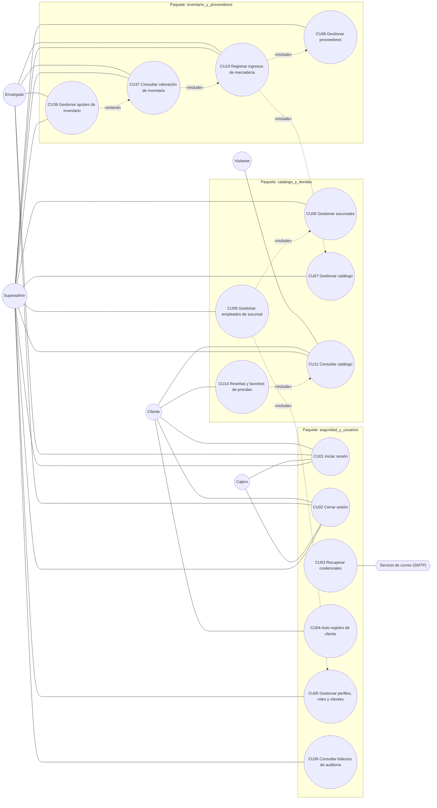

> **Regla transversal (no se dibuja en cada arista):** todos los CU con operación de escritura
> (CU04–CU10, CU14, CU38) tienen `«include» → CU36` (bitácora). CU01/CU02/CU03 también escriben
> eventos (`LOGIN`, `LOGOUT`, `RECOVER`).

### Vista por paquete

**`seguridad_y_usuarios`**

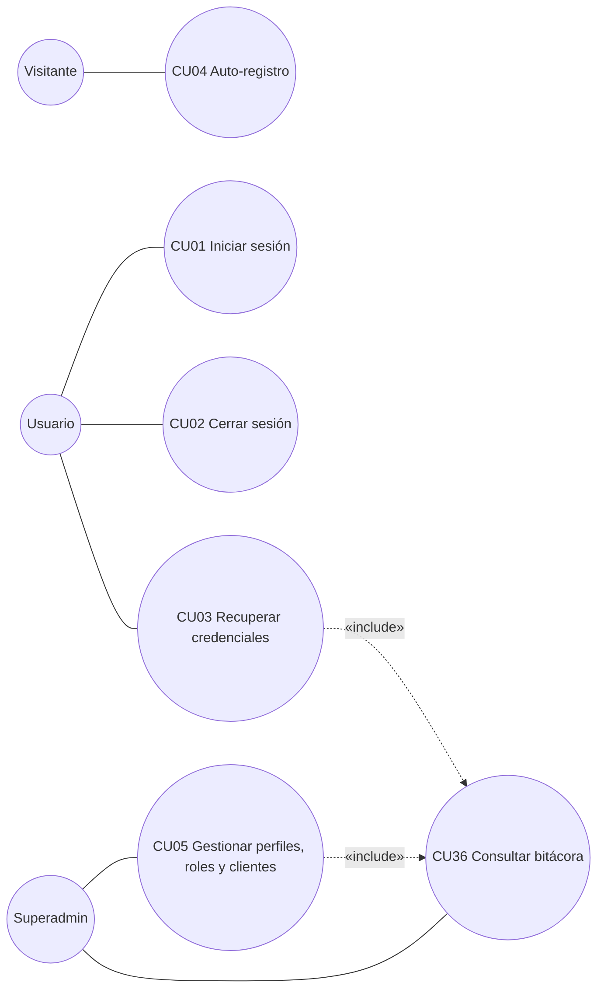

**`catalogo_y_tiendas`**

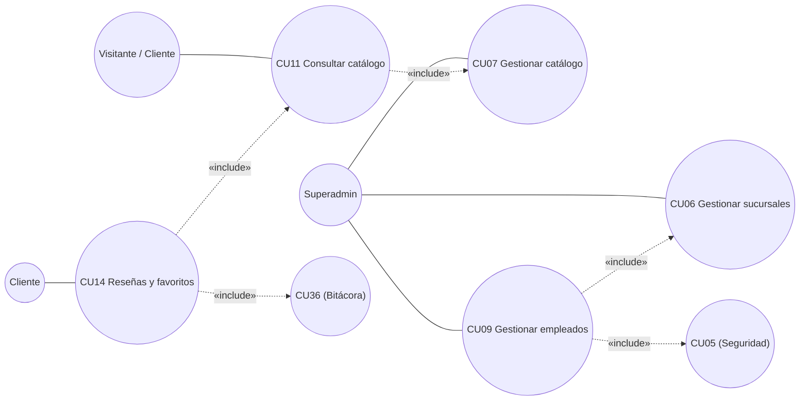

**`inventario_y_proveedores`**

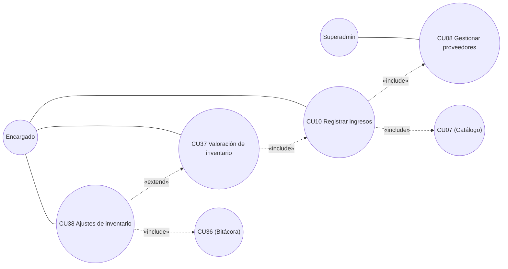

---

# 2. Análisis

## 2.1 Análisis de arquitectura

### Identificación de paquetes y CU por paquete (Ciclo 1)

En el Ciclo 1 hay código en **4 paquetes**. Los demás existen como carpeta reservada.

| Paquete | CU del Ciclo 1 | Vista de CU dentro del paquete |
| :-- | :-- | :-- |
| `seguridad_y_usuarios` | CU01, CU02, CU03, CU04, CU05, CU36 | Autenticación + gestión de identidad + auditoría |
| `catalogo_y_tiendas` | CU06, CU07, CU09, CU11, CU14 | Sucursales + personal de sucursal + catálogo enriquecido + tienda del cliente (detalle, reseñas, favoritos) |
| `inventario_y_proveedores` | CU08, CU10, CU37, CU38 | Proveedores + ingresos + valoración + ajustes |
| `ventas_y_pagos` | *(solo modelos)* | Jerarquía `MedioDePago` y `Comprobante` como respaldo del diagrama de clases |

### Diagrama de dependencias entre paquetes (Ciclo 1)

`A --> B` = "A depende de / consume elementos de B".

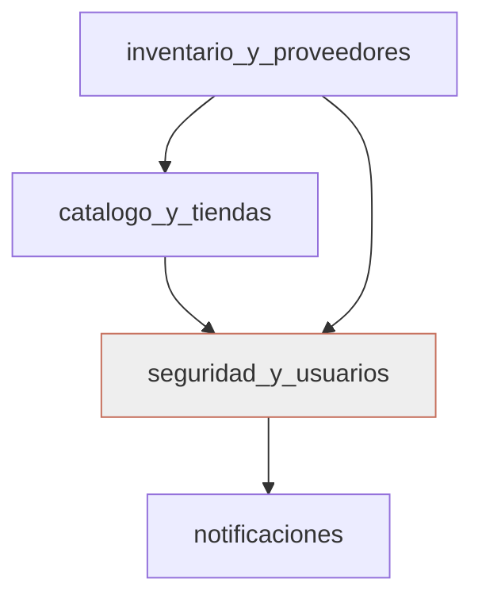

Las dependencias van siempre "hacia el núcleo" (seguridad ← catálogo ← inventario), sin ciclos.
El análisis de acoplamiento y cohesión está en la §2.4.

---

## 2.2 Analizar casos de uso — Diagramas de comunicación

Notación **Mermaid (flowchart)**: Actor · Interfaz (`IU_*`) · Control (`CTR_*`) · Entidad
(`CE_*`); flechas numeradas en orden cronológico.

### CU01: Iniciar Sesión

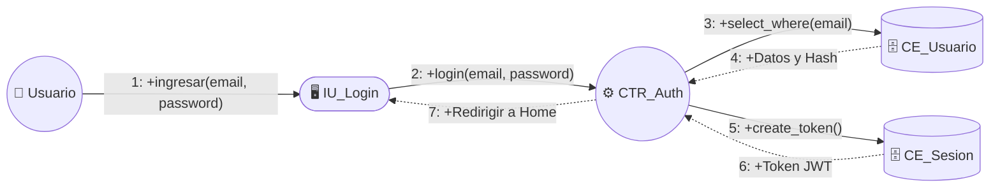

### CU02: Cerrar Sesión

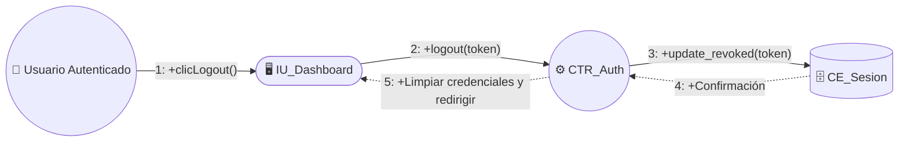

### CU03: Recuperar Credenciales

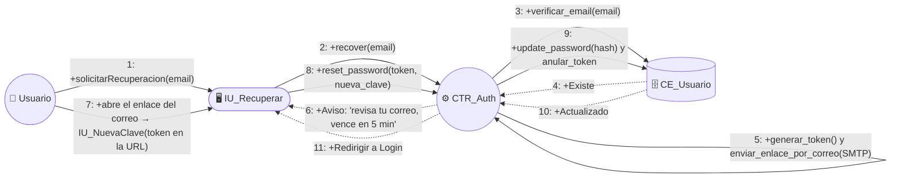

### CU04: Auto-registro de Cliente

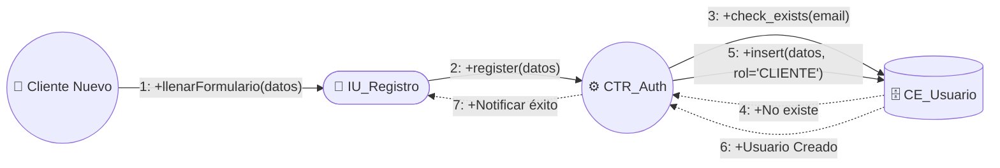

### CU05: Gestionar perfiles, roles y clientes

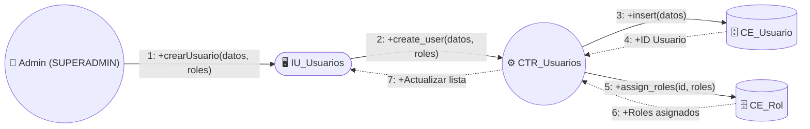

### CU06: Gestionar sucursales

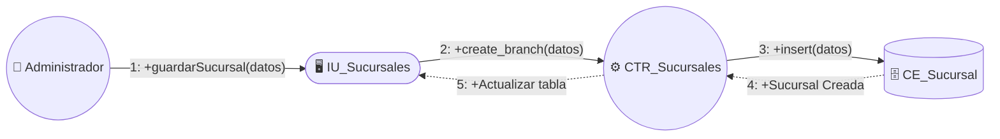

### CU07: Gestionar catálogo

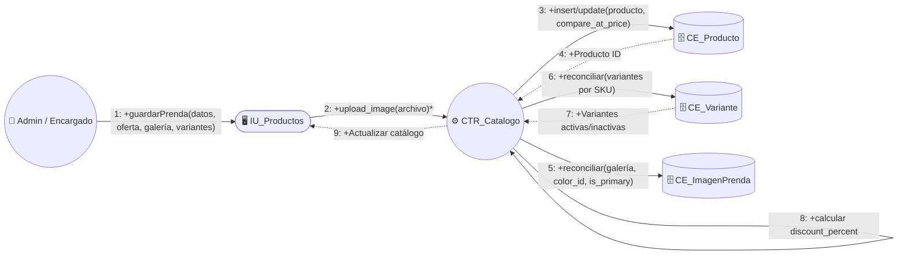

### CU08: Gestionar proveedores

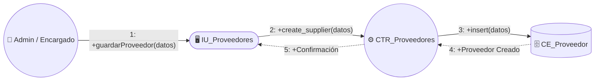

### CU09: Gestionar empleados

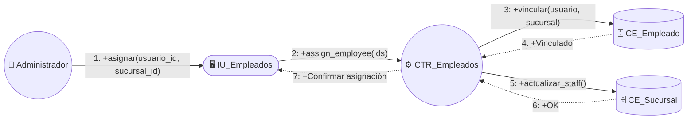

### CU10: Registrar compras/ingresos

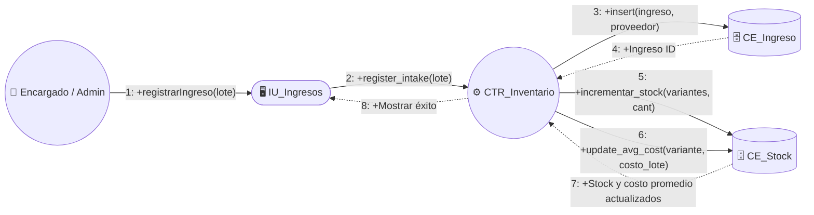

### CU11: Consultar catálogo (Público) — grilla y detalle

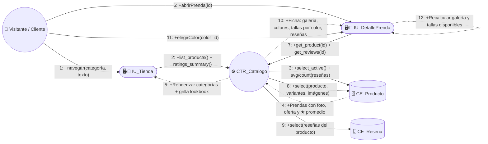

### CU14: Reseñas y favoritos de prendas

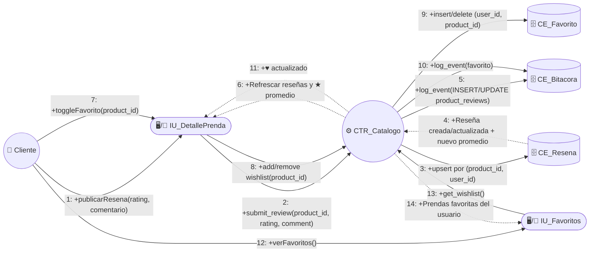

### CU36: Consultar bitácora de auditoría

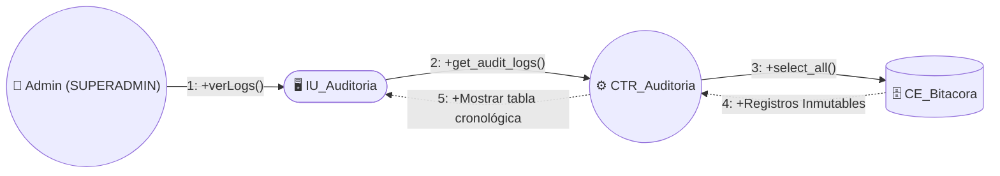

### CU37: Consultar valoración de inventario (capital invertido)

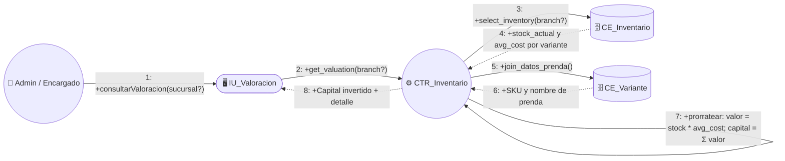

### CU38: Gestionar ajustes de inventario (mermas, daños, pérdidas)

```mermaid
flowchart LR
    Actor(("👤 Encargado / Admin"))
    IU(["🖥️ IU_Ajustes"])
    CTR(("⚙️ CTR_Inventario"))
    ENT_S[("🗄️ CE_Stock")]
    ENT_L[("🗄️ CE_LibroMayor")]
    ENT_B[("🗄️ CE_Bitacora")]

    Actor -- "1: +registrarAjuste(sucursal, variante, cant, motivo)" --> IU
    IU -- "2: +create_adjustment(datos)" --> CTR
    CTR -- "3: +verificar_stock(sucursal, variante)" --> ENT_S
    ENT_S -. "4: +stock_actual y avg_cost vigente" .-> CTR
    CTR -- "5: +ajustar_stock(cant)" --> ENT_S
    CTR -- "6: +insert_movimiento('AJUSTE', unit_cost = avg_cost)" --> ENT_L
    ENT_L -. "7: +Movimiento AJU-{id}" .-> CTR
    CTR -- "8: +insert(INSERT, inventory_ledger)" --> ENT_B
    CTR -. "9: +Ajuste registrado + stock resultante" .-> IU
```

---

## 2.3 Análisis de clases (Interfaz / Control / Entidad)

* **Interfaz / Boundary (`IU_*`)** — pantalla o formulario; sus *métodos* son acciones de UI.
* **Control (`CTR_*`)** — lógica de negocio (backend). **Solo métodos, sin atributos.**
* **Entidad (`CE_*`)** — datos persistentes. Atributos `tabla.campo` (de `BaseDeDatos.md`) y
  métodos de acceso.

Los métodos de las clases **Control** coinciden 1:1 con las funciones de los routers FastAPI
(ver §6.1).

### Paquete `seguridad_y_usuarios`

```mermaid
classDiagram
    class IU_Login {
        +email
        +password
        +ingresar()
        +mostrarError()
        +redirigirPorRol()
    }
    class IU_Register {
        +first_name
        +last_name
        +phone
        +email
        +password
        +llenarFormulario()
        +enviar()
    }
    class IU_Recover {
        +email
        +new_password
        +solicitar()
        +enviarNuevaClave()
    }
    class IU_UsuariosRoles {
        +filtroRol
        +nuevo()
        +guardar()
        +editar()
        +desactivar()
        +listar()
    }
    class IU_Audit {
        +filtroAccion
        +listar()
        +verDetalle()
    }
    class CTR_Auth {
        +login(email, password)
        +logout(token)
        +register(datos)
        +recover(email)
        +reset_password(token, clave)
        +create_access_token(user_id)
        +decode_access_token(token)
    }
    class CTR_Users {
        +list_users()
        +create_user(datos, roles)
        +update_user(id, datos)
        +deactivate_user(id)
        +assign_roles(id, roles)
    }
    class CTR_Auditoria {
        +get_audit_logs()
        +log_event(user, accion, tabla, row, detalle, ip)
    }
    class RoleChecker {
        +allowed_roles
        +__call__(current_user)
    }
    class CE_Usuario {
        +users.id
        +users.email
        +users.password_hash
        +users.first_name
        +users.last_name
        +users.phone
        +users.is_active
        +users.reset_token
        +users.reset_token_expires
        +select_where(email)
        +insert(datos)
        +update(datos)
    }
    class CE_Rol {
        +roles.id
        +roles.name
        +roles.description
        +user_roles.user_id
        +user_roles.role_id
        +assign(user_id, role_id)
    }
    class CE_SessionToken {
        +session_tokens.id
        +session_tokens.user_id
        +session_tokens.token
        +session_tokens.expires_at
        +session_tokens.is_revoked
        +create_token()
        +update_revoked(token)
    }
    class CE_AuditLog {
        +audit_logs.id
        +audit_logs.user_id
        +audit_logs.action
        +audit_logs.table_name
        +audit_logs.row_id
        +audit_logs.new_values
        +audit_logs.ip_address
        +audit_logs.timestamp
        +insert(evento)
        +select_all()
    }

    IU_Login ..> CTR_Auth
    IU_Register ..> CTR_Auth
    IU_Recover ..> CTR_Auth
    IU_UsuariosRoles ..> CTR_Users
    IU_Audit ..> CTR_Auditoria
    CTR_Auth ..> CE_Usuario
    CTR_Auth ..> CE_Rol
    CTR_Auth ..> CE_SessionToken
    CTR_Auth ..> CE_AuditLog
    CTR_Users ..> CE_Usuario
    CTR_Users ..> CE_Rol
    CTR_Users ..> CE_AuditLog
    CTR_Auditoria ..> CE_AuditLog
    CTR_Users ..> RoleChecker
    CTR_Auditoria ..> RoleChecker
```

| CU | Boundary | Control | Entidades |
| :-- | :-- | :-- | :-- |
| CU01 | IU_Login | CTR_Auth | CE_Usuario, CE_Rol, CE_SessionToken, CE_AuditLog |
| CU02 | IU_Login (Dashboard) | CTR_Auth | CE_SessionToken, CE_AuditLog |
| CU03 | IU_Recover | CTR_Auth | CE_Usuario, CE_AuditLog (+ SMTP) |
| CU04 | IU_Register | CTR_Auth | CE_Usuario, CE_Rol, CE_AuditLog |
| CU05 | IU_UsuariosRoles | CTR_Users | CE_Usuario, CE_Rol, CE_AuditLog |
| CU36 | IU_Audit | CTR_Auditoria | CE_AuditLog |

### Paquete `catalogo_y_tiendas`

```mermaid
classDiagram
    class IU_Branches {
        +name
        +address
        +phone
        +latitude
        +longitude
        +nuevo()
        +guardar()
        +editar()
        +desactivar()
        +asignarEmpleado()
    }
    class IU_Products {
        +name
        +description
        +base_price
        +category_id
        +season_id
        +variantes[]
        +nuevo()
        +agregarVariante()
        +guardar()
        +ocultar()
    }
    class IU_Employees {
        +first_name
        +last_name
        +email
        +phone
        +rol
        +branch_id
        +nuevo()
        +guardar()
        +desactivar()
    }
    class IU_StoreHome {
        +texto
        +categoria
        +entrarATienda()
        +buscar()
        +filtrarPorCategoria()
        +abrirDetalle(id)
        +toggleFavorito(id)
    }
    class IU_ProductDetail {
        +galeria[]
        +colorSeleccionado
        +tallasDisponibles[]
        +elegirColor(color_id)
        +abrirGuiaTallas()
        +publicarResena(rating, comentario)
        +toggleFavorito()
    }
    class IU_Wishlist {
        +favoritos[]
        +quitarFavorito(id)
    }
    class CTR_Branches {
        +list_branches()
        +create_branch(datos)
        +update_branch(id, datos)
        +deactivate_branch(id)
        +assign_employee(branch_id, user_id)
        +remove_employee(branch_id, user_id)
    }
    class CTR_Catalogo {
        +list_products()
        +get_product(id)
        +create_product(datos, compare_at_price, variantes, imagenes)
        +update_product(id, datos, variantes)
        +deactivate_product(id)
        +create_category(image_url)
        +update_category(id, image_url)
        +create_season()
        +create_color()
        +create_size()
        +ratings_summary()
        +list_reviews(product_id)
        +submit_review(product_id, rating, comment)
        +get_wishlist()
        +add_to_wishlist(product_id)
        +remove_from_wishlist(product_id)
    }
    class CE_Sucursal {
        +branches.id
        +branches.name
        +branches.address
        +branches.phone
        +branches.latitude
        +branches.longitude
        +branches.is_active
        +branch_employees.branch_id
        +branch_employees.user_id
        +insert(datos)
        +select_where(name)
        +update(datos)
    }
    class CE_Producto {
        +products.id
        +products.name
        +products.description
        +products.base_price
        +products.compare_at_price
        +products.category_id
        +products.season_id
        +products.is_active
        +select_active()
        +insert(datos)
        +update(datos)
        +discount_percent()
    }
    class CE_Variante {
        +product_variants.id
        +product_variants.product_id
        +product_variants.color_id
        +product_variants.size_id
        +product_variants.sku
        +product_variants.price_override
        +product_variants.is_active
        +insert(datos)
        +reconciliar_por_sku(datos)
    }
    class CE_ImagenPrenda {
        +product_images.id
        +product_images.product_id
        +product_images.color_id
        +product_images.image_url
        +product_images.is_primary
        +insert(datos)
        +delete(id)
    }
    class CE_Resena {
        +product_reviews.id
        +product_reviews.product_id
        +product_reviews.user_id
        +product_reviews.rating
        +product_reviews.comment
        +upsert(product_id, user_id, datos)
        +avg_and_count(product_id)
    }
    class CE_Favorito {
        +wishlist_items.user_id
        +wishlist_items.product_id
        +insert(user_id, product_id)
        +delete(user_id, product_id)
        +select_by_user(user_id)
    }
    class CE_ParametroCatalogo {
        +categories.name
        +seasons.name
        +seasons.start_date
        +seasons.end_date
        +colors.name
        +colors.hex_code
        +sizes.name
        +insert(datos)
    }

    IU_Branches ..> CTR_Branches
    IU_Employees ..> CTR_Branches
    IU_Products ..> CTR_Catalogo
    IU_StoreHome ..> CTR_Catalogo
    IU_ProductDetail ..> CTR_Catalogo
    IU_Wishlist ..> CTR_Catalogo
    CTR_Branches ..> CE_Sucursal
    CTR_Catalogo ..> CE_Producto
    CTR_Catalogo ..> CE_Variante
    CTR_Catalogo ..> CE_ImagenPrenda
    CTR_Catalogo ..> CE_ParametroCatalogo
    CTR_Catalogo ..> CE_Resena
    CTR_Catalogo ..> CE_Favorito
```

| CU | Boundary | Control | Entidades |
| :-- | :-- | :-- | :-- |
| CU06 | IU_Branches | CTR_Branches | CE_Sucursal, CE_AuditLog |
| CU07 | IU_Products | CTR_Catalogo | CE_Producto, CE_Variante, CE_ImagenPrenda, CE_ParametroCatalogo, CE_AuditLog |
| CU09 | IU_Employees | CTR_Branches (+ CTR_Users) | CE_Usuario, CE_Rol, CE_Sucursal, CE_AuditLog |
| CU11 | IU_StoreHome, IU_ProductDetail | CTR_Catalogo | CE_Producto, CE_Variante, CE_ImagenPrenda, CE_Resena (★ promedio) |
| CU14 | IU_ProductDetail, IU_Wishlist | CTR_Catalogo | CE_Resena, CE_Favorito, CE_AuditLog |

### Paquete `inventario_y_proveedores`

```mermaid
classDiagram
    class IU_Suppliers {
        +nit
        +name
        +email
        +phone
        +address
        +nuevo()
        +guardar()
        +editar()
        +eliminar()
    }
    class IU_Merchandise {
        +supplierId
        +branchId
        +rows[]
        +addRow()
        +removeRow()
        +register()
    }
    class IU_Valuation {
        +branchId
        +consultarValoracion()
    }
    class IU_Adjustments {
        +branchId
        +variantId
        +quantity
        +reason
        +note
        +register()
    }
    class CTR_Proveedores {
        +list_suppliers()
        +create_supplier(datos)
        +update_supplier(id, datos)
        +delete_supplier(id)
    }
    class CTR_Inventario {
        +register_intake(datos)
        +update_avg_cost(variante, costo_lote)
        +get_inventory(branch?)
        +get_valuation(branch?)
        +register_adjustment(datos)
        +get_ledger()
    }
    class CE_Proveedor {
        +suppliers.id
        +suppliers.nit
        +suppliers.name
        +suppliers.email
        +suppliers.phone
        +suppliers.address
        +insert(datos)
        +select_where(nit)
    }
    class CE_Compra {
        +purchase_orders.id
        +purchase_orders.supplier_id
        +purchase_orders.branch_id
        +purchase_orders.status
        +purchase_details.variant_id
        +purchase_details.quantity
        +purchase_details.unit_cost
        +insert_cabecera(datos)
        +insert_detalle(datos)
    }
    class CE_Inventario {
        +inventory.branch_id
        +inventory.variant_id
        +inventory.stock_actual
        +inventory.avg_cost
        +inventory.stock_minimo
        +inventory.stock_maximo
        +increment_stock(cant)
        +recalcular_avg_cost(cant, costo_lote)
        +ajustar_stock(cant)
    }
    class CE_LibroMayor {
        +inventory_ledger.id
        +inventory_ledger.branch_id
        +inventory_ledger.variant_id
        +inventory_ledger.quantity
        +inventory_ledger.movement_type
        +inventory_ledger.unit_cost
        +inventory_ledger.reference_id
        +inventory_ledger.created_at
        +insert(movimiento)
        +select_all()
    }

    IU_Suppliers ..> CTR_Proveedores
    IU_Merchandise ..> CTR_Inventario
    IU_Valuation ..> CTR_Inventario
    IU_Adjustments ..> CTR_Inventario
    CTR_Proveedores ..> CE_Proveedor
    CTR_Inventario ..> CE_Compra
    CTR_Inventario ..> CE_Inventario
    CTR_Inventario ..> CE_LibroMayor
```

| CU | Boundary | Control | Entidades |
| :-- | :-- | :-- | :-- |
| CU08 | IU_Suppliers | CTR_Proveedores | CE_Proveedor, CE_AuditLog |
| CU10 | IU_Merchandise | CTR_Inventario | CE_Compra, CE_Inventario, CE_LibroMayor, CE_AuditLog |
| CU37 | IU_Valuation | CTR_Inventario | CE_Inventario, CE_Variante, CE_Producto |
| CU38 | IU_Adjustments | CTR_Inventario | CE_Inventario, CE_LibroMayor, CE_AuditLog |

> `RoleChecker` (control transversal de seguridad) y `CTR_Auditoria.log_event` los consumen
> todos los controladores de escritura — corresponde al `«include» → CU36` del modelo de CU.

---

## 2.4 Análisis de paquete — Acoplamiento y cohesión

* **Acoplamiento** — medida de **interdependencia** entre paquetes.
* **Cohesión** — medida de la **fuerza de asociación** de los elementos **dentro** de un paquete.
* Objetivo: **bajo acoplamiento, alta cohesión**.

### Matriz de acoplamiento (imports reales del backend)

| Paquete que importa ↓ | seguridad_y_usuarios | catalogo_y_tiendas | inventario_y_proveedores | notificaciones |
| :-- | :--: | :--: | :--: | :--: |
| **seguridad_y_usuarios** | — | — | — | ✅ (`send_password_recovery_email`) |
| **catalogo_y_tiendas** | ✅ (`RoleChecker`, `log_event`, `User`) | — | — | — |
| **inventario_y_proveedores** | ✅ (`RoleChecker`, `log_event`, `User`) | ✅ (`Branch`, `ProductVariant`, `Product`) | — | — |
| **notificaciones** | — | — | — | — |

Evidencia en el código:

| Import | Archivo |
| :-- | :-- |
| `from app.packages.seguridad_y_usuarios import User, RoleChecker, log_event` | `catalogo_y_tiendas/routers.py`, `catalogo_y_tiendas/branches/routers.py`, `inventario_y_proveedores/suppliers/routers.py`, `inventario_y_proveedores/merchandise/routers.py` |
| `from app.packages.notificaciones import send_password_recovery_email` | `seguridad_y_usuarios/routers.py` |
| `from app.packages.catalogo_y_tiendas... import Branch, Product, ProductVariant` | `inventario_y_proveedores/merchandise/models.py` y `routers.py` |

**Grado de acoplamiento (fan-out):**

| Paquete | Depende de | Comentario |
| :-- | :--: | :-- |
| `seguridad_y_usuarios` | 1 (notificaciones) | **Acoplamiento muy bajo.** Núcleo del sistema; solo delega el envío de correo. |
| `notificaciones` | 0 | **Independiente.** Servicio puro (SMTP). |
| `catalogo_y_tiendas` | 1 (seguridad) | **Bajo.** Solo consume el control de acceso y la auditoría. |
| `inventario_y_proveedores` | 2 (seguridad, catálogo) | **Bajo–medio, justificado:** el inventario es *stock de variantes del catálogo en sucursales*; no puede existir sin `product_variants` ni `branches`. |

No hay dependencias cíclicas. Las dependencias van siempre "hacia el núcleo".

### Cohesión por paquete

| Paquete | Responsabilidad única | Cohesión |
| :-- | :-- | :-- |
| `seguridad_y_usuarios` | Identidad, sesión y trazabilidad. La bitácora vive aquí porque su FK es `users.id` y su semántica es de seguridad. | **Alta** |
| `catalogo_y_tiendas` | Qué vende la cadena y dónde: sucursales, personal de sucursal y catálogo (prenda → variante color+talla). | **Alta** |
| `inventario_y_proveedores` | Cuánta mercadería hay, cuánto costó y de quién vino: proveedores, ingresos, stock, costo promedio ponderado, valoración y ajustes. | **Alta** |
| `notificaciones` | Salida de mensajes al exterior (correo/push). Única responsabilidad, sin estado propio. | **Alta** |

**Conclusión:** cada paquete tiene una única razón de cambio: modificar la política de sesiones
no toca el catálogo; añadir un atributo a la prenda no toca la auditoría; cambiar el cálculo de
costo promedio solo afecta a `inventario_y_proveedores/merchandise`.

---

# 3. Diseño

## 3.1 Diseño de arquitectura

### 3.1.1 Diseño lógico — Diagrama de paquetes en 4 capas

UML organiza la arquitectura lógica en cuatro capas: **específica de la aplicación**,
**intermedia**, **general** y **software de sistema**.

```mermaid
flowchart TB
    subgraph L1["Capa específica de la aplicación (escenario de los usuarios)"]
        direction LR
        WEB["Frontend Web · Angular<br/>packages/*: login, register, recover, usuarios_roles,<br/>branches, products, employees, suppliers, merchandise,<br/>valuation, adjustments, audit, store"]
        MOV["App Móvil · Flutter<br/>packages/seguridad_y_usuarios, catalogo_y_tiendas<br/>(cliente: login, registro, recuperación, catálogo)"]
    end

    subgraph L2["Capa intermedia (lógica de negocio · API REST FastAPI)"]
        direction LR
        P_SEG["seguridad_y_usuarios<br/>routers: auth, users, audit"]
        P_CAT["catalogo_y_tiendas<br/>routers: catalog, branches"]
        P_INV["inventario_y_proveedores<br/>routers: suppliers, merchandise (intake, valuation, adjustments)"]
        P_VEN["ventas_y_pagos<br/>(solo modelos en Ciclo 1)"]
        P_NOT["notificaciones<br/>emailer (SMTP)"]
    end

    subgraph L3["Capa general (servicios y utilidades comunes)"]
        direction LR
        DB_SESSION["app.db.session · SQLAlchemy Base + get_db"]
        CONFIG["app.config · Settings (JWT, CORS, SMTP, DATABASE_URL)"]
        SEC["Servicios transversales<br/>get_password_hash / verify_password (bcrypt),<br/>create/decode_access_token (JWT), RoleChecker, log_event"]
    end

    subgraph L4["Capa software de sistema"]
        direction LR
        PG["PostgreSQL"]
        SMTP_SRV["Servidor SMTP (Gmail)"]
        RUNTIME["Python 3 / Uvicorn · Node / Angular CLI · Flutter Engine"]
    end

    WEB -->|HTTPS JSON| P_SEG
    WEB -->|HTTPS JSON| P_CAT
    WEB -->|HTTPS JSON| P_INV
    MOV -->|HTTPS JSON| P_SEG
    MOV -->|HTTPS JSON| P_CAT

    P_CAT --> P_SEG
    P_INV --> P_SEG
    P_INV --> P_CAT
    P_SEG --> P_NOT
    P_VEN --> P_CAT
    P_VEN --> P_SEG

    P_SEG --> SEC
    P_CAT --> SEC
    P_INV --> SEC
    SEC --> DB_SESSION
    SEC --> CONFIG
    P_SEG --> DB_SESSION
    P_CAT --> DB_SESSION
    P_INV --> DB_SESSION
    P_VEN --> DB_SESSION
    DB_SESSION --> PG
    P_NOT --> SMTP_SRV
    DB_SESSION --> RUNTIME
```

| Capa | Contenido en el Ciclo 1 |
| :-- | :-- |
| **Específica de la aplicación** | Componentes Angular (`frontend-web/src/app/packages/`) y vistas Flutter (`mobile/lib/src/packages/`). |
| **Intermedia** | Los 8 paquetes de negocio expuestos como *routers* FastAPI bajo `/api/v1`. |
| **General** | `app/db/session.py` (ORM), `app/config.py` (parámetros) y los servicios transversales de seguridad/auditoría. |
| **Software de sistema** | Motor PostgreSQL, servidor SMTP, runtimes (Uvicorn, Node, Flutter). |

### 3.1.2 Diseño físico — Diagrama de despliegue

Cada **nodo** es un recurso físico; los conectores llevan el protocolo.

```mermaid
flowchart LR
    subgraph N_MOV["📱 Dispositivo móvil (Android 8+/iOS 13+)"]
        APP["«artifact» app FashionStore (Flutter)"]
    end
    subgraph N_PC["💻 PC / Navegador del personal"]
        SPA["«artifact» SPA Angular (bundle)"]
    end
    subgraph N_WEB["☁️ Nodo Web estático (GCP / hosting)"]
        DIST["«artifact» frontend-web/dist"]
    end
    subgraph N_API["☁️ Servidor de aplicación (GCP, serverless, sin contenedores)"]
        UAPP["«artifact» FastAPI + Uvicorn (app.main:app)"]
    end
    subgraph N_DB["🗄️ Servidor de base de datos (PostgreSQL)"]
        DBI["«artifact» base fashionstore"]
    end
    subgraph N_SMTP["✉️ Servicio SMTP (Gmail)"]
        MX["relay de correo"]
    end

    APP -- "HTTPS / JSON (REST /api/v1)" --> UAPP
    SPA -- "HTTPS / JSON (REST /api/v1)" --> UAPP
    N_PC -- "HTTPS (carga de la SPA)" --> N_WEB
    UAPP -- "TCP/IP 5432 (SQLAlchemy / psycopg2)" --> DBI
    UAPP -- "SMTP 587 STARTTLS" --> MX
```

**Notas de despliegue (RNF08/RNF09 y `AGENST.md`):**

* Despliegue **obligatorio en la nube (GCP)**, **serverless, sin Docker ni Kubernetes**.
* El backend se sirve con `uvicorn app.main:app --host 0.0.0.0 --port 8000` (`--host 0.0.0.0`
  es necesario para que un teléfono físico alcance la API).
* La app móvil resuelve la URL con `--dart-define=API_BASE_URL=https://.../api/v1` (producción)
  o `API_HOST`/`API_PORT` (desarrollo). Ver `mobile/README.md`.
* CORS restringido a `BACKEND_CORS_ORIGINS`; JWT HS256, expiración 60 min.
* `FRONTEND_URL` debe ser la URL pública del frontend (para el enlace del correo de CU03).

---

## 3.2 Diseño de casos de uso

### 3.2.1 Diagramas de secuencia (DSC)

Nomenclatura **DSC** (Diagrama de Secuencia de Caso de uso).

**DSC001: Iniciar sesión**

```mermaid
sequenceDiagram
    actor U as Usuario (No Autenticado)
    participant IU as IU_Login
    participant CTR as CTR_Auth
    participant CE_U as CE_Usuario
    participant CE_S as CE_SessionToken

    U->>+IU: 1: ingresar(email, password)
    IU->>+CTR: 2: login(email, password)
    CTR->>+CE_U: 3: select_where(lower(email))
    CE_U-->>-CTR: 4: Datos y Hash
    Note over CTR: Verifica contraseña (BCrypt)
    CTR->>+CE_S: 5: create_token()
    CE_S-->>-CTR: 6: Token JWT
    CTR-->>-IU: 7: Token JWT y Datos
    IU-->>-U: 8: Redirigir a Home()
```

**DSC002: Cerrar sesión**

```mermaid
sequenceDiagram
    actor U as Usuario (Autenticado)
    participant IU as IU_Dashboard
    participant CTR as CTR_Auth
    participant CE_S as CE_SessionToken
    participant BD as CE_Bitacora

    U->>+IU: 1: clicLogout()
    IU->>+CTR: 2: logout(token)
    CTR->>+CE_S: 3: update_revoked(token)
    CE_S-->>-CTR: 4: Confirmación
    CTR->>+BD: 5: insert(LOGOUT)
    BD-->>-CTR: 6: Confirmación
    CTR-->>-IU: 7: Éxito
    IU-->>-U: 8: Limpiar credenciales y redirigir
```

**DSC003: Recuperar credenciales**

```mermaid
sequenceDiagram
    actor U as Usuario (Cliente/Empleado)
    participant IU as IU_Recover
    participant CTR as CTR_Auth
    participant CE_U as CE_Usuario

    U->>+IU: 1: solicitarRecuperacion(email)
    IU->>+CTR: 2: recover(email)
    CTR->>+CE_U: 3: verificar_email(lower(email))
    CE_U-->>-CTR: 4: Existe
    Note over CTR: Genera token seguro (5 min)
    CTR->>CTR: 5: generar_token() + enviar_enlace_por_correo(SMTP)
    CTR-->>-IU: 6: Aviso neutro
    IU-->>-U: 7: "Revisa tu correo, vence en 5 min"
    Note over U, CE_U: El usuario ABRE EL ENLACE del correo (token en la URL)
    U->>+IU: 8: enviarNuevaClave(token, nueva_clave)
    IU->>+CTR: 9: reset_password(token, nueva_clave)
    CTR->>+CE_U: 10: update_password(hash) + anular_token
    CE_U-->>-CTR: 11: Actualizado
    CTR-->>-IU: 12: Éxito
    IU-->>-U: 13: Redirigir a Login()
```

**DSC004: Auto-registro de cliente**

```mermaid
sequenceDiagram
    actor C as Cliente Nuevo
    participant IU as IU_Register
    participant CTR as CTR_Auth
    participant CE_U as CE_Usuario

    C->>+IU: 1: llenarFormulario(datos)
    IU->>+CTR: 2: register(datos)
    CTR->>+CE_U: 3: check_exists(lower(email))
    CE_U-->>-CTR: 4: No existe
    CTR->>+CE_U: 5: insert(datos, rol='CLIENTE')
    CE_U-->>-CTR: 6: Usuario Creado
    CTR-->>-IU: 7: Respuesta 200/201 Created
    IU-->>-C: 8: Notificar éxito y redirigir a login
```

**DSC005: Gestionar perfiles, roles y clientes**

```mermaid
sequenceDiagram
    actor A as Superadmin
    participant IU as IU_UsuariosRoles
    participant CTR as CTR_Users
    participant CE_U as CE_Usuario

    A->>+IU: 1: crearUsuario(datos, roles)
    IU->>+CTR: 2: create_user(datos, roles)
    CTR->>+CE_U: 3: insert(datos)
    CE_U-->>-CTR: 4: ID Usuario
    CTR->>+CE_U: 5: assign_roles(id, roles)
    CE_U-->>-CTR: 6: Roles asignados
    CTR-->>-IU: 7: Usuario Creado
    IU-->>-A: 8: Actualizar lista en UI
```

**DSC006: Gestionar sucursales**

```mermaid
sequenceDiagram
    actor A as Superadmin
    participant IU as IU_Branches
    participant CTR as CTR_Branches
    participant CE_B as CE_Sucursal

    A->>+IU: 1: registrar(datos)
    IU->>+CTR: 2: create_branch(datos)
    CTR->>+CE_B: 3: check_exists(nombre)
    CE_B-->>-CTR: 4: No existe
    CTR->>+CE_B: 5: insert_branch(datos)
    CE_B-->>-CTR: 6: Sucursal Creada
    CTR-->>-IU: 7: 201 Created
    IU-->>-A: 8: Actualizar lista en UI
```

**DSC007: Gestionar catálogo**

```mermaid
sequenceDiagram
    actor A as Superadmin
    participant IU as IU_Products
    participant CTR as CTR_Products
    participant CE_P as CE_Producto
    participant CE_IMG as CE_ImagenPrenda
    participant CE_V as CE_Variante

    A->>+IU: 1: registrar(datos, oferta, galería, variantes)
    loop Por cada foto nueva
        IU->>+CTR: 2: upload_image(archivo)
        CTR-->>-IU: 3: image_url
    end
    IU->>+CTR: 4: create/update_product(datos, compare_at_price, images, variants)
    CTR->>+CE_P: 5: insert/update_product(datos, compare_at_price)
    CE_P-->>-CTR: 6: ID Producto
    CTR->>+CE_IMG: 7: reconciliar galería (color_id, is_primary)
    CE_IMG-->>-CTR: 8: OK
    loop Por cada variante (por SKU)
        CTR->>+CE_V: 9: nueva → insert / faltante → is_active=false
        CE_V-->>-CTR: 10: Confirmación
    end
    CTR->>CTR: 11: discount_percent = round((1 - base/antes)*100)
    CTR-->>-IU: 12: Producto guardado
    IU-->>-A: 13: Actualizar UI
```

**DSC008: Gestionar proveedores**

```mermaid
sequenceDiagram
    actor A as Superadmin
    participant IU as IU_Suppliers
    participant CTR as CTR_Suppliers
    participant CE_S as CE_Proveedor

    A->>+IU: 1: registrar(datos)
    IU->>+CTR: 2: create_supplier(datos)
    CTR->>+CE_S: 3: check_exists(nit)
    CE_S-->>-CTR: 4: No existe
    CTR->>+CE_S: 5: insert_supplier(datos)
    CE_S-->>-CTR: 6: Proveedor Creado
    CTR-->>-IU: 7: 201 Created
    IU-->>-A: 8: Actualizar lista en UI
```

**DSC009: Gestionar empleados**

```mermaid
sequenceDiagram
    actor A as Superadmin
    participant IU as IU_Employees
    participant CTR as CTR_Branches
    participant CE_B as CE_Sucursal

    A->>+IU: 1: asignarSucursal(empleado, sucursal)
    IU->>+CTR: 2: assign_employee(sucursal_id, usuario_id)
    CTR->>+CE_B: 3: check_exists(sucursal_id, usuario_id) + valida rol
    CE_B-->>-CTR: 4: Válidos
    CTR->>+CE_B: 5: insert_assign(sucursal_id, usuario_id)
    CE_B-->>-CTR: 6: Asignación Completada
    CTR-->>-IU: 7: Éxito
    IU-->>-A: 8: Actualizar UI
```

**DSC010: Registrar compras/ingresos**

```mermaid
sequenceDiagram
    actor E as Encargado / Superadmin
    participant IU as IU_Merchandise
    participant CTR as CTR_Inventory
    participant CE_C as CE_Compra
    participant CE_I as CE_Inventario

    E->>+IU: 1: registrar(datos)
    IU->>+CTR: 2: register_intake(datos)
    CTR->>CTR: 3: check_relations(proveedor_id, sucursal_id)
    CTR->>+CE_C: 4: insert_purchase(cabecera)
    CE_C-->>-CTR: 5: ID Compra
    loop Por cada detalle
        CTR->>+CE_C: 6: insert_detail(detalle)
        CE_C-->>-CTR: 7: OK
        CTR->>+CE_I: 8: increment_stock(detalle)
        CTR->>CE_I: 9: update_avg_cost(variante, costo_lote)
        Note over CTR,CE_I: nuevo_avg = (stock_previo*avg_previo + cant*costo_lote) / (stock_previo + cant)
        CE_I-->>-CTR: 10: Stock y costo promedio OK
    end
    CTR-->>-IU: 11: Ingreso Completado
    IU-->>-E: 12: Notificar éxito y limpiar
```

**DSC011: Consultar catálogo (grilla + detalle de prenda)**

```mermaid
sequenceDiagram
    actor C as Cliente
    participant IU as IU_StoreHome
    participant IUD as IU_ProductDetail
    participant CTR as CTR_Catalogo
    participant CE_P as CE_Producto
    participant CE_R as CE_Resena

    C->>+IU: 1: entrarATienda()
    IU->>+CTR: 2: list_products() + ratings_summary() + categories()
    CTR->>+CE_P: 3: select_active() + avg/count(reseñas)
    CE_P-->>-CTR: 4: Prendas con foto, oferta y ★ promedio
    CTR-->>-IU: 5: JSON Array
    IU-->>-C: 6: Categorías + grilla lookbook (oferta / ★ / ♥)
    C->>+IUD: 7: abrirPrenda(id)
    IUD->>+CTR: 8: get_product(id) + get_reviews(id)
    CTR->>+CE_P: 9: select(producto, variantes, imágenes)
    CE_P-->>-CTR: 10: Ficha completa
    CTR->>+CE_R: 11: select(reseñas del producto)
    CE_R-->>-CTR: 12: Reseñas + promedio
    CTR-->>-IUD: 13: JSON detalle
    IUD-->>-C: 14: Galería + color + tallas por color + reseñas
    C->>IUD: 15: elegirColor(color_id) → recalcula galería y tallas
```

**DSC014: Reseñas y favoritos de prendas**

```mermaid
sequenceDiagram
    actor C as Cliente
    participant IU as IU_ProductDetail
    participant CTR as CTR_Catalogo
    participant CE_R as CE_Resena
    participant CE_F as CE_Favorito
    participant CE_A as CE_AuditLog

    C->>+IU: 1: publicarResena(rating 1-5, comentario)
    IU->>+CTR: 2: submit_review(product_id, rating, comment)
    CTR->>+CE_R: 3: upsert por (product_id, user_id)
    CE_R-->>-CTR: 4: Reseña creada/actualizada
    CTR->>CE_A: 5: log_event(INSERT/UPDATE product_reviews)
    CTR->>CE_R: 6: recalcular avg + count
    CTR-->>-IU: 7: Reseñas + ★ promedio actualizados
    C->>+IU: 8: toggleFavorito(product_id)
    IU->>+CTR: 9: add_to_wishlist / remove_from_wishlist(product_id)
    CTR->>+CE_F: 10: insert / delete (user_id, product_id)
    CE_F-->>-CTR: 11: in_wishlist
    CTR->>CE_A: 12: log_event(favorito)
    CTR-->>-IU: 13: ♥ actualizado
```

**DSC036: Consultar bitácora de auditoría**

```mermaid
sequenceDiagram
    actor A as Superadmin
    participant IU as IU_Audit
    participant CTR as CTR_Users
    participant CE_A as CE_AuditLog

    A->>+IU: 1: verLogs()
    IU->>+CTR: 2: get_audit_logs()
    CTR->>+CE_A: 3: select_all()
    CE_A-->>-CTR: 4: Registros inmutables
    CTR-->>-IU: 5: JSON Array
    IU-->>-A: 6: Mostrar tabla cronológica
```

**DSC037: Consultar valoración de inventario (capital invertido)**

```mermaid
sequenceDiagram
    actor A as Admin / Encargado
    participant IU as IU_Valuation
    participant CTR as CTR_Inventory
    participant CE_I as CE_Inventario
    participant CE_V as CE_Variante

    A->>+IU: 1: consultarValoracion(sucursal?)
    IU->>+CTR: 2: get_valuation(branch?)
    CTR->>+CE_I: 3: select_inventory(branch?)
    CE_I-->>-CTR: 4: [{stock_actual, avg_cost}]
    CTR->>+CE_V: 5: join(sku, product_name)
    CE_V-->>-CTR: 6: datos de prenda
    Note over CTR: valor = stock_actual * avg_cost<br/>capital_invertido = Σ valor
    CTR-->>-IU: 7: {capital_invertido, items[]}
    IU-->>-A: 8: Mostrar capital invertido + detalle
```

**DSC038: Gestionar ajustes de inventario**

```mermaid
sequenceDiagram
    actor E as Encargado / Superadmin
    participant IU as IU_Adjustments
    participant CTR as CTR_Inventory
    participant CE_S as CE_Stock
    participant CE_L as CE_LibroMayor
    participant BD as CE_Bitacora

    E->>+IU: 1: registrarAjuste(sucursal, variante, cant, motivo, nota)
    IU->>+CTR: 2: create_adjustment(datos)
    CTR->>+CE_S: 3: verificar_stock(sucursal, variante)
    CE_S-->>-CTR: 4: stock_actual, avg_cost vigente
    Note over CTR: si cant < 0 y stock_actual + cant < 0 -> HTTP 400
    CTR->>CE_S: 5: stock_actual += cant
    CTR->>+CE_L: 6: insert('AJUSTE', unit_cost = avg_cost, ref = AJU-{id})
    CE_L-->>-CTR: 7: OK
    CTR->>+BD: 8: insert(INSERT, inventory_ledger)
    BD-->>-CTR: 9: OK
    CTR-->>-IU: 10: {reference_id, stock_resultante}
    IU-->>-E: 11: "Ajuste registrado"
```

### 3.2.2 Diagrama de navegación

**Sistema principal (web) — enrutado por rol** (base: `frontend-web/src/app/app-routing.module.ts`)

```mermaid
flowchart TD
    START["/ (redirect)"] --> LOGIN["/login · IU_Login"]
    LOGIN -->|"registrarse"| REG["/register"]
    LOGIN -->|"¿olvidaste tu contraseña?"| REC["/recover"]
    REC -->|"enlace del correo (token en URL)"| REC2["/recover?token=… · nueva contraseña"]
    REC2 --> LOGIN
    REG --> LOGIN
    LOGIN -->|"rol personal (SUPERADMIN/ENCARGADO/CAJERO)"| DASH["/admin/dashboard"]
    LOGIN -->|"rol CLIENTE"| TIENDA["/tienda · IU_StoreHome"]
    DASH --> ADMINNAV{{"Barra lateral admin (AuthGuard)"}}
    TIENDA -->|"cerrar sesión"| LOGIN
    DASH -->|"cerrar sesión"| LOGIN
```

* `SessionGuard` protege `/tienda`; `AuthGuard` protege `/admin/**`; `**` → `/login`.

**Subsistema del panel administrativo (Ciclo 1)**

```mermaid
flowchart LR
    NAV{{"Barra lateral"}}
    NAV --> D["/admin/dashboard"]
    NAV --> U["/admin/usuarios · Usuarios y Roles (CU05)"]
    NAV --> B["/admin/branches · Sucursales (CU06)"]
    NAV --> P["/admin/products · Catálogo: galería + oferta + variantes (CU07)"]
    NAV --> S["/admin/suppliers · Proveedores (CU08)"]
    NAV --> E["/admin/employees · Empleados (CU09)"]
    NAV --> M["/admin/purchases · Mercadería (CU10)"]
    NAV --> V["/admin/valuation · Valoración (CU37)"]
    NAV --> A["/admin/adjustments · Ajustes (CU38)"]
    NAV --> AU["/admin/audit · Auditoría (CU36)"]
    D -->|"Ver auditoría completa"| AU
```

**Subsistema de la tienda del cliente — Web y Móvil (Ciclo 1)**

```mermaid
flowchart LR
    subgraph WEB["Web (/tienda)"]
        SH["IU_StoreHome: categorías + grilla lookbook (oferta / ★ / ♥)"]
        SH -->|"buscar / filtrar por categoría"| SH
        SH -->|"tocar prenda"| PD["/tienda/producto/:id · IU_ProductDetail: galería, color, tallas, reseñas"]
        SH -->|"♥ favoritos"| WL["/tienda/favoritos · IU_Wishlist"]
        PD -->|"publicar / actualizar reseña (CU14)"| PD
        PD -->|"♥ (CU14)"| PD
        WL --> PD
        SH -->|"menú → cerrar sesión"| LG["/login"]
    end
    subgraph MOVIL["Móvil (Flutter)"]
        MLOGIN["login_view"] --> MREG["register_view"]
        MLOGIN --> MREC["recover_view (aviso: revisa tu correo)"]
        MLOGIN -->|"sesión iniciada"| MSHELL["store_shell: Inicio · Catálogo · Carrito · Favoritos · Perfil"]
        MSHELL --> MCAT["catalogo_view: categorías + grilla lookbook"]
        MCAT -->|"tocar prenda"| MPD["product_detail_view: galería, color, tallas, reseñas (CU14)"]
        MSHELL --> MWL["wishlist_view (CU14)"]
        MSHELL -->|"Perfil → cerrar sesión / inactividad 15 min"| MLOGIN
    end
```

* La pantalla de "nueva contraseña" **no existe en el móvil**: el enlace del correo abre la
  página web responsiva (`/recover?token=…`).

**Evolución por iteración**

| Nodo / enlace | I1 | I2 | I3 |
| :-- | :--: | :--: | :--: |
| login / register / recover / dashboard / tienda | ✅ | ✅ | ✅ |
| CRUD admin: usuarios, sucursales, catálogo, proveedores, empleados, mercadería, auditoría | ✅ | ✅ | ✅ |
| valoración / ajustes de inventario | ✅ | ✅ | ✅ |
| detalle de prenda (galería, color, tallas por color), reseñas y favoritos (CU11 ampliado + CU14) | ✅ | ✅ | ✅ |
| filtro avanzado precio/talla/color/ocasión + disponibilidad por sucursal (CU12) | | ✅ | ✅ |
| carrito y checkout (CU17–CU20) | | ✅ | ✅ |
| reservas, vestidor virtual, envíos, reportes por voz | | | ✅ |

### 3.2.3 Diagramas de estado y de tiempo

> Según la cátedra, estos diagramas se elaboran **solo para procesos**: catálogo, venta, compra
> y tipos de pago. En el **Ciclo 1 el único proceso presente es el CATÁLOGO** (y su
> abastecimiento). Venta, compra completa y tipos de pago → Ciclo 2.

**Diagrama de estados — Prenda / Producto (proceso Catálogo)**

```mermaid
stateDiagram-v2
    [*] --> Borrador: crear prenda (CU07) sin variantes
    Borrador --> Activa: agregar >=1 variante y publicar (is_active = true)
    Activa --> Oculta: ocultar del catálogo (CU07, is_active = false)
    Oculta --> Activa: reactivar (CU07)
    Activa --> Activa: editar datos / variantes (CU07)
    Activa --> ConStock: registrar ingreso (CU10) -> inventory.stock_actual > 0
    ConStock --> Activa: ajuste a 0 (CU38) / sin stock
    note right of Activa
        Visible en la tienda del cliente (CU11)
        y disponible para abastecerse (CU10)
    end note
```

**Diagrama de estados — Ingreso de mercadería (proceso Compra)**

```mermaid
stateDiagram-v2
    [*] --> Capturando: el actor añade filas (variante, cantidad, costo)
    Capturando --> Validado: proveedor + sucursal + >=1 fila válida
    Validado --> Registrado: transacción ACID (purchase_orders + purchase_details + inventory + inventory_ledger + recálculo avg_cost)
    Validado --> Capturando: error de validación (cantidad/costo <= 0)
    Registrado --> Auditado: log_event INSERT purchase_orders (CU36)
    Auditado --> [*]: status = 'COMPLETADO'
```

**Diagrama de estados — Stock de una variante (por sucursal)**

```mermaid
stateDiagram-v2
    [*] --> SinRegistro: variante nunca abastecida en la sucursal
    SinRegistro --> Disponible: primer INGRESO (CU10) -> stock_actual = cant, avg_cost = costo_lote
    Disponible --> Disponible: nuevo INGRESO (CU10) -> stock += cant, avg_cost recalculado
    Disponible --> Disponible: AJUSTE + (CU38, sobrante de conteo)
    Disponible --> Agotado: AJUSTE - (CU38) o salidas -> stock_actual = 0
    Agotado --> Disponible: nuevo INGRESO (CU10)
    Disponible --> Bloqueado: reserva (CU28, Ciclo 3)
    Bloqueado --> Disponible: reserva cancelada (Ciclo 3)
```

> **Regla clave (CU10 / CU37 / CU38):** `avg_cost` **solo** cambia con los **INGRESOS**. Las
> salidas (venta, reserva, ajuste) se valoran al `avg_cost` vigente pero **no** lo modifican.

**Diagrama de estados — Reseña de una prenda (CU14)**

```mermaid
stateDiagram-v2
    [*] --> SinReseña: el cliente aún no opinó esta prenda
    SinReseña --> Publicada: submit_review(rating 1-5, comentario) -> INSERT
    Publicada --> Publicada: el cliente reenvía -> UPDATE (upsert por product_id+user_id)
    Publicada --> [*]
    note right of Publicada
        Cuenta para el promedio y el conteo
        que se muestran en la ficha (CU11).
        Sin moderación en el Ciclo 1.
    end note
```

**Diagrama de tiempo — Proceso Catálogo (consulta del cliente, CU11)**

```mermaid
gantt
    title Diagrama de tiempo — CU11 Consultar catálogo (una petición)
    dateFormat X
    axisFormat %s
    section Cliente (IU_StoreHome / IU_ProductDetail)
    entrar a la tienda            :a1, 0, 1
    esperar respuesta             :a2, 1, 4
    ver grilla / buscar / filtrar :a3, 4, 7
    tocar prenda -> ver detalle   :a4, 7, 11
    section API (CTR_Catalogo)
    GET /catalog/products + ratings-summary :b1, 1, 2
    consultar CE_Producto + avg/count       :b2, 2, 3
    serializar JSON                          :b3, 3, 4
    GET /catalog/products/{id} + reviews     :b4, 7, 9
    section PostgreSQL
    SELECT products + variants + images :c1, 2, 3
    SELECT producto + reseñas           :c2, 7, 9
```

**Restricción de tiempo (RNF02):** la respuesta del catálogo debe tardar **< 1,5 s**. Índices de
apoyo: `idx_variants_search (product_id, color_id, size_id)`, `idx_reviews_product (product_id)`.

**Diagrama de tiempo — Sesión del usuario (CU01 → CU02 automático)**

```mermaid
gantt
    title Diagrama de tiempo — vigencia de la sesión (JWT)
    dateFormat X
    axisFormat %Mm
    section Token JWT
    activo (60 min)          :active, t1, 0, 60
    expirado -> 401          :crit, t2, 60, 65
    section Inactividad (frontend)
    ventana de actividad     :i1, 0, 15
    sin actividad -> logout  :crit, i2, 15, 16
```

* `session_tokens.expires_at` = emisión + 60 min. Al vencer, `get_current_user` revoca la
  sesión y responde **401** (CU02 automático). El frontend fuerza `logout` tras **15 min** de
  inactividad (`inactivity_wrapper` en móvil, `SessionGuard` en web).

---

## 3.3 Diseño de datos

El diseño físico completo (todas las tablas, normalización 3NF, índices y los modelos de
Ciclo 2/3) está en **`BaseDeDatos.md`**. Aquí se muestra el **modelo del Ciclo 1**.

### Diagrama de clases de datos — Ciclo 1

```mermaid
classDiagram
    class roles {
        +id
        +name
        +description
    }
    class users {
        +id
        +email (unique, lowercase)
        +password_hash
        +first_name
        +last_name
        +phone
        +is_active
        +reset_token
        +reset_token_expires
    }
    class user_roles {
        +user_id
        +role_id
    }
    class session_tokens {
        +id
        +user_id
        +token
        +expires_at
        +is_revoked
    }
    class audit_logs {
        +id
        +user_id
        +action
        +table_name
        +row_id
        +old_values
        +new_values
        +ip_address
        +timestamp
    }
    class branches {
        +id
        +name (unique)
        +address
        +phone
        +latitude
        +longitude
        +is_active
    }
    class branch_employees {
        +branch_id
        +user_id
    }
    class categories {
        +id
        +name (unique)
        +image_url
    }
    class seasons {
        +id
        +name (unique)
        +start_date
        +end_date
    }
    class colors {
        +id
        +name (unique)
        +hex_code (unique)
    }
    class sizes {
        +id
        +name (unique)
    }
    class products {
        +id
        +name
        +description
        +base_price
        +compare_at_price
        +category_id
        +season_id
        +is_active
    }
    class product_variants {
        +id
        +product_id
        +color_id
        +size_id
        +sku (unique)
        +price_override
        +is_active
    }
    class product_images {
        +id
        +product_id
        +color_id (nullable)
        +image_url
        +is_primary
    }
    class product_reviews {
        +id
        +product_id
        +user_id
        +rating (1..5)
        +comment
        +created_at
        +updated_at
        +UNIQUE(product_id, user_id)
    }
    class wishlist_items {
        +user_id
        +product_id
        +created_at
        +PK(user_id, product_id)
    }
    class suppliers {
        +id
        +nit (unique)
        +name
        +email
        +phone
        +address
    }
    class purchase_orders {
        +id
        +supplier_id
        +branch_id
        +status
        +created_at
    }
    class purchase_details {
        +id
        +purchase_order_id
        +variant_id
        +quantity
        +unit_cost
    }
    class inventory {
        +branch_id
        +variant_id
        +stock_actual
        +avg_cost
        +stock_minimo
        +stock_maximo
    }
    class inventory_ledger {
        +id
        +branch_id
        +variant_id
        +quantity
        +movement_type
        +unit_cost
        +reference_id
        +created_at
    }

    users "1" -- "*" user_roles
    roles "1" -- "*" user_roles
    users "1" -- "*" session_tokens
    users "1" -- "*" audit_logs
    branches "1" -- "*" branch_employees
    users "1" -- "*" branch_employees
    categories "1" -- "*" products
    seasons "1" -- "*" products
    products "1" -- "*" product_variants
    colors "1" -- "*" product_variants
    sizes "1" -- "*" product_variants
    products "1" -- "*" product_images
    products "1" -- "*" product_reviews
    users "1" -- "*" product_reviews
    users "1" -- "*" wishlist_items
    products "1" -- "*" wishlist_items
    suppliers "1" -- "*" purchase_orders
    branches "1" -- "*" purchase_orders
    purchase_orders "1" -- "*" purchase_details
    product_variants "1" -- "*" purchase_details
    branches "1" -- "*" inventory
    product_variants "1" -- "*" inventory
    branches "1" -- "*" inventory_ledger
    product_variants "1" -- "*" inventory_ledger
```

### Tablas del Ciclo 1 (resumen DDL)

| Tabla | Rol en el Ciclo 1 | CU |
| :-- | :-- | :-- |
| `roles`, `users`, `user_roles`, `session_tokens` | Identidad, RBAC y sesiones | CU01, CU02, CU04, CU05 |
| `audit_logs` | Bitácora inmutable de escrituras | CU36 (transversal) |
| `branches`, `branch_employees` | Sucursales físicas y su personal | CU06, CU09 |
| `categories` (**+ `image_url`**), `seasons`, `colors`, `sizes` | Parámetros del catálogo (categoría con foto circular) | CU07 |
| `products` (**+ `compare_at_price`**), `product_variants` (**+ `is_active`**), `product_images` (galería, `color_id` nullable) | Prendas, oferta directa, variantes (color+talla+SKU) y galería de fotos | CU07, CU11 |
| `product_reviews` (`rating` 1–5, `comment`, `UNIQUE(product_id, user_id)`) | Reseñas de prendas (una por cliente, editable) | CU14 |
| `wishlist_items` (PK `(user_id, product_id)`) | Prendas favoritas del cliente | CU14 |
| `suppliers` | Directorio de proveedores | CU08 |
| `purchase_orders`, `purchase_details` | Cabecera y detalle de los ingresos de mercadería | CU10 |
| `inventory` (**incluye `avg_cost`**) | Stock y **costo promedio ponderado** por sucursal+variante | CU10, CU37, CU38 |
| `inventory_ledger` | Libro mayor: movimientos `INGRESO` / `AJUSTE` valorados | CU10, CU38 |

**Regla del costo promedio ponderado (CU10 / CU37 / CU38):**
`avg_cost = (stock_previo · avg_previo + cantidad · costo_unitario_lote) / (stock_previo + cantidad)`
en cada **ingreso**. Las salidas se valoran al `avg_cost` vigente y **no** lo modifican.
Capital invertido (CU37) = `Σ (inventory.stock_actual · inventory.avg_cost)`.

**Modelos base creados en el Ciclo 1 sin routers** (paquete `ventas_y_pagos`, respaldo del
diagrama de clases del análisis de Ciclo 2): `orders`, `order_items`, `payments`
(herencia de tabla única: `EFECTIVO` / `TARJETA` / `QR` / `CREDITO`) e `invoices`
(`doc_type` = `FACTURA` / `NOTA_ENTREGA`, `tax_rate` = 0.130).

---

# 4. Implementación

## 4.1 Selección de la plataforma de software

| Componente | Tecnología | Justificación |
| :-- | :-- | :-- |
| Backend | **Python 3 + FastAPI** (Uvicorn) | API REST asíncrona, tipado con Pydantic, arquitectura por capas. |
| ORM / BD | **SQLAlchemy 2 + PostgreSQL** | ACID para transacciones concurrentes de stock; 3NF. |
| Frontend Web | **Angular (TypeScript)** + Bootstrap 5 + bootstrap-icons | SPA reactiva; panel administrativo y tienda del cliente en el mismo sitio. |
| App Móvil | **Flutter (Dart)** | Base única Android/iOS; acceso a cámara (vestidor RA, Ciclo 3) y voz (Ciclo 3). |
| Autenticación | **JWT (HS256)** + BCrypt (passlib) | Token con `jti`/`iat`, expiración 60 min, sesiones revocables en `session_tokens`. |
| Correo | **SMTP (Gmail)** | Enlace de recuperación de contraseña (CU03). |
| Despliegue | **GCP serverless, sin contenedores** (RNF08/RNF09) | Prohibido Docker/Kubernetes y CMS de e-commerce (Shopify/Magento/WooCommerce). |
| Control de versiones | **Git / GitHub** | Ramas separadas, despliegue a la nube. |

## 4.2 Implementación de la arquitectura del sistema principal

* **Arranque:** `main.py` importa los modelos de todos los paquetes, ejecuta
  `Base.metadata.create_all`, luego **migraciones ligeras idempotentes**
  (`ALTER TABLE ... ADD COLUMN IF NOT EXISTS` para `inventory.avg_cost`, `orders.channel`,
  `categories.image_url` y `products.compare_at_price`; `ALTER COLUMN product_images.color_id
  DROP NOT NULL`; y normalización de `users.email` a minúsculas), y monta los routers por
  paquete. Las tablas `product_reviews` y `wishlist_items` nacen del `create_all`.
* **CORS:** restringido a `BACKEND_CORS_ORIGINS` (regex para `localhost` en desarrollo).
* **Dependencias transversales:** `get_current_user` (valida el JWT contra `session_tokens` y
  la expiración), `RoleChecker(allowed_roles=[...])` (RBAC; `SUPERADMIN` siempre pasa),
  `log_event(...)` (bitácora, CU36).
* **Correo normalizado:** los schemas de `seguridad_y_usuarios` pasan el correo a minúsculas en
  login, registro, recuperación y CU05 → registrarse en la web e iniciar sesión en el móvil
  siempre coordinan.

**Rutas del backend (todas bajo `/api/v1`):**

| Método(s) | Ruta | CU |
| :-- | :-- | :-- |
| POST | `/auth/login` | CU01 |
| POST | `/auth/logout` | CU02 |
| POST | `/auth/recover`, `/auth/reset-password` | CU03 |
| POST | `/auth/register` | CU04 |
| GET, POST · PUT, DELETE | `/users`, `/users/{id}` | CU05 |
| GET | `/audit/logs` | CU36 |
| GET, POST · PUT, DELETE | `/branches`, `/branches/{id}` | CU06 |
| POST, DELETE | `/branches/{id}/employees`, `/branches/{id}/employees/{uid}` | CU09 |
| GET, POST · PUT | `/catalog/categories`, `/catalog/categories/{id}` (acepta `image_url`) | CU07 |
| GET, POST | `/catalog/seasons`, `/catalog/colors`, `/catalog/sizes` | CU07 |
| POST | `/catalog/upload-image` (multipart → `/uploads/products/…`) | CU07 |
| GET, POST · PUT, DELETE | `/catalog/products`, `/catalog/products/{id}` (acepta `compare_at_price`, `images`, `variants`) | CU07 (GET público = CU11) |
| GET | `/catalog/products/{id}` (ficha con variantes + galería + `rating_avg`/`discount_percent`) | CU11 |
| GET | `/catalog/ratings-summary` (★ promedio y conteo por prenda, para la grilla) | CU11 |
| GET · POST | `/catalog/products/{id}/reviews` (POST = *upsert*, requiere sesión) | CU14 |
| GET · POST, DELETE | `/catalog/wishlist`, `/catalog/wishlist/{product_id}` (requiere sesión) | CU14 |
| GET, POST · PUT, DELETE | `/suppliers`, `/suppliers/{id}` | CU08 |
| POST · GET · GET | `/merchandise/intake` · `/merchandise/inventory` · `/merchandise/ledger` | CU10 |
| GET | `/merchandise/valuation` | CU37 |
| POST | `/merchandise/adjustments` | CU38 |

## 4.3 Implementación de la arquitectura de los subsistemas (paquetes)

Estructura física idéntica en los tres frentes — *un directorio por paquete*:

```text
backend/app/packages/            frontend-web/src/app/packages/     mobile/lib/src/packages/
├── seguridad_y_usuarios/        ├── seguridad_y_usuarios/          ├── seguridad_y_usuarios/
├── catalogo_y_tiendas/          ├── catalogo_y_tiendas/            ├── catalogo_y_tiendas/
│   └── branches/                │   ├── branches/                  │   └── branches/
├── inventario_y_proveedores/    │   ├── products/                  ├── inventario_y_proveedores/
│   ├── suppliers/               │   ├── employees/                 ├── ventas_y_pagos/
│   └── merchandise/             │   └── store/                     ├── reservas_y_citas/
├── ventas_y_pagos/              ├── inventario_y_proveedores/      ├── envios_y_logistica/
├── reservas_y_citas/            │   ├── suppliers/                 ├── inteligente_y_analitica/
├── envios_y_logistica/          │   ├── merchandise/               └── notificaciones/
├── inteligente_y_analitica/     │   ├── valuation/
└── notificaciones/              │   └── adjustments/
                                 ├── ventas_y_pagos/  reservas_y_citas/  envios_y_logistica/
                                 ├── inteligente_y_analitica/  notificaciones/
```

Cada paquete del **backend** tiene `models.py` (SQLAlchemy), `schemas.py` (Pydantic) y
`routers.py` (endpoints). Cada paquete del **frontend** agrupa componentes, servicios y guardas.
"Mirar el paquete de inventario" muestra todos sus controladores juntos — organización que se
mantiene desde el análisis (§2.1) hasta el código.

---

# 5. Pruebas

Formato: por caso de uso. Resultados verificados contra PostgreSQL real.

| # | Caso de prueba | Entrada | Resultado esperado | Estado |
| :-- | :-- | :-- | :-- | :-- |
| P-CU01a | Login correcto | `admin@fashionstore.com` / `Admin123!` | HTTP 200 + `access_token` + `roles: [SUPERADMIN]` | ✅ |
| P-CU01b | Correo con mayúsculas distintas al registro | registrar `Cliente@GMAIL.com`, login `cliente@gmail.com` **y** `CLIENTE@GMAIL.COM` | Ambos HTTP 200 (correo insensible a mayúsculas) | ✅ |
| P-CU01c | Contraseña incorrecta | correo válido + clave mala | HTTP 400 "Correo o contraseña incorrectos" | ✅ |
| P-CU03 | Recuperación completa | recover → `dev_reset_link` (SMTP off) → reset-password → login con nueva clave | reset 200 · login 200 · token reusado → rechazado | ✅ |
| P-CU04 | Auto-registro | datos válidos + contraseña fuerte | HTTP 200, usuario con rol `CLIENTE` | ✅ |
| P-CU07 | Prenda con oferta + galería + variantes | crear prenda `base_price=189`, `compare_at_price=259`, 2 fotos, 3 variantes × 2 colores | `GET /catalog/products/{id}` → `discount_percent=27`, precio tachado, galería y variantes completas | ✅ |
| P-CU07-edit | Reconciliación de variantes al editar | editar la prenda quitando 1 SKU y añadiendo otro | el SKU quitado queda `is_active=false`, el nuevo se inserta; sin duplicados de SKU | ✅ |
| P-CU10+CU37 | **Costo promedio ponderado** | 2 ingresos de la misma variante: 1 u. a 10 y 1 u. a 14 | `GET /merchandise/valuation` → `avg_cost = 12`, `valor = 24`, `capital_invertido = 24` (no 28) | ✅ |
| P-CU11 | Detalle de prenda y cambio de color | `GET /catalog/products/{id}`; en la ficha elegir el 2.º color | cambian las fotos y la lista de tallas disponibles de ese color | ✅ |
| P-CU14a | Reseña *upsert* | como `CLIENTE`, `POST .../reviews {rating:5}` y luego `{rating:3}` | primera crea, segunda actualiza; `summary` → `average=3`, `count=1` | ✅ |
| P-CU14b | Reseña sin sesión | `POST .../reviews` sin token | HTTP 401 | ✅ |
| P-CU14c | Favorito toggle | `POST /catalog/wishlist/{id}` → `DELETE` | `in_wishlist:true` luego `false`; `GET /catalog/wishlist` refleja el cambio; eventos en `/audit/logs` | ✅ |
| P-CU14d | Rating en la grilla | tras P-CU14a, `GET /catalog/ratings-summary` | la prenda aparece con `average=3`, `count=1` | ✅ |
| P-CU38a | Merma | `POST /merchandise/adjustments {quantity:-1, reason:"MERMA"}` | stock −1, fila `AJUSTE` (AJU-id) en `/ledger` con `unit_cost = 12`, `avg_cost` sin cambio, registro en `/audit/logs` | ✅ |
| P-CU38b | Ajuste mayor al stock | `{quantity:-99}` sobre stock 1 | HTTP 400 "Stock insuficiente" | ✅ |
| P-perm-1 | Endpoint de inventario sin token | `GET /merchandise/valuation` | HTTP 401 | ✅ |
| P-perm-2 | Endpoint de inventario con rol `CLIENTE` | token de cliente | HTTP 403 | ✅ |
| P-build-1 | Compilación frontend | `tsc -p tsconfig.app.json --noEmit` | sin errores | ✅ |
| P-build-2 | Análisis móvil | `flutter analyze` (paquetes auth + catálogo) | sin errores (solo `info` de estilo preexistentes) | ✅ |
| P-build-3 | Mappers SQLAlchemy | `configure_mappers()` sobre `ventas_y_pagos.models` | OK (jerarquía `Payment` STI) | ✅ |

---

# 6. Trazabilidad

## 6.1 Matriz CU ↔ endpoint ↔ código ↔ diagramas ↔ tablas ↔ pantalla

| CU | Endpoint(s) FastAPI | Archivo · función (backend) | Diag. comunicación / DSC | Análisis de clases | Tablas | Pantalla (frontend) |
| :-- | :-- | :-- | :-- | :-- | :-- | :-- |
| **CU01** | `POST /auth/login` | `seguridad_y_usuarios/routers.py` · `login` | §2.2 CU01 / DSC001 | IU_Login → CTR_Auth → CE_Usuario/CE_Rol/CE_SessionToken/CE_AuditLog | `users`, `roles`, `user_roles`, `session_tokens`, `audit_logs` | `seguridad_y_usuarios/login/` · `mobile login_view.dart` |
| **CU02** | `POST /auth/logout` | `seguridad_y_usuarios/routers.py` · `logout` | §2.2 CU02 / DSC002 | IU_Login → CTR_Auth → CE_SessionToken/CE_AuditLog | `session_tokens`, `audit_logs` | sidebar `app.component.html` · menú móvil |
| **CU03** | `POST /auth/recover` · `POST /auth/reset-password` | `seguridad_y_usuarios/routers.py` · `recover_credentials`, `reset_password` | §2.2 CU03 / DSC003 | IU_Recover → CTR_Auth → CE_Usuario/CE_AuditLog (+ SMTP) | `users` (`reset_token`, `reset_token_expires`), `audit_logs` | `seguridad_y_usuarios/recover/` · `mobile recover_view.dart` |
| **CU04** | `POST /auth/register` | `seguridad_y_usuarios/routers.py` · `register` | §2.2 CU04 / DSC004 | IU_Register → CTR_Auth → CE_Usuario/CE_Rol/CE_AuditLog | `users`, `roles`, `user_roles`, `audit_logs` | `seguridad_y_usuarios/register/` · `mobile register_view.dart` |
| **CU05** | `GET/POST /users` · `PUT/DELETE /users/{id}` | `seguridad_y_usuarios/routers.py` · `list_users`, `create_user`, `update_user`, `deactivate_user` | §2.2 CU05 / DSC005 | IU_UsuariosRoles → CTR_Users → CE_Usuario/CE_Rol/CE_AuditLog | `users`, `roles`, `user_roles`, `audit_logs` | `seguridad_y_usuarios/usuarios_roles/` |
| **CU06** | `GET/POST /branches` · `PUT/DELETE /branches/{id}` | `catalogo_y_tiendas/branches/routers.py` | §2.2 CU06 / DSC006 | IU_Branches → CTR_Branches → CE_Sucursal/CE_AuditLog | `branches`, `branch_employees`, `audit_logs` | `catalogo_y_tiendas/branches/` |
| **CU07** | `GET/POST/PUT /catalog/categories` · `GET/POST /catalog/{seasons,colors,sizes}` · `POST /catalog/upload-image` · `GET/POST/PUT/DELETE /catalog/products` | `catalogo_y_tiendas/routers.py` · `create_product`, `update_product` (reconcilia `variants` por SKU), `update_category` | §2.2 CU07 / DSC007 | IU_Products → CTR_Catalogo → CE_Producto/CE_Variante/CE_ImagenPrenda/CE_ParametroCatalogo/CE_AuditLog | `products` (`compare_at_price`), `product_variants` (`is_active`), `product_images`, `categories` (`image_url`), `seasons`, `colors`, `sizes`, `audit_logs` | `catalogo_y_tiendas/products/` |
| **CU08** | `GET/POST /suppliers` · `PUT/DELETE /suppliers/{id}` | `inventario_y_proveedores/suppliers/routers.py` | §2.2 CU08 / DSC008 | IU_Suppliers → CTR_Proveedores → CE_Proveedor/CE_AuditLog | `suppliers`, `audit_logs` | `inventario_y_proveedores/suppliers/` |
| **CU09** | `POST/DELETE /branches/{id}/employees` (+ `POST /users`) | `catalogo_y_tiendas/branches/routers.py` · `assign_employee_to_branch`, `remove_employee_from_branch` | §2.2 CU09 / DSC009 | IU_Employees → CTR_Branches/CTR_Users → CE_Usuario/CE_Rol/CE_Sucursal/CE_AuditLog | `users`, `roles`, `user_roles`, `branch_employees`, `branches`, `audit_logs` | `catalogo_y_tiendas/employees/` |
| **CU10** | `POST /merchandise/intake` · `GET /merchandise/inventory` · `GET /merchandise/ledger` | `inventario_y_proveedores/merchandise/routers.py` · `register_merchandise_intake` | §2.2 CU10 / DSC010 | IU_Merchandise → CTR_Inventario → CE_Compra/CE_Inventario/CE_LibroMayor/CE_AuditLog | `purchase_orders`, `purchase_details`, `inventory` (`avg_cost`), `inventory_ledger`, `audit_logs` | `inventario_y_proveedores/merchandise/` |
| **CU11** | `GET /catalog/products` · `GET /catalog/products/{id}` · `GET /catalog/ratings-summary` | `catalogo_y_tiendas/routers.py` · `list_products`, `get_product`, `ratings_summary`, `_attach_ratings` | §2.2 CU11 / DSC011 | IU_StoreHome, IU_ProductDetail → CTR_Catalogo → CE_Producto/CE_Variante/CE_ImagenPrenda/CE_Resena | `products`, `product_variants`, `product_images`, `categories`, `product_reviews` (★) | `catalogo_y_tiendas/store/store-home.component.*`, `product-detail.component.*` · `mobile catalogo_view.dart`, `product_detail_view.dart` |
| **CU14** | `GET/POST /catalog/products/{id}/reviews` · `GET /catalog/wishlist` · `POST/DELETE /catalog/wishlist/{product_id}` | `catalogo_y_tiendas/routers.py` · `list_reviews`, `submit_review`, `get_wishlist`, `add_to_wishlist`, `remove_from_wishlist` | §2.2 CU14 / DSC014 | IU_ProductDetail, IU_Wishlist → CTR_Catalogo → CE_Resena/CE_Favorito/CE_AuditLog | `product_reviews`, `wishlist_items`, `audit_logs` | `catalogo_y_tiendas/store/product-detail.component.*`, `wishlist.component.*` · `mobile product_detail_view.dart`, `wishlist_view.dart` |
| **CU36** | `GET /audit/logs` | `seguridad_y_usuarios/routers.py` · `get_audit_logs` | §2.2 CU36 / DSC036 | IU_Audit → CTR_Auditoria → CE_AuditLog | `audit_logs` | `seguridad_y_usuarios/audit/` |
| **CU37** | `GET /merchandise/valuation` | `inventario_y_proveedores/merchandise/routers.py` · `get_inventory_valuation` | §2.2 CU37 / DSC037 | IU_Valuation → CTR_Inventario → CE_Inventario/CE_Variante/CE_Producto | `inventory` (`stock_actual`, `avg_cost`), `product_variants`, `products` | `inventario_y_proveedores/valuation/` |
| **CU38** | `POST /merchandise/adjustments` | `inventario_y_proveedores/merchandise/routers.py` · `register_inventory_adjustment` | §2.2 CU38 / DSC038 | IU_Adjustments → CTR_Inventario → CE_Inventario/CE_LibroMayor/CE_AuditLog | `inventory` (`stock_actual`), `inventory_ledger`, `audit_logs` | `inventario_y_proveedores/adjustments/` |

> Los comentarios `# [CUxx - Paso N] / [DSCxxx - Paso N]` dentro de cada router marcan la
> correspondencia línea de código ↔ paso del diagrama.

## 6.2 Requisitos funcionales ↔ casos de uso (Ciclo 1)

| RF (`Contexto.md`) | CU |
| :-- | :-- |
| RF01 (auto-registro) | CU04 |
| RF02 (JWT) | CU01 |
| RF03 (recuperación por enlace) | CU03 |
| RF05 (CRUD de personal) | CU05, CU09 |
| RF06 (roles) | CU05 |
| RF07 / auditoría | CU36 (transversal a CU01–CU10, CU14 y CU38) |
| RF08–RF09 (sucursales, encargados) | CU06, CU09 |
| RF12–RF18 (temporadas, colores, tallas, prendas, variantes, SKU) | CU07 |
| RF (galería de fotos, categoría con imagen, oferta directa por prenda) *(dentro del ámbito de catálogo y de CU13)* | CU07 |
| RF23–RF26 (proveedores, órdenes de compra, ingreso) | CU08, CU10 |
| **RF27 (costo por promedio ponderado)** | **CU10 + CU37** |
| RF (mermas / ajustes) *(implícito en §1.4.6 de `Contexto.md`)* | **CU38** |
| RF36 / RF38 (catálogo del cliente, búsqueda por texto) | CU11 |
| RF (vista de detalle de prenda: galería, color, tallas por color, guía de tallas) | CU11 |
| RF (reseñas 1–5★ con comentario · favoritos / wishlist) *(versión ligera de CU14)* | **CU14** |
| RF84 (valoración monetaria del inventario) | **CU37** |

## 6.3 Mapa de equivalencias de numeración

`Listado_General_Casos_Uso.md` (obsoleto) usaba otra numeración:

| Listado_General (obsoleto) | Lista maestra vigente |
| :-- | :-- |
| CU01–CU11 (Seguridad, Catálogo, Inventario, Proveedores) | **iguales** (CU01–CU11) |
| CU36 "Consultar bitácora" | **CU36** (igual) |
| CU12 "Consultar Valoración de Inventario (Capital Invertido)" | **CU37** |
| CU13 "Gestionar Ajustes de Inventario (mermas)" | **CU38** |
| "Buscar/filtrar" + "Disponibilidad por sucursal" | **CU12** (fusionados) |
| "Carrito" / "Checkout con herencia (Efectivo/Tarjeta/QR)" / "Factura y nota de entrega (13 %)" | CU17 / CU18 / CU20 |
| "Gestionar clientes" | CU05 (fusionado en "perfiles, roles y clientes") |
| "Historial de compras" / "Devoluciones" / "Arqueo de caja" | CU24 / CU22 / CU23 |
| "Cupones" + "Ofertas de temporada" | CU13 (fusionados) |
| "Wishlist" + "Reviews" | CU14 (fusionados) |
| "Método de envío" / "Despacho" / "Rastrear pedido" / "Zonas y tarifas" | CU29 / CU29 / CU30 / CU31 |
| "Dashboard de ventas" | CU39 |
| "Reportes por voz" / "Exportar PDF" / "Kardex" / "Más vendidos" / "Ingresos por sucursal" / "Rendimiento de empleados" | CU34 (voz) / **CU35** (fusionados en "reportes gerenciales") |

---

*Fin de la documentación del Ciclo 1. Numeración: lista maestra de 40 CU de `Contexto.md`.*
