# Documentación del Ciclo 2 — Plataforma FashionStore

**Proceso Unificado de Desarrollo de Software (PUDS) + UML 2.5+** · Grupo #29 · Sistemas de Información II

Especificación del **Ciclo 2** tal como está **implementada** en el repositorio: captura de
requisitos, análisis, diseño, datos, implementación y pruebas. Todas las rutas, tablas, estados y
reglas se verificaron contra el código (`backend/app/packages`, `frontend-web`, `mobile`).

**Documentos relacionados:** `Contexto.md` (40 CU), `Ciclo1.md`, `Ciclo3.md`, `BaseDeDatos.md`,
`PaquetesUML.md`.

---

## Índice

- **0. Resumen del Ciclo 2** — alcance, paquetes, alcance por canal, reglas de personal por sucursal
- **1. Captura de Requisitos** — actores, priorización, fichas CU12–CU24 (con la **pasarela PayPal**), modelo de CU
- **2. Análisis** — arquitectura de paquetes, diagramas de comunicación, clases de análisis
- **3. Diseño** — arquitectura, diagramas de secuencia, máquinas de estado
- **4. Diseño de datos** — DDL real
- **5. Implementación** — endpoints, componentes web y pantallas móviles
- **6. Pruebas**
- **7. Trazabilidad**

---

## 0. Resumen del Ciclo 2

### 0.1 Alcance

El Ciclo 2 cubre **13 casos de uso**: **CU12, CU13, CU14+ (ampliación), CU15, CU16, CU17, CU18,
CU19, CU20, CU21, CU22, CU23 y CU24** — el núcleo comercial:

1. **Comercio digital:** búsqueda facetada con stock por sucursal, carrito con control de
   existencias, checkout con **Tarjeta, QR o PayPal real**, cupones, historial de compras.
2. **Tienda física:** POS en caja con turno obligatorio, alistado y entrega de pedidos online de la
   sucursal, arqueo de caja con desglose por medio de pago y origen.
3. **Facturación:** Factura (IVA 13 %, código de control) o Nota de Entrega en cada venta.
4. **Inventario:** transferencias entre sucursales con libro mayor y alertas mínimo/máximo.
5. **Posventa y marketing:** cotizaciones con vigencia, devoluciones y cambios (≤ 30 días),
   cupones, campañas de temporada, wishlists múltiples compartibles y moderación de reseñas.

### 0.2 Paquetes

| Paquete | CU |
| :-- | :-- |
| `catalogo_y_tiendas` | CU12, CU13, CU14+ |
| `inventario_y_proveedores` | CU15, CU16 |
| `ventas_y_pagos` | CU17–CU24 + servicio **PayPal** (`paypal_service.py`, `paypal_routers.py`) |

### 0.3 Alcance por canal

| CU | Web tienda | Web panel | App móvil | Backend |
| :-- | :-: | :-: | :-- | :-: |
| CU12 Buscar/filtrar + stock por sucursal | ✅ filtros facetados y disponibilidad | — | ✅ texto, categoría y voz en el catálogo; **stock por sucursal** en el detalle | ✅ |
| CU13 Cupones y campañas | ✅ aplicar cupón | ✅ `/admin/promotions` | ✅ aplicar cupón en checkout | ✅ |
| CU14+ Wishlist múltiple y moderación | ✅ listas múltiples y enlace compartible | ✅ `/admin/reviews` | ⚠️ una lista de favoritos (la API de listas múltiples existe pero la app no la usa) | ✅ |
| CU15 Transferencias | — | ✅ `/admin/transfers` | — | ✅ |
| CU16 Alertas de stock | — | ✅ `/admin/alerts` | — | ✅ |
| CU17 Carrito | ✅ | — | ✅ | ✅ |
| CU18 Checkout (Tarjeta · PayPal · QR) | ✅ | — | ✅ | ✅ |
| CU19 Venta en caja (POS) | — | ✅ `/admin/pos` | — | ✅ |
| CU20 Factura / Nota de entrega | ✅ ver | ✅ emitir e imprimir | ✅ ver | ✅ |
| CU21 Cotizaciones | — | ✅ `/admin/quotations-returns` | — | ✅ |
| CU22 Devoluciones y cambios | ✅ **consultar** en `/tienda/pedidos` | ✅ `/admin/quotations-returns` | ✅ **consultar** mis devoluciones | ✅ |
| CU23 Arqueo de caja | — | ✅ `/admin/shifts` | — | ✅ |
| CU24 Historial de compras | ✅ `/tienda/pedidos` (pestañas Pedidos / Devoluciones) | — | ✅ Mis compras (pestañas Pedidos / Devoluciones) | ✅ |

### 0.4 Reglas de personal por sucursal (vigentes desde este ciclo)

- Cada **ENCARGADO** y **CAJERO** pertenece a **una sola sucursal** (`branch_employees`); cada
  sucursal tiene **un solo ENCARGADO activo** (409 si se intenta asignar un segundo).
- **Solo `SUPERADMIN` es Casa Matriz** (vista consolidada de todas las sucursales). El backend
  aplica el alcance con `get_branch_scope`: el personal de sucursal solo ve y opera su sucursal.
- **Cajero:** POS, arqueo, dashboard y catálogo en solo lectura.
  **Encargado:** operación completa de su sucursal (mercadería, transferencias, alertas, ajustes,
  cotizaciones, devoluciones, reservas, despachos, recepción de pedidos a proveedores).

---

# 1. Captura de Requisitos

## 1.1 Actores

| Actor | Descripción | CU |
| :-- | :-- | :-- |
| **Visitante** | Sin sesión: busca y filtra el catálogo | CU12 |
| **Cliente** (`CLIENTE`) | Compra en web o app | CU12, CU14+, CU17, CU18, CU20, CU22 (consulta), CU24 |
| **Cajero** (`CAJERO`) | Personal de **una** sucursal | CU19, CU20, CU23, alistado de pedidos online |
| **Encargado** (`ENCARGADO`) | Responsable de **una** sucursal | CU15, CU16, CU19, CU21, CU22, CU23 |
| **Casa Matriz** (`SUPERADMIN`) | Administración central | CU13, CU14+ (moderación), CU15, CU16, CU21, CU22, CU23 (auditoría global) |
| **PayPal** | Pasarela de pagos externa (REST API v2, sandbox o live) | CU18 |
| **Servicio de facturación** | Cálculo de IVA 13 % y código de control (interno) | CU20 |

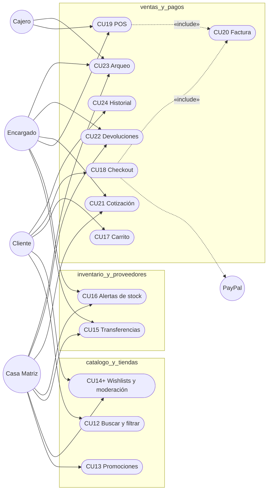

## 1.2 Priorización

| CU | Prioridad | Tipo |
| :-- | :-: | :-- |
| CU17, CU18, CU19, CU20, CU23 | Alta | Transacciones ACID / control financiero |
| CU12, CU15 | Alta | Consulta indexada / transacción multi-sucursal |
| CU13, CU16, CU22, CU24 | Media | Reglas de negocio / consulta |
| CU14+, CU21 | Baja | Social / documental |

## 1.3 Fichas de casos de uso

### CU12 · Buscar y filtrar catálogo + disponibilidad por sucursal

| Campo | Descripción |
| :-- | :-- |
| **Actores** | Visitante, Cliente. |
| **Tablas** | `products`, `product_variants`, `inventory`, `categories`, `seasons`, `colors`, `sizes`, `branches` |
| **Flujo (web)** | 1. `/tienda` muestra filtros con las opciones de `GET /catalog/filter-options` (rango de precios, categorías, temporadas/ocasión, tallas, colores, sucursales).<br>2. El cliente combina filtros y/o texto (o voz, CU34).<br>3. `GET /catalog/products/search?q&category_id&season_id&min_price&max_price&size_id&color_id&branch_id&sort_by&page&limit` (orden: `newest`, `price_asc`, `price_desc`, `rating`) devuelve resultados **paginados**.<br>4. En el detalle, `GET /catalog/products/{id}/branch-availability` muestra el **stock de la variante elegida en cada sucursal**, separando las que tienen stock, las agotadas y las **cerradas temporalmente**; desde ahí se reserva (CU26). |
| **Flujo (móvil)** | Búsqueda por texto, filtro por categoría y **búsqueda por voz** en el catálogo; el detalle de prenda muestra la sección **"Disponible en tiendas"** con el stock por sucursal de la talla y el color elegidos y el botón *Reservar*. |
| **Excepción** | Sin resultados: mensaje y opción de limpiar filtros. |

### CU13 · Gestionar promociones (cupones y campañas de temporada)

| Campo | Descripción |
| :-- | :-- |
| **Actor** | Casa Matriz (`/admin/promotions`). |
| **Tablas** | `coupons`, `seasonal_promotions`, `audit_logs` |
| **Cupones** | Código único, `discount_type` **`PORCENTAJE` o `MONTO_FIJO`**, valor, compra mínima, `valid_from`/`valid_until`, `max_uses`, `used_count`, activo. CRUD: `GET/POST/PUT/DELETE /catalog/coupons`. |
| **Validación** | `POST /catalog/coupons/validate` (público) con código y total: verifica vigencia, activo, usos y compra mínima y devuelve el descuento. Se usa en el carrito web, el checkout móvil y el POS; el checkout vuelve a aplicarlo en el servidor. |
| **Campañas** | `seasonal_promotions`: nombre, % de descuento, categoría opcional, `start_date`–`end_date`. CRUD: `/catalog/promotions`. |
| **Excepción** | Código duplicado (400). |

### CU14+ · Wishlists múltiples y moderación de reseñas

| Campo | Descripción |
| :-- | :-- |
| **Actores** | Cliente (listas), Casa Matriz (moderación). |
| **Tablas** | `wishlists` (`is_public`, `share_token` único), `wishlist_group_items`, `wishlist_items` (favorito simple), `product_reviews` (`status`, `moderated_at`, `moderator_id`) |
| **Listas (web)** | El cliente crea listas con nombre y visibilidad, agrega/quita prendas (`/catalog/wishlists/*`) y comparte la lista pública con su enlace `GET /catalog/wishlists/shared/{share_token}` (sin sesión). |
| **Moderación** | Las reseñas se publican con estado `APPROVED` (moderación **posterior**). Casa Matriz revisa en `/admin/reviews` (`GET /catalog/admin/reviews`) y puede **rechazarlas** (`PUT /catalog/admin/reviews/{id}/moderate` con `APPROVED`/`REJECTED`); la tienda solo muestra las aprobadas (el autor ve la suya). |
| **Móvil** | Mantiene el favorito simple (♥) del Ciclo 1. |

### CU15 · Transferencias entre sucursales

| Campo | Descripción |
| :-- | :-- |
| **Actores** | Encargado (su sucursal), Casa Matriz. Web `/admin/transfers`. |
| **Tablas** | `stock_transfers`, `stock_transfer_details`, `inventory`, `inventory_ledger` |
| **Flujo** | 1. `POST /merchandise/transfers`: origen, destino y variantes/cantidades → estado **`SOLICITADA`** (código `transfer_number`).<br>2. `PUT /merchandise/transfers/{id}/status` → **`EN_TRANSITO`** (solo desde `SOLICITADA`): valida y **descuenta el stock del origen** y asienta `TRANSFERENCIA_SALIDA` en `inventory_ledger`.<br>3. → **`COMPLETADA`**: **suma el stock en el destino** y asienta `TRANSFERENCIA_ENTRADA`; guarda `received_by_id` y `completed_at`.<br>4. → **`CANCELADA`**: si ya estaba `EN_TRANSITO`, **devuelve el stock al origen** (`TRANSFERENCIA_REVERSION`). Una transferencia `COMPLETADA` o `CANCELADA` ya no cambia. |
| **Excepción** | Stock insuficiente en el origen al despachar (400). |
| **Nota** | La actualización del inventario es **lógica de aplicación dentro de la misma transacción** (no hay triggers en la base de datos). |

### CU16 · Alertas de stock (mínimo / máximo)

| Campo | Descripción |
| :-- | :-- |
| **Actores** | Encargado, Casa Matriz (lectura también para Cajero vía API). Web `/admin/alerts`. |
| **Tablas** | `inventory` (`stock_minimo`, `stock_maximo`) — **no hay tabla de alertas**: se calculan al consultar. |
| **Flujo** | `GET /merchandise/inventory/alerts` devuelve las variantes de la sucursal con `stock_actual ≤ stock_minimo` (**`QUIEBRE_STOCK`**) o `stock_actual ≥ stock_maximo` (**`SOBRESTOCK`**). Los umbrales se configuran con `PUT /merchandise/inventory/thresholds/{branch_id}/{variant_id}`. Desde la alerta el encargado puede pedir una transferencia (CU15) o Casa Matriz una reposición al proveedor (CU08/CU10). |

### CU17 · Carrito de compra digital

| Campo | Descripción |
| :-- | :-- |
| **Actor** | Cliente autenticado (web: modal de carrito; móvil: pestaña *Carrito*). |
| **Tablas** | `carts` (uno por usuario), `cart_items` |
| **Flujo** | `GET /sales/cart`, `POST /sales/cart/items`, `PUT/DELETE /sales/cart/items/{id}`, `DELETE /sales/cart/clear`. Al agregar se valida que la variante tenga stock (> 0) en alguna sucursal; la sucursal definitiva se elige en el checkout, donde se revalida el stock de **esa** sucursal. También recibe prendas desde el vestidor virtual (CU32) con la talla recomendada. |
| **Excepción** | "La prenda se encuentra temporalmente agotada en todas las sucursales (stock = 0)". |

### CU18 · Checkout digital con medios de pago (incluye la pasarela PayPal)

| Campo | Descripción |
| :-- | :-- |
| **Actores** | Cliente; **PayPal** (sistema externo). |
| **Tablas** | `orders`, `order_items`, `payments` (herencia de tabla única), `invoices`, `inventory`, `inventory_ledger`, `carts`, `cart_items`, `coupons` |
| **Precondición** | Carrito con ítems; stock en la sucursal elegida. |
| **Flujo** | 1. El cliente elige la **sucursal** de retiro/despacho, tipo de comprobante (**Factura** con NIT/CI y razón social, o **Nota de Entrega**) y, si tiene, un **cupón**.<br>2. Elige el medio de pago del canal online: **Tarjeta**, **PayPal** o **QR** (efectivo y crédito solo existen en el POS).<br>3. **Tarjeta:** titular, número (≥ 13 dígitos), vencimiento MM/AA y CVV; se guardan solo marca y últimos 4 dígitos. **QR:** se registra una referencia. **PayPal:** ver flujo de la pasarela.<br>4. `POST /sales/checkout` (canal `ONLINE`) ejecuta **una transacción**: valida stock por variante en la sucursal, crea la orden en estado **`PAGADA`**, sus ítems, **descuenta el inventario** y asienta `VENTA` en `inventory_ledger`, aplica el cupón, registra el pago con su subtipo, **emite el comprobante** (CU20) y vacía el carrito.<br>5. La web y la app muestran el comprobante (número de pedido, código de control, referencia del pago y total). |
| **Excepciones** | **E1** Stock insuficiente en la sucursal (400, se revierte todo). **E2** Datos de tarjeta inválidos (validación en web y móvil). **E3** PayPal no confirma el cobro (402) o no hay datos de la transacción (400). |

#### Pasarela de pago PayPal (CU18 y seña de CU26)

| Aspecto | Implementación |
| :-- | :-- |
| **API** | PayPal REST v2 (`/v1/oauth2/token`, `/v2/checkout/orders`, `/capture`, consulta de orden). `PAYPAL_MODE=sandbox` → `api-m.sandbox.paypal.com`; `live` → `api-m.paypal.com`. |
| **Credenciales** | `PAYPAL_CLIENT_ID` y `PAYPAL_CLIENT_SECRET` en `backend/.env` (app REST creada en developer.paypal.com). El **Secret nunca sale del backend**; el Client ID es público. |
| **Moneda** | Los montos en Bs se convierten a USD con `PAYPAL_EXCHANGE_RATE_BOB_USD` (6,96). |
| **Endpoints** | `GET /api/v1/payments/paypal/config` (Client ID, modo, `simulated`), `GET …/status` (prueba OAuth real: `connected`), `POST …/create-order`, `POST …/capture-order`. |
| **Web** | `paypal-checkout.service.ts` carga el **SDK oficial de PayPal (Smart Buttons)**: `createOrder` → backend crea la orden; el comprador inicia sesión en la ventana de PayPal y aprueba; `onApprove` → backend captura. |
| **Móvil** | `paypal_checkout.dart`: el backend crea la orden; la **ventana oficial de PayPal** se abre en la app (`webview_flutter`); cuando PayPal redirige a `…/checkout/success` la app pide al backend la captura. Si falla el checkout tras cobrar, se reutiliza el cobro (no se cobra dos veces). |
| **Verificación en servidor** | Antes de registrar el pedido (o la reserva), `verify_completed_order` consulta la orden en PayPal y exige `COMPLETED` y un monto que cubra el total. **Nunca se registra como pagado un pedido solo porque el cliente envió un ID.** |
| **Registro** | Pago de subtipo `PAYPAL` con `gateway_reference = PAYPAL:{orderId}`, `paypal_payer_id` y `paypal_payer_email`. |
| **Modo simulación** | Solo si no hay credenciales: órdenes `PAYPAL-SIM-…`, sin contacto con PayPal, y la pantalla lo indica explícitamente ("no se realiza ningún cobro"). |

#### Alistado y entrega de pedidos online en la sucursal (extensión de CU18/CU19)

El stock del pedido online se descuenta de la sucursal elegida al pagar. El **cajero** (o
encargado) lo atiende desde el POS → pestaña **Alistado**:
`GET /sales/orders-fulfillment` (pedidos `ONLINE` de su sucursal en `PENDIENTE`/`PAGADA`/`PREPARANDO`/`LISTO_PARA_ENTREGA`)
y `PATCH /sales/orders/{id}/fulfillment`:

| Desde | Hacia |
| :-- | :-- |
| `PENDIENTE`, `PAGADA` | `PREPARANDO`, `CANCELADO` |
| `PREPARANDO` | `LISTO_PARA_ENTREGA`, `CANCELADO` |
| `LISTO_PARA_ENTREGA` | `ENTREGADO` |

Requiere **caja abierta** del cajero en esa sucursal (el pedido queda asociado a su turno para el
arqueo). **Cancelar** devuelve las prendas al stock (`DEVOLUCION` en el libro mayor).

### CU19 · Venta presencial en caja (POS)

| Campo | Descripción |
| :-- | :-- |
| **Actores** | Cajero o Encargado de la sucursal (Casa Matriz debe elegir una sucursal). Web `/admin/pos`. |
| **Precondición** | **Turno de caja `ABIERTO`** del mismo usuario en la misma sucursal (CU23). |
| **Flujo** | 1. Búsqueda rápida por nombre o SKU en el **inventario real de la sucursal**.<br>2. El ticket suma ítems; opcionalmente aplica un cupón.<br>3. Medio de pago: **EFECTIVO** (monto recibido → vuelto), **TARJETA** (marca + últimos 4 / voucher), **QR** o **CREDITO** (fecha de vencimiento, 30 días por defecto).<br>4. NIT/CI y razón social → Factura o Nota de Entrega.<br>5. `POST /sales/checkout` con `channel = "POS"`, `cash_shift_id` y `pos_items`: misma transacción que CU18 (orden `PAGADA`, stock, ledger, pago, comprobante) asociada al turno.<br>6. Se muestra el recibo y se **imprime** desde el navegador. |
| **Pestañas del POS** | **Venta directa** (CU19) · **Reservas** (cobro del saldo, CU25) · **Alistado** (pedidos online). |
| **Excepciones** | Sin turno abierto, turno de otro usuario o de otra sucursal (400); efectivo insuficiente (400); stock insuficiente (400). |

### CU20 · Emitir factura y nota de entrega

| Campo | Descripción |
| :-- | :-- |
| **Actores** | Sistema (en cada venta: CU18, CU19, CU21, CU25). |
| **Tabla** | `invoices` (`order_id` único) |
| **Cálculo** | `tax_rate = 0,13`; `tax_amount = round(total × 0,13, 2)` (precios con IVA incluido); `subtotal` y `total` de la orden. |
| **Factura** | `doc_type = FACTURA`, NIT/CI y razón social del cliente y **código de control** hexadecimal (`XX-XX-XX-XX`). |
| **Nota de entrega** | `doc_type = NOTA_ENTREGA`, sin código de control. |
| **Visualización** | En la respuesta del pedido (web, app y POS) y en el historial (CU24); el POS lo imprime con el navegador. No hay generación de PDF en el servidor. |

### CU21 · Generar y convertir cotización

| Campo | Descripción |
| :-- | :-- |
| **Actores** | **Encargado** y Casa Matriz (`POST` y conversión restringidos a `SUPERADMIN`/`ENCARGADO`; el cajero solo puede consultar vía API). Web `/admin/quotations-returns`. |
| **Tablas** | `quotations` (`quotation_number` único, `valid_until`), `quotation_items` |
| **Flujo** | 1. `POST /sales/quotations` con cliente, ítems y días de vigencia → estado **`VIGENTE`**.<br>2. `GET /sales/quotations` marca como **`EXPIRADA`** las vencidas al consultar.<br>3. `POST /sales/quotations/{id}/convert` (solo `VIGENTE`): valida stock, crea la venta con pago y **factura** (CU20), descuenta stock y deja la cotización **`CONVERTIDA`**. |
| **Excepciones** | Cotización expirada (400); stock insuficiente en la sucursal (400). |

### CU22 · Devoluciones y cambios de prendas

| Campo | Descripción |
| :-- | :-- |
| **Actores** | **Encargado** y Casa Matriz (`POST /sales/returns`); el **cliente consulta** sus devoluciones (`GET /sales/returns/my`: web `/tienda/pedidos` → pestaña *Devoluciones y cambios*; app móvil → *Mis compras* → *Devoluciones*). |
| **Tablas** | `order_returns` (`return_number` `DEV-AAAA-XXXXXX`, `refund_amount`, `status`), `order_return_items` (`replacement_variant_id`) |
| **Reglas** | Plazo máximo **30 días** desde la compra (validado en web y backend). Solo prendas de esa orden y hasta la cantidad comprada. |
| **Tipos** | **`DEVOLUCION_DINERO`** (reembolso del precio facturado) o **`CAMBIO_PRENDA`** (con variante de reemplazo; se valida y descuenta su stock). |
| **Efecto** | La prenda devuelta **siempre reingresa** al stock de la sucursal de la orden (`DEVOLUCION_CLIENTE` en el libro mayor); la de cambio se descuenta como `VENTA`. La devolución queda `APROBADA` y se audita. |
| **Excepciones** | Plazo vencido (400); prenda ajena a la orden o cantidad excedida (400); sin stock para el cambio (400). |

### CU23 · Arqueo de caja

| Campo | Descripción |
| :-- | :-- |
| **Actores** | Cajero, Encargado; Casa Matriz ve la **auditoría global** de cajas. Web `/admin/shifts`. |
| **Tabla** | `cash_shifts` (`cashier_id`, `branch_id`, `opening_amount`, `closing_amount_declared`, `closing_amount_system`, `difference`, `status`) |
| **Apertura** | `POST /sales/shifts/open` con monto inicial → **`ABIERTO`**. Un usuario no puede tener dos turnos abiertos (aviso si está abierto en otra sucursal). |
| **Turno en curso** | `GET /sales/shifts/current` con ventas del turno y **desglose**: efectivo, tarjeta, QR y por origen (presencial, reservas, pedidos online/delivery). |
| **Cierre ciego** | `POST /sales/shifts/{id}/close` con el efectivo contado: **esperado = apertura + ventas en efectivo del turno**; **diferencia = declarado − esperado** (0 cuadra, > 0 sobrante, < 0 faltante) → **`CERRADO`**. |
| **Historial** | `GET /sales/shifts` (por sucursal; global para Casa Matriz). |

### CU24 · Historial de compras (cliente)

`GET /sales/orders/my-orders` y `GET /sales/orders/{id}`: número (`ORD-AAAA-NNNNNN`), fecha,
sucursal/canal, estado (`PAGADA`, `PREPARANDO`, `LISTO_PARA_ENTREGA`, `ENTREGADO`, `CANCELADO`),
ítems (prenda, talla, color, cantidad, subtotal), pagos (medio y referencia) y comprobante (tipo,
código de control, NIT). Web `/tienda/pedidos` y móvil *Mis compras*, ambos con las pestañas
**Pedidos** y **Devoluciones** (CU22). Cada compra online, cambio de alistado y devolución genera
además un aviso en el buzón del cliente (CU40, ver `Ciclo3.md`).

## 1.4 Prototipos de navegación

```
Tienda (web/app) ─► Catálogo + filtros (CU12) ─► Detalle (stock por sucursal) ─► Añadir al carrito (CU17)
      ─► Checkout (CU18): sucursal · Factura/Nota · cupón · [Tarjeta | PayPal | QR]
            └─ PayPal: ventana oficial ─► aprobar ─► captura en servidor
      ─► Comprobante (CU20) ─► Mis compras (CU24: Pedidos · Devoluciones)

Panel (cajero) ─► Abrir caja (CU23) ─► POS: [Venta directa (CU19) | Reservas (CU25) | Alistado]
      ─► Recibo impreso ─► Cierre ciego de caja (CU23)
```

## 1.5 Modelo de casos de uso (estereotipos)

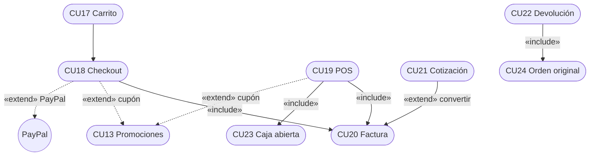

---

# 2. Análisis

## 2.1 Arquitectura de paquetes

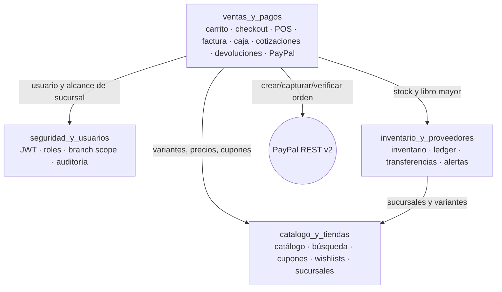

## 2.2 Diagramas de comunicación

**CU18 — Checkout con PayPal**

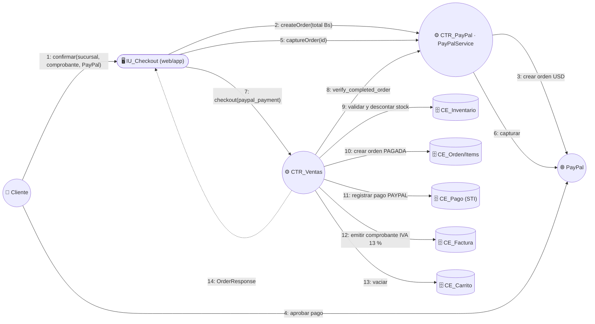

**CU19 — Venta en POS**

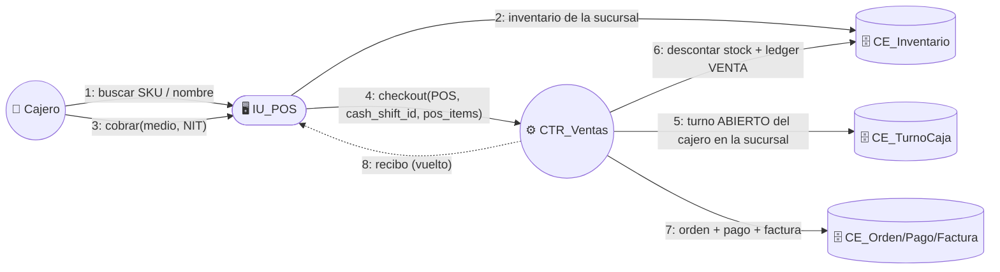

**CU15 — Transferencia entre sucursales**

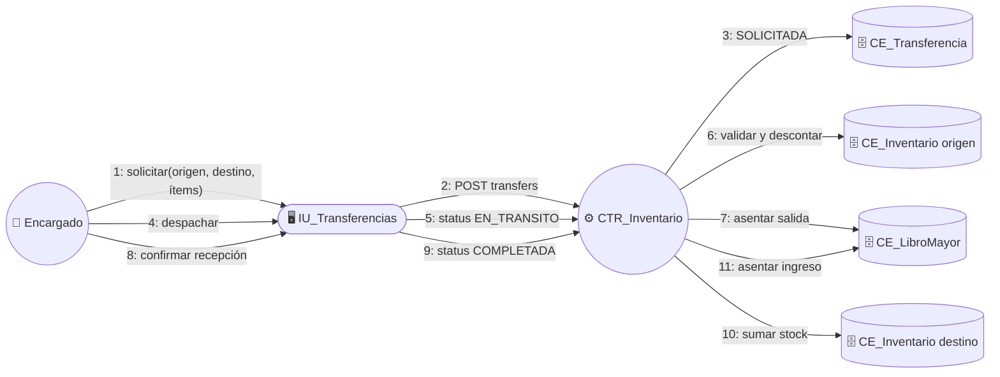

**CU22 — Devolución / cambio**

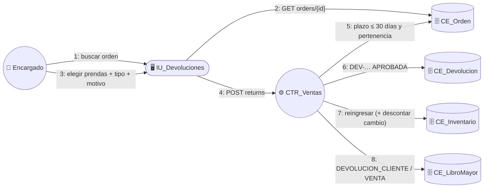

## 2.3 Clases de análisis

| Paquete | Boundary | Control | Entity |
| :-- | :-- | :-- | :-- |
| `ventas_y_pagos` | `CartModalComponent`, `PosComponent`, `CashShiftComponent`, `QuotationsReturnsComponent`, `CustomerOrdersComponent` · móvil `CartView`/`CheckoutSheet`, `CustomerOrdersView`, `PayPalApprovalPage` | `ventas_y_pagos/routers.py`, `paypal_routers.py`, `PayPalService`, `PayPalCheckoutService` (web) | `Cart`, `CartItem`, `Order`, `OrderItem`, `Payment` (`Efectivo`/`Tarjeta`/`QR`/`PayPal`/`Credito`), `Invoice`, `CashShift`, `Quotation`, `QuotationItem`, `OrderReturn`, `OrderReturnItem` |
| `inventario_y_proveedores` | `TransfersComponent`, `StockAlertsComponent` | `merchandise/routers.py` | `StockTransfer`, `StockTransferDetail`, `Inventory`, `InventoryLedger` |
| `catalogo_y_tiendas` | `StoreHomeComponent`, `ProductDetailComponent`, `WishlistComponent`, `PromotionsComponent`, `ReviewsModerationComponent` · `CatalogoView`, `ProductDetailView` | `catalogo_y_tiendas/routers.py` | `Coupon`, `SeasonalPromotion`, `Wishlist`, `WishlistGroupItem`, `ProductReview` |

## 2.4 Acoplamiento y cohesión

- `ventas_y_pagos` concentra toda la lógica comercial y fiscal; consume `catalogo_y_tiendas`
  (precios, cupones) e `inventario_y_proveedores` (stock y ledger) y **aísla la pasarela externa**
  en `PayPalService`.
- El polimorfismo de pagos se persiste en **una sola tabla** (`payments`, discriminador
  `payment_type`: `EFECTIVO`, `TARJETA`, `QR`, `PAYPAL`, `CREDITO`).
- El alcance por sucursal se resuelve en una sola dependencia (`get_branch_scope`) reutilizada por
  ventas, caja, inventario y transferencias.

---

# 3. Diseño

## 3.1 Arquitectura

| Capa | Tecnología |
| :-- | :-- |
| Presentación | **Angular 16** + Bootstrap 5 (web) · **Flutter** (app; `http`, `shared_preferences`, `webview_flutter`, `speech_to_text`, `image_picker`, `camera`) |
| Servicios | **FastAPI** (routers por paquete, `Depends` para JWT, roles y alcance de sucursal) |
| Dominio | Reglas en los routers y servicios del paquete (`paypal_service.py`, `vton_service.py`), transacciones SQLAlchemy |
| Datos | **SQLAlchemy 2** sobre **PostgreSQL**; tablas por `create_all` + migraciones ligeras en `main.py` |
| Externos | PayPal REST v2 · SMTP |

## 3.2 Diagramas de secuencia

**DSC018 — Checkout digital con PayPal y factura**

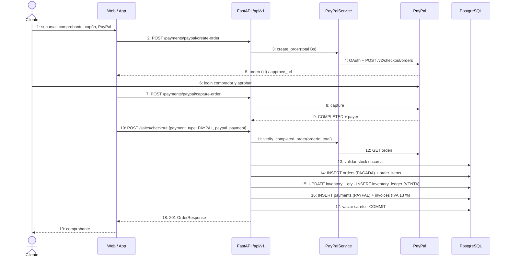

**DSC019/023 — Turno de caja, venta POS y cierre ciego**

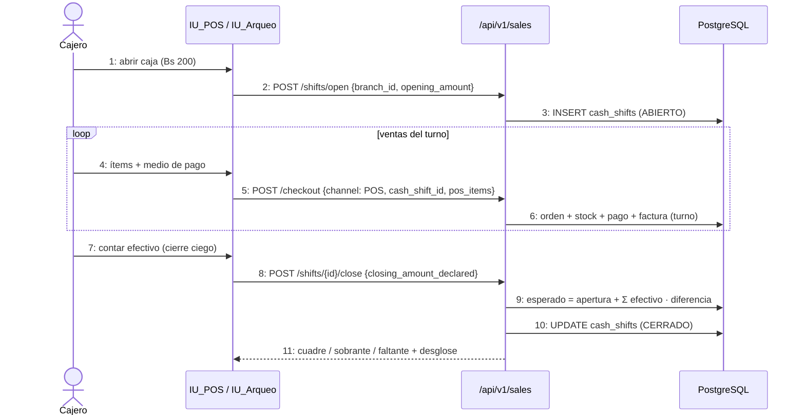

**DSC-Alistado — Pedido online en la sucursal**

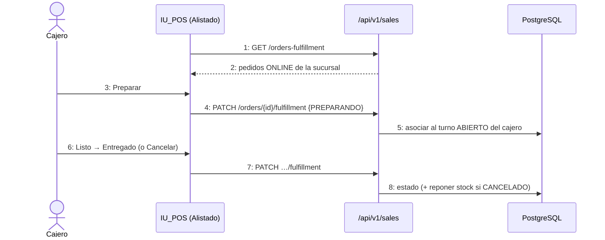

**DSC021 — Convertir cotización**

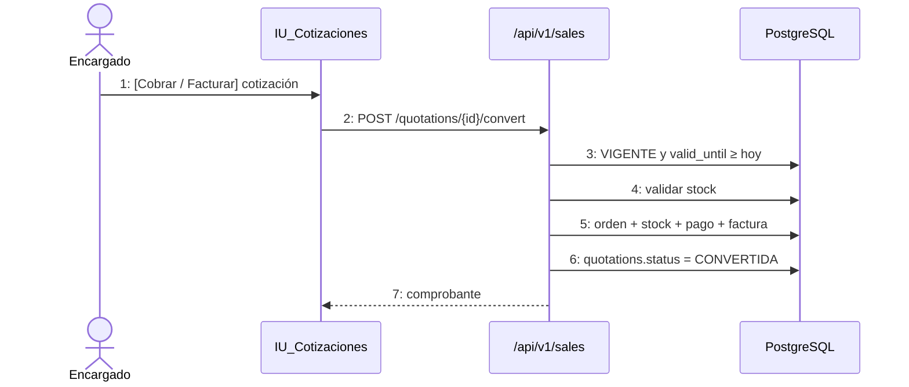

**DSC022 — Devolución o cambio (≤ 30 días)**

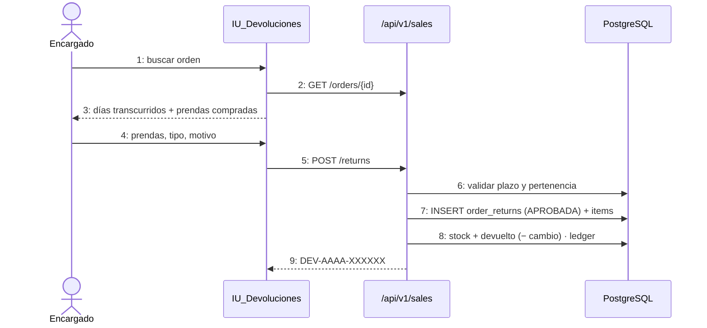

## 3.3 Máquinas de estado

**Orden (`orders.status`)**

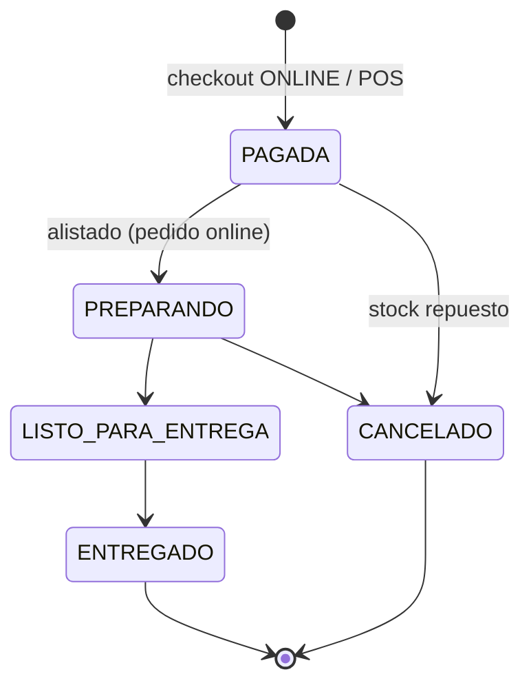

(`PENDIENTE` también se acepta como estado de origen en el alistado.)

**Transferencia (`stock_transfers.status`)**

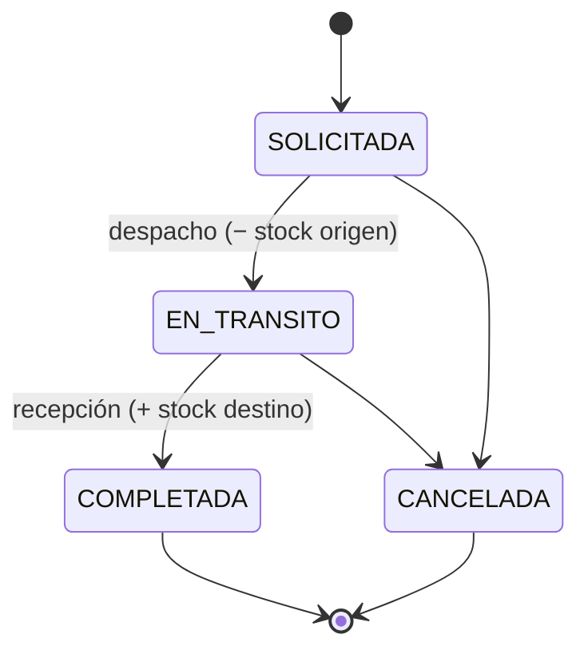

**Cotización (`quotations.status`)** — `VIGENTE → CONVERTIDA` (cobro) · `VIGENTE → EXPIRADA` (vencida al consultar).

**Turno de caja (`cash_shifts.status`)** — `ABIERTO → CERRADO` (cierre ciego).

---

# 4. Diseño de datos (DDL real)

Generado desde los modelos SQLAlchemy (dialecto PostgreSQL); coincide con la base de datos.
No hay triggers: la actualización de inventario y libro mayor ocurre en la aplicación, dentro de
la misma transacción que la venta, la transferencia o la devolución.

```sql
CREATE TABLE carts (
    id SERIAL NOT NULL,
    user_id INTEGER,
    session_id VARCHAR(80),
    created_at TIMESTAMP WITH TIME ZONE DEFAULT now() NOT NULL,
    updated_at TIMESTAMP WITH TIME ZONE DEFAULT now() NOT NULL,
    PRIMARY KEY (id),
    FOREIGN KEY(user_id) REFERENCES users (id) ON DELETE CASCADE
);

CREATE TABLE cart_items (
    id SERIAL NOT NULL,
    cart_id INTEGER NOT NULL,
    variant_id INTEGER NOT NULL,
    quantity INTEGER NOT NULL,
    created_at TIMESTAMP WITH TIME ZONE DEFAULT now() NOT NULL,
    PRIMARY KEY (id),
    FOREIGN KEY(cart_id) REFERENCES carts (id) ON DELETE CASCADE,
    FOREIGN KEY(variant_id) REFERENCES product_variants (id) ON DELETE RESTRICT
);

CREATE TABLE cash_shifts (
    id SERIAL NOT NULL,
    cashier_id INTEGER NOT NULL,
    branch_id INTEGER NOT NULL,
    opening_amount NUMERIC(10, 2) NOT NULL,
    closing_amount_declared NUMERIC(10, 2),
    closing_amount_system NUMERIC(10, 2),
    difference NUMERIC(10, 2),
    status VARCHAR(20) NOT NULL,
    opened_at TIMESTAMP WITH TIME ZONE DEFAULT now() NOT NULL,
    closed_at TIMESTAMP WITH TIME ZONE,
    notes VARCHAR(255),
    PRIMARY KEY (id),
    FOREIGN KEY(cashier_id) REFERENCES users (id) ON DELETE RESTRICT,
    FOREIGN KEY(branch_id) REFERENCES branches (id) ON DELETE RESTRICT
);

CREATE TABLE orders (
    id SERIAL NOT NULL,
    user_id INTEGER NOT NULL,
    branch_id INTEGER NOT NULL,
    channel VARCHAR(10) NOT NULL,
    status VARCHAR(20) NOT NULL,
    subtotal NUMERIC(10, 2) NOT NULL,
    discount_amount NUMERIC(10, 2) NOT NULL,
    coupon_code VARCHAR(30),
    total_amount NUMERIC(10, 2) NOT NULL,
    cash_shift_id INTEGER,
    created_at TIMESTAMP WITH TIME ZONE DEFAULT now() NOT NULL,
    PRIMARY KEY (id),
    FOREIGN KEY(user_id) REFERENCES users (id) ON DELETE RESTRICT,
    FOREIGN KEY(branch_id) REFERENCES branches (id) ON DELETE RESTRICT,
    FOREIGN KEY(cash_shift_id) REFERENCES cash_shifts (id) ON DELETE SET NULL
);

CREATE TABLE order_items (
    id SERIAL NOT NULL,
    order_id INTEGER NOT NULL,
    variant_id INTEGER NOT NULL,
    quantity INTEGER NOT NULL,
    unit_price NUMERIC(10, 2) NOT NULL,
    PRIMARY KEY (id),
    FOREIGN KEY(order_id) REFERENCES orders (id) ON DELETE CASCADE,
    FOREIGN KEY(variant_id) REFERENCES product_variants (id) ON DELETE RESTRICT
);

CREATE TABLE payments (
    id SERIAL NOT NULL,
    order_id INTEGER NOT NULL,
    payment_type VARCHAR(20) NOT NULL,
    amount NUMERIC(10, 2) NOT NULL,
    status VARCHAR(20) NOT NULL,
    paid_at TIMESTAMP WITH TIME ZONE DEFAULT now() NOT NULL,
    cash_received NUMERIC(10, 2),
    cash_change NUMERIC(10, 2),
    card_brand VARCHAR(20),
    card_last4 VARCHAR(4),
    gateway_reference VARCHAR(80),
    qr_reference VARCHAR(80),
    paypal_payer_id VARCHAR(50),
    paypal_payer_email VARCHAR(100),
    credit_due_date DATE,
    PRIMARY KEY (id),
    FOREIGN KEY(order_id) REFERENCES orders (id) ON DELETE CASCADE
);

CREATE TABLE invoices (
    id SERIAL NOT NULL,
    order_id INTEGER NOT NULL,
    doc_type VARCHAR(15) NOT NULL,
    tax_rate NUMERIC(4, 3) NOT NULL,
    subtotal NUMERIC(10, 2) NOT NULL,
    tax_amount NUMERIC(10, 2) NOT NULL,
    total NUMERIC(10, 2) NOT NULL,
    control_code VARCHAR(40),
    customer_nit VARCHAR(20),
    customer_name VARCHAR(150),
    issued_at TIMESTAMP WITH TIME ZONE DEFAULT now() NOT NULL,
    PRIMARY KEY (id),
    UNIQUE (order_id),
    FOREIGN KEY(order_id) REFERENCES orders (id) ON DELETE RESTRICT
);

CREATE TABLE quotations (
    id SERIAL NOT NULL,
    quotation_number VARCHAR(30) NOT NULL,
    customer_name VARCHAR(150) NOT NULL,
    customer_email VARCHAR(100),
    customer_phone VARCHAR(30),
    created_by_id INTEGER NOT NULL,
    branch_id INTEGER,
    total_amount NUMERIC(10, 2) NOT NULL,
    valid_until TIMESTAMP WITH TIME ZONE NOT NULL,
    status VARCHAR(20) NOT NULL,
    created_at TIMESTAMP WITH TIME ZONE DEFAULT now() NOT NULL,
    PRIMARY KEY (id),
    UNIQUE (quotation_number),
    FOREIGN KEY(created_by_id) REFERENCES users (id) ON DELETE RESTRICT,
    FOREIGN KEY(branch_id) REFERENCES branches (id) ON DELETE SET NULL
);

CREATE TABLE quotation_items (
    id SERIAL NOT NULL,
    quotation_id INTEGER NOT NULL,
    variant_id INTEGER NOT NULL,
    quantity INTEGER NOT NULL,
    unit_price NUMERIC(10, 2) NOT NULL,
    PRIMARY KEY (id),
    FOREIGN KEY(quotation_id) REFERENCES quotations (id) ON DELETE CASCADE,
    FOREIGN KEY(variant_id) REFERENCES product_variants (id) ON DELETE RESTRICT
);

CREATE TABLE order_returns (
    id SERIAL NOT NULL,
    return_number VARCHAR(30) NOT NULL,
    order_id INTEGER NOT NULL,
    processed_by_id INTEGER NOT NULL,
    return_type VARCHAR(25) NOT NULL,
    reason VARCHAR(255) NOT NULL,
    refund_amount NUMERIC(10, 2) NOT NULL,
    status VARCHAR(20) NOT NULL,
    created_at TIMESTAMP WITH TIME ZONE DEFAULT now() NOT NULL,
    PRIMARY KEY (id),
    UNIQUE (return_number),
    FOREIGN KEY(order_id) REFERENCES orders (id) ON DELETE RESTRICT,
    FOREIGN KEY(processed_by_id) REFERENCES users (id) ON DELETE RESTRICT
);

CREATE TABLE order_return_items (
    id SERIAL NOT NULL,
    return_id INTEGER NOT NULL,
    variant_id INTEGER NOT NULL,
    quantity INTEGER NOT NULL,
    replacement_variant_id INTEGER,
    PRIMARY KEY (id),
    FOREIGN KEY(return_id) REFERENCES order_returns (id) ON DELETE CASCADE,
    FOREIGN KEY(variant_id) REFERENCES product_variants (id) ON DELETE RESTRICT,
    FOREIGN KEY(replacement_variant_id) REFERENCES product_variants (id) ON DELETE RESTRICT
);

CREATE TABLE stock_transfers (
    id SERIAL NOT NULL,
    transfer_number VARCHAR(30) NOT NULL,
    origin_branch_id INTEGER NOT NULL,
    destination_branch_id INTEGER NOT NULL,
    requested_by_id INTEGER NOT NULL,
    received_by_id INTEGER,
    status VARCHAR(20) NOT NULL,
    notes VARCHAR(255),
    created_at TIMESTAMP WITH TIME ZONE DEFAULT now() NOT NULL,
    updated_at TIMESTAMP WITH TIME ZONE DEFAULT now() NOT NULL,
    completed_at TIMESTAMP WITH TIME ZONE,
    PRIMARY KEY (id),
    UNIQUE (transfer_number),
    FOREIGN KEY(origin_branch_id) REFERENCES branches (id) ON DELETE RESTRICT,
    FOREIGN KEY(destination_branch_id) REFERENCES branches (id) ON DELETE RESTRICT,
    FOREIGN KEY(requested_by_id) REFERENCES users (id) ON DELETE RESTRICT,
    FOREIGN KEY(received_by_id) REFERENCES users (id) ON DELETE SET NULL
);

CREATE TABLE stock_transfer_details (
    id SERIAL NOT NULL,
    transfer_id INTEGER NOT NULL,
    variant_id INTEGER NOT NULL,
    quantity INTEGER NOT NULL,
    PRIMARY KEY (id),
    FOREIGN KEY(transfer_id) REFERENCES stock_transfers (id) ON DELETE CASCADE,
    FOREIGN KEY(variant_id) REFERENCES product_variants (id) ON DELETE RESTRICT
);

CREATE TABLE inventory (
    branch_id INTEGER NOT NULL,
    variant_id INTEGER NOT NULL,
    stock_actual INTEGER NOT NULL,
    avg_cost NUMERIC(10, 2) NOT NULL,
    stock_minimo INTEGER NOT NULL,
    stock_maximo INTEGER NOT NULL,
    PRIMARY KEY (branch_id, variant_id),
    FOREIGN KEY(branch_id) REFERENCES branches (id) ON DELETE RESTRICT,
    FOREIGN KEY(variant_id) REFERENCES product_variants (id) ON DELETE CASCADE
);

CREATE TABLE coupons (
    id SERIAL NOT NULL,
    code VARCHAR(30) NOT NULL,
    discount_type VARCHAR(15) NOT NULL,
    discount_value NUMERIC(10, 2) NOT NULL,
    min_purchase_amount NUMERIC(10, 2) NOT NULL,
    valid_from TIMESTAMP WITH TIME ZONE NOT NULL,
    valid_until TIMESTAMP WITH TIME ZONE NOT NULL,
    max_uses INTEGER NOT NULL,
    used_count INTEGER NOT NULL,
    is_active BOOLEAN NOT NULL,
    created_at TIMESTAMP WITH TIME ZONE DEFAULT now() NOT NULL,
    PRIMARY KEY (id),
    UNIQUE (code)
);

CREATE TABLE seasonal_promotions (
    id SERIAL NOT NULL,
    name VARCHAR(100) NOT NULL,
    description TEXT,
    discount_percent INTEGER NOT NULL,
    category_id INTEGER,
    start_date DATE NOT NULL,
    end_date DATE NOT NULL,
    is_active BOOLEAN NOT NULL,
    created_at TIMESTAMP WITH TIME ZONE DEFAULT now() NOT NULL,
    PRIMARY KEY (id),
    FOREIGN KEY(category_id) REFERENCES categories (id) ON DELETE SET NULL
);

CREATE TABLE wishlists (
    id SERIAL NOT NULL,
    user_id INTEGER NOT NULL,
    name VARCHAR(100) NOT NULL,
    is_public BOOLEAN NOT NULL,
    share_token VARCHAR(64) NOT NULL,
    created_at TIMESTAMP WITH TIME ZONE DEFAULT now() NOT NULL,
    PRIMARY KEY (id),
    FOREIGN KEY(user_id) REFERENCES users (id) ON DELETE CASCADE,
    UNIQUE (share_token)
);

CREATE TABLE wishlist_group_items (
    id SERIAL NOT NULL,
    wishlist_id INTEGER NOT NULL,
    product_id INTEGER NOT NULL,
    created_at TIMESTAMP WITH TIME ZONE DEFAULT now() NOT NULL,
    PRIMARY KEY (id),
    CONSTRAINT uq_wishlist_group_product UNIQUE (wishlist_id, product_id),
    FOREIGN KEY(wishlist_id) REFERENCES wishlists (id) ON DELETE CASCADE,
    FOREIGN KEY(product_id) REFERENCES products (id) ON DELETE CASCADE
);
```

| Columna | Valores usados |
| :-- | :-- |
| `orders.channel` | `ONLINE`, `POS` |
| `orders.status` | `PAGADA`, `PENDIENTE`, `PREPARANDO`, `LISTO_PARA_ENTREGA`, `ENTREGADO`, `CANCELADO` |
| `payments.payment_type` | `EFECTIVO`, `TARJETA`, `QR`, `PAYPAL`, `CREDITO` |
| `payments.status` | `CONFIRMADO` |
| `invoices.doc_type` | `FACTURA`, `NOTA_ENTREGA` |
| `cash_shifts.status` | `ABIERTO`, `CERRADO` |
| `quotations.status` | `VIGENTE`, `CONVERTIDA`, `EXPIRADA` |
| `order_returns.return_type` | `DEVOLUCION_DINERO`, `CAMBIO_PRENDA` |
| `stock_transfers.status` | `SOLICITADA`, `EN_TRANSITO`, `COMPLETADA`, `CANCELADA` |
| `coupons.discount_type` | `PORCENTAJE`, `MONTO_FIJO` |
| `product_reviews.status` | `APPROVED`, `REJECTED` |
| `inventory_ledger.movement_type` (Ciclo 2) | `VENTA`, `DEVOLUCION` (pedido cancelado), `DEVOLUCION_CLIENTE`, `TRANSFERENCIA_SALIDA`, `TRANSFERENCIA_ENTRADA`, `TRANSFERENCIA_REVERSION` |

---

# 5. Implementación

## 5.1 Endpoints (prefijo `/api/v1`)

**`ventas_y_pagos` (`/sales`)**

| Método y ruta | Permiso | CU |
| :-- | :-- | :-- |
| `GET /sales/cart` · `POST /sales/cart/items` · `PUT/DELETE /sales/cart/items/{id}` · `DELETE /sales/cart/clear` | Autenticado | CU17 |
| `POST /sales/checkout` | Autenticado (canal `POS` solo personal de tienda) | CU18 / CU19 / CU20 |
| `GET /sales/orders/my-orders` · `GET /sales/orders/{id}` | Cliente / personal de la sucursal | CU24 |
| `GET /sales/orders` | Personal (su sucursal) | — |
| `GET /sales/orders-fulfillment` · `PATCH /sales/orders/{id}/fulfillment` | SUPERADMIN, ENCARGADO, CAJERO | Alistado |
| `POST /sales/shifts/open` · `GET /sales/shifts/current` · `GET /sales/shifts` · `POST /sales/shifts/{id}/close` | SUPERADMIN, ENCARGADO, CAJERO | CU23 |
| `POST /sales/quotations` · `POST /sales/quotations/{id}/convert` | SUPERADMIN, ENCARGADO | CU21 |
| `GET /sales/quotations` | SUPERADMIN, ENCARGADO, CAJERO | CU21 |
| `POST /sales/returns` | SUPERADMIN, ENCARGADO | CU22 |
| `GET /sales/returns/my` | Cliente | CU22 / CU24 |

**Pasarela PayPal (`/payments/paypal`)**

| Método y ruta | Permiso |
| :-- | :-- |
| `GET /payments/paypal/config` · `GET /payments/paypal/status` | Público |
| `POST /payments/paypal/create-order` · `POST /payments/paypal/capture-order` | Autenticado |

**`inventario_y_proveedores` (`/merchandise`)**

| Método y ruta | Permiso | CU |
| :-- | :-- | :-- |
| `POST /merchandise/transfers` · `PUT /merchandise/transfers/{id}/status` | SUPERADMIN, ENCARGADO | CU15 |
| `GET /merchandise/transfers` · `GET /merchandise/transfers/{id}` | + CAJERO | CU15 |
| `GET /merchandise/inventory/alerts` | SUPERADMIN, ENCARGADO, CAJERO | CU16 |
| `PUT /merchandise/inventory/thresholds/{branch_id}/{variant_id}` | SUPERADMIN, ENCARGADO | CU16 |

**`catalogo_y_tiendas` (`/catalog`)**

| Método y ruta | Permiso | CU |
| :-- | :-- | :-- |
| `GET /catalog/filter-options` · `GET /catalog/products/search` · `GET /catalog/products/{id}/branch-availability` | Público | CU12 |
| `GET/POST/PUT/DELETE /catalog/coupons` · `/catalog/promotions` (escritura) | SUPERADMIN | CU13 |
| `POST /catalog/coupons/validate` · `GET /catalog/promotions` | Público | CU13 |
| `GET/POST/PUT/DELETE /catalog/wishlists…` · `POST/DELETE /catalog/wishlists/{id}/items/{product_id}` | Autenticado | CU14+ |
| `GET /catalog/wishlists/shared/{share_token}` | Público | CU14+ |
| `GET /catalog/admin/reviews` · `PUT /catalog/admin/reviews/{id}/moderate` | SUPERADMIN | CU14+ |

## 5.2 Web (`frontend-web/src/app/packages/`)

| Componente | Ruta | CU |
| :-- | :-- | :-- |
| `catalogo_y_tiendas/store/store-home` | `/tienda` | CU12 (+ CU34 voz) |
| `catalogo_y_tiendas/store/product-detail` | `/tienda/producto/:id` | CU12 (stock por sucursal), CU26 |
| `catalogo_y_tiendas/store/wishlist` | `/tienda/favoritos` | CU14+ |
| `catalogo_y_tiendas/promotions` | `/admin/promotions` | CU13 |
| `catalogo_y_tiendas/reviews-moderation` | `/admin/reviews` | CU14+ |
| `inventario_y_proveedores/transfers` | `/admin/transfers` | CU15 |
| `inventario_y_proveedores/stock-alerts` | `/admin/alerts` | CU16 |
| `ventas_y_pagos/cart/cart-modal` | modal de la tienda | CU17, CU18 (Tarjeta / PayPal / QR) |
| `ventas_y_pagos/paypal-checkout.service.ts` | — | PayPal Smart Buttons |
| `ventas_y_pagos/pos` | `/admin/pos` | CU19, CU25, alistado |
| `ventas_y_pagos/cash-shift` | `/admin/shifts` | CU23 |
| `ventas_y_pagos/quotations-returns` | `/admin/quotations-returns` | CU21, CU22 |
| `ventas_y_pagos/orders/customer-orders` | `/tienda/pedidos` (Pedidos · Devoluciones) | CU24, CU22 |

## 5.3 Móvil (`mobile/lib/src/packages/`)

| Archivo | CU |
| :-- | :-- |
| `catalogo_y_tiendas/catalogo_view.dart` | CU12 (texto, categoría, voz) |
| `catalogo_y_tiendas/product_detail_view.dart` | CU12 (stock por sucursal), CU17 (añadir al carrito) |
| `ventas_y_pagos/cart_view.dart` (`CartView` + `CheckoutSheet`) | CU17, CU18, CU20, CU13 (cupón) |
| `ventas_y_pagos/paypal_checkout.dart` | PayPal (ventana oficial en WebView) |
| `ventas_y_pagos/customer_orders_view.dart` | CU24 + CU22 (pestaña Devoluciones) |
| `ventas_y_pagos/ventas_api.dart` | Cliente HTTP de ventas |

---

# 6. Pruebas

| Archivo | Pruebas | Escenarios |
| :-- | :-: | :-- |
| `test_cu12.py` | 4 | opciones de filtro, búsqueda básica, búsqueda con filtros, disponibilidad inexistente |
| `test_cu13.py` | 2 | CRUD y validación de cupones, campañas de temporada |
| `test_cu14.py` | 2 | reseña y moderación, wishlists múltiples y enlace compartido |
| `test_cu15_cu16.py` | 2 | ciclo de vida de transferencias, alertas y umbrales |
| `test_cu17_cu24.py` | 5 | carrito; checkout online + factura + historial; POS + turno; cotización; devolución y cambio + **consulta de devoluciones del cliente** |
| `test_paypal_payments.py` | 4 | config, **status OAuth**, crear y capturar orden, reserva con seña PayPal |
| `test_nuevas_operaciones_caja_proveedor.py` | 3 | alistado de pedidos de la sucursal, desglose del arqueo, reposición bloqueada |

Suite completa del backend: **72 pruebas aprobadas**. Móvil: `flutter analyze` sin errores y
`flutter test` 4/4. Web: `ng build` sin errores.

---

# 7. Trazabilidad

| CU | Endpoint principal | Backend | Web | Móvil | Tablas |
| :-- | :-- | :-- | :-- | :-- | :-- |
| CU12 | `GET /catalog/products/search`, `…/branch-availability` | `catalogo_y_tiendas/routers.py` | `store-home`, `product-detail` | `catalogo_view`, `product_detail_view` | `products`, `product_variants`, `inventory` |
| CU13 | `/catalog/coupons`, `/catalog/promotions` | idem | `promotions` | checkout (cupón) | `coupons`, `seasonal_promotions` |
| CU14+ | `/catalog/wishlists`, `/catalog/admin/reviews` | idem | `wishlist`, `reviews-moderation` | favoritos simples | `wishlists`, `wishlist_group_items`, `product_reviews` |
| CU15 | `/merchandise/transfers` | `merchandise/routers.py` | `transfers` | — | `stock_transfers`, `stock_transfer_details`, `inventory_ledger` |
| CU16 | `/merchandise/inventory/alerts` | idem | `stock-alerts` | — | `inventory` |
| CU17 | `/sales/cart` | `ventas_y_pagos/routers.py` | `cart-modal` | `cart_view` | `carts`, `cart_items` |
| CU18 | `POST /sales/checkout` + `/payments/paypal/*` | `routers.py`, `paypal_service.py` | `cart-modal`, `paypal-checkout.service` | `cart_view`, `paypal_checkout` | `orders`, `order_items`, `payments`, `invoices` |
| CU19 | `POST /sales/checkout` (POS) | idem | `pos` | — | idem + `cash_shifts` |
| CU20 | (dentro del checkout) | idem | `cart-modal`, `pos` | `cart_view` | `invoices` |
| CU21 | `/sales/quotations` | idem | `quotations-returns` | — | `quotations`, `quotation_items` |
| CU22 | `POST /sales/returns`, `GET /sales/returns/my` | idem | `quotations-returns`, `customer-orders` | `customer_orders_view` | `order_returns`, `order_return_items` |
| CU23 | `/sales/shifts` | idem | `cash-shift` | — | `cash_shifts` |
| CU24 | `/sales/orders/my-orders` | idem | `customer-orders` | `customer_orders_view` | `orders`, `invoices`, `payments` |

**Pendientes conocidos del Ciclo 2:** pagos con **tarjeta y QR simulados** (sin pasarela bancaria;
PayPal sí es real); la app móvil no usa las listas de deseos múltiples (solo favoritos); no hay PDF de factura
en el servidor (el POS imprime desde el navegador).
