# Documentación del Ciclo 2 — Plataforma FashionStore

**Proceso Unificado de Desarrollo de Software (PUDS) + UML 2.5+** · Grupo #29 · Sistemas de Información II

Este documento reúne **toda** la especificación formal del **Ciclo 2** en un solo archivo maestro: captura de requisitos, análisis, diseño, arquitectura de implementación y pruebas, estructurados conforme a los cinco flujos de trabajo del PUDS.

**Documentos complementarios del proyecto:**
- [Contexto.md](file:///c:/Users/MARILYN/Documents/Carpeta%20Esther/Semestre%202-2026/SI%202/Primer_parcial/Contexto.md) (perfil general, marco teórico, lista maestra de 40 Casos de Uso).
- [PaquetesUML.md](file:///c:/Users/MARILYN/Documents/Carpeta%20Esther/Semestre%202-2026/SI%202/Primer_parcial/PaquetesUML.md) (arquitectura de paquetes y dependencias).
- [BaseDeDatos.md](file:///c:/Users/MARILYN/Documents/Carpeta%20Esther/Semestre%202-2026/SI%202/Primer_parcial/BaseDeDatos.md) (diseño físico completo de la base de datos relacional).
- [Ciclo1.md](file:///c:/Users/MARILYN/Documents/Carpeta%20Esther/Semestre%202-2026/SI%202/Primer_parcial/Ciclo1.md) (especificación del ciclo 1: autenticación, catálogo base, inventario y valoración).

---

## Índice

- [0. Resumen del Ciclo 2](#0-resumen-del-ciclo-2)
  - [0.1 Alcance](#01-alcance)
  - [0.2 Paquetes involucrados](#02-paquetes-involucrados)
  - [0.3 Alcance por canal (Web vs Móvil)](#03-alcance-por-canal-web-vs-móvil)
- [1. Captura de Requisitos](#1-captura-de-requisitos)
  - [1.1 Identificación de actores y casos de uso](#11-identificación-de-actores-y-casos-de-uso)
  - [1.2 Priorización y clasificación](#12-priorización-y-clasificación)
  - [1.3 Fichas detalladas de casos de uso (CU12 a CU24)](#13-fichas-detalladas-de-casos-de-uso)
  - [1.4 Prototipado y experiencia de usuario (UX/UI)](#14-prototipado-y-experiencia-de-usuario)
  - [1.5 Estructuración del modelo de casos de uso (Diagramas Use Case)](#15-estructuración-del-modelo-de-casos-de-uso)
- [2. Flujo de Trabajo — Análisis](#2-flujo-de-trabajo--análisis)
  - [2.1 Análisis de arquitectura de paquetes](#21-análisis-de-arquitectura-de-paquetes)
  - [2.2 Diagramas de comunicación / colaboración (BCE)](#22-diagramas-de-comunicación--colaboración-bce)
  - [2.3 Análisis de clases (Boundary - Control - Entity)](#23-análisis-de-clases-boundary---control---entity)
  - [2.4 Acoplamiento y cohesión](#24-acoplamiento-y-cohesión)
- [3. Flujo de Trabajo — Diseño](#3-flujo-de-trabajo--diseño)
  - [3.1 Diseño de arquitectura lógica (4 capas) y física de despliegue](#31-diseño-de-arquitectura-lógica-4-capas-y-física-de-despliegue)
  - [3.2 Diagramas de secuencia de los flujos críticos](#32-diagramas-de-secuencia-de-los-flujos-críticos)
  - [3.3 Diagramas de máquinas de estado](#33-diagramas-de-máquinas-de-estado)
  - [3.4 Diseño de datos relacional (DDL SQL, índices y triggers)](#34-diseño-de-datos-relacional-ddl-sql-índices-y-triggers)
- [4. Flujo de Trabajo — Implementación](#4-flujo-de-trabajo--implementación)
  - [4.1 Selección de tecnologías y dependencias](#41-selección-de-tecnologías-y-dependencias)
  - [4.2 Especificación de endpoints y contratos API REST](#42-especificación-de-endpoints-y-contratos-api-rest)
  - [4.3 Componentes Web (Angular) y Móvil (Flutter)](#43-componentes-web-angular-y-móvil-flutter)
- [5. Flujo de Trabajo — Pruebas](#5-flujo-de-trabajo--pruebas)
  - [5.1 Plan de pruebas unitarias e integración](#51-plan-de-pruebas-unitarias-e-integración)
  - [5.2 Matriz de casos de prueba del Ciclo 2](#52-matriz-de-casos-de-prueba-del-ciclo-2)
- [6. Matriz de Trazabilidad](#6-matriz-de-trazabilidad)

---

## 0. Resumen del Ciclo 2

### 0.1 Alcance

El **Ciclo 2** comprende **13 Casos de Uso** esenciales para el núcleo transaccional de ventas, facturación, logística interna y conversión de la plataforma FashionStore:

> **CU12, CU13, CU14 (ampliación), CU15, CU16, CU17, CU18, CU19, CU20, CU21, CU22, CU23, CU24.**

Mientras que el Ciclo 1 estableció la seguridad, usuarios, sucursales y la gestión base de catálogo e inventario, el **Ciclo 2 materializa el negocio comercial**:
1. **Comercio digital omnicanal:** Carrito de compra con control estricto de existencias, checkout con herencia de medios de pago (Efectivo, Tarjeta, QR y Crédito), historial de compras y comprobantes.
2. **Punto de Venta presencial (POS):** Módulo de caja ágil para cajeros en tiendas físicas, venta con lector/búsqueda rápida, arqueo de apertura/cierre diario de caja con cálculo de faltantes/sobrantes.
3. **Facturación legal y comprobantes:** Emisión automática de Factura fiscal con cálculo del **IVA 13 %** y generación de código de control / QR fiscal, o Nota de Entrega según requerimiento del cliente.
4. **Logística y optimización de inventario:** Transferencias de stock entre sucursales mediante transacciones seguras con afectación al libro mayor (`inventory_ledger`), y sistema de alertas de stock mínimo y sobrestock.
5. **Comercialización y fidelización:** Cupones de descuento, campañas de temporada por fecha, cotizaciones formales con vigencia, devoluciones y cambios con reingreso controlado de prendas, wishlist múltiple y moderación de reseñas.

---

### 0.2 Paquetes involucrados

El Ciclo 2 opera sobre 3 de los 8 paquetes arquitecturales del sistema:

| Paquete | Rol en Ciclo 2 | Casos de Uso |
| :--- | :--- | :--- |
| **`catalogo_y_tiendas`** | Búsqueda facetada con stock por tienda, cupones/promociones, wishlist y moderación | `CU12`, `CU13`, `CU14+` |
| **`inventario_y_proveedores`** | Transferencias inter-sucursales, alertas de stock mínimo/máximo | `CU15`, `CU16` |
| **`ventas_y_pagos`** *(núcleo activo)* | Carrito, checkout digital, POS físico, facturación IVA 13 %, cotización, devoluciones, arqueo de caja e historial | `CU17`, `CU18`, `CU19`, `CU20`, `CU21`, `CU22`, `CU23`, `CU24` |

---

### 0.3 Alcance por canal (Web vs Móvil)

| ID | Caso de uso | Móvil (Flutter) | Web Tienda (Angular) | Web Panel Admin (Angular) | Backend (FastAPI) |
| :-- | :-- | :-: | :-: | :-: | :-: |
| **CU12** | Buscar y filtrar catálogo + stock por sucursal | ✅ | ✅ | — | ✅ |
| **CU13** | Promociones: cupones y ofertas de temporada | — | — | ✅ | ✅ |
| **CU14+** | Wishlist múltiple y moderación de reseñas | ✅ | ✅ | ✅ *(moderación)* | ✅ |
| **CU15** | Transferencias de inventario entre sucursales | — | — | ✅ | ✅ |
| **CU16** | Configuración y alertas de stock | — | — | ✅ | ✅ |
| **CU17** | Carrito de compras digital (bloqueo stock = 0) | ✅ | ✅ | — | ✅ |
| **CU18** | Checkout digital polimórfico (Efectivo/Tarjeta/QR/Crédito) | ✅ | ✅ | — | ✅ |
| **CU19** | Punto de Venta en caja (POS presencial) | — | — | ✅ *(Cajero)* | ✅ |
| **CU20** | Emisión de Factura (IVA 13 %) y Nota de Entrega | ✅ *(descarga)* | ✅ *(descarga)* | ✅ *(emisión)* | ✅ |
| **CU21** | Generar cotización | — | — | ✅ | ✅ |
| **CU22** | Devoluciones y cambios de prendas | — | — | ✅ | ✅ |
| **CU23** | Arqueo de caja (apertura y cierre de turno) | — | — | ✅ *(Cajero)* | ✅ |
| **CU24** | Historial y detalle de compras del cliente | ✅ | ✅ | — | ✅ |

---

# 1. Captura de Requisitos

## 1.1 Identificación de actores y casos de uso

### Actores participantes
1. **Cliente (`CLIENTE`):** Usuario registrado que busca productos, arma su carrito, aplica cupones, realiza checkout digital, revisa su historial de pedidos y administra sus listas de deseos.
2. **Cajero (`CAJERO`):** Empleado asignado a una sucursal física. Abre y cierra su turno de caja mediante arqueo (CU23), procesa ventas rápidas de mostrador en el módulo POS (CU19), emite facturas/notas de entrega (CU20) y tramita devoluciones/cambios autorizados (CU22).
3. **Encargado de Sucursal (`ENCARGADO`):** Administra la operación local. Solicita y recibe transferencias de mercadería desde/hacia otras sucursales (CU15), supervisa alertas de reposición de stock (CU16), genera cotizaciones comerciales (CU21) y revisa los arqueos de sus cajeros.
4. **Superadministrador (`SUPERADMIN`):** Acceso integral al sistema. Modera reseñas públicas de clientes (CU14+), programa cupones y promociones de temporada (CU13), y supervisa la operación global y auditorías.
5. **Pasarela de Pagos Externa (Stripe / QR Simple / Banco):** Actor externo de sistema que procesa transacciones bancarias o confirma recepción de pagos vía webhooks.
6. **Servicio de Facturación / Impuestos Nacionales:** Algoritmo/servicio de generación de Código de Control y validación fiscal bajo normativa boliviana (IVA 13 %).

```mermaid
flowchart LR
    Cliente((Cliente))
    Cajero((Cajero))
    Encargado((Encargado))
    Superadmin((Superadmin))
    Pasarela((Pasarela Pagos))

    subgraph catalogo_y_tiendas
        CU12["CU12: Buscar y filtrar catálogo"]
        CU13["CU13: Gestionar promociones"]
        CU14["CU14+: Wishlist múltiple y reseñas"]
    end

    subgraph inventario_y_proveedores
        CU15["CU15: Transferencias entre sucursales"]
        CU16["CU16: Alertas de stock"]
    end

    subgraph ventas_y_pagos
        CU17["CU17: Carrito de compras"]
        CU18["CU18: Checkout digital"]
        CU19["CU19: Venta en caja POS"]
        CU20["CU20: Facturación IVA 13%"]
        CU21["CU21: Generar cotización"]
        CU22["CU22: Devoluciones y cambios"]
        CU23["CU23: Arqueo de caja"]
        CU24["CU24: Historial de compras"]
    end

    Cliente --> CU12
    Cliente --> CU14
    Cliente --> CU17
    Cliente --> CU18
    Cliente --> CU24

    Superadmin --> CU13
    Superadmin --> CU14
    Encargado --> CU15
    Encargado --> CU16
    Encargado --> CU21

    Cajero --> CU19
    Cajero --> CU20
    Cajero --> CU22
    Cajero --> CU23

    CU18 -.-> Pasarela
    CU18 ..> CU20 : «include»
    CU19 ..> CU20 : «include»
```

---

## 1.2 Priorización y clasificación

| ID | Caso de uso | Prioridad | Tipo / Complejidad | Justificación de negocio |
| :-- | :-- | :-: | :-- | :-- |
| **CU17** | Gestionar carrito de compra digital | **Alta** | Transaccional (Memoria/BD) | Base del embudo de conversión e-commerce con reserva preventiva de stock. |
| **CU18** | Procesar venta / checkout polimórfico | **Alta** | **Transacción ACID crítica** | Procesa el cobro digital, orquesta pago, descuenta stock y genera factura. |
| **CU19** | Procesar venta presencial (POS) | **Alta** | **Transacción ACID crítica** | Operación en mostrador físico con flujo ultrarrápido y validación de caja abierta. |
| **CU20** | Emitir factura (IVA 13 %) y nota de entrega | **Alta** | Cálculo fiscal y PDF/QR | Obligación tributaria nacional con cálculo exacto de débito fiscal. |
| **CU23** | Gestionar arqueo de caja (apertura y cierre) | **Alta** | Control financiero | Garantiza el cuadre diario de dinero entre el cajero físico y el sistema. |
| **CU15** | Transferencias entre sucursales | **Alta** | **Transacción multi-sucursal** | Mueve mercadería garantizando consistencia en ambos inventarios y kardex. |
| **CU12** | Buscar y filtrar catálogo + stock | **Alta** | Consulta indexada | Mejora la tasa de hallazgo de prendas y visibilidad de sucursales cercanas. |
| **CU13** | Promociones: cupones y ofertas | **Media** | Reglas de negocio | Incentivo comercial y campañas de temporada automatizadas por fecha. |
| **CU16** | Alertas de stock mínimo/máximo | **Media** | Monitoreo proactivo | Evita quiebres de stock en tienda física y sobrecosto de almacenaje. |
| **CU22** | Devoluciones y cambios de prendas | **Media** | Transaccional inversa | Control de garantías, notas de crédito y reversión de inventario / mermas. |
| **CU24** | Historial de compras (cliente) | **Media** | Consulta de auditoría | Consulta de pedidos, estado de entrega y re-descarga de facturas. |
| **CU14+** | Wishlist múltiple y moderación | **Baja** | Gestión social y curación | Permite crear colecciones compartibles y filtrar reseñas inadecuadas. |
| **CU21** | Generar cotización | **Baja** | Documental | Formalización de presupuestos con validez de 7 a 15 días antes de la venta. |

---

## 1.3 Fichas detalladas de casos de uso

### CU12: Buscar y filtrar catálogo + disponibilidad por sucursal
* **Propósito:** Permitir al cliente encontrar prendas rápidamente mediante filtros combinados (precio, talla, color, ocasión/temporada, categoría) y conocer en cuál sucursal física hay stock inmediato disponible.
* **Actores:** Cliente, Visitante.
* **Precondiciones:** Catálogo de productos y variantes activo en la base de datos.
* **Flujo Principal:**
  1. El usuario accede a la vista de búsqueda/catálogo desde la Web o App Móvil.
  2. El sistema presenta la grilla de productos junto a una barra lateral/panel de filtros con opciones facetadas: rango de precios (slider), tallas disponibles (S, M, L, XL), colores (chips cromáticos), categorías y selector de sucursal.
  3. El usuario define uno o más criterios de búsqueda y/o escribe palabras clave en la barra de texto.
  4. El sistema ejecuta una consulta parametrizada con agregación de existencias por sucursal (`inventory.stock_actual > 0`).
  5. El sistema muestra la lista de resultados paginados, indicando para cada producto si cuenta con oferta directa, tallas disponibles y badges de disponibilidad por tienda.
  6. Al seleccionar un producto, el usuario ve el desglose exacto de unidades por sucursal.
* **Postcondiciones:** El usuario visualiza la oferta precisa sin inconsistencias de stock.
* **Excepciones:**
  * **E1: No existen productos:** El sistema notifica "No se encontraron prendas con los filtros seleccionados" y sugiere limpiar los filtros.

---

### CU13: Gestionar promociones: cupones y ofertas de temporada
* **Propósito:** Permitir al administrador crear y calendarizar cupones de descuento (código alfanumérico, porcentaje o monto fijo) y campañas promocionales de temporada (ej. "CyberWeek", "Descuento Otoño").
* **Actores:** Superadministrador.
* **Precondiciones:** Usuario autenticado con rol `SUPERADMIN`.
* **Flujo Principal:**
  1. El administrador ingresa a "Promociones y Cupones" en el panel administrativo.
  2. Selecciona "Crear Cupón" o "Nueva Campaña de Temporada".
  3. Para cupones: define código (ej. `FASHION2026`), tipo de descuento (`PORCENTAJE` o `MONTO_FIJO`), valor, compra mínima requerida, fecha de inicio, fecha de expiración y límite máximo de usos.
  4. Para campañas: define nombre, porcentaje de descuento masivo, categorías o prendas aplicables y rango de fechas de vigencia.
  5. El sistema valida que el código no esté duplicado y que las fechas sean coherentes.
  6. El sistema guarda la promoción en la base de datos y audita la acción en `audit_logs`.
* **Postcondiciones:** El cupón o campaña queda programado y se activará automáticamente dentro del rango temporal especificado.
* **Excepciones:**
  * **E1: Código de cupón duplicado:** Notifica error "El código ya existe y no puede repetirse".

---

### CU14+: Wishlist múltiple / compartible y moderación de reseñas
* **Propósito:** Extender la funcionalidad de favoritos permitiendo múltiples listas temáticas personalizadas (ej. "Para el verano", "Regalos") con enlace compartible, y habilitar la moderación de reseñas para que el personal apruebe o rechace comentarios públicos.
* **Actores:** Cliente (listas), Superadministrador (moderación).
* **Precondiciones:** Cliente autenticado para crear listas; Superadmin autenticado para moderar.
* **Flujo Principal (Listas):**
  1. El cliente accede a su módulo de "Listas de Deseos".
  2. Crea una nueva lista con nombre personalizado (ej. "Fiesta de Graduación") y visibilidad (`PRIVADA` o `COMPARTIBLE`).
  3. Al navegar por el catálogo, presiona el botón de guardar y selecciona a qué lista desea añadir la prenda.
  4. Si la lista es compartible, el sistema genera un enlace público seguro de solo lectura con token único.
* **Flujo Principal (Moderación de reseñas):**
  1. El administrador entra a "Moderación de Reseñas".
  2. El sistema lista las reseñas enviadas en estado `PENDIENTE`.
  3. El administrador revisa el contenido y califica con `APROBADA` o `RECHAZADA` (en caso de lenguaje ofensivo o spam).
  4. El sistema actualiza el estado y solo las aprobadas se muestran en la tienda pública.
* **Postcondiciones:** Listas actualizadas; tienda limpia de reseñas indebidas.

---

### CU15: Gestionar inventario general y transferencias entre sucursales (+ trigger)
* **Propósito:** Permitir el traslado seguro de stock de prendas entre dos sucursales físicas para redistribuir existencias ante quiebres de inventario o demanda localizada.
* **Actores:** Encargado de sucursal, Superadministrador.
* **Precondiciones:** Sucursal origen cuenta con stock físico suficiente (`stock_actual >= cantidad`).
* **Flujo Principal:**
  1. El encargado de la sucursal destino o el administrador inicia una "Solicitud de Transferencia".
  2. Selecciona la sucursal de origen, la sucursal de destino y los ítems con sus variantes y cantidades.
  3. El sistema valida que la sucursal de origen disponga de existencias suficientes en `inventory`.
  4. El sistema registra la orden de transferencia en estado `SOLICITADA` con un código único (ej. `TRF-2026-0001`).
  5. La sucursal de origen despacha la mercadería: el estado cambia a `EN_TRANSITO`. El sistema descuenta el stock en la sucursal origen e inserta un registro en `inventory_ledger` con tipo `TRANSFERENCIA_SALIDA`.
  6. La sucursal de destino recibe físicamente el paquete, cuenta los ítems e ingresa la confirmación en el sistema.
  7. El sistema marca la transferencia como `RECIBIDA`, incrementa el stock en la sucursal destino e inserta un registro en `inventory_ledger` con tipo `TRANSFERENCIA_INGRESO` (con recálculo del costo promedio ponderado si correspondiese).
* **Postcondiciones:** Consistencia absoluta en las existencias de ambas tiendas y trazabilidad en el libro mayor.
* **Excepciones:**
  * **E1: Stock insuficiente en origen:** El sistema cancela la operación y notifica "Stock insuficiente en sucursal remitente".
  * **E2: Diferencia en conteo físico al recibir:** Se permite recibir parcialmente y el sobrante/faltante se desvía a ajuste por merma (CU38).

---

### CU16: Configurar y notificar alertas de stock (mínimo/máximo)
* **Propósito:** Notificar automáticamente al personal cuando una variante de prenda en una sucursal caiga por debajo de su umbral mínimo de seguridad (`stock_minimo`) o exceda su capacidad (`stock_maximo`).
* **Actores:** Encargado de sucursal, Superadministrador, Demonio/Trigger del sistema.
* **Precondiciones:** Umbrales configurados previamente en la tabla de inventario.
* **Flujo Principal:**
  1. Tras cada venta (CU18, CU19) o transferencia (CU15), el sistema evalúa el `stock_actual` contra `stock_minimo` y `stock_maximo`.
  2. Si `stock_actual <= stock_minimo`, el sistema genera una alerta con severidad `CRÍTICA` o `ADVERTENCIA` en la tabla `stock_alerts`.
  3. El sistema despliega un indicador visual en el panel administrativo del encargado de esa sucursal (badge en campana de notificaciones).
  4. El encargado visualiza el listado de prendas críticas y el botón de acción rápida para sugerir una compra a proveedor (CU10) o transferencia inter-sucursales (CU15).
* **Postcondiciones:** Registro de alerta disponible para auditoría y toma de decisiones de reposición.

---

### CU17: Gestionar carrito de compra digital (bloqueo si existencia = 0)
* **Propósito:** Permitir al cliente en la web o app móvil seleccionar prendas, variantes (talla/color), definir cantidades deseadas y retenerlas temporalmente, impidiendo agregar productos agotados.
* **Actores:** Cliente registrado.
* **Precondiciones:** Cliente autenticado en la plataforma.
* **Flujo Principal:**
  1. El cliente visualiza una prenda y selecciona talla, color y sucursal de despacho/retiro.
  2. Presiona "Añadir al Carrito".
  3. El sistema valida en tiempo real: `inventory.stock_actual >= cantidad_solicitada`. Si el stock es 0, bloquea la acción.
  4. Si hay disponibilidad, el sistema agrega el ítem a la tabla `carts` / `cart_items` del usuario.
  5. El cliente puede consultar su carrito, modificar cantidades o eliminar ítems. Al subir la cantidad, el sistema valida nuevamente contra el stock disponible.
  6. El sistema recalcula en tiempo real el subtotal, descuentos por ofertas directas aplicadas y monto total estimado.
* **Postcondiciones:** Carrito sincronizado entre dispositivos del cliente con validación continua de inventario.
* **Excepciones:**
  * **E1: Existencia = 0:** Botón deshabilitado y mensaje "Producto temporalmente agotado".
  * **E2: Cantidad en carrito supera el stock físico:** Al abrir el carrito, el sistema ajusta automáticamente la cantidad al máximo disponible y advierte al usuario.

---

### CU18: Procesar venta / checkout con herencia de medios de pago (Efectivo, Tarjeta, QR, Crédito)
* **Propósito:** Transformar el contenido del carrito en una venta formalizada mediante una transacción atómica que registre el pedido, descuente el inventario de la sucursal elegida, registre el pago polimórfico y dispare la facturación fiscal (CU20).
* **Actores:** Cliente, Pasarela de pago externa.
* **Precondiciones:** Carrito con al menos 1 ítem; stock validado; medio de pago seleccionado.
* **Flujo Principal:**
  1. El cliente inicia el proceso de checkout desde su carrito.
  2. Selecciona la sucursal de abastecimiento y la modalidad de entrega (recojo en tienda física o envío a domicilio).
  3. Ingresa datos para comprobante: Nombre / Razón Social y NIT/CI (o solicita Nota de Entrega sin NIT).
  4. Opcionalmente ingresa un cupón de descuento: el sistema valida vigencia y descuenta el porcentaje/monto en el total.
  5. Selecciona el medio de pago (herencia `MedioDePago`):
     * **Tarjeta:** Ingresa token de pasarela segura (guarda marca y últimos 4 dígitos).
     * **QR:** El sistema genera un código QR interoperable con identificador único de pago.
     * **Efectivo:** Pago contra entrega en sucursal o contra entrega delivery.
     * **Crédito:** Requiere autorización y fecha límite de pago (`credit_due_date`).
  6. El sistema abre una **Transacción ACID**:
     * Inserta cabecera en `orders` (canal `ONLINE`, estado `PAGADO` o `PENDIENTE_PAGO`).
     * Inserta cada ítem en `order_items`.
     * Descuenta el stock en `inventory` y registra movimiento `VENTA` en `inventory_ledger`.
     * Inserta registro polimórfico en `payments` con discriminador (`payment_type`).
     * Invoca la emisión de Comprobante / Factura (CU20).
     * Vacía el carrito del cliente.
  7. El sistema confirma la compra mostrando el resumen del pedido y permite descargar la Factura en PDF.
* **Postcondiciones:** Venta consolidada, inventario restado, comprobante emitido, carrito limpio.
* **Excepciones:**
  * **E1: Concurrencia de stock:** Si otro usuario compró las últimas prendas mientras se ejecutaba el checkout, la transacción hace `ROLLBACK` y avisa: "No hay suficiente stock para completar la orden".
  * **E2: Pago con tarjeta rechazado por la pasarela:** La orden queda en estado `PENDIENTE` y no se descuenta el stock definitivo hasta confirmación.

---

### CU19: Procesar venta presencial (directa) en caja (POS)
* **Propósito:** Permitir al cajero en sucursal física registrar una venta rápida y directa en mostrador mediante lector de código de barras o búsqueda rápida por SKU, cobrando al instante e imprimiendo la factura o nota de entrega.
* **Actores:** Cajero (`CAJERO`), Cliente en mostrador.
* **Precondiciones:** El cajero debe tener una sesión de caja abierta en su turno (CU23 con estado `ABIERTA`).
* **Flujo Principal:**
  1. El cajero abre la pantalla de "Punto de Venta (POS)".
  2. El sistema vincula la sesión activa de caja (`cash_sessions`) y la sucursal del cajero.
  3. El cajero escanea el código de barras o escribe el SKU/nombre de las prendas que el cliente tiene en mostrador.
  4. El sistema agrega las prendas a la grilla de venta POS, validando stock inmediato en esa sucursal.
  5. El cajero ingresa el NIT/CI y Razón Social del cliente (o presiona "Sin NIT / Cliente Genérico").
  6. El cajero selecciona el medio de pago:
     * Si es **Efectivo**: ingresa el `monto_recibido` y el sistema calcula en tiempo real el `vuelto` a entregar.
     * Si es **QR**: muestra el QR dinámico en la pantalla para escaneo del cliente.
     * Si es **Tarjeta**: ingresa el número de referencia del POS físico bancario.
  7. El cajero pulsa "Confirmar Venta / Cobrar":
     * El sistema registra la orden en `orders` con canal `POS` y estado `COMPLETADO`.
     * Descuenta inmediatamente las unidades de `inventory` y alimenta `inventory_ledger`.
     * Registra el pago en `payments`.
     * Emite la factura fiscal en `invoices` (CU20).
  8. El sistema abre la gaveta de dinero e imprime el ticket de factura térmica (rollo 80mm).
* **Postcondiciones:** Venta cerrada en menos de 30 segundos, stock físico descontado y saldo de caja actualizado.
* **Excepciones:**
  * **E1: Caja no abierta:** Si el cajero no realizó la apertura de turno (CU23), el POS bloquea las ventas indicando "Debe abrir turno de caja antes de realizar ventas".

---

### CU20: Emitir factura y nota de entrega (IVA 13 %, código de control)
* **Propósito:** Generar el comprobante legal de venta bajo el marco normativo de impuestos, calculando el Débito Fiscal IVA del 13 %, subtotal, monto total, código de control y código QR tributario.
* **Actores:** Sistema (automático tras CU18/CU19), Cajero, Cliente.
* **Precondiciones:** Orden de venta completada con éxito (`status = 'PAGADO'` o `'COMPLETADO'`).
* **Flujo Principal:**
  1. El sistema toma el monto total facturable de la orden.
  2. Calcula los valores fiscales:
     * `subtotal = monto_total`
     * `tax_rate = 0.130` (IVA 13 % en Bolivia)
     * `tax_amount = round(subtotal * 0.13, 2)` (monto del crédito/débito fiscal)
     * `total = subtotal` (precios con IVA incluido según normativa nacional)
  3. Si el cliente presentó NIT/CI válido:
     * Se genera registro con `doc_type = 'FACTURA'`.
     * Se genera el `control_code` alfanumérico hexadecimal y cadena de datos para el código QR fiscal (NIT emisor|Nro Factura|Nro Autorización|Fecha|Total|NIT comprador|Código Control).
  4. Si el cliente opta por venta no fiscal o sin NIT:
     * Se genera comprobante interno con `doc_type = 'NOTA_ENTREGA'`.
  5. Se almacena en la tabla `invoices` vinculada de forma unívoca a la orden (`order_id UNIQUE`).
  6. El sistema genera el PDF imprimible (en tamaño carta o formato de ticket térmico para POS).
* **Postcondiciones:** Comprobante almacenado y disponible para descarga o impresión.

---

### CU21: Generar y convertir cotización comercial
* **Propósito:** Permitir al personal comercial emitir propuestas y cotizaciones formales de prendas y cantidades para clientes particulares o institucionales con un periodo de validez definido (garantía de precio congelado), y posibilitar su posterior conversión directa en venta formal con cobro (Efectivo/Tarjeta/QR), descuento de stock físico y emisión de Factura Fiscal oficial (IVA 13%).
* **Actores:** Encargado de sucursal, Cajero, Superadministrador, Cliente.
* **Precondiciones:** Catálogo de productos con precios activos y sucursal emisora seleccionada.
* **Flujo Principal (Emisión de Cotización):**
  1. El usuario entra a "Cotizaciones y Devoluciones" y selecciona la pestaña "Cotizaciones a Clientes".
  2. Ingresa los datos del cliente (nombre o razón social, teléfono, correo electrónico institucional/personal).
  3. Añade los ítems requeridos especificando variante (prenda, talla, color) y cantidades.
  4. Define la fecha de vigencia (`valid_until`, por ejemplo 7, 15 o 30 días calendario).
     > **Propósito de la Vigencia de la Cotización:** Congela formalmente los precios unitarios y condiciones comerciales pactadas con el cliente durante ese lapso, protegiéndolo de variaciones de precios o ajustes de temporada. Si la fecha expira, el sistema marca automáticamente la cotización como `EXPIRADA` y bloquea su conversión directa, exigiendo emitir una cotización actualizada con los precios vigentes.
  5. El sistema calcula el subtotal y el total estimado con el desglose de ley del IVA 13%.
  6. El sistema guarda la cotización con estado `VIGENTE` y código único (ej. `COT-2026-0001`).
* **Flujo Alternativo (Conversión de Cotización a Venta y Facturación):**
  1. Cuando el cliente acepta la propuesta comercial y procede al pago, el cajero localiza la cotización vigente en la lista y presiona el botón **`[Cobrar / Facturar]`**.
  2. Se despliega una ventana modal donde el cajero confirma la sucursal de retiro/despacho, el método de pago (Efectivo, Tarjeta de Crédito/Débito o QR Interoperable) y los datos fiscales del cliente (NIT/CI y Razón Social).
  3. El sistema valida en tiempo real la disponibilidad de existencias en el inventario de la sucursal para cada variante cotizada.
  4. El sistema ejecuta la transacción de venta (CU18/CU19):
     * Inserta la orden de venta en `orders` vinculada a la sesión de caja activa.
     * Descuenta las unidades en `inventory` y asienta el movimiento en el libro mayor (`inventory_ledger` con tipo `VENTA_COTIZACION`).
     * Registra el pago en `payments`.
     * Emite la Factura Fiscal oficial (CU20) con cálculo del IVA 13%, código de control y QR tributario.
     * Actualiza el estado de la cotización a `CONVERTIDA`, impidiendo duplicidad o reconversiones.
  5. El sistema despliega el comprobante listo para impresión o descarga digital.
* **Postcondiciones:** Cotización convertida en orden de venta cerrada, inventario descontado, factura fiscal emitida y trazabilidad contable consolidada.
* **Excepciones:**
  * **E1: Cotización Expirada:** Si la fecha actual es posterior a `valid_until`, el sistema marca la cotización como `EXPIRADA`, deshabilita el cobro directo y emite el mensaje: *"La cotización ha expirado. Por política comercial, debe generarse una nueva cotización con los precios actuales del catálogo."*
  * **E2: Stock insuficiente en sucursal:** Si alguna prenda cotizada no cuenta con existencias suficientes en la sucursal seleccionada, el sistema detiene la conversión e informa la variante agotada para coordinar una transferencia previa (CU15).

---

### CU22: Gestionar devoluciones y cambios de prendas
* **Propósito:** Atender de forma controlada y transparente las solicitudes de devolución o cambio de prendas adquiridas previamente por los clientes, garantizando el cumplimiento estricto del plazo de garantía (máximo 30 días), la verificación de las prendas efectivamente facturadas en la orden original, el reingreso físico al stock o baja por merma y el ajuste financiero correspondiente.
* **Actores:** Cajero, Encargado de sucursal, Cliente.
* **Precondiciones:**
  1. Existe una orden previa registrada en el sistema (`orders`).
  2. **Regla de Garantía Estricta de 30 Días:** La fecha de emisión de la orden de venta no debe superar los **30 días calendario** transcurridos desde su compra:
     $$\Delta t = \text{Fecha Actual} - \text{Fecha de Compra} \le 30\text{ días}$$
     Si $\Delta t > 30\text{ días}$, el sistema bloquea automáticamente la devolución.
* **Flujo Principal:**
  1. El cliente se presenta en mostrador con las prendas y su ticket o número de orden.
  2. El cajero ingresa el ID o código de la orden de venta en el módulo de "Cambios y Devoluciones" y hace clic en **`[Buscar Orden]`**.
  3. El sistema busca la orden en la base de datos y evalúa la regla de tiempo:
     * Si han transcurrido $\le 30$ días: El sistema muestra un indicador de aprobación en verde (*"Dentro del plazo legal de garantía: X días transcurridos"*).
     * El sistema despliega una **tabla interactiva con las prendas reales adquiridas en esa orden** (nombre del producto, SKU, variante, talla, color, precio facturado y cantidad comprada).
  4. El cajero localiza en la lista la prenda que el cliente desea devolver y presiona **`[Devolver / Cambiar]`**. Con esto se garantiza que no se puedan ingresar ni adivinar variantes que no pertenezcan a la factura original.
  5. El cajero selecciona el **Tipo de Operación**:
     * **Devolución de Dinero (Reembolso):** Se reembolsa el monto exacto facturado por la prenda devuelta.
     * **Cambio por Otra Prenda:** Se selecciona la nueva variante que llevará el cliente. Si el precio es idéntico, la diferencia es Bs. 0.00; si la nueva prenda es de mayor valor, el cajero cobra la diferencia; si es de menor valor, se reembolsa el saldo a favor del cliente.
     * **Vale de Compra (Crédito en Tienda):** Se emite una nota de crédito para compras futuras.
  6. El cajero indica el motivo justificado (ej. "Talla no adecuada", "Defecto de confección", "Disconformidad con el color").
  7. El cajero determina el **Destino Físico de la Prenda**:
     * `REINGRESO_INVENTARIO`: Prenda intacta en perfectas condiciones; el sistema reincorpora las unidades a `inventory.stock_actual` en la sucursal y asienta el movimiento en el libro mayor (`inventory_ledger` con tipo `DEVOLUCION_CLIENTE`).
     * `MERMA_DEFECTO`: Prenda con falla o rotura; no se reingresa a la venta para proteger la calidad de la tienda y se envía a registro de merma/baja técnica (CU38).
  8. El cajero presiona **`[Confirmar y Aplicar Devolución en Inventario]`**.
  9. El sistema procesa la transacción de forma atómica:
     * Registra la orden de devolución en `return_orders` y el detalle en `return_order_items`.
     * Actualiza el inventario físico y kardex según el destino seleccionado.
     * Si hubo devolución de efectivo, descuenta el monto de la sesión activa de caja del cajero (`cash_sessions`), registrándolo en el arqueo del turno (CU23).
     * Emite el comprobante de devolución/cambio firmado.
* **Postcondiciones:** Inventario conciliado, dinero en caja ajustado, comprobante entregado al cliente y registro auditable.
* **Excepciones:**
  * **E1: Plazo de Devolución Vencido (> 30 días):** Si la compra fue realizada hace más de 30 días, el sistema despliega una alerta roja destacada: *"Plazo de Devolución Vencido: Han transcurrido X días desde la compra. Por políticas de garantía comercial, las devoluciones o cambios están limitadas a un máximo de 30 días calendario"*, y deshabilita por completo el botón de confirmación. Tanto el frontend como el backend (HTTP 400) rechazan la solicitud.
  * **E2: Prenda ajena a la orden:** Si por manipulación externa de la API se intenta registrar una variante que no fue facturada en la orden, el backend bloquea la operación arrojando: *"La prenda con ID variante X no pertenece a esta orden"*.
  * **E3: Cantidad a devolver excede lo comprado:** Si el cliente compró 1 unidad y se intenta devolver 2, el sistema restringe el valor máximo al total efectivamente facturado.

---

### CU23: Gestionar arqueo de caja (apertura y cierre diario del cajero)
* **Propósito:** Controlar el flujo de efectivo y dinero recibido en cada puesto de venta físico, registrando el monto base de apertura, las ventas ocurridas en el turno y el cuadre final al cerrar caja para detectar faltantes o sobrantes.
* **Actores:** Cajero, Encargado de sucursal.
* **Precondiciones:** El cajero tiene usuario asignado a la sucursal. No puede tener más de una caja abierta simultáneamente.
* **Flujo Principal (Apertura de turno):**
  1. Al iniciar su jornada de trabajo, el cajero ingresa al módulo "Caja / Arqueo".
  2. Presiona "Apertura de Caja" e ingresa el monto inicial de cambio en efectivo (ej. `Bs. 200.00`).
  3. El sistema crea una nueva sesión en `cash_sessions` en estado `ABIERTA` con la fecha y hora exacta.
  4. A partir de este momento, el POS (CU19) queda habilitado para realizar cobros.
* **Flujo Principal (Cierre de turno y arqueo):**
  1. Al finalizar su turno, el cajero selecciona "Cerrar Caja".
  2. El sistema solicita al cajero realizar el recuento físico ciego e ingresar el monto total en efectivo que tiene en su gaveta (`closing_amount_declared`).
  3. El sistema calcula internamente el monto teórico esperado:
     $$\text{Esperado} = \text{Monto Apertura} + \sum \text{Ventas en Efectivo del Turno} - \sum \text{Devoluciones en Efectivo}$$
  4. El sistema calcula la diferencia:
     $$\text{Diferencia} = \text{Monto Declarado} - \text{Monto Esperado}$$
     * Si Diferencia = 0: **Caja cuadrada**.
     * Si Diferencia > 0: **Sobrante de caja**.
     * Si Diferencia < 0: **Faltante de caja**.
  5. El sistema actualiza `cash_sessions` a estado `CERRADA`, guarda la diferencia y emite el reporte de arqueo para firma del cajero y visto bueno del encargado.
* **Postcondiciones:** Sesión cerrada; no se pueden procesar más ventas con esa sesión.

---

### CU24: Consultar historial de compras (cliente)
* **Propósito:** Permitir al cliente autenticado ver todas sus compras pasadas, conocer el estado de cada pedido (`PENDIENTE`, `PAGADO`, `EN_ENVIO`, `COMPLETADO`, `CANCELADO`), ver el desglose de productos y descargar su factura o nota de entrega digital en cualquier momento.
* **Actores:** Cliente.
* **Precondiciones:** Cliente autenticado con sesión JWT activa.
* **Flujo Principal:**
  1. El cliente accede a "Mis Compras" o "Historial de Pedidos" desde la Web o App Móvil.
  2. El sistema consulta las órdenes asociadas a su `user_id` ordenadas descendentemente por fecha.
  3. Se muestra una tarjeta/fila por pedido con: Nro. de Orden, Fecha, Sucursal/Canal, Total en Bs., Estado y medio de pago empleado.
  4. Al pulsar sobre un pedido, se abre la vista de detalle con la foto de cada prenda, talla, color, precio unitario y cantidad.
  5. El cliente puede presionar "Descargar Factura" para obtener el comprobante fiscal en PDF.
* **Postcondiciones:** Transparencia total y autoservicio para el cliente.

---

## 1.4 Prototipado y experiencia de usuario (UX/UI)

### 1.4.1 Flujo Tienda / E-Commerce (Cliente)
```
[Catálogo Facetado (CU12)] ──> [Ficha Producto + Selector Talla/Color/Sucursal]
                                             │
                                  [Añadir al Carrito (CU17)]
                                             │
                                             ▼
                               [Drawer / Vista de Carrito]
                             (Valida stock > 0 en tiempo real)
                                             │
                                             ▼
                              [Pantalla Checkout (CU18)]
                        ┌────────────────────┴────────────────────┐
                        ▼                                         ▼
            [Datos de Factura / Envío]                 [Selector Medio de Pago]
            (NIT/CI + Razón Social)                    • Efectivo
                                                       • Tarjeta (Stripe token)
                                                       • QR Simple interoperable
                                                       • Crédito (autorizado)
                                                                  │
                                                                  ▼
                                                      [Confirmación de Compra]
                                                    (Descarga Factura IVA 13% CU20)
                                                                  │
                                                                  ▼
                                                    [Mis Compras / Historial CU24]
```

### 1.4.2 Flujo Punto de Venta Físico / POS (Cajero)
```
[Login Cajero] ──> [Apertura de Caja CU23 (Monto inicial Bs.)]
                                 │
                                 ▼
                     [Pantalla POS Rápida CU19]
             ┌───────────────────┴───────────────────┐
             ▼                                       ▼
     [Escaneo de Código / SKU]              [Búsqueda en grilla táctil]
             │                                       │
             └───────────────────┬───────────────────┘
                                 │
                                 ▼
                   [Grilla de Venta Actual]
             (Cantidades, Descuentos, Subtotal)
                                 │
                                 ▼
               [Modal de Cobro Rápido]
             • Efectivo: Recibido ➔ Vuelto automático
             • QR en pantalla
             • Tarjeta / Datáfono
                                 │
                                 ▼
               [Emisión de Factura Fiscal CU20]
             (Impresión térmica automática 80mm)
                                 │
                                 ▼
        [Fin de Turno: Arqueo y Cierre Ciego de Caja CU23]
```

---

## 1.5 Estructuración del modelo de casos de uso

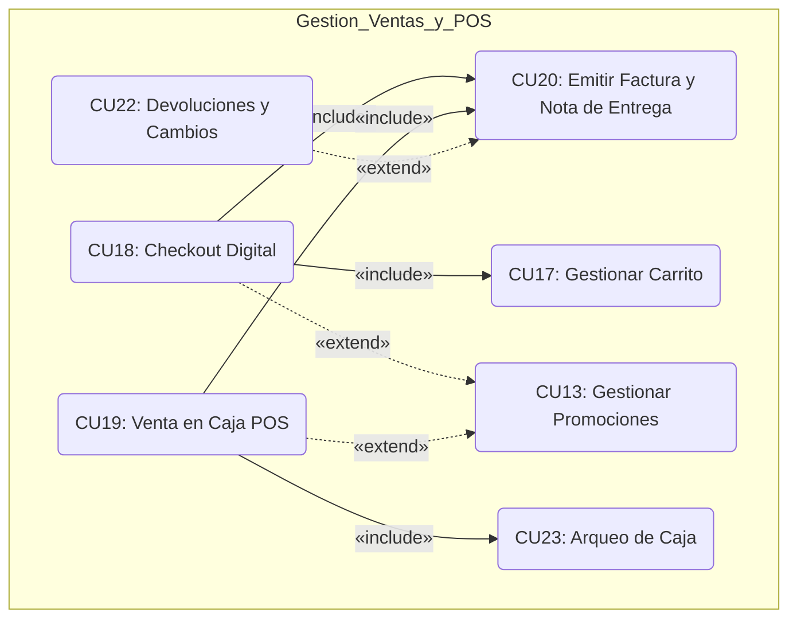

---

# 2. Flujo de Trabajo — Análisis

## 2.1 Análisis de arquitectura de paquetes

En el Ciclo 2, la plataforma activa la comunicación inter-paquetes de alta densidad. El paquete `ventas_y_pagos` actúa como consumidor de servicios de `catalogo_y_tiendas` e `inventario_y_proveedores`:

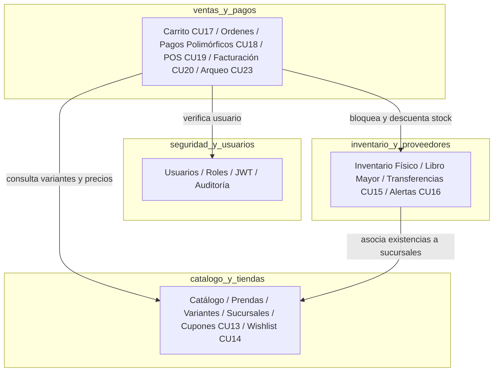

---

## 2.2 Diagramas de comunicación / colaboración (BCE)

### 2.2.1 Realización de CU18: Checkout Digital con Herencia de Pagos
Participantes:
- **Boundary:** `InterfazCheckout`, `PasarelaPagoAPI`
- **Control:** `GestorCheckout`, `GestorFacturacion`, `GestorInventario`
- **Entity:** `Carrito`, `Orden`, `ItemOrden`, `MedioDePago` (subtipos), `Factura`, `Inventario`

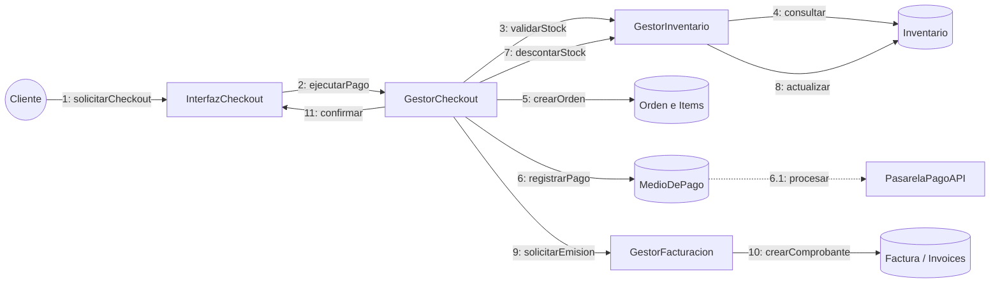

### 2.2.2 Realización de CU15: Transferencia entre Sucursales
Participantes:
- **Boundary:** `InterfazTransferencias`
- **Control:** `GestorTransferencias`
- **Entity:** `OrdenTransferencia`, `ItemTransferencia`, `Inventario`, `LibroMayor (Ledger)`

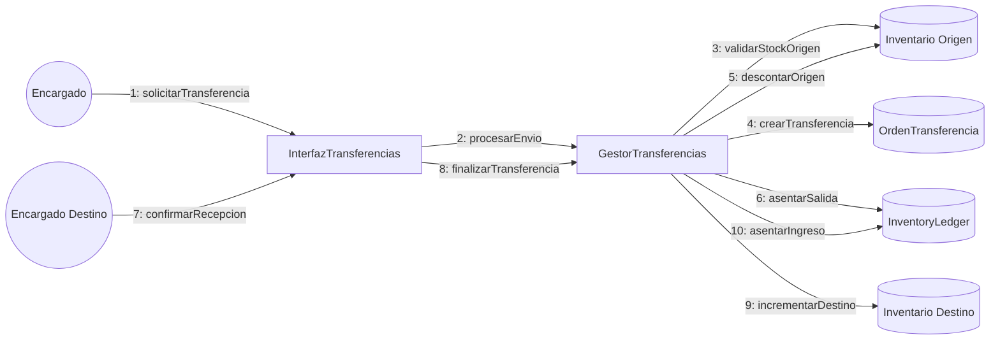

---

## 2.3 Análisis de clases (Boundary - Control - Entity)

| Paquete | Estereotipo | Clase de Análisis | Responsabilidad Principal |
| :--- | :--- | :--- | :--- |
| `ventas_y_pagos` | **Boundary** | `InterfazCarritoWeb` / `Móvil` | Renderizado del carrito reactivo y captura de eventos. |
| `ventas_y_pagos` | **Boundary** | `InterfazCheckout` | Formulario unificado de envío, datos fiscales y selección de pago. |
| `ventas_y_pagos` | **Boundary** | `InterfazPuntoDeVentaPOS` | Pantalla táctil de mostrador optimizada para cajeros. |
| `ventas_y_pagos` | **Boundary** | `InterfazArqueoCaja` | Vista de apertura, conteo físico y cierre de turno. |
| `ventas_y_pagos` | **Control** | `ControladorCarrito` | Lógica de inserción, validación de cupón y stock. |
| `ventas_y_pagos` | **Control** | `ControladorCheckout` | Orquestación transaccional ACID de órdenes y pagos. |
| `ventas_y_pagos` | **Control** | `ControladorPOS` | Manejo de ventas de alta velocidad en tienda física. |
| `ventas_y_pagos` | **Control** | `ControladorFacturacion` | Algoritmo de cálculo de IVA 13 % y código de control. |
| `ventas_y_pagos` | **Control** | `ControladorArqueo` | Balance de caja y cálculo de descuadres. |
| `ventas_y_pagos` | **Entity** | `Order` / `OrderItem` | Cabecera y detalle de las ventas. |
| `ventas_y_pagos` | **Entity** | `Payment` *(STI)* | Superclase abstracta de pago. |
| `ventas_y_pagos` | **Entity** | `EfectivoPayment` | Subclase concreta con `cash_received` y `cash_change`. |
| `ventas_y_pagos` | **Entity** | `TarjetaPayment` | Subclase con referencia a pasarela y `card_last4`. |
| `ventas_y_pagos` | **Entity** | `QRPayment` | Subclase con referencia de transacción QR Simple. |
| `ventas_y_pagos` | **Entity** | `CreditoPayment` | Subclase con plazo de gracia y vencimiento. |
| `ventas_y_pagos` | **Entity** | `Invoice` | Comprobante tributario fiscal o nota de entrega. |
| `ventas_y_pagos` | **Entity** | `CashSession` | Registro de apertura, monto declarado y cierre de caja. |
| `inventario_y_proveedores` | **Boundary** | `InterfazTransferencias` | Formularios de solicitud y recepción de transferencias. |
| `inventario_y_proveedores` | **Control** | `ControladorTransferencias`| Gestión atómica de despacho y recepción entre sucursales. |
| `inventario_y_proveedores` | **Control** | `ControladorAlertasStock` | Demonio/evaluador de stock mínimo y máximo. |
| `inventario_y_proveedores` | **Entity** | `StockTransfer` / `Item` | Registro del envío inter-sucursal. |
| `inventario_y_proveedores` | **Entity** | `StockAlert` | Notificación de umbral de inventario superado. |
| `catalogo_y_tiendas` | **Boundary** | `InterfazPromociones` | Panel de creación de cupones y ofertas. |
| `catalogo_y_tiendas` | **Control** | `ControladorPromociones` | Validador de reglas de descuento en tiempo real. |
| `catalogo_y_tiendas` | **Entity** | `Coupon` / `Promotion` | Modelos de descuentos y vigencias. |

---

## 2.4 Acoplamiento y cohesión

1. **Alta Cohesión Funcional:**
   * El paquete `ventas_y_pagos` concentra la totalidad de operaciones comerciales, financieras y fiscales. No delega la lógica del pago ni la emisión del comprobante fuera de su frontera.
2. **Bajo Acoplamiento por Interfaces de Dominio:**
   * Para descontar stock, `ventas_y_pagos` no manipula directamente las tablas internas de inventario sino que invoca métodos del servicio de inventario (`InventoryService.deduct_stock(branch_id, variant_id, qty, movement_type)`), respetando la encapsulación.
3. **Persistencia Polimórfica (Single Table Inheritance):**
   * El polimorfismo de medios de pago en una sola tabla (`payments`) minimiza la proliferación de tablas puente y simplifica consultas analíticas como "Total recaudado en el día sin importar el medio".

---

# 3. Flujo de Trabajo — Diseño

## 3.1 Diseño de arquitectura lógica (4 capas) y física de despliegue

### 3.1.1 Arquitectura Lógica en 4 Capas
1. **Capa de Presentación:**
   * **Web:** Angular 19 (TypeScript) con componentes standalone y arquitectura reactiva (Signals + RxJS).
   * **Móvil:** Flutter 3.29 (Dart) con gestión de estado Provider y diseño Material 3.
2. **Capa de Servicios / Controladores de Aplicación:**
   * FastAPI APIRouters con validación de esquemas Pydantic V2, inyección de dependencias (`Depends`) y middleware de seguridad JWT.
3. **Capa de Dominio y Negocio:**
   * Servicios puros (`CheckoutService`, `PosService`, `TaxService`, `CashRegisterService`, `TransferService`). Contienen las reglas fiscales (IVA 13%), validaciones de stock y estados de transición.
4. **Capa de Infraestructura y Datos:**
   * SQLAlchemy 2.0 (Async/Sync ORM) sobre PostgreSQL 16 con Pool de conexiones `QueuePool`.

---

## 3.2 Diagramas de secuencia de los flujos críticos

### 3.2.1 Checkout Digital con Facturación (CU18 + CU20)
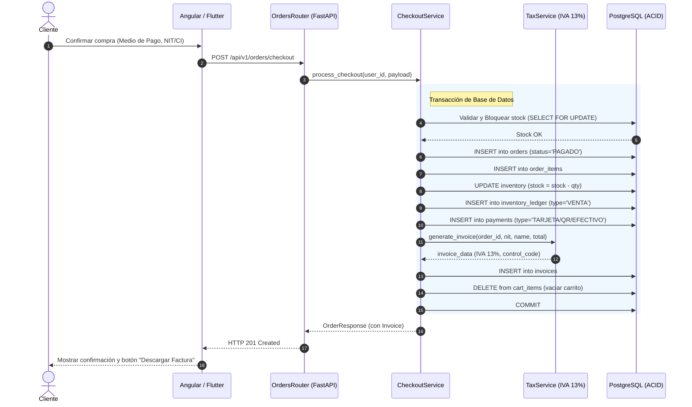

### 3.2.2 Apertura, Venta POS y Arqueo de Caja (CU23 + CU19)
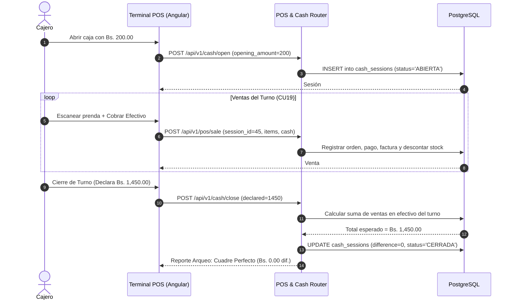

### 3.2.3 Conversión de Cotización a Factura Fiscal Oficial (CU21 ➔ CU18/CU20)
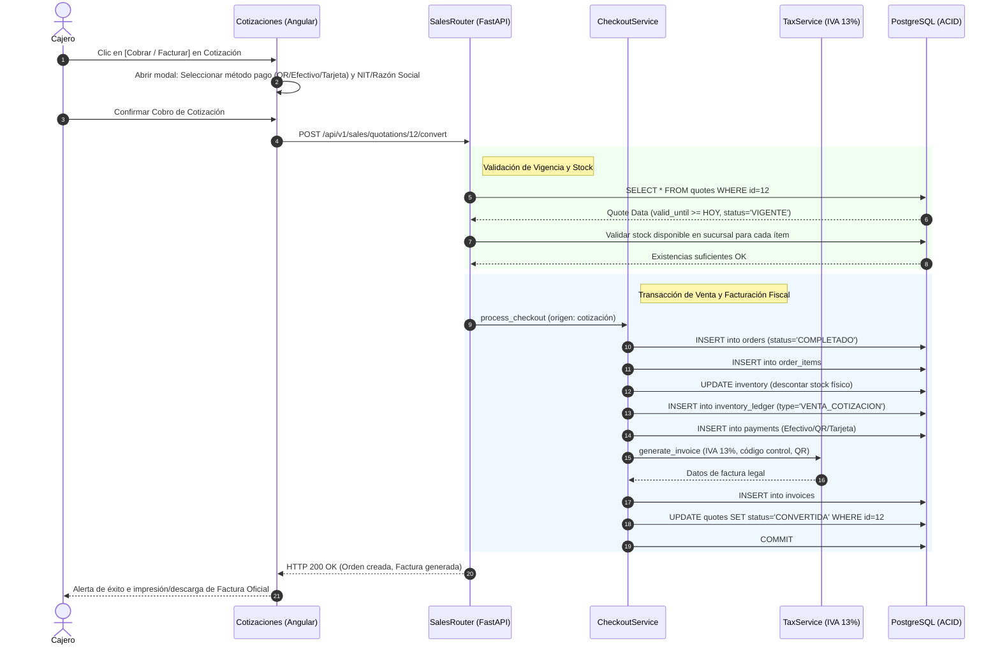

### 3.2.4 Devolución o Cambio con Validación de Plazo (<= 30 días) y Reingreso (CU22)
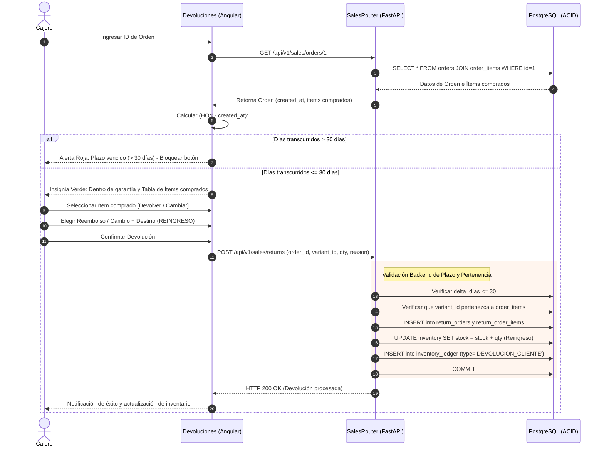

---

## 3.3 Diagramas de máquinas de estado

### 3.3.1 Ciclo de Vida de la Orden (`orders.status`)
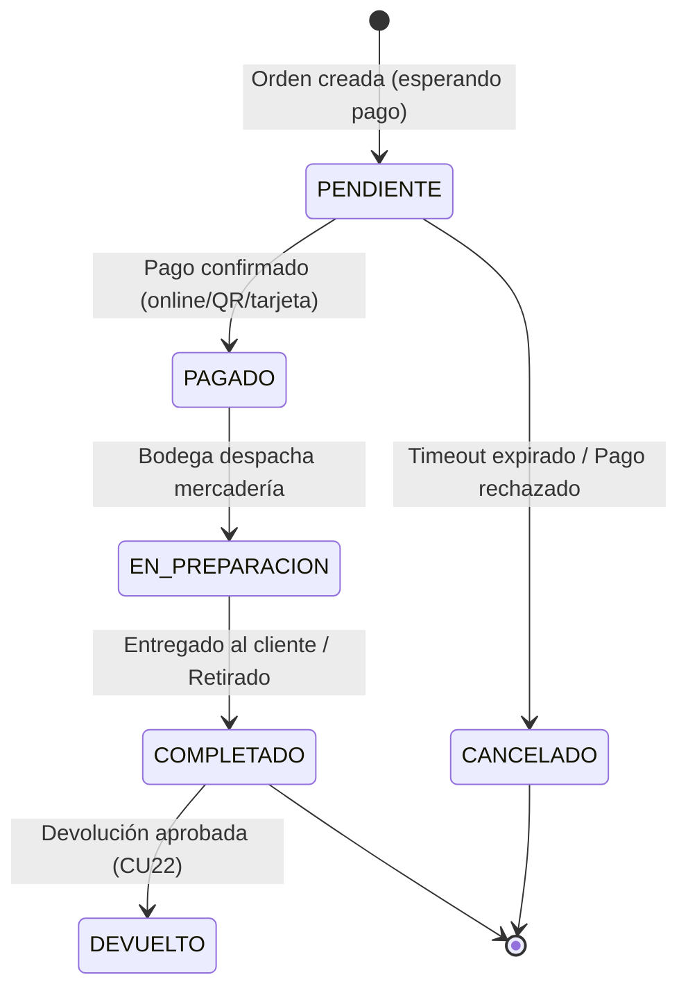

### 3.3.2 Ciclo de Vida de Transferencia entre Sucursales (`stock_transfers.status`)
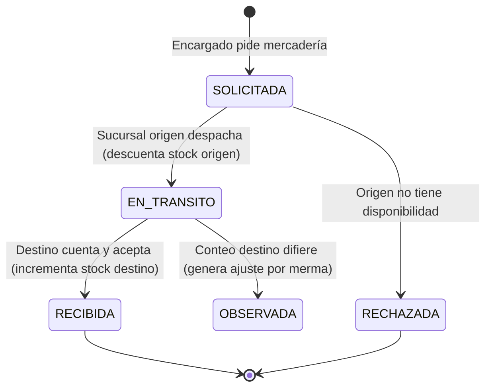

### 3.3.3 Ciclo de Vida de la Cotización Comercial (`quotes.status`)
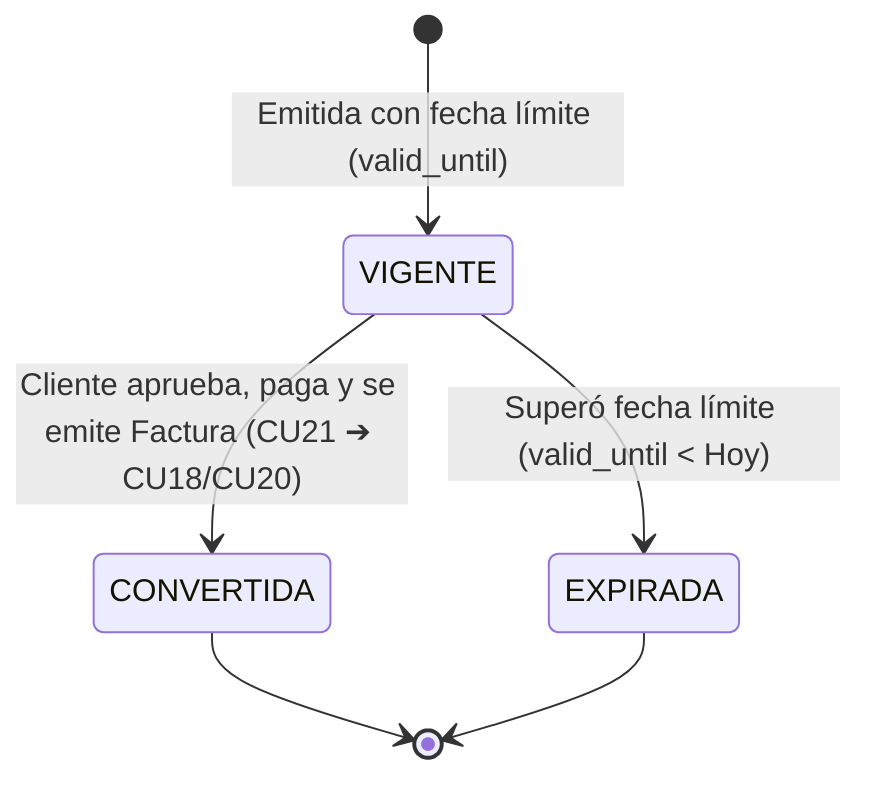

---

## 3.4 Diseño de datos relacional (DDL SQL, índices y triggers)

Alineado con el documento [BaseDeDatos.md](file:///c:/Users/MARILYN/Documents/Carpeta%20Esther/Semestre%202-2026/SI%202/Primer_parcial/BaseDeDatos.md), el Ciclo 2 incorpora las siguientes definiciones físicas:

```sql
-- =============================================================================
-- TABLAS DEL CICLO 2: VENTAS, PAGOS, FACTURACIÓN, CAJA Y TRANSFERENCIAS
-- =============================================================================

-- 1. CARRITO DE COMPRAS DIGITAL (CU17)
CREATE TABLE carts (
    id SERIAL PRIMARY KEY,
    user_id INTEGER NOT NULL UNIQUE,
    created_at TIMESTAMP WITH TIME ZONE DEFAULT CURRENT_TIMESTAMP NOT NULL,
    updated_at TIMESTAMP WITH TIME ZONE DEFAULT CURRENT_TIMESTAMP NOT NULL,
    FOREIGN KEY (user_id) REFERENCES users(id) ON DELETE CASCADE
);

CREATE TABLE cart_items (
    id SERIAL PRIMARY KEY,
    cart_id INTEGER NOT NULL,
    variant_id INTEGER NOT NULL,
    branch_id INTEGER NOT NULL,
    quantity INTEGER NOT NULL CHECK (quantity > 0),
    added_at TIMESTAMP WITH TIME ZONE DEFAULT CURRENT_TIMESTAMP NOT NULL,
    FOREIGN KEY (cart_id) REFERENCES carts(id) ON DELETE CASCADE,
    FOREIGN KEY (variant_id) REFERENCES product_variants(id) ON DELETE CASCADE,
    FOREIGN KEY (branch_id) REFERENCES branches(id) ON DELETE RESTRICT,
    CONSTRAINT uq_cart_variant UNIQUE (cart_id, variant_id, branch_id)
);

-- 2. SESIONES Y ARQUEO DE CAJA DIARIA (CU23)
CREATE TABLE cash_sessions (
    id SERIAL PRIMARY KEY,
    branch_id INTEGER NOT NULL,
    user_id INTEGER NOT NULL, -- Cajero responsable
    opening_amount DECIMAL(10, 2) NOT NULL CHECK (opening_amount >= 0),
    closing_amount_declared DECIMAL(10, 2),
    closing_amount_system DECIMAL(10, 2),
    difference DECIMAL(10, 2), -- Sobrante (+) o Faltante (-)
    status VARCHAR(15) DEFAULT 'ABIERTA' NOT NULL CHECK (status IN ('ABIERTA', 'CERRADA')),
    opened_at TIMESTAMP WITH TIME ZONE DEFAULT CURRENT_TIMESTAMP NOT NULL,
    closed_at TIMESTAMP WITH TIME ZONE,
    notes TEXT,
    FOREIGN KEY (branch_id) REFERENCES branches(id) ON DELETE RESTRICT,
    FOREIGN KEY (user_id) REFERENCES users(id) ON DELETE RESTRICT
);

-- 3. CABECERA DE PEDIDOS Y VENTAS (CU18, CU19)
CREATE TABLE orders (
    id SERIAL PRIMARY KEY,
    order_code VARCHAR(30) UNIQUE NOT NULL, -- Ej: ORD-2026-0001
    user_id INTEGER NOT NULL,
    branch_id INTEGER NOT NULL,
    cash_session_id INTEGER, -- Obligatorio si canal = 'POS'
    channel VARCHAR(10) DEFAULT 'ONLINE' NOT NULL CHECK (channel IN ('ONLINE', 'POS')),
    status VARCHAR(20) DEFAULT 'PENDIENTE' NOT NULL CHECK (status IN ('PENDIENTE', 'PAGADO', 'COMPLETADO', 'CANCELADO', 'DEVUELTO')),
    subtotal DECIMAL(10, 2) NOT NULL CHECK (subtotal >= 0),
    discount_amount DECIMAL(10, 2) DEFAULT 0.00 NOT NULL CHECK (discount_amount >= 0),
    total_amount DECIMAL(10, 2) NOT NULL CHECK (total_amount >= 0),
    created_at TIMESTAMP WITH TIME ZONE DEFAULT CURRENT_TIMESTAMP NOT NULL,
    FOREIGN KEY (user_id) REFERENCES users(id) ON DELETE RESTRICT,
    FOREIGN KEY (branch_id) REFERENCES branches(id) ON DELETE RESTRICT,
    FOREIGN KEY (cash_session_id) REFERENCES cash_sessions(id) ON DELETE RESTRICT
);

-- 4. DETALLE DE PEDIDOS (CU18, CU19)
CREATE TABLE order_items (
    id SERIAL PRIMARY KEY,
    order_id INTEGER NOT NULL,
    variant_id INTEGER NOT NULL,
    quantity INTEGER NOT NULL CHECK (quantity > 0),
    unit_price DECIMAL(10, 2) NOT NULL CHECK (unit_price >= 0),
    subtotal DECIMAL(10, 2) NOT NULL CHECK (subtotal >= 0),
    FOREIGN KEY (order_id) REFERENCES orders(id) ON DELETE CASCADE,
    FOREIGN KEY (variant_id) REFERENCES product_variants(id) ON DELETE RESTRICT
);

-- 5. MEDIOS DE PAGO POLIMÓRFICOS - STI (CU18, CU19)
CREATE TABLE payments (
    id SERIAL PRIMARY KEY,
    order_id INTEGER NOT NULL,
    payment_type VARCHAR(20) NOT NULL CHECK (payment_type IN ('EFECTIVO', 'TARJETA', 'QR', 'CREDITO')),
    amount DECIMAL(10, 2) NOT NULL CHECK (amount > 0),
    status VARCHAR(20) DEFAULT 'CONFIRMADO' NOT NULL CHECK (status IN ('PENDIENTE', 'CONFIRMADO', 'RECHAZADO')),
    paid_at TIMESTAMP WITH TIME ZONE DEFAULT CURRENT_TIMESTAMP NOT NULL,
    -- Campos subtipo Efectivo:
    cash_received DECIMAL(10, 2),
    cash_change DECIMAL(10, 2),
    -- Campos subtipo Tarjeta:
    card_brand VARCHAR(20),
    card_last4 VARCHAR(4),
    gateway_reference VARCHAR(80),
    -- Campos subtipo QR:
    qr_reference VARCHAR(80),
    -- Campos subtipo Crédito:
    credit_due_date DATE,
    FOREIGN KEY (order_id) REFERENCES orders(id) ON DELETE CASCADE
);

-- 6. COMPROBANTES Y FACTURACIÓN CON IVA 13 % (CU20)
CREATE TABLE invoices (
    id SERIAL PRIMARY KEY,
    order_id INTEGER NOT NULL UNIQUE,
    invoice_number VARCHAR(30) UNIQUE NOT NULL,
    doc_type VARCHAR(15) DEFAULT 'FACTURA' NOT NULL CHECK (doc_type IN ('FACTURA', 'NOTA_ENTREGA')),
    tax_rate DECIMAL(4, 3) DEFAULT 0.130 NOT NULL, -- IVA 13 %
    subtotal DECIMAL(10, 2) NOT NULL,
    tax_amount DECIMAL(10, 2) NOT NULL, -- Débito fiscal (total * 0.13)
    total DECIMAL(10, 2) NOT NULL,
    control_code VARCHAR(40), -- Generado bajo estándar fiscal
    qr_payload TEXT,          -- Cadena para código QR fiscal
    customer_nit VARCHAR(20),
    customer_name VARCHAR(150),
    issued_at TIMESTAMP WITH TIME ZONE DEFAULT CURRENT_TIMESTAMP NOT NULL,
    FOREIGN KEY (order_id) REFERENCES orders(id) ON DELETE RESTRICT
);

-- 7. CUPONES Y PROMOCIONES (CU13)
CREATE TABLE coupons (
    id SERIAL PRIMARY KEY,
    code VARCHAR(30) UNIQUE NOT NULL,
    discount_type VARCHAR(15) NOT NULL CHECK (discount_type IN ('PORCENTAJE', 'MONTO_FIJO')),
    discount_value DECIMAL(10, 2) NOT NULL CHECK (discount_value > 0),
    min_purchase_amount DECIMAL(10, 2) DEFAULT 0.00 NOT NULL,
    valid_from TIMESTAMP WITH TIME ZONE NOT NULL,
    valid_until TIMESTAMP WITH TIME ZONE NOT NULL,
    max_uses INTEGER DEFAULT 100 NOT NULL,
    used_count INTEGER DEFAULT 0 NOT NULL,
    is_active BOOLEAN DEFAULT TRUE NOT NULL,
    created_at TIMESTAMP WITH TIME ZONE DEFAULT CURRENT_TIMESTAMP NOT NULL
);

-- 8. TRANSFERENCIAS ENTRE SUCURSALES (CU15)
CREATE TABLE stock_transfers (
    id SERIAL PRIMARY KEY,
    transfer_code VARCHAR(30) UNIQUE NOT NULL,
    source_branch_id INTEGER NOT NULL,
    destination_branch_id INTEGER NOT NULL,
    requested_by_id INTEGER NOT NULL,
    received_by_id INTEGER,
    status VARCHAR(20) DEFAULT 'SOLICITADA' NOT NULL CHECK (status IN ('SOLICITADA', 'EN_TRANSITO', 'RECIBIDA', 'RECHAZADA', 'CANCELADA')),
    notes TEXT,
    shipped_at TIMESTAMP WITH TIME ZONE,
    received_at TIMESTAMP WITH TIME ZONE,
    created_at TIMESTAMP WITH TIME ZONE DEFAULT CURRENT_TIMESTAMP NOT NULL,
    FOREIGN KEY (source_branch_id) REFERENCES branches(id) ON DELETE RESTRICT,
    FOREIGN KEY (destination_branch_id) REFERENCES branches(id) ON DELETE RESTRICT,
    FOREIGN KEY (requested_by_id) REFERENCES users(id) ON DELETE RESTRICT,
    FOREIGN KEY (received_by_id) REFERENCES users(id) ON DELETE RESTRICT,
    CONSTRAINT chk_branches_different CHECK (source_branch_id <> destination_branch_id)
);

CREATE TABLE stock_transfer_items (
    id SERIAL PRIMARY KEY,
    transfer_id INTEGER NOT NULL,
    variant_id INTEGER NOT NULL,
    quantity_sent INTEGER NOT NULL CHECK (quantity_sent > 0),
    quantity_received INTEGER DEFAULT 0 CHECK (quantity_received >= 0),
    FOREIGN KEY (transfer_id) REFERENCES stock_transfers(id) ON DELETE CASCADE,
    FOREIGN KEY (variant_id) REFERENCES product_variants(id) ON DELETE RESTRICT
);

-- 9. ALERTAS DE STOCK AUTOMÁTICAS (CU16)
CREATE TABLE stock_alerts (
    id SERIAL PRIMARY KEY,
    branch_id INTEGER NOT NULL,
    variant_id INTEGER NOT NULL,
    alert_type VARCHAR(20) NOT NULL CHECK (alert_type IN ('STOCK_MINIMO', 'SOBRESTOCK', 'SIN_STOCK')),
    current_stock INTEGER NOT NULL,
    threshold INTEGER NOT NULL,
    status VARCHAR(15) DEFAULT 'PENDIENTE' NOT NULL CHECK (status IN ('PENDIENTE', 'REVISADA', 'RESUELTA')),
    created_at TIMESTAMP WITH TIME ZONE DEFAULT CURRENT_TIMESTAMP NOT NULL,
    FOREIGN KEY (branch_id) REFERENCES branches(id) ON DELETE CASCADE,
    FOREIGN KEY (variant_id) REFERENCES product_variants(id) ON DELETE CASCADE
);

-- 10. COTIZACIONES COMERCIALES (CU21)
CREATE TABLE quotes (
    id SERIAL PRIMARY KEY,
    quote_code VARCHAR(30) UNIQUE NOT NULL,
    branch_id INTEGER NOT NULL,
    created_by_id INTEGER NOT NULL,
    customer_name VARCHAR(150) NOT NULL,
    customer_email VARCHAR(120),
    customer_phone VARCHAR(30),
    total_amount DECIMAL(10, 2) NOT NULL CHECK (total_amount >= 0),
    valid_until DATE NOT NULL,
    status VARCHAR(15) DEFAULT 'VIGENTE' NOT NULL CHECK (status IN ('VIGENTE', 'CONVERTIDA', 'VENCIDA')),
    created_at TIMESTAMP WITH TIME ZONE DEFAULT CURRENT_TIMESTAMP NOT NULL,
    FOREIGN KEY (branch_id) REFERENCES branches(id) ON DELETE RESTRICT,
    FOREIGN KEY (created_by_id) REFERENCES users(id) ON DELETE RESTRICT
);

CREATE TABLE quote_items (
    id SERIAL PRIMARY KEY,
    quote_id INTEGER NOT NULL,
    variant_id INTEGER NOT NULL,
    quantity INTEGER NOT NULL CHECK (quantity > 0),
    unit_price DECIMAL(10, 2) NOT NULL,
    subtotal DECIMAL(10, 2) NOT NULL,
    FOREIGN KEY (quote_id) REFERENCES quotes(id) ON DELETE CASCADE,
    FOREIGN KEY (variant_id) REFERENCES product_variants(id) ON DELETE RESTRICT
);

-- 11. DEVOLUCIONES Y CAMBIOS (CU22)
CREATE TABLE return_orders (
    id SERIAL PRIMARY KEY,
    return_code VARCHAR(30) UNIQUE NOT NULL,
    order_id INTEGER NOT NULL,
    processed_by_id INTEGER NOT NULL,
    return_type VARCHAR(20) NOT NULL CHECK (return_type IN ('CAMBIO_PRENDA', 'DEVOLUCION_EFECTIVO', 'VALE_CREDITO')),
    reason TEXT NOT NULL,
    total_refunded DECIMAL(10, 2) DEFAULT 0.00 NOT NULL,
    created_at TIMESTAMP WITH TIME ZONE DEFAULT CURRENT_TIMESTAMP NOT NULL,
    FOREIGN KEY (order_id) REFERENCES orders(id) ON DELETE RESTRICT,
    FOREIGN KEY (processed_by_id) REFERENCES users(id) ON DELETE RESTRICT
);

CREATE TABLE return_order_items (
    id SERIAL PRIMARY KEY,
    return_order_id INTEGER NOT NULL,
    order_item_id INTEGER NOT NULL,
    quantity INTEGER NOT NULL CHECK (quantity > 0),
    destination_action VARCHAR(25) NOT NULL CHECK (destination_action IN ('REINGRESO_INVENTARIO', 'MERMA_DEFECTO')),
    FOREIGN KEY (return_order_id) REFERENCES return_orders(id) ON DELETE CASCADE,
    FOREIGN KEY (order_item_id) REFERENCES order_items(id) ON DELETE RESTRICT
);

-- ÍNDICES DE ALTO RENDIMIENTO
CREATE INDEX idx_orders_user ON orders(user_id);
CREATE INDEX idx_orders_branch_created ON orders(branch_id, created_at DESC);
CREATE INDEX idx_invoices_order ON invoices(order_id);
CREATE INDEX idx_payments_order ON payments(order_id);
CREATE INDEX idx_cash_sessions_branch_status ON cash_sessions(branch_id, status);
CREATE INDEX idx_transfers_status ON stock_transfers(status);
CREATE INDEX idx_stock_alerts_branch_status ON stock_alerts(branch_id, status);
```

---

# 4. Flujo de Trabajo — Implementación

## 4.1 Selección de tecnologías y dependencias

- **Backend:** Python 3.13 + FastAPI 0.115 + Pydantic V2 + SQLAlchemy 2.0 (PostgreSQL). Generación de reportes PDF con `reportlab` o `fpdf2` y códigos QR con `qrcode`.
- **Frontend Web:** Angular 19 + TypeScript + Angular Material + TailwindCSS (módulo admin POS táctil + módulo tienda e-commerce).
- **Frontend Móvil:** Flutter 3.29 + Dart (Catálogo facetado, carrito reactivo sincronizado, checkout con selector de pago e historial de compras con descarga de comprobante).

---

## 4.2 Especificación de endpoints y contratos API REST

### 4.2.1 Paquete `ventas_y_pagos`
* `GET /api/v1/cart` — Obtiene el carrito del usuario autenticado con cálculo de totales y alertas de existencia.
* `POST /api/v1/cart/items` — Agrega un ítem al carrito (valida stock inmediato > 0).
* `PUT /api/v1/cart/items/{item_id}` — Modifica la cantidad de un ítem.
* `DELETE /api/v1/cart/items/{item_id}` — Remueve un ítem del carrito.
* `POST /api/v1/orders/checkout` — Ejecuta el checkout online con medio de pago polimórfico y genera la orden + comprobante.
* `GET /api/v1/orders/my-orders` — Lista el historial de pedidos del cliente autenticado (CU24).
* `GET /api/v1/orders/{order_id}` — Detalle completo de una orden específica.
* `GET /api/v1/orders/{order_id}/invoice/pdf` — Descarga del PDF oficial de la Factura o Nota de Entrega (CU20).
* `POST /api/v1/pos/orders` — Registra una venta presencial directa en mostrador desde la terminal de caja (CU19).
* `POST /api/v1/cash/open` — Registra la apertura de caja del día para el cajero (CU23).
* `POST /api/v1/cash/close` — Registra el arqueo de cierre y calcula faltantes/sobrantes (CU23).
* `GET /api/v1/cash/current` — Consulta el estado y monto acumulado de la sesión de caja activa.
* `POST /api/v1/quotes` — Emite una cotización comercial formal con periodo de validez definido (CU21).
* `GET /api/v1/sales/quotations` — Consulta el listado de cotizaciones comerciales con verificación y actualización automática de vigencia (`VIGENTE`, `EXPIRADA`, `CONVERTIDA`) (CU21).
* `POST /api/v1/sales/quotations/{id}/convert` — Convierte una cotización vigente en orden de venta formal, procesando el cobro (Efectivo/Tarjeta/QR), emitiendo la Factura Fiscal con IVA 13% y descontando el stock físico de la sucursal (CU21 ➔ CU18/CU20).
* `POST /api/v1/sales/returns` — Registra una devolución o cambio de prendas validando el plazo máximo de 30 días y pertenencia estricta de ítems a la orden, actualizando inventario y kardex (CU22).

### 4.2.2 Paquete `inventario_y_proveedores` (Extensiones Ciclo 2)
* `POST /api/v1/inventory/transfers` — Crea una orden de transferencia inter-sucursal (CU15).
* `PUT /api/v1/inventory/transfers/{id}/ship` — Despacha la transferencia (descuenta stock en origen).
* `PUT /api/v1/inventory/transfers/{id}/receive` — Recibe la transferencia (incrementa stock en destino).
* `GET /api/v1/inventory/alerts` — Consulta alertas activas de stock mínimo y máximo (CU16).

### 4.2.3 Paquete `catalogo_y_tiendas` (Extensiones Ciclo 2)
* `GET /api/v1/products/search` — Búsqueda avanzada con filtros combinados (precio, talla, color, categoría, ocasión) y stock por sucursal (CU12).
* `POST /api/v1/coupons` — Crea un nuevo cupón de descuento promocional (CU13).
* `POST /api/v1/coupons/validate` — Valida un código de cupón contra el monto actual del carrito.
* `PUT /api/v1/reviews/{id}/moderate` — Modera una reseña de cliente (`APROBADA` / `RECHAZADA`) (CU14+).

---

## 4.3 Componentes Web (Angular) y Móvil (Flutter)

### Frontend Web (`frontend-web`):
1. `src/app/packages/ventas_y_pagos/cart/`: Drawer y página completa de carrito de compra.
2. `src/app/packages/ventas_y_pagos/checkout/`: Asistente de pago (Wizard: Dirección ➔ Facturación ➔ Método de Pago ➔ Resumen).
3. `src/app/packages/ventas_y_pagos/pos/`: Terminal de venta física táctil para cajeros, con soporte de teclado numérico y escáner.
4. `src/app/packages/ventas_y_pagos/cash-register/`: Panel de apertura, arqueo y reporte de cierre de caja.
5. `src/app/packages/ventas_y_pagos/quotations-returns/`: Módulo dual de emisión/cobro de cotizaciones comerciales y gestión de cambios/devoluciones con validación estricta de 30 días y visualización de prendas facturadas.
6. `src/app/packages/inventario_y_proveedores/transfers/`: Módulo de despacho y recepción de mercadería inter-sucursales.
7. `src/app/packages/catalogo_y_tiendas/promotions/`: Panel de gestión de cupones y campañas temporales.

### Móvil (`mobile`):
1. `lib/src/packages/ventas_y_pagos/cart/`: Carrito reactivo móvil con badges de stock y swipe para eliminar.
2. `lib/src/packages/ventas_y_pagos/checkout/`: Pantalla de confirmación de pedido móvil con selector de QR y pasarela.
3. `lib/src/packages/ventas_y_pagos/orders/`: Pantalla "Mis Compras" con timeline visual del estado del pedido y visor de facturas.
4. `lib/src/packages/catalogo_y_tiendas/search/`: Filtros avanzados en modal bottom-sheet (talla, color, precio y disponibilidad).

---

# 5. Flujo de Trabajo — Pruebas

## 5.1 Plan de pruebas unitarias e integración

Se define una suite de pruebas automatizadas con `pytest` en backend y pruebas de componentes en frontend para certificar:
1. **Consistencia Transaccional (ACID):** Toda venta que falle a mitad de camino debe revertir el stock de forma absoluta (`ROLLBACK`).
2. **Precisión Numérica Fiscal:** El cálculo del Débito Fiscal IVA 13 % debe coincidir con centavos exactos contra la suma de ítems facturados.
3. **Control de Caja (Arqueo):** Las ventas en efectivo deben sumarse exactamente a la sesión activa; ninguna venta POS puede registrarse con caja cerrada.
4. **Reserva de Inventario:** Dos compras concurrentes de la última unidad deben resultar en una compra exitosa y otra rechazada por falta de stock.
5. **Control de Garantías y Cotizaciones:** Toda devolución después de 30 días debe ser rechazada; la conversión de cotizaciones debe emitir factura fiscal y bloquear reconversión.

---

## 5.2 Matriz de casos de prueba del Ciclo 2

| Código | Caso de Uso | Escenario de Prueba | Datos de Entrada | Resultado Esperado |
| :--- | :--- | :--- | :--- | :--- |
| **TC-CU17-01** | CU17 Carrito | Agregar producto con stock > 0 | Prenda ID 1, Talla M, Cantidad 2 | Ítem agregado al carrito, total actualizado. |
| **TC-CU17-02** | CU17 Carrito | Intentar agregar producto con existencia = 0 | Prenda ID 5, Talla S, Stock = 0 | Error HTTP 400: "Producto agotado sin existencias". |
| **TC-CU18-01** | CU18 Checkout | Venta online con pago QR | Total Bs. 300, NIT: 4920192018 | Orden creada, estado `PAGADO`, stock descontado, factura IVA 13% generada (IVA = Bs. 39.00). |
| **TC-CU18-02** | CU18 Checkout | Aplicar cupón de descuento vigente | Cupón `VERANO10` (10% desc.) | Total recalculado con descuento del 10%. |
| **TC-CU19-01** | CU19 POS | Venta presencial con caja abierta | Pago Efectivo Bs. 200, Total Bs. 150 | Venta completada, vuelto = Bs. 50, acumulado en caja actualizado. |
| **TC-CU19-02** | CU19 POS | Venta presencial con caja cerrada | Intento de cobro sin sesión | Error HTTP 403: "Debe abrir una sesión de caja antes de cobrar". |
| **TC-CU20-01** | CU20 Factura | Emisión con NIT válido | NIT 1020304050, Razón Social | Factura con código de control generado y QR fiscal. |
| **TC-CU21-01** | CU21 Cotización | Conversión de cotización vigente a venta y factura | Cotización vigente, pago QR/Efectivo, NIT | Orden creada, factura IVA 13% emitida, stock descontado y cotización en estado `CONVERTIDA`. |
| **TC-CU21-02** | CU21 Cotización | Intento de conversión de cotización expirada | Cotización con `valid_until < Hoy` | Error HTTP 400: "La cotización ha expirado y no puede ser convertida a venta directa". |
| **TC-CU22-01** | CU22 Devolución| Devolución en plazo válido (<= 30 días) y prenda facturada | Orden #10 (comprada hace 5 días), Prenda en factura | Reingreso exitoso al stock (+1 u en inventario y kardex) y reembolso/vale registrado. |
| **TC-CU22-02** | CU22 Devolución| Intento de devolución superando plazo de 30 días | Orden con antigüedad de 45 días | Bloqueo en UI y Error HTTP 400: "Plazo vencido: La orden fue emitida hace 45 días. Límite máximo 30 días". |
| **TC-CU22-03** | CU22 Devolución| Intento de devolver prenda ajena a la orden | Orden #1, variante #20 (no comprada en orden #1) | Bloqueo en UI y Error HTTP 400: "La prenda con ID variante 20 no pertenece a esta orden". |
| **TC-CU23-01** | CU23 Arqueo | Cierre de caja con balance exacto | Declarado: Bs. 1,000; Esperado: Bs. 1,000 | Sesión `CERRADA`, diferencia = Bs. 0.00 (cuadre conforme). |
| **TC-CU23-02** | CU23 Arqueo | Cierre de caja con faltante | Declarado: Bs. 950; Esperado: Bs. 1,000 | Sesión `CERRADA`, diferencia = -Bs. 50.00 (alerta de faltante). |
| **TC-CU15-01** | CU15 Transfer | Transferencia exitosa entre tiendas | 10 unidades Sucursal Centro ➔ Norte | Origen: -10 u; Destino: +10 u; estado `RECIBIDA`. |
| **TC-CU15-02** | CU15 Transfer | Transferencia con stock insuficiente | Solicitud 50 u, stock disponible 20 u | Error HTTP 400: "Stock insuficiente en sucursal remitente". |
| **TC-CU16-01** | CU16 Alertas | Disparo de alerta por stock mínimo | Stock cae a 3 u (umbral mínimo = 5 u) | Alerta insertada en `stock_alerts` con severidad `CRÍTICA`. |

---

# 6. Matriz de Trazabilidad

Esta matriz relaciona formalmente cada necesidad de negocio con sus artefactos de especificación, análisis, base de datos e implementación en el Ciclo 2:

| Requisito de Negocio | Caso de Uso | Paquete | Clases de Análisis (BCE) | Tablas en Base de Datos | Endpoints Principales | Vistas de Usuario |
| :--- | :--- | :--- | :--- | :--- | :--- | :--- |
| **Búsqueda Avanzada** | CU12 | `catalogo_y_tiendas` | `InterfazBusqueda`, `ControladorCatalogo`, `Producto` | `products`, `product_variants`, `inventory` | `GET /api/v1/products/search` | Web Lookbook, Móvil Explorer |
| **Promociones** | CU13 | `catalogo_y_tiendas` | `InterfazPromos`, `ControladorPromos`, `Coupon` | `coupons` | `POST /api/v1/coupons` | Panel Admin Cupones |
| **Wishlist y Reseñas** | CU14+ | `catalogo_y_tiendas` | `InterfazSocial`, `ControladorSocial`, `Review` | `wishlists`, `product_reviews` | `PUT /api/v1/reviews/{id}/moderate` | Moderación Web, Mis Listas |
| **Transferencias** | CU15 | `inventario_y_proveedores` | `InterfazTransfer`, `ControladorTransfer`, `StockTransfer` | `stock_transfers`, `stock_transfer_items`, `inventory_ledger` | `POST /api/v1/inventory/transfers` | Panel Logística Admin |
| **Alertas de Stock** | CU16 | `inventario_y_proveedores` | `InterfazAlertas`, `ControladorAlertas`, `StockAlert` | `stock_alerts`, `inventory` | `GET /api/v1/inventory/alerts` | Notificaciones Admin |
| **Carrito Digital** | CU17 | `ventas_y_pagos` | `InterfazCarrito`, `ControladorCarrito`, `Cart` | `carts`, `cart_items` | `GET /api/v1/cart`, `POST /api/v1/cart/items` | Drawer Carrito Web y Móvil |
| **Checkout Polimórfico**| CU18 | `ventas_y_pagos` | `InterfazCheckout`, `ControladorCheckout`, `Order`, `Payment` | `orders`, `order_items`, `payments` | `POST /api/v1/orders/checkout` | Pantalla Checkout Wizard |
| **Punto de Venta POS** | CU19 | `ventas_y_pagos` | `InterfazPOS`, `ControladorPOS`, `Order`, `Payment` | `orders`, `order_items`, `payments` | `POST /api/v1/pos/orders` | Pantalla Táctil Cajero POS |
| **Facturación IVA 13%** | CU20 | `ventas_y_pagos` | `InterfazFactura`, `ControladorFactura`, `Invoice` | `invoices` | `GET /api/v1/orders/{id}/invoice/pdf`| Visor PDF / Ticket Térmico |
| **Cotizaciones** | CU21 | `ventas_y_pagos` | `InterfazCotizacion`, `ControladorCotizacion`, `Quote` | `quotes`, `quote_items` | `POST /api/v1/quotes`, `GET /api/v1/sales/quotations`, `POST /api/v1/sales/quotations/{id}/convert` | Módulo Cotizaciones y Conversión Web |
| **Devoluciones** | CU22 | `ventas_y_pagos` | `InterfazDevolucion`, `ControladorDevolucion`, `ReturnOrder` | `return_orders`, `return_order_items` | `GET /api/v1/sales/orders/{id}`, `POST /api/v1/sales/returns` | Atención Clientes POS y Validación 30 Días |
| **Arqueo de Caja** | CU23 | `ventas_y_pagos` | `InterfazArqueo`, `ControladorArqueo`, `CashSession` | `cash_sessions` | `POST /api/v1/cash/open`, `/close` | Turnos y Cierre de Caja |
| **Historial Cliente** | CU24 | `ventas_y_pagos` | `InterfazHistorial`, `ControladorHistorial`, `Order` | `orders`, `invoices` | `GET /api/v1/orders/my-orders` | "Mis Compras" Web y Móvil |
