# Documentación del Ciclo 3 — Plataforma FashionStore

**Proceso Unificado de Desarrollo de Software (PUDS) + UML 2.5+** · Grupo #29 · Sistemas de Información II

Este documento reúne la especificación del **Ciclo 3** tal como está **implementada** en el
repositorio (backend FastAPI, web Angular 16 y app Flutter): captura de requisitos, análisis,
diseño, datos, el plan de **entrenamiento de la IA del vestidor virtual (CU32)**, implementación,
pruebas y trazabilidad. Cada afirmación de este documento se verificó contra el código fuente.

**Documentos relacionados:** `Contexto.md` (lista maestra de 40 CU), `Ciclo1.md`, `Ciclo2.md`,
`BaseDeDatos.md`, `PaquetesUML.md`, `ia_vestidor/` (notebook de entrenamiento).

---

## Índice

- **0. Resumen del Ciclo 3**
  - 0.1 Alcance · 0.2 Paquetes · 0.3 Alcance por canal (Web / Móvil) · 0.4 Paneles por actor
- **1. Captura de Requisitos**
  - 1.1 Actores y matriz actor ↔ CU · 1.2 Priorización · 1.3 Fichas de casos de uso · 1.4 Modelo de CU
- **2. Análisis** — diagramas de comunicación y clases de análisis
- **3. Diseño** — diagramas de secuencia (DSC) y máquinas de estado
- **4. Diseño de datos** — DDL real de las tablas del Ciclo 3
- **5. IA del Vestidor Virtual (CU32)** — motor actual y **plan de entrenamiento con Transfer Learning**
- **6. Implementación** — endpoints, componentes web y pantallas móviles
- **7. Pruebas**
- **8. Trazabilidad y pendientes conocidos**

---

## 0. Resumen del Ciclo 3

### 0.1 Alcance

El Ciclo 3 implementa **13 casos de uso**: **CU25–CU35, CU39 y CU40**.

| Paquete | CU | Caso de uso |
| :-- | :-- | :-- |
| `ventas_y_pagos` | **CU25** | Convertir una reserva en venta confirmada (cobro del saldo en caja + factura) |
| `reservas_y_citas` | **CU26** | Agendar reserva de prendas para prueba física (seña 50 %, hasta 5 prendas) |
| `reservas_y_citas` | **CU27** | Gestionar la bandeja de reservas entrantes (Kanban: preparar / atender) |
| `reservas_y_citas` | **CU28** | Cancelar reserva (libera el stock apartado) |
| `envios_y_logistica` | **CU29** | Gestionar envíos a domicilio: despacho, bolsa de pedidos y portal del repartidor con foto de evidencia |
| `envios_y_logistica` | **CU30** | Rastrear el estado de un envío (código `TRK-…`) |
| `envios_y_logistica` | **CU31** | Gestionar zonas de cobertura y tarifas de envío (anillos por km) |
| `inteligente_y_analitica` | **CU32** | Probador (vestidor) virtual + recomendación de talla |
| `inteligente_y_analitica` | **CU33** | Asistente IA (chatbot) de recomendaciones |
| `inteligente_y_analitica` | **CU34** | Búsqueda de prendas por voz (NLP) |
| `inteligente_y_analitica` | **CU35** | Reportes gerenciales (kardex, más vendidos, resumen ejecutivo, CSV, lectura por voz) |
| `inteligente_y_analitica` | **CU39** | Dashboard analítico de ventas e inventario |
| `notificaciones` | **CU40** | Centro de notificaciones in-app y correos transaccionales |

Además, en el Ciclo 3 se completaron tres ampliaciones transversales que afectan a CU de ciclos
anteriores (documentadas en `Ciclo1.md` y `Ciclo2.md`):

- **Pasarela PayPal real (sandbox/live)** para el checkout (CU18) y para la seña de reserva (CU26).
- **Roles `PROVEEDOR` y `REPARTIDOR`** con portal propio (web) y, para el repartidor, panel en la app móvil.
- **Reglas de personal por sucursal:** cada `ENCARGADO` y `CAJERO` pertenece a una sola sucursal y
  cada sucursal tiene un solo `ENCARGADO` activo; solo `SUPERADMIN` opera como Casa Matriz.

### 0.2 Paquetes involucrados

| Paquete | Rol en el Ciclo 3 | Depende de |
| :-- | :-- | :-- |
| `reservas_y_citas` | Reservas con seña, Kanban de probador, cancelación | `catalogo_y_tiendas`, `inventario_y_proveedores`, `ventas_y_pagos` (PayPal, POS) |
| `envios_y_logistica` | Zonas y tarifas, envíos, repartidores, tracking | `ventas_y_pagos` (pedido), `catalogo_y_tiendas` (sucursal origen) |
| `inteligente_y_analitica` | Vestidor virtual, chatbot, voz, reportes, dashboard | `catalogo_y_tiendas`, `ventas_y_pagos`, `inventario_y_proveedores` |
| `notificaciones` | Buzón in-app, correo SMTP | `seguridad_y_usuarios` |
| `ventas_y_pagos` | CU25 (cobro de reserva en POS), servicio PayPal | `reservas_y_citas` |

### 0.3 Alcance por canal (Web / Móvil)

| CU | Web tienda (cliente) | Web panel / portales | App móvil (Flutter) | Backend |
| :-- | :-- | :-- | :-- | :-- |
| CU25 | — | ✅ POS → pestaña **Reservas** (Cajero/Encargado) | — | ✅ |
| CU26 | ✅ `/tienda/reservas` y detalle de prenda | — | ✅ Detalle de prenda → **Reservar en tienda** (`reserve_fitting_view.dart`) | ✅ |
| CU27 | — | ✅ `/admin/reservations` (Kanban, Encargado) | — | ✅ |
| CU28 | ✅ `/tienda/reservas` | ✅ Kanban | ✅ `reservations_view.dart` | ✅ |
| CU29 | — | ✅ `/admin/shipments` (despacho, Encargado) · `/repartidor` (portal web) | ✅ `delivery_dashboard_view.dart` (repartidor) | ✅ |
| CU30 | ✅ `/tienda/rastreo` (público) | ✅ | ✅ `tracking_view.dart` | ✅ |
| CU31 | — | ✅ `/admin/delivery-zones` (Casa Matriz, mapa Leaflet) | — | ✅ |
| CU32 | ✅ `/tienda/vestidor` | — | ✅ `virtual_tryon_view.dart` | ✅ |
| CU33 | ✅ widget flotante (solo cliente/visitante) | — | ✅ `chatbot_view.dart` (Inicio → Asistente IA) | ✅ |
| CU34 | ✅ micrófono en la tienda (Web Speech API) | — | ✅ micrófono en el catálogo (`speech_to_text`) | ✅ |
| CU35 | — | ✅ `/admin/reports` (Casa Matriz, lectura por voz) | — | ✅ |
| CU39 | — | ✅ `/admin/analytics-dashboard` (Casa Matriz) | — | ✅ |
| CU40 | ✅ campana en la cabecera de la tienda | ✅ campana en panel, portal proveedor y portal repartidor | ✅ `notifications_view.dart` | ✅ |

> **App móvil:** es para **clientes y repartidores**. Al iniciar sesión, el `REPARTIDOR` entra
> directo a su panel de entregas; `SUPERADMIN`, `ADMINISTRADOR`, `ENCARGADO`, `CAJERO` y `PROVEEDOR`
> reciben el aviso "usa el panel web". La pantalla **Inicio** de la app da acceso directo a Vestidor
> virtual, Reservar en tienda, Mis reservas, Mis compras y devoluciones, Rastrear envío,
> Notificaciones, Asistente IA y búsqueda por voz.

### 0.4 Paneles por actor (web)

| Actor | Entrada | Módulos que ve (sidebar + guards) |
| :-- | :-- | :-- |
| **Casa Matriz** (`SUPERADMIN`) | `/admin/dashboard` | Todo: sucursales, usuarios, catálogo, promociones, reseñas, proveedores, pedidos a proveedores, empleados, mercadería, transferencias, alertas, valoración, ajustes, cotizaciones/devoluciones, reservas, despachos, zonas de entrega, reportes, dashboard BI, auditoría. Puede "entrar" a una sucursal para operar su POS/caja. |
| **Encargado** (`ENCARGADO`) | `/admin/dashboard` de **su** sucursal | Dashboard, POS, arqueo, catálogo (lectura), mercadería, pedidos a proveedores (recepción), transferencias, alertas, ajustes, cotizaciones y devoluciones, reservas (Kanban), despachos. |
| **Cajero** (`CAJERO`) | `/admin/dashboard` de **su** sucursal | Dashboard, **POS** (3 pestañas: Venta directa · Reservas CU25 · Alistado de pedidos online), **arqueo de caja**, catálogo en solo lectura. |
| **Proveedor** (`PROVEEDOR`) | `/proveedor` | Portal: datos de su empresa, prendas que suministra (estado DISPONIBLE/AGOTADO/DESCONTINUADO), bandeja de pedidos de reposición, ofertas de modelos nuevos. |
| **Repartidor** (`REPARTIDOR`) | `/repartidor` (web) · panel en la app | Bolsa de envíos disponibles, mis entregas activas, cambios de estado en ruta, entrega con foto obligatoria, intento fallido, historial con tiempos. |
| **Cliente** (`CLIENTE`) | `/tienda` | Tienda, detalle, carrito/checkout, favoritos, pedidos, reservas, rastreo, vestidor, chatbot, búsqueda por voz. |

Guards web (`app-routing.module.ts`): `AuthGuard` (personal), `CentralOnlyGuard` (solo
`SUPERADMIN`), `RoleGuard` con `data.roles` (`BRANCH_MANAGER` = SUPERADMIN+ENCARGADO,
`BRANCH_STAFF` = +CAJERO), `ProveedorGuard`, `RepartidorGuard`, `SessionGuard` (cliente).

---

# 1. Captura de Requisitos

## 1.1 Actores y matriz actor ↔ caso de uso

| Actor | Tipo | Participa en |
| :-- | :-- | :-- |
| **Visitante** | Humano | CU30 (rastreo público), CU32 (simulación de talla), CU33, CU34 |
| **Cliente** (`CLIENTE`) | Humano primario | CU26, CU28, CU30, CU32, CU33, CU34, CU40 |
| **Cajero** (`CAJERO`) | Humano primario | CU25 |
| **Encargado** (`ENCARGADO`) | Humano primario | CU25, CU27, CU28, CU29 (despacho) |
| **Casa Matriz** (`SUPERADMIN`) | Humano primario | Todos los de gestión: CU27, CU29, CU31, CU35, CU39 |
| **Repartidor** (`REPARTIDOR`) | Humano primario | CU29 (bolsa, ruta, entrega con foto), CU30 |
| **PayPal** | Sistema externo | CU26 (seña), CU18 (checkout) |
| **FASHN.ai / Hugging Face (IDM-VTON)** | Sistema externo opcional | CU32 (generación fotorrealista, si hay credenciales) |
| **Servicio SMTP** | Sistema externo | CU40 (correo transaccional) |
| **Reloj del sistema** | Actor "Tiempo" | CU27 (tolerancia 15/30 min de la cita) |

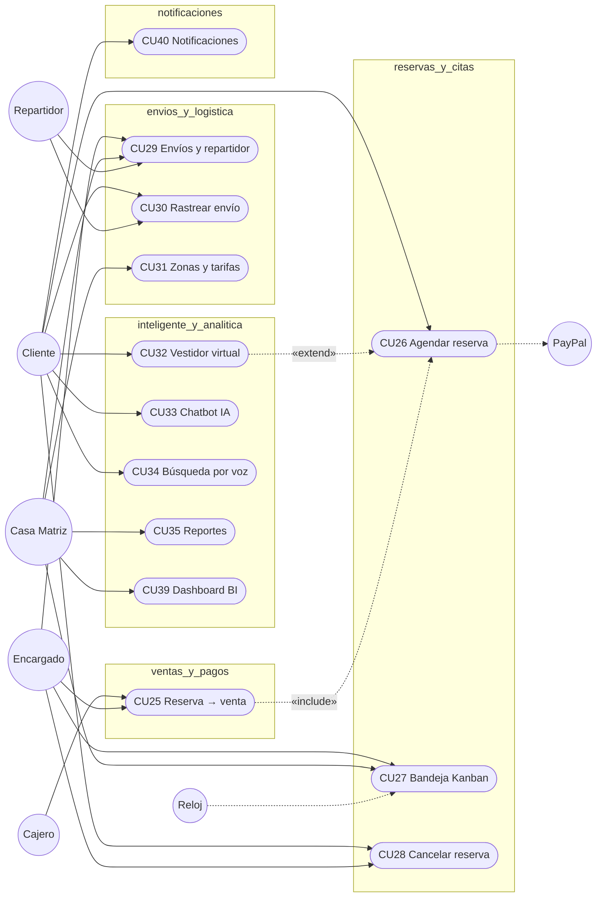

## 1.2 Priorización

| CU | Prioridad | Tipo | Justificación |
| :-- | :-: | :-- | :-- |
| CU26 | Alta | Transacción (stock HOLD + pago) | Flujo online-to-offline central de la propuesta del proyecto |
| CU25 | Alta | Transacción ACID (venta + factura + stock) | Cierra el ciclo de la reserva en caja |
| CU27 / CU28 | Alta | Gestión de estados | Operación diaria del probador |
| CU32 | Alta | IA / visión por computadora | Diferenciador del producto |
| CU29 / CU30 | Media | Logística | Entrega a domicilio con evidencia |
| CU31 | Media | Parametrización | Tarifa de envío por distancia |
| CU33 / CU34 | Media | IA / NLP | Asistencia y accesibilidad |
| CU35 / CU39 | Media | Consulta analítica | Decisiones de Casa Matriz |
| CU40 | Media | Mensajería | Avisos al usuario |

## 1.3 Fichas de casos de uso

### CU26 · Agendar reserva de prendas para prueba física [Alta]

| Campo | Descripción |
| :-- | :-- |
| **Propósito** | Apartar hasta 5 prendas en una sucursal con probador para probárselas en una cita, pagando una seña del 50 %. |
| **Actores** | Cliente (iniciador); PayPal (si paga la seña por PayPal). |
| **Canales** | Web (`/tienda/reservas` y detalle de prenda) y móvil (detalle de prenda → *Reservar en tienda*; también desde el vestidor virtual). |
| **Tablas** | `reservations`, `reservation_items`, `inventory`, `inventory_ledger`, `product_variants`, `branches` |
| **Precondición** | Cliente autenticado. La variante (prenda + color + talla) tiene stock en la sucursal elegida. |
| **Flujo principal** | 1. El cliente elige prenda, **color y talla**.<br>2. El sistema muestra el **stock por sucursal** de esa variante (`GET /catalog/products/{id}/branch-availability`, CU12) y solo permite reservar en sucursales con stock, abiertas y con probador.<br>3. El cliente elige sucursal, **fecha y hora** (dentro del horario `opening_time`–`closing_time` de la sucursal) y teléfono.<br>4. El sistema calcula la **seña = 50 % del precio base** de las prendas.<br>5. El cliente paga la seña con **Tarjeta**, **QR** o **PayPal**. Con PayPal: la app/web crea la orden y el cliente la aprueba en la ventana oficial de PayPal; el backend la captura.<br>6. `POST /reservations`: el backend valida horario, máximo 5 prendas (1–3 unidades por ítem) y stock; si el pago es PayPal **verifica con la API de PayPal** que la orden esté `COMPLETED` y cubra la seña.<br>7. El sistema genera el código `RES-XXXXXX`, **descuenta el stock** (`inventory.stock_actual -= qty`), asienta `RESERVA` en `inventory_ledger` y guarda la reserva en estado `PENDING` con `expires_at = reserved_at + 48 h`. |
| **Postcondición** | Stock apartado; la reserva aparece en "Mis reservas" del cliente y en el Kanban de la sucursal. |
| **Excepciones** | **E1** Hora fuera del horario de la sucursal (400). **E2** Más de 5 prendas (400). **E3** Stock insuficiente en la sucursal (400). **E4** Seña PayPal sin orden o no completada (400/402). |

### CU27 · Gestionar la bandeja de reservas (Kanban) [Alta]

| Campo | Descripción |
| :-- | :-- |
| **Actores** | Encargado de la sucursal (web `/admin/reservations`), Casa Matriz; Reloj del sistema. |
| **Tablas** | `reservations`, `reservation_items`, `inventory`, `inventory_ledger` |
| **Flujo** | 1. El encargado ve las reservas de **su** sucursal (Casa Matriz ve todas).<br>2. Mueve cada reserva por las columnas: `PENDING` → `PREPARING` (prendas en perchero) → `READY` (listo en vestidor).<br>3. Puede **marcar llegada** (`PATCH /reservations/{id}/mark-arrived`: `PENDING/PREPARING/LATE` → `READY`) o **reprogramar** la cita (`PATCH …/reschedule`, máximo **2** reprogramaciones, fecha no pasada, hora dentro del horario).<br>4. **Tolerancia automática** (se evalúa al consultar la reserva): si pasaron **más de 15 min** de la hora de la cita → `LATE`; **más de 30 min** → `NO_SHOW` y el stock apartado **vuelve al inventario**. |
| **Estados válidos** | `PENDING, PREPARING, READY, LATE, NO_SHOW, COMPLETED, CANCELLED, EXPIRED` (`PATCH /reservations/{id}/status`). Al pasar a `CANCELLED` o `NO_SHOW` se libera el stock apartado (la seña no se reembolsa). |
| **Avisos (CU40)** | Cada cambio de estado notifica al cliente; la creación, la reprogramación y la cancelación por parte del cliente también avisan al encargado de la sucursal. |

### CU28 · Cancelar reserva [Alta]

| Campo | Descripción |
| :-- | :-- |
| **Actores** | Cliente (web y móvil), personal de la sucursal. |
| **Flujo** | `POST /reservations/{id}/cancel` → libera el stock (`inventory.stock_actual += qty` + movimiento en `inventory_ledger`) y deja la reserva en `CANCELLED`. |
| **Reglas** | No se cancela una reserva `CANCELLED` o `COMPLETED`. El **cliente** solo puede cancelar con **más de 24 h** de anticipación a la fecha de la reserva; el personal puede cancelar en cualquier momento. |

### CU25 · Convertir reserva en venta (POS) [Alta]

| Campo | Descripción |
| :-- | :-- |
| **Actores** | Cajero o Encargado con **caja abierta** en la sucursal de la reserva. |
| **Canal** | Web: POS → pestaña **Reservas**. |
| **Flujo** | 1. El cajero busca la reserva activa de su sucursal.<br>2. Marca **qué prendas compra** el cliente; las no marcadas se reponen al inventario.<br>3. El sistema calcula el **saldo** = total de lo comprado − seña pagada.<br>4. El cajero cobra el saldo en **EFECTIVO** (con vuelto), **TARJETA** o **QR** e ingresa NIT/razón social.<br>5. `POST /reservations/{id}/convert-to-pos`: crea la orden (canal `POS`, en el turno de caja), el pago, la **factura con IVA 13 %** y marca la reserva `COMPLETED` (`completed_sale_id`). |
| **Excepciones** | Reserva cancelada/completada/expirada/no-show; caja no abierta o de otro cajero/sucursal; medio de pago no permitido. |

### CU29 · Gestionar envíos a domicilio y portal del repartidor [Media]

| Campo | Descripción |
| :-- | :-- |
| **Actores** | Encargado (despacho), Casa Matriz, **Repartidor**. |
| **Tablas** | `shipments`, `shipment_tracking_events`, `delivery_persons`, `delivery_zones`, `orders` |
| **Flujo del despacho** | 1. El encargado crea el envío de un pedido **de su sucursal** (`POST /logistics/shipments`) con dirección, destinatario y zona → estado `PENDING_DISPATCH`, código `TRK-…`. |
| **Flujo del repartidor** | 2. El repartidor (web `/repartidor` o app) activa su **disponibilidad** y ve la **bolsa** de envíos `PENDING_DISPATCH`/`RESCHEDULED`.<br>3. **Toma** uno (`POST …/claim`, requiere estar disponible) → `ASSIGNED`.<br>4. Avanza la ruta (`PATCH …/route-status`): `ASSIGNED → PICKED_UP → IN_TRANSIT → OUT_FOR_DELIVERY` (`FAILED_ATTEMPT/RESCHEDULED → IN_TRANSIT`).<br>5. **Entrega con foto obligatoria**: toma la foto con la cámara, escribe quién recibió y confirma (`POST …/confirm-delivery` con `photo_data_url` + `received_by_name`) → `DELIVERED`, `delivered_at`, `total_deliveries + 1`.<br>6. Si no puede entregar: `POST …/failed-delivery` con motivo (`FAILED_ATTEMPT`, suma `delivery_attempts`); puede **reprogramarse** (`…/reschedule-delivery`, repartidor, cliente o personal) o **liberarse** a la bolsa (`…/release`).<br>7. **Historial** (`GET …/my-history`): envíos entregados/fallidos con hora de toma, hora de entrega, duración y foto. |
| **Reglas** | La entrega **no** puede marcarse `DELIVERED` por `route-status`: solo con foto. Un repartidor pausado no puede tomar pedidos. |

### CU30 · Rastrear envío [Media]

`GET /logistics/track/{tracking_number}` (público). Devuelve estado, destino, sucursal de origen,
repartidor asignado, entrega (fecha y quién recibió) y la **línea de tiempo** de
`shipment_tracking_events` (estado, ubicación, descripción, fecha). Web `/tienda/rastreo`
(`?code=`) y móvil `tracking_view.dart` muestran los mismos textos por estado
(`PENDING_DISPATCH` "En preparación en almacén", `OUT_FOR_DELIVERY` "¡En reparto hoy…!", etc.).

### CU31 · Zonas de cobertura y tarifas [Media]

| Campo | Descripción |
| :-- | :-- |
| **Actor** | Casa Matriz (`/admin/delivery-zones`, con mapa Leaflet). |
| **Modelo** | Cada zona es un **anillo por distancia** (`min_distance_km`–`max_distance_km`) con **tarifa fija** `base_rate` (Bs) y `estimated_hours`. |
| **Cálculo** (`POST /logistics/calculate-rate`) | Se busca la zona activa cuyo rango contiene la distancia → tarifa = `base_rate` de esa zona. Si la distancia supera la zona más lejana → `base_rate` de esa zona **+ Bs 3,50 por km adicional** (+12 h estimadas). Sin zonas configuradas → tarifa plana por defecto. |

### CU32 · Vestidor virtual y recomendación de talla [Alta]

| Campo | Descripción |
| :-- | :-- |
| **Actores** | Cliente o visitante; FASHN.ai / Hugging Face (opcionales). |
| **Canales** | Web `/tienda/vestidor`; móvil `virtual_tryon_view.dart` (desde Inicio, desde el detalle de prenda o desde "Probar" en el catálogo). |
| **Flujo** | 1. El cliente elige la prenda **por su foto** (carrusel/catálogo visual, nunca por listas de texto).<br>2. Sube o toma su foto; `POST /analytics/tryon/remove-background` segmenta a la persona (rembg `u2net_human_seg`) y pone fondo blanco.<br>3. Ingresa medidas (estatura, peso, pecho, cintura); `POST /analytics/tryon/simulate` recomienda la talla:<br>&nbsp;&nbsp;• con **pecho**: `<88` XS · `≤94` S · `≤102` M · `≤110` L · `>110` XL;<br>&nbsp;&nbsp;• si no, con **IMC** (peso/estatura²): `<19,5` S · `≤24,5` M · `≤28,5` L · `>28,5` XL; devuelve también la evaluación de calce por zona.<br>4. `POST /analytics/tryon/generate-vton` genera la imagen probada (ver §5: motor en cascada).<br>5. Opcional: guarda la captura (`POST /analytics/tryon/captures`) y la sesión/ítems probados (`/tryon/sessions`, `/tryon/items`).<br>6. **Conversión:** *Delivery* → agrega la variante de la talla recomendada al carrito (CU17); *Reservar* → abre el detalle de la prenda con esa talla preseleccionada y el stock por sucursal (CU26). |

### CU33 · Asistente IA (chatbot) [Media]

`POST /analytics/chatbot/message` con `session_token`. Detecta la intención
(`GREETING`, `CATALOG_SEARCH`, `STYLE_RECOMMENDATION`, `RESERVATION`, `ORDER_TRACKING`,
`STORE_INFO`, `GENERAL`), responde y sugiere prendas (con foto y precio) y acciones rápidas.
La conversación se guarda en `chatbot_conversations`. **Solo para clientes y visitantes**: el
widget web se oculta para personal, proveedor y repartidor; en móvil está en *Inicio → Asistente IA*.

### CU34 · Búsqueda por voz (NLP) [Media]

1. Web: micrófono en la barra de la tienda (Web Speech API). Móvil: micrófono en el catálogo y
   botón de voz en *Inicio* (`speech_to_text`, idioma español del teléfono).
2. La transcripción se envía a `POST /analytics/search/voice-nlp`, que extrae **prenda**
   (vestido, camisa, pantalón…), **color**, **género** y **precio máximo** ("menos de / hasta N").
3. Filtra el catálogo por prenda y precio y devuelve hasta 10 productos. En móvil, si se reconoció
   alguna entidad se muestran esos productos (chip "Voz: …, N resultados"); si no, la frase se usa
   como búsqueda de texto.

### CU35 · Reportes gerenciales [Media]

Casa Matriz (`/admin/reports`):
1. **Kardex Físico-Valorado** por sucursal (`GET /analytics/reports/kardex`) con **exportación CSV** (`…/kardex/export-csv`).
2. **Prendas Más Vendidas** (`GET /analytics/reports/top-selling`) por volumen de piezas e ingresos.
3. **Resumen Ejecutivo por Voz** (`GET /analytics/reports/executive-summary`): síntesis de voz en tiempo real con Web Speech API (`speechSynthesis`).
4. **Demanda Histórica y Dictamen de Reposición por Prenda** (`GET /analytics/reports/product-sales-trend`):
   - Selector dinámico de prendas del catálogo.
   - Serie temporal gráfica de ventas agrupadas por semana/mes con volumen e ingresos generados.
   - Cálculo automático de **Velocidad Semanal de Ventas** y **Días de Cobertura de Stock**.
   - **Dictamen Gerencial de Compra**: Semáforo algorítmico (`URGENTE_REORDENAR`, `CONVIENE_PEDIR`, `STOCK_ADECUADO`, `BAJA_ROTACION`) con justificación y **lote sugerido de unidades a pedir a proveedores**.
   - Desglose multisede y detalle por variante (talla/color) para emitir pedidos con precisión de SKU.

### CU39 · Dashboard analítico [Media]

Casa Matriz (`/admin/analytics-dashboard`): `GET /analytics/dashboard` con métricas consolidadas
de ventas (por canal ONLINE/POS), inventario y actividad.

### CU40 · Notificaciones [Media]

| Campo | Descripción |
| :-- | :-- |
| **Buzón** | `in_app_notifications` por usuario: `GET /notifications/my` (con `unread_count`), `GET /notifications/unread-count`, `PATCH /notifications/{id}/read`, `POST /notifications/mark-all-read`; correo transaccional por SMTP (`POST /notifications/send-email`). |
| **Pantallas** | Web: campana en la cabecera de la **tienda** (cliente), en el **panel** y en los portales de **proveedor** y **repartidor**. Móvil: `notifications_view.dart` (contador, marcar leída, marcar todas). |
| **Generación automática** | `notificaciones/service.py` (`notificar`, `notificar_varios`, `personal_de_sucursal`, `usuarios_de_proveedor`) se invoca **dentro de la misma transacción** del evento, así la notificación se guarda (o se revierte) junto con el cambio. |

**Eventos que generan notificaciones**

| Evento | Destinatario | Tipo |
| :-- | :-- | :-- |
| Compra online confirmada (CU18) | Cliente | `ORDER` |
| Alistado del pedido: preparando, listo, entregado, cancelado | Cliente | `ORDER` |
| Devolución o cambio registrado (CU22) | Cliente | `ORDER` |
| Reserva creada (CU26) | Cliente y encargado de la sucursal | `RESERVATION` |
| Reserva en preparación, lista, con retraso (15 min), no-show (30 min), completada, cancelada, vencida, reprogramada | Cliente (el encargado también en reprogramación y en cancelación hecha por el cliente) | `RESERVATION` |
| Envío creado, repartidor asignado, recogido, en tránsito, en reparto, entregado, intento fallido, reprogramado | Cliente dueño del pedido | `SHIPMENT` |
| Oferta nueva de proveedor | Casa Matriz | `SYSTEM` |
| Oferta aprobada / rechazada | Usuarios del proveedor | `SYSTEM` |
| Pedido de reposición creado | Usuarios del proveedor | `SYSTEM` |
| Proveedor acepta / rechaza la reposición · reposición recibida | Quien la pidió (Casa Matriz) | `SYSTEM` |
| Mercadería despachada por el proveedor | Encargado de la sucursal destino | `SYSTEM` |

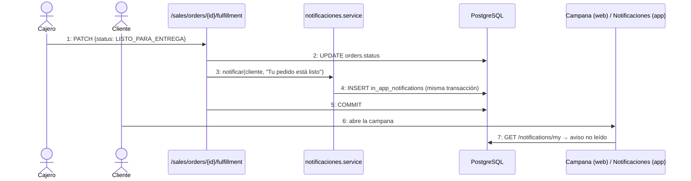

## 1.4 Modelo de casos de uso (estereotipos)

| Relación | Significado |
| :-- | :-- |
| `CU32 --«extend»--> CU17` | Desde el vestidor se agrega al carrito la talla recomendada |
| `CU32 --«extend»--> CU26` | Desde el vestidor se reserva la talla recomendada |
| `CU26 --«include»--> CU12` | La reserva usa la disponibilidad por sucursal |
| `CU26 --«extend»--> CU18 (PayPal)` | La seña puede pagarse con la pasarela PayPal |
| `CU25 --«include»--> CU20` | Cobrar la reserva emite factura (IVA 13 %) |
| `CU29 --«include»--> CU30` | Cada cambio de estado del envío alimenta el rastreo |
| `CU29 --«include»--> CU31` | El costo del envío sale de la zona |

---

# 2. Análisis

## 2.1 Diagramas de comunicación

**CU26 — Agendar reserva con seña (incluye pago PayPal)**

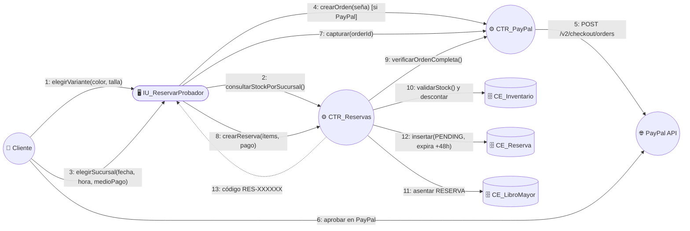

**CU25 — Convertir reserva en venta**

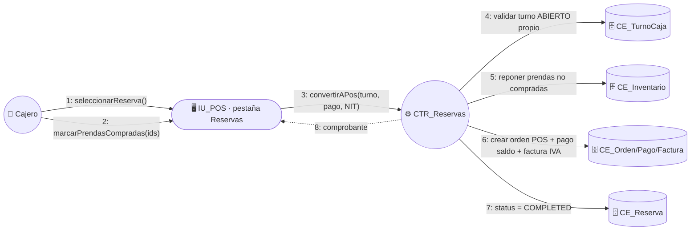

**CU29 — Entrega con evidencia fotográfica**

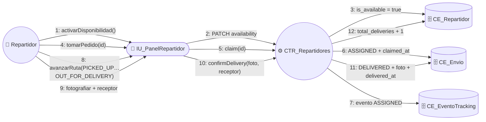

**CU32 — Vestidor virtual**

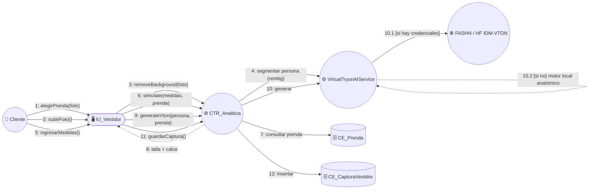

**CU34 — Búsqueda por voz**

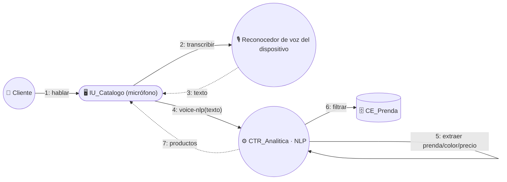

## 2.2 Clases de análisis (Boundary / Control / Entity)

| Paquete | Boundary (web · móvil) | Control (backend) | Entity |
| :-- | :-- | :-- | :-- |
| `reservas_y_citas` | `CustomerReservationsComponent`, `ReservationsBoardComponent` · `ReserveFittingView`, `ReservationsView` | `reservas_y_citas/routers.py` | `Reservation`, `ReservationItem` |
| `ventas_y_pagos` (CU25) | `PosComponent` (pestaña Reservas) | `convert_reservation_to_pos` | `Order`, `Payment`, `Invoice`, `CashShift` |
| `envios_y_logistica` | `ShipmentsComponent`, `DeliveryZonesComponent`, `DeliveryPortalComponent`, `TrackingViewComponent` · `DeliveryDashboardView`, `TrackingView` | `envios_y_logistica/routers.py`, `delivery_persons/routers.py` | `DeliveryZone`, `Shipment`, `ShipmentTrackingEvent`, `DeliveryPerson` |
| `inteligente_y_analitica` | `VirtualTryonComponent`, `ChatbotWidgetComponent`, `VoiceSearchComponent`, `ManagerReportsComponent`, `AnalyticsDashboardComponent` · `VirtualTryonView`, `ChatbotView`, catálogo con micrófono | `inteligente_y_analitica/routers.py`, `vton_service.py` (`VirtualTryonAIService`) | `VirtualTryonSession`, `VirtualTryonItem`, `VirtualTryonCapture`, `ChatbotConversation` |
| `notificaciones` | `NotificationsDropdownComponent` · `NotificationsView` | `notificaciones/routers.py`, `emailer.py` | `InAppNotification` |

---

# 3. Diseño

## 3.1 Diagramas de secuencia

**DSC026 — Agendar reserva con seña por PayPal (móvil / web)**

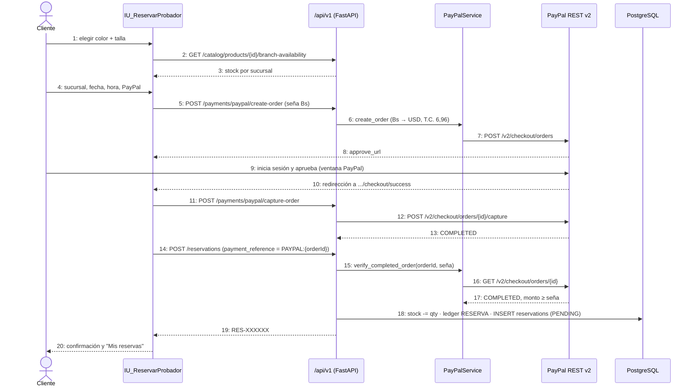

**DSC027 — Kanban y tolerancia automática**

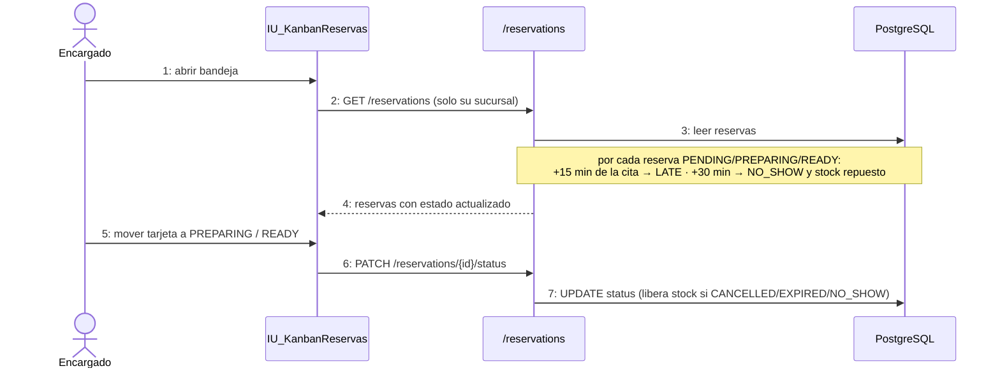

**DSC025 — Cobro de la reserva en POS**

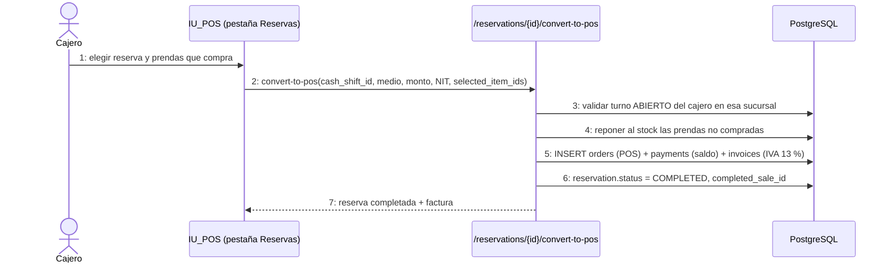

**DSC029 — Entrega a domicilio con foto (app móvil del repartidor)**

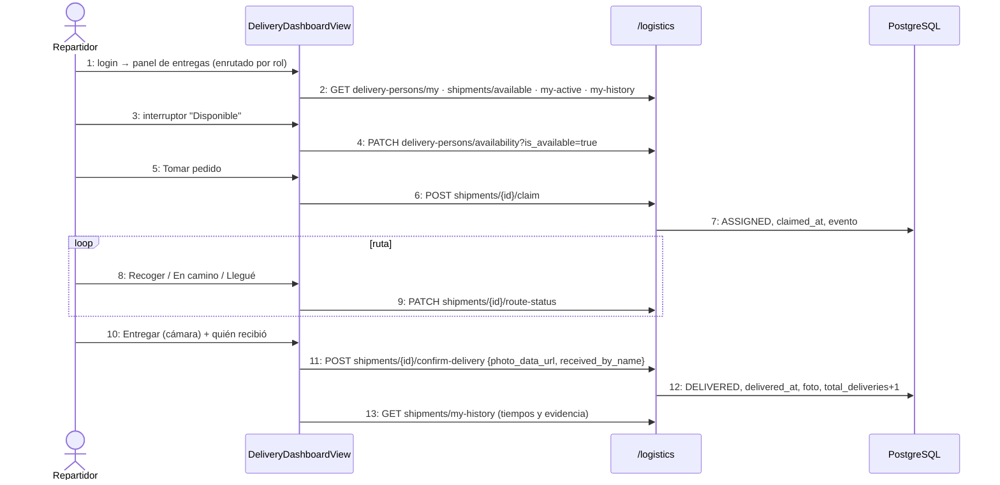

**DSC032 — Vestidor virtual (motor en cascada)**

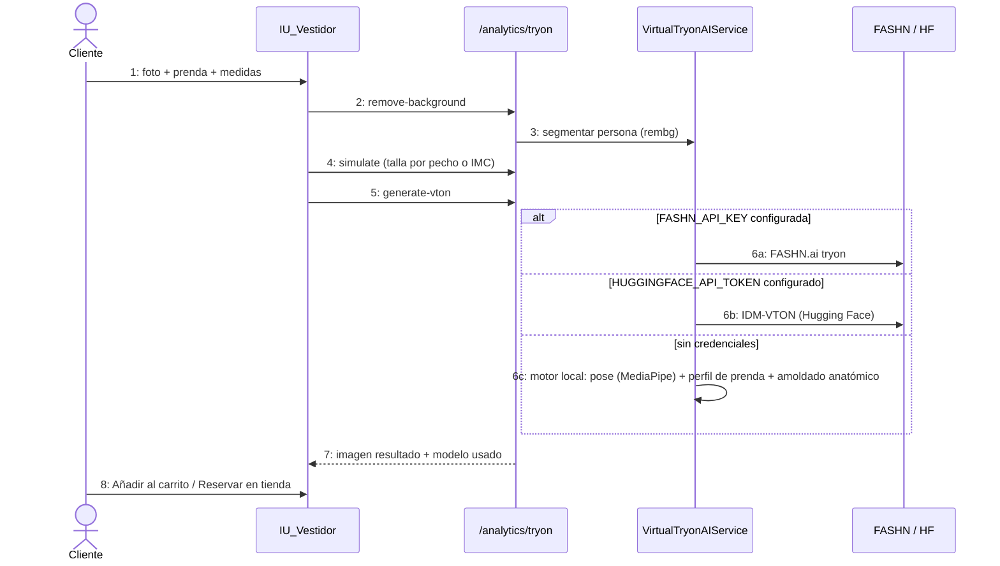

**DSC034 — Búsqueda por voz (móvil)**

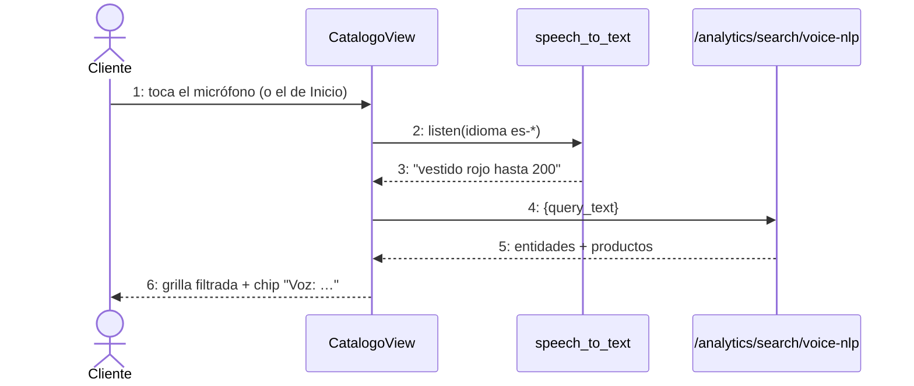

## 3.2 Máquinas de estado

**Reserva (`reservations.status`)**

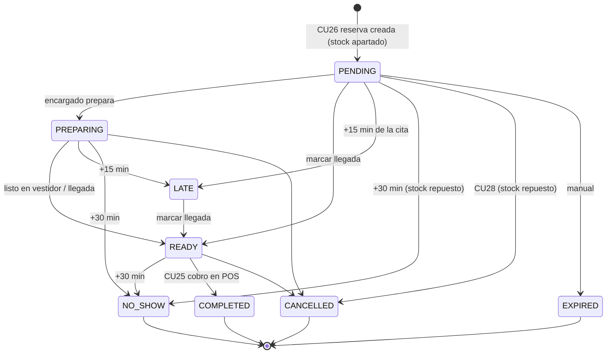

**Envío (`shipments.status`)**

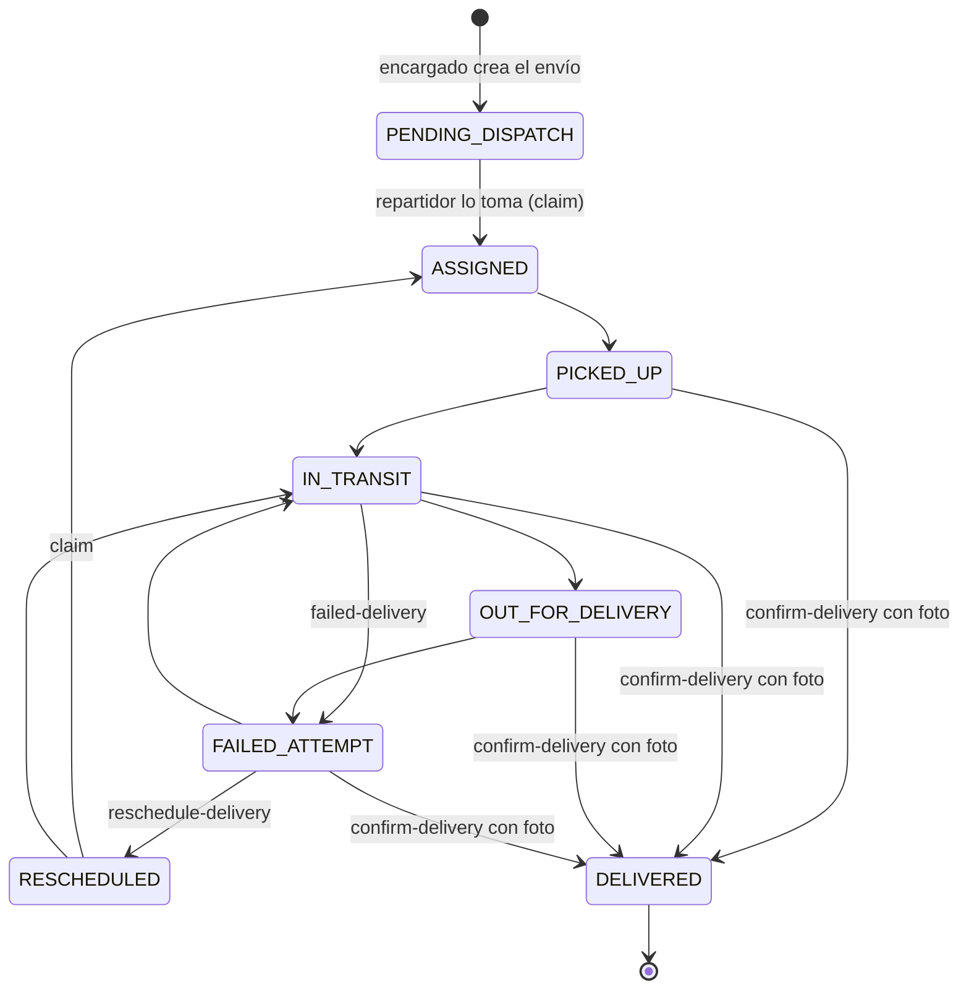

---

# 4. Diseño de datos (DDL real)

El siguiente DDL se **generó automáticamente desde los modelos SQLAlchemy** del backend
(dialecto PostgreSQL), por lo que coincide exactamente con la base de datos creada por
`create_all`. No hay triggers de base de datos: las reglas (descuento de stock, liberación, etc.)
se ejecutan en la capa de aplicación dentro de la misma transacción.

```sql
CREATE TABLE reservations (
    id SERIAL NOT NULL,
    reservation_code VARCHAR(20) NOT NULL,
    customer_id INTEGER NOT NULL,
    branch_id INTEGER NOT NULL,
    status VARCHAR(20) NOT NULL,
    appointment_date DATE,
    appointment_time VARCHAR(10),
    reschedule_count INTEGER NOT NULL,
    grace_period_notified BOOLEAN NOT NULL,
    reserved_at TIMESTAMP WITH TIME ZONE DEFAULT now() NOT NULL,
    expires_at TIMESTAMP WITH TIME ZONE NOT NULL,
    notes VARCHAR(255),
    total_amount NUMERIC(10, 2) NOT NULL,
    deposit_amount NUMERIC(10, 2) NOT NULL,
    payment_method VARCHAR(20),
    payment_reference VARCHAR(100),
    deposit_paid BOOLEAN NOT NULL,
    completed_sale_id INTEGER,
    created_at TIMESTAMP WITH TIME ZONE DEFAULT now() NOT NULL,
    updated_at TIMESTAMP WITH TIME ZONE DEFAULT now() NOT NULL,
    PRIMARY KEY (id),
    FOREIGN KEY(customer_id) REFERENCES users (id) ON DELETE RESTRICT,
    FOREIGN KEY(branch_id) REFERENCES branches (id) ON DELETE RESTRICT,
    FOREIGN KEY(completed_sale_id) REFERENCES orders (id) ON DELETE SET NULL
);
CREATE INDEX ix_reservations_status ON reservations (status);
CREATE UNIQUE INDEX ix_reservations_reservation_code ON reservations (reservation_code);

CREATE TABLE reservation_items (
    id SERIAL NOT NULL,
    reservation_id INTEGER NOT NULL,
    variant_id INTEGER NOT NULL,
    quantity INTEGER NOT NULL,
    unit_price NUMERIC(10, 2) NOT NULL,
    notes VARCHAR(100),
    PRIMARY KEY (id),
    FOREIGN KEY(reservation_id) REFERENCES reservations (id) ON DELETE CASCADE,
    FOREIGN KEY(variant_id) REFERENCES product_variants (id) ON DELETE RESTRICT
);

CREATE TABLE delivery_zones (
    id SERIAL NOT NULL,
    name VARCHAR(100) NOT NULL,
    city VARCHAR(50) NOT NULL,
    min_distance_km NUMERIC(5, 2) NOT NULL,
    max_distance_km NUMERIC(5, 2) NOT NULL,
    base_rate NUMERIC(10, 2) NOT NULL,
    estimated_hours INTEGER NOT NULL,
    is_active BOOLEAN NOT NULL,
    created_at TIMESTAMP WITH TIME ZONE DEFAULT now() NOT NULL,
    PRIMARY KEY (id)
);

CREATE TABLE delivery_persons (
    id SERIAL NOT NULL,
    user_id INTEGER NOT NULL,
    vehicle_type VARCHAR(50) NOT NULL,
    vehicle_plate VARCHAR(20),
    license_number VARCHAR(50),
    coverage_zone VARCHAR(100) NOT NULL,
    phone VARCHAR(20) NOT NULL,
    is_available BOOLEAN NOT NULL,
    rating NUMERIC(3, 2) NOT NULL,
    total_deliveries INTEGER NOT NULL,
    is_active BOOLEAN NOT NULL,
    created_at TIMESTAMP WITH TIME ZONE DEFAULT now() NOT NULL,
    updated_at TIMESTAMP WITH TIME ZONE DEFAULT now() NOT NULL,
    PRIMARY KEY (id),
    UNIQUE (user_id),
    FOREIGN KEY(user_id) REFERENCES users (id) ON DELETE CASCADE
);

CREATE TABLE shipments (
    id SERIAL NOT NULL,
    tracking_number VARCHAR(30) NOT NULL,
    order_id INTEGER NOT NULL,
    zone_id INTEGER,
    delivery_person_id INTEGER,
    claimed_at TIMESTAMP WITH TIME ZONE,
    delivery_date DATE,
    delivery_time VARCHAR(20),
    delivery_attempts INTEGER NOT NULL,
    failed_reason VARCHAR(255),
    carrier_name VARCHAR(100) NOT NULL,
    carrier_phone VARCHAR(20),
    delivery_address VARCHAR(255) NOT NULL,
    recipient_name VARCHAR(100) NOT NULL,
    recipient_phone VARCHAR(20) NOT NULL,
    shipping_cost NUMERIC(10, 2) NOT NULL,
    status VARCHAR(30) NOT NULL,
    dispatched_at TIMESTAMP WITH TIME ZONE,
    delivered_at TIMESTAMP WITH TIME ZONE,
    notes VARCHAR(255),
    delivery_photo_url TEXT,
    received_by_name VARCHAR(100),
    created_at TIMESTAMP WITH TIME ZONE DEFAULT now() NOT NULL,
    updated_at TIMESTAMP WITH TIME ZONE DEFAULT now() NOT NULL,
    PRIMARY KEY (id),
    FOREIGN KEY(order_id) REFERENCES orders (id) ON DELETE RESTRICT,
    FOREIGN KEY(zone_id) REFERENCES delivery_zones (id) ON DELETE SET NULL,
    FOREIGN KEY(delivery_person_id) REFERENCES delivery_persons (id) ON DELETE SET NULL
);
CREATE UNIQUE INDEX ix_shipments_tracking_number ON shipments (tracking_number);
CREATE INDEX ix_shipments_status ON shipments (status);

CREATE TABLE shipment_tracking_events (
    id SERIAL NOT NULL,
    shipment_id INTEGER NOT NULL,
    status VARCHAR(30) NOT NULL,
    location VARCHAR(100) NOT NULL,
    description VARCHAR(255) NOT NULL,
    photo_url TEXT,
    created_at TIMESTAMP WITH TIME ZONE DEFAULT now() NOT NULL,
    PRIMARY KEY (id),
    FOREIGN KEY(shipment_id) REFERENCES shipments (id) ON DELETE CASCADE
);

CREATE TABLE virtual_tryon_sessions (
    id SERIAL NOT NULL,
    user_id INTEGER,
    session_token VARCHAR(100) NOT NULL,
    channel VARCHAR(20) NOT NULL,
    status VARCHAR(20) NOT NULL,
    started_at TIMESTAMP WITH TIME ZONE DEFAULT now() NOT NULL,
    finished_at TIMESTAMP WITH TIME ZONE,
    PRIMARY KEY (id),
    FOREIGN KEY(user_id) REFERENCES users (id) ON DELETE SET NULL
);
CREATE UNIQUE INDEX ix_virtual_tryon_sessions_session_token ON virtual_tryon_sessions (session_token);

CREATE TABLE virtual_tryon_items (
    id SERIAL NOT NULL,
    session_id INTEGER NOT NULL,
    product_id INTEGER NOT NULL,
    variant_id INTEGER,
    tested_size VARCHAR(20),
    fit_feedback VARCHAR(100),
    tested_at TIMESTAMP WITH TIME ZONE DEFAULT now() NOT NULL,
    PRIMARY KEY (id),
    FOREIGN KEY(session_id) REFERENCES virtual_tryon_sessions (id) ON DELETE CASCADE,
    FOREIGN KEY(product_id) REFERENCES products (id) ON DELETE CASCADE,
    FOREIGN KEY(variant_id) REFERENCES product_variants (id) ON DELETE SET NULL
);

CREATE TABLE virtual_tryon_captures (
    id SERIAL NOT NULL,
    session_id INTEGER,
    user_id INTEGER,
    product_id INTEGER NOT NULL,
    variant_id INTEGER,
    photo_url TEXT NOT NULL,
    original_photo_url TEXT,
    generation_model VARCHAR(100) NOT NULL,
    confidence_score FLOAT,
    recommended_size VARCHAR(20),
    measurements_json TEXT,
    created_at TIMESTAMP WITH TIME ZONE DEFAULT now() NOT NULL,
    PRIMARY KEY (id),
    FOREIGN KEY(session_id) REFERENCES virtual_tryon_sessions (id) ON DELETE SET NULL,
    FOREIGN KEY(user_id) REFERENCES users (id) ON DELETE SET NULL,
    FOREIGN KEY(product_id) REFERENCES products (id) ON DELETE CASCADE,
    FOREIGN KEY(variant_id) REFERENCES product_variants (id) ON DELETE SET NULL
);

CREATE TABLE chatbot_conversations (
    id SERIAL NOT NULL,
    user_id INTEGER,
    session_token VARCHAR(100) NOT NULL,
    sender VARCHAR(10) NOT NULL,
    message TEXT NOT NULL,
    intent VARCHAR(50),
    metadata_json TEXT,
    created_at TIMESTAMP WITH TIME ZONE DEFAULT now() NOT NULL,
    PRIMARY KEY (id),
    FOREIGN KEY(user_id) REFERENCES users (id) ON DELETE SET NULL
);
CREATE INDEX ix_chatbot_conversations_session_token ON chatbot_conversations (session_token);

CREATE TABLE in_app_notifications (
    id SERIAL NOT NULL,
    user_id INTEGER NOT NULL,
    title VARCHAR(150) NOT NULL,
    message TEXT NOT NULL,
    notification_type VARCHAR(30) NOT NULL,
    reference_id INTEGER,
    reference_type VARCHAR(30),
    is_read BOOLEAN NOT NULL,
    created_at TIMESTAMP WITH TIME ZONE DEFAULT now() NOT NULL,
    PRIMARY KEY (id),
    FOREIGN KEY(user_id) REFERENCES users (id) ON DELETE CASCADE
);
CREATE INDEX ix_in_app_notifications_user_id ON in_app_notifications (user_id);
CREATE INDEX ix_in_app_notifications_is_read ON in_app_notifications (is_read);
```

**Valores de dominio usados por el código**

| Columna | Valores |
| :-- | :-- |
| `reservations.status` | `PENDING, PREPARING, READY, LATE, NO_SHOW, COMPLETED, CANCELLED, EXPIRED` |
| `reservations.payment_method` | `TARJETA, PAYPAL, QR` |
| `shipments.status` | `PENDING_DISPATCH, ASSIGNED, PICKED_UP, IN_TRANSIT, OUT_FOR_DELIVERY, DELIVERED, FAILED_ATTEMPT, RESCHEDULED, RETURNED_TO_STORE` |
| `delivery_persons.vehicle_type` | `MOTO, BICICLETA, AUTO, TORITO` |
| `in_app_notifications.notification_type` | `RESERVATION, SHIPMENT, ORDER, SYSTEM, PROMOTION` |
| `virtual_tryon_sessions.channel` | `WEB, MOBILE` |
| `chatbot_conversations.sender` | `USER, BOT` |
| `inventory_ledger.movement_type` (Ciclo 3) | `RESERVA` (apartado), `RESERVA_LIBERACION` (cancelación / no-show), `VENTA_RESERVA` (cobro CU25), `REPOSICION_NO_COMPRADO` (prendas no compradas en CU25) |

---

# 5. IA del Vestidor Virtual (CU32)

## 5.1 Motor implementado hoy (`vton_service.py`)

`POST /analytics/tryon/generate-vton` usa un **motor en cascada** (el primero disponible):

| Orden | Motor | Se activa con | Resultado |
| :-: | :-- | :-- | :-- |
| 1 | **FASHN.ai** (API comercial de try-on) | `FASHN_API_KEY` en `.env` (`FASHN_MODEL_NAME=tryon-max` o `tryon-v1.6`) | Fotorrealista |
| 2 | **IDM-VTON** (difusión, Hugging Face `yisol/IDM-VTON`) | `HUGGINGFACE_API_TOKEN` | Fotorrealista (sujeto a disponibilidad del endpoint) |
| 3 | **Motor local de amoldado anatómico** | siempre (fallback) | Coloca y entalla la prenda; no inventa pliegues ni sombras de tejido |

El motor local combina: segmentación de persona con **rembg `u2net_human_seg`**, segmentación de
la prenda con **`isnet-general-use`**, **pose con MediaPipe `pose_landmarker`** (hombros, cuello,
cintura), medición del **perfil de la prenda** (hombro, torso, mangas), remapeo geométrico al
cuerpo, reproyección de mangas cuando el brazo se separa más de 35° y borrado de las mangas de la
ropa de debajo. Los modelos se precargan con `python preload_models.py` (~360 MB, en el Build
Command de Render). Está cubierto por `test_vton_cu32.py` (6) y `test_vton_fit_quality.py` (26
pruebas de calidad: proporciones, hombro, cobertura del torso, largo, mangas).

## 5.2 Plan de entrenamiento propio con Transfer Learning

Para no depender de APIs externas, se entrena un modelo propio de Virtual Try-On. Todo el
entrenamiento está en **`ia_vestidor/vton_transfer_learning_colab.ipynb`** (y su equivalente
`.py`), listo para **Google Colab con GPU T4**, porque la CPU local no soporta el entrenamiento.

### 5.2.1 Datos

| Etapa | Ruta en Google Drive | Contenido esperado | Uso |
| :-- | :-- | :-- | :-- |
| **1 · Pre-entrenamiento base** | `MyDrive/entrenamiento_ia_vestidor/archive/` (metadatos `labels_front.csv`) | Fotos de personas de frente (con o sin prenda aparte) | Aprender a borrar la ropa y colocar prendas en cuerpos |
| **2 · Fine-tuning** | `MyDrive/entrenamiento_ia_vestidor/entrenamiento_ia_ropa/` | Fotos del **catálogo de FashionStore** | Adaptar la deformación a nuestras prendas |

El notebook **descubre solo** la estructura y elige la estrategia:

- **`pareado`**: hay pares (persona, prenda) — estructura VITON (`image/` + `cloth/`) o CSV con dos columnas de imagen → supervisión completa.
- **`auto`**: solo fotos de personas → la prenda se recorta de la misma foto (con deformaciones aleatorias) y la foto original es el objetivo → supervisión completa.
- **`prenda`**: solo fotos de prendas (catálogo) → se combinan con personas de la Etapa 1; se entrena el **ajuste de forma** (Dice/IoU con la silueta de la ropa de la persona) y la **fidelidad de textura** (L1/VGG/SSIM contra la prenda deformada).

Preprocesamiento: *letterbox* a **256 × 192** sobre fondo blanco y **human parsing** con SegFormer
preentrenado (`mattmdjaga/segformer_b2_clothes`, 18 clases). Todo se guarda en caché en Drive
(`resultados_vton/cache`) y se copia al disco local de Colab para leer rápido. Las imágenes
corruptas se registran y se saltan tanto en el preprocesamiento como en el `DataLoader`
(`__getitem__` con `try/except` + `collate` que descarta `None`). Límite por defecto:
4 000 imágenes en la Etapa 1 para terminar en el día.

### 5.2.2 Representación agnóstica y regla de oro (cuello/brazos)

A partir del parsing se derivan (`derivar_mascaras`):

- **Agnóstica:** la foto con la ropa superior/vestido **borrada** (gris) y la anatomía intacta.
- **Cuello:** franja bajo la cara que no es ropa (se define por geometría porque muchos parsers etiquetan el cuello como fondo).
- **Preservar:** cara, pelo, cuello, brazos, parte inferior y todo lo que está fuera del área de la prenda.

La **regla de oro** se garantiza **por construcción** en el modelo:

```
máscara_prenda_efectiva = máscara_deformada × (1 − preservar)
final = preservar × original + (1 − preservar) × generado
```

Así la parte trasera de una prenda (etiqueta, nuca) **nunca** puede dibujarse sobre el cuello o
los brazos: esos píxeles siempre se copian de la foto original. Además, una pérdida
penaliza la "invasión de cuello" para que el GMM aprenda a no ponerla ahí.

### 5.2.3 Arquitectura y Transfer Learning

Arquitectura tipo **CP-VTON** a 256 × 192:

| Módulo | Qué hace | Etapa 1 | Etapa 2 |
| :-- | :-- | :-: | :-: |
| **Backbone ResNet34 (ImageNet)** ×3 (persona, prenda, generador) | Extracción espacial y de características | ❄️ congelado | ❄️ congelado |
| Adaptadores de entrada (`stem`) | Adaptan 8/4/12 canales al backbone | 🔥 | ❄️ |
| **GMM por flujo** (estimadores coarse-to-fine H/32→H/4) | Deforma la prenda para que calce en el cuerpo | 🔥 | 🔥 |
| Decoder U-Net del TOM | Sintetiza la imagen | 🔥 | ❄️ |
| **Capas finales de fusión** (`up1` + `fusion`) | Imagen renderizada + máscara de composición | 🔥 | 🔥 |

**Versión v2 (correcciones tras el primer entrenamiento en Colab):**

| Problema observado en v1 (TensorBoard y demo) | Causa | Corrección v2 |
| :-- | :-- | :-- |
| La Etapa 2 entrenó con fotos de prendas como si fueran personas (grid con un cárdigan como "persona", 1 muestra de validación, pérdidas de entrenamiento que se repiten) | La clasificación consideraba "persona" cualquier imagen con brazos; las mangas de un producto se parsean como brazos | "Persona" exige rostro o pelo visible; la caché se reclasifica sola al volver a ejecutar; aviso si la Etapa 2 tiene menos de 20 muestras |
| Contorno blanco alrededor de la prenda y manchas de color en los hombros | La agnóstica borraba un anillo dilatado que incluía fondo, y la máscara suave mezclaba la prenda con su fondo blanco | La agnóstica solo borra la ropa vieja (+2 px); el fondo que la prenda nueva no cubre se copia de la foto original (canal `fondo_visible`); composición con borde firme |
| La demo "salía bien" pero no probaba nada | Usaba la misma prenda que la persona llevaba puesta | La demo final prueba **persona A + prenda B** (del catálogo o de otra persona) |

Los checkpoints v1 no son compatibles (5 canales): v2 entrena en `etapa1_v2` / `etapa2_v2` reutilizando la caché de imágenes.

Parámetros entrenables: ~8 % en la Etapa 1 y ~4 % en la Etapa 2 (evita el olvido catastrófico).
Optimizador **AdamW** + **ReduceLROnPlateau** (factor 0,5, paciencia 2), precisión mixta (AMP),
recorte de gradiente, early stopping (paciencia 6). Épocas por defecto: 20 (Etapa 1) y 15 (Etapa 2);
LR 2e-4 y 5e-5.

**Pérdidas:** L1, perceptual **VGG19**, Dice de la máscara de la prenda, suavidad del flujo (TV),
invasión de cuello, regularización de la composición y (1 − SSIM).

### 5.2.4 Evaluación por época

En cada época se guardan y muestran: **Training vs Validation Loss** (con el LR), **L1**,
**Perceptual (VGG)**, **IoU** de la máscara de la prenda, **SSIM** e **invasión de cuello (%)**, más
un grid de validación **[Foto original | Máscara agnóstica | Prenda | Resultado]**. También se
registra en TensorBoard. Checkpoints `.pth` **cada 5 épocas** + `best.pth` + `last.pth` en Drive
(`resultados_vton/etapaN/checkpoints`); si Colab se desconecta, el entrenamiento **se reanuda**
desde `last.pth` sin repetir el preprocesamiento.

### 5.2.5 Exportación ONNX para el backend

Al final se exporta `resultados_vton/onnx/vton_fashionstore.onnx` (opset 17, **batch dinámico**,
verificado contra PyTorch con onnxruntime) y `vton_metadatos.json`:

| Tensor | Forma | Rango |
| :-- | :-- | :-- |
| entrada `agnostic` | `[batch, 3, 256, 192]` | [-1, 1] |
| entrada `parse` | `[batch, 6, 256, 192]` — `[preservar, área_generar, brazos, cara_cuello, silueta, fondo_visible]` | {0, 1} |
| entrada `cloth` | `[batch, 3, 256, 192]` | [-1, 1] |
| entrada `cloth_mask` | `[batch, 1, 256, 192]` | {0, 1} |
| salida `result` | `[batch, 3, 256, 192]` | [-1, 1] |
| salidas `warped_cloth`, `warped_mask` | prenda y máscara deformadas | |

Opcionalmente se exporta también el parser (`parser_segformer.onnx`) para que el servidor no
necesite PyTorch.

### 5.2.6 Integración planificada con el backend (siguiente paso)

1. Copiar `vton_fashionstore.onnx`, `vton_metadatos.json` (y `parser_segformer.onnx`) al backend (`backend/models/`).
2. Agregar en `inteligente_y_analitica` un motor **"ONNX propio"** con `onnxruntime`, replicando exactamente la función `preparar_entrada()` del notebook (letterbox → parsing → `derivar_mascaras` → tensores).
3. Insertarlo en la cascada de `generate-vton` **antes del motor local** (FASHN → IDM-VTON → **ONNX propio** → motor local).
4. El mismo endpoint sirve a la web y a la app móvil; el modelo no va embebido en la app.

> **Prueba realizada:** el notebook completo se ejecutó de principio a fin en modo prueba (datos
> sintéticos, CPU): descubrimiento, parsing, ambas etapas, gráficas, checkpoints, reanudación y
> exportación ONNX (diferencia máxima PyTorch vs ONNX 5,6e-05). El entrenamiento real con los
> datos de Drive se realiza en Colab.

---

# 6. Implementación

## 6.1 Endpoints del Ciclo 3 (prefijo `/api/v1`)

| Método y ruta | Permiso | CU |
| :-- | :-- | :-- |
| `POST /reservations` | Cliente autenticado | CU26 |
| `GET /reservations/my` | Cliente | CU26/CU28 |
| `GET /reservations` · `GET /reservations/{id}` | Personal (su sucursal) / dueño | CU27 |
| `PATCH /reservations/{id}/status` · `/reschedule` · `/mark-arrived` | Personal de la sucursal | CU27 |
| `POST /reservations/{id}/cancel` | Cliente (>24 h) / personal | CU28 |
| `POST /reservations/{id}/convert-to-pos` | Cajero/Encargado con caja abierta | CU25 |
| `GET /logistics/zones` · `POST /logistics/calculate-rate` | Público | CU31 |
| `POST /logistics/zones` · `PUT /logistics/zones/{id}` | Casa Matriz (`SUPERADMIN`, `ADMINISTRADOR`) | CU31 |
| `POST /logistics/shipments` · `GET /logistics/shipments` · `POST …/{id}/events` | Casa Matriz + Encargado (su sucursal) | CU29 |
| `GET /logistics/shipments/{id}` | Autenticado | CU29/CU30 |
| `GET /logistics/track/{tracking_number}` | Público | CU30 |
| `POST/GET /logistics/delivery-persons` | Casa Matriz | CU29 |
| `GET /logistics/delivery-persons/my` · `PATCH …/availability` | Repartidor | CU29 |
| `GET /logistics/shipments/available` · `my-active` · `my-history` | Repartidor | CU29 |
| `POST …/{id}/claim` · `release` · `failed-delivery` · `confirm-delivery` · `PATCH …/route-status` | Repartidor | CU29 |
| `POST …/{id}/reschedule-delivery` | Repartidor, cliente dueño o personal | CU29 |
| `POST /analytics/tryon/remove-background` · `sessions` · `items` · `generate-vton` · `simulate` · `captures` · `GET …/sessions/{token}/items` | Público | CU32 |
| `POST /analytics/chatbot/message` | Público | CU33 |
| `POST /analytics/search/voice-nlp` | Público | CU34 |
| `GET /analytics/reports/kardex` · `kardex/export-csv` · `top-selling` · `executive-summary` | Autenticado (UI solo Casa Matriz) | CU35 |
| `GET /analytics/dashboard` | Autenticado (UI solo Casa Matriz) | CU39 |
| `GET /notifications/my` · `unread-count` · `PATCH /{id}/read` · `POST mark-all-read` · `POST send-email` | Autenticado | CU40 |
| `GET /payments/paypal/config` · `status` · `POST create-order` · `capture-order` | config/status públicos; órdenes con sesión | CU26 / CU18 |

## 6.2 Web (Angular 16) — `frontend-web/src/app/packages/`

| Carpeta | Ruta | CU |
| :-- | :-- | :-- |
| `reservas_y_citas/customer-reservations` | `/tienda/reservas` | CU26, CU28 |
| `reservas_y_citas/reservations-board` | `/admin/reservations` | CU27 |
| `ventas_y_pagos/pos` (pestañas Reservas y Alistado) | `/admin/pos` | CU25 (+ alistado de pedidos online) |
| `envios_y_logistica/shipments` | `/admin/shipments` | CU29 |
| `envios_y_logistica/delivery-zones` | `/admin/delivery-zones` | CU31 |
| `envios_y_logistica/delivery-portal` | `/repartidor` | CU29 |
| `envios_y_logistica/tracking-view` | `/tienda/rastreo` | CU30 |
| `inteligente_y_analitica/virtual-tryon` | `/tienda/vestidor` | CU32 |
| `inteligente_y_analitica/chatbot-widget` | widget global (cliente/visitante) | CU33 |
| `inteligente_y_analitica/voice-search` | en `/tienda` | CU34 |
| `inteligente_y_analitica/manager-reports` | `/admin/reports` | CU35 |
| `inteligente_y_analitica/analytics-dashboard` | `/admin/analytics-dashboard` | CU39 |
| `notificaciones/notifications-dropdown` | campana del panel y portales | CU40 |
| `ventas_y_pagos/paypal-checkout.service.ts` | SDK oficial de PayPal (Smart Buttons) | CU26 / CU18 |

## 6.3 Móvil (Flutter) — `mobile/lib/src/packages/`

| Archivo | CU |
| :-- | :-- |
| `catalogo_y_tiendas/home_view.dart` | Inicio con accesos a todas las funciones + botón de voz |
| `catalogo_y_tiendas/product_detail_view.dart` | CU12 (stock por sucursal), CU26 (reservar), CU32 (abrir vestidor) |
| `reservas_y_citas/reserve_fitting_view.dart` | CU26 (fecha/hora, seña 50 % Tarjeta/PayPal/QR) |
| `reservas_y_citas/reservations_view.dart` | CU26/CU28 (lista, cancelar) |
| `envios_y_logistica/delivery_dashboard_view.dart` | CU29 (bolsa, entregas, historial, foto) |
| `envios_y_logistica/tracking_view.dart` | CU30 |
| `inteligente_y_analitica/virtual_tryon_view.dart` | CU32 |
| `inteligente_y_analitica/chatbot_view.dart` | CU33 |
| `catalogo_y_tiendas/catalogo_view.dart` (micrófono) | CU34 |
| `notificaciones/notifications_view.dart` | CU40 |
| `ventas_y_pagos/paypal_checkout.dart` | PayPal (WebView oficial) para CU26 / CU18 |

Permisos del sistema operativo: Android `INTERNET`, `RECORD_AUDIO` (+ consulta del servicio
`RecognitionService`); iOS `NSCameraUsageDescription`, `NSPhotoLibraryUsageDescription`,
`NSMicrophoneUsageDescription`, `NSSpeechRecognitionUsageDescription`.

---

# 7. Pruebas

Backend: **72 pruebas `pytest`, todas aprobadas** (suite completa del proyecto).

| Archivo | Pruebas | Cubre |
| :-- | :-: | :-- |
| `test_ciclo3.py` | 10 | CU25, CU26–CU28, CU29–CU31, CU32 (biometría), CU33, CU34, CU35, CU39, CU40 |
| `test_nuevas_funcionalidades.py` | 4 | CU06 solo Santa Cruz, flujo ofertas/reposición CU08/CU10, reserva con fecha/hora/seña/reprogramación, repartidor CU29/CU30 |
| `test_nuevas_operaciones_caja_proveedor.py` | 3 | prenda descontinuada bloquea reposición, alistado de pedidos de sucursal, desglose del arqueo |
| `test_paypal_payments.py` | 4 | config, status, crear y capturar orden, **reserva con seña PayPal** |
| `test_vton_cu32.py` | 6 | segmentación, perfil de prenda, amoldado anatómico, centrado |
| `test_vton_fit_quality.py` | 26 | calidad del amoldado sobre 4 prendas reales y borrado de mangas |
| `test_cu40_notificaciones_eventos.py` | 2 | la compra y el alistado notifican al cliente; la reserva y su cancelación notifican al cliente |
| `test_apk_download.py` | 2 | descarga del APK |

Móvil: `flutter analyze` sin errores, `flutter test` 4/4, `flutter build apk --release` correcto.
Web: `ng build` sin errores.

---

# 8. Trazabilidad y pendientes conocidos

## 8.1 Matriz de trazabilidad

| CU | Endpoint principal | Backend | Web | Móvil | Tablas |
| :-- | :-- | :-- | :-- | :-- | :-- |
| CU25 | `POST /reservations/{id}/convert-to-pos` | `reservas_y_citas/routers.py` | `pos/` | — | `reservations`, `orders`, `payments`, `invoices`, `cash_shifts` |
| CU26 | `POST /reservations` | `reservas_y_citas/routers.py`, `ventas_y_pagos/paypal_service.py` | `customer-reservations/`, `store/product-detail` | `reserve_fitting_view.dart` | `reservations`, `reservation_items`, `inventory`, `inventory_ledger` |
| CU27 | `PATCH /reservations/{id}/status` | idem | `reservations-board/` | — | `reservations` |
| CU28 | `POST /reservations/{id}/cancel` | idem | `customer-reservations/` | `reservations_view.dart` | `reservations`, `inventory`, `inventory_ledger` |
| CU29 | `/logistics/shipments/*` | `envios_y_logistica/*` | `shipments/`, `delivery-portal/` | `delivery_dashboard_view.dart` | `shipments`, `shipment_tracking_events`, `delivery_persons` |
| CU30 | `GET /logistics/track/{code}` | `envios_y_logistica/routers.py` | `tracking-view/` | `tracking_view.dart` | `shipments`, `shipment_tracking_events` |
| CU31 | `/logistics/zones`, `calculate-rate` | idem | `delivery-zones/` | — | `delivery_zones` |
| CU32 | `/analytics/tryon/*` | `inteligente_y_analitica/routers.py`, `vton_service.py` | `virtual-tryon/` | `virtual_tryon_view.dart` | `virtual_tryon_*` |
| CU33 | `POST /analytics/chatbot/message` | idem | `chatbot-widget/` | `chatbot_view.dart` | `chatbot_conversations` |
| CU34 | `POST /analytics/search/voice-nlp` | idem | `voice-search/` | `catalogo_view.dart`, `home_view.dart` | `products` |
| CU35 | `/analytics/reports/*` | idem | `manager-reports/` | — | `orders`, `inventory_ledger` |
| CU39 | `GET /analytics/dashboard` | idem | `analytics-dashboard/` | — | `orders`, `inventory` |
| CU40 | `/notifications/*` + eventos | `notificaciones/routers.py`, `notificaciones/service.py` (llamado desde ventas, reservas, logística y proveedores) | `notifications-dropdown/` (tienda, panel y portales) | `notifications_view.dart` | `in_app_notifications` |

## 8.2 Pendientes conocidos (lo que el código **no** hace todavía)

1. **Vencimiento de reservas a 48 h:** `expires_at` se guarda, pero no hay un proceso automático que pase la reserva a `EXPIRED`; lo automático es la tolerancia de la cita (15 min → `LATE`, 30 min → `NO_SHOW` con stock repuesto). `EXPIRED` se asigna manualmente.
2. **Creación de envíos:** el checkout no crea el envío; lo crea el encargado desde `/admin/shipments` a partir del pedido.
3. **Modelo propio de try-on:** entrenamiento y exportación ONNX listos (§5.2); falta integrarlo al endpoint `generate-vton` (§5.2.6).
4. **Reportes y dashboard (CU35/CU39):** la restricción a Casa Matriz está en la web (`CentralOnlyGuard`); los endpoints `/analytics/reports/*` y `/analytics/dashboard` solo exigen sesión iniciada.
5. **Pagos con tarjeta y QR** son registros simulados (no hay pasarela bancaria); **PayPal sí se conecta** a la API real cuando hay credenciales sandbox/live (ver `Ciclo2.md`, CU18).
