# Diseño de Paquetes del Sistema (UML)

En la ingeniería de software orientada a objetos y en el modelado con UML 2.5+, un **Diagrama de Paquetes** es fundamental para estructurar y modularizar la arquitectura lógica de un sistema complejo. Permite agrupar elementos (como casos de uso, clases o componentes) en subsistemas cohesivos y definir las dependencias lícitas entre ellos.

Para la plataforma **FashionStore**, los **40 casos de uso** del sistema (lista maestra en `Contexto.md` → *Captura de requisitos → Lista maestra de casos de uso*) se han organizado en **8 paquetes de diseño**. Esta división asegura un bajo acoplamiento y una alta cohesión, facilitando que el desarrollo por capas (FastAPI backend, Angular frontend y Flutter móvil) sea ordenado y escalable.

> **Numeración única:** este documento usa **exactamente los mismos números de caso de uso que `Contexto.md`** (lista maestra de 40 CU). `Listado_General_Casos_Uso.md` queda obsoleto; ver equivalencias en `Ciclo1.md` §6.3. El análisis de acoplamiento y cohesión entre paquetes está en `Ciclo1.md` §2.4.

---

## 1. Diagrama de Paquetes y Dependencias (Mermaid)

`A --> B` indica que el paquete `A` depende o consume elementos del paquete `B`. Entre paréntesis se indica el ciclo de implementación (C1 = Ciclo 1, C2 = Ciclo 2, C3 = Ciclo 3).

```mermaid
graph TD
    subgraph PKG_Security [1. Seguridad y Usuarios]
        CU01["CU01: Iniciar sesión (C1)"]
        CU02["CU02: Cerrar sesión (C1)"]
        CU03["CU03: Recuperar credenciales (C1)"]
        CU04["CU04: Auto-registro de cliente (C1)"]
        CU05["CU05: Gestionar perfiles y roles (C1)"]
        CU36["CU36: Consultar bitácora de auditoría (C1)"]
    end

    subgraph PKG_Catalog [2. Catálogo y Tiendas]
        CU06["CU06: Gestionar sucursales (C1)"]
        CU07["CU07: Gestionar catálogo — galería, oferta, variantes editables (C1)"]
        CU09["CU09: Gestionar empleados de sucursal (C1)"]
        CU11["CU11: Consultar catálogo — categorías, grilla lookbook y detalle de prenda (C1)"]
        CU12["CU12: Buscar/filtrar catálogo + disponibilidad por sucursal (C2)"]
        CU13["CU13: Promociones: cupones y ofertas de temporada programadas (C2)"]
        CU14["CU14: Wishlist y reseñas de prendas — versión ligera (C1); ampliación (C2)"]
    end

    subgraph PKG_Inventory [3. Inventario y Proveedores]
        CU08["CU08: Gestionar proveedores (C1)"]
        CU10["CU10: Registrar compras/ingresos de mercadería (C1)"]
        CU37["CU37: Valoración de inventario / capital invertido - costo promedio ponderado (C1)"]
        CU38["CU38: Ajustes de inventario - mermas/daños/pérdidas (C1)"]
        CU15["CU15: Inventario general y transferencias + trigger (C2)"]
        CU16["CU16: Alertas automáticas de stock (C2)"]
    end

    subgraph PKG_Sales [4. Ventas y Pagos]
        CU17["CU17: Carrito de compra digital (C2)"]
        CU18["CU18: Checkout con herencia de medios de pago - Efectivo/Tarjeta/QR/Crédito (C2)"]
        CU19["CU19: Venta presencial en caja - POS (C2)"]
        CU20["CU20: Factura y nota de entrega - IVA 13% + código de control (C2)"]
        CU21["CU21: Generar cotización (C2)"]
        CU22["CU22: Devoluciones y cambios (C2)"]
        CU23["CU23: Arqueo de caja (C2)"]
        CU24["CU24: Historial de compras del cliente (C2)"]
        CU25["CU25: Convertir reserva en venta (C3)"]
    end

    subgraph PKG_Reservations [5. Reservas y Citas]
        CU26["CU26: Agendar reserva de prendas (C3)"]
        CU27["CU27: Gestionar bandeja de reservas - preparar/atender (C3)"]
        CU28["CU28: Cancelar reserva - libera stock (C3)"]
    end

    subgraph PKG_Logistics [6. Envíos y Logística]
        CU29["CU29: Envíos/despacho + método de envío/recojo (C3)"]
        CU30["CU30: Rastrear estado de pedido/envío (C3)"]
        CU31["CU31: Zonas de cobertura y tarifas de envío (C3)"]
    end

    subgraph PKG_AI_Analytics [7. Inteligente y Analítica]
        CU32["CU32: Vestidor Virtual RA + capturas (C3)"]
        CU33["CU33: Recomendaciones IA + chatbot (C3)"]
        CU34["CU34: Búsqueda de catálogo por voz / NLP (C3)"]
        CU35["CU35: Reportes gerenciales - kardex/más vendidos/ingresos/rendimiento (C3)"]
        CU39["CU39: Dashboard de ventas e inventario global (C3)"]
    end

    subgraph PKG_Notif [8. Notificaciones]
        CU40["CU40: Notificar estado en tiempo real (push) + correos transaccionales (C3)"]
    end

    %% Relaciones de dependencia entre paquetes
    PKG_Catalog --> PKG_Security
    PKG_Inventory --> PKG_Catalog
    PKG_Inventory --> PKG_Security
    PKG_Sales --> PKG_Catalog
    PKG_Sales --> PKG_Inventory
    PKG_Sales --> PKG_Security
    PKG_Reservations --> PKG_Catalog
    PKG_Reservations --> PKG_Inventory
    PKG_Reservations --> PKG_Security
    PKG_Logistics --> PKG_Sales
    PKG_AI_Analytics --> PKG_Catalog
    PKG_AI_Analytics --> PKG_Sales
    PKG_AI_Analytics --> PKG_Reservations
    PKG_Notif --> PKG_Reservations
    PKG_Notif --> PKG_Sales
```

---

## 2. Descripción Detallada de los Paquetes

### 2.1 Paquete de Seguridad y Usuarios (`seguridad_y_usuarios`)
* **Propósito**: Centraliza la autenticación mediante JSON Web Tokens (JWT), el auto-registro de clientes, la recuperación de credenciales por correo, la gestión de perfiles/roles (RBAC) y la bitácora de auditoría.
* **Casos de Uso**: `CU01`, `CU02`, `CU03`, `CU04`, `CU05` (perfiles, roles y clientes), `CU36`.
* **Componentes de Capa**:
  * *Backend*: controladores de autenticación, `RoleChecker` (RBAC), hashing BCrypt, `log_event` de auditoría, servicio de correo saliente para el enlace de recuperación.
  * *Frontend Web/Móvil*: formularios de Login, Registro y Recuperación; `AuthGuard` / `SessionGuard`; `AuthInterceptor`.
  * *Base de Datos*: `users`, `roles`, `user_roles`, `session_tokens`, `audit_logs`.

### 2.2 Paquete de Catálogo y Tiendas (`catalogo_y_tiendas`)
* **Propósito**: Administra la cadena de sucursales físicas y su personal, el catálogo unificado de prendas con sus variantes (color + talla), y la consulta del catálogo por parte del cliente.
* **Casos de Uso**: `CU06` (sucursales), `CU07` (catálogo: galería de fotos, categorías con imagen, oferta directa por prenda, variantes editables), `CU09` (empleados de sucursal), `CU11` (consultar catálogo: navegación por categorías, grilla lookbook y vista de detalle de prenda — web y móvil), `CU14` (reseñas 1–5★ y favoritos / wishlist — **versión ligera**) — Ciclo 1; `CU12` (buscar/filtrar + disponibilidad por sucursal), `CU13` (cupones y ofertas de temporada programadas), ampliación de `CU14` (wishlist múltiple y reseñas con moderación) — Ciclo 2.
* **Componentes de Capa**:
  * *Backend*: CRUD de productos, variantes, categorías, tallas, colores, temporadas; CRUD de sucursales y asignación de empleados.
  * *Frontend*: paneles administrativos (Angular) y tienda del cliente (web `/tienda` + app móvil).
  * *Base de Datos*: `branches`, `branch_employees`, `categories`, `seasons`, `colors`, `sizes`, `products`, `product_variants`, `product_images`.

### 2.3 Paquete de Inventario y Proveedores (`inventario_y_proveedores`)
* **Propósito**: Controla el stock físico real por sucursal, el directorio de proveedores, el registro de ingresos de mercadería con **costeo por promedio ponderado**, la **valoración del capital invertido**, los **ajustes de inventario** (mermas/daños/pérdidas) y la actualización automática de existencias.
* **Casos de Uso**: `CU08` (proveedores), `CU10` (compras/ingresos, costo unitario del lote), `CU37` (valoración de inventario / capital invertido — costo promedio ponderado), `CU38` (ajustes de inventario) — Ciclo 1; `CU15` (inventario general y transferencias entre sucursales + trigger), `CU16` (alertas de stock) — Ciclo 2.
* **Componentes de Capa**:
  * *Backend*: registro transaccional de ingresos; **recálculo del costo promedio ponderado** por variante+sucursal en cada ingreso (`(stock_previo·avg_previo + cant·costo_lote) / (stock_previo + cant)`); endpoint de valoración (`GET /merchandise/valuation` → Σ stock·avg_cost); registro de ajustes (`POST /merchandise/adjustments`, movimiento `AJUSTE` en el ledger).
  * *Frontend*: pantallas `admin/valuation` (capital invertido) y `admin/adjustments` (mermas).
  * *Base de Datos*: `suppliers`, `inventory` (con `avg_cost`), `inventory_ledger`, `purchase_orders`, `purchase_details`.

### 2.4 Paquete de Ventas y Pagos (`ventas_y_pagos`) — *(Ciclo 2; modelos base en Ciclo 1)*
* **Propósito**: Funcionalidad transaccional de la tienda **física + online**: carrito, checkout con **herencia de medios de pago** (Efectivo, Tarjeta, QR, Crédito), pasarela (Stripe/QR), POS presencial, arqueo de caja, emisión de **factura / nota de entrega (IVA 13 %, código de control)**, cotización, devoluciones e historial de compras.
* **Casos de Uso**: `CU17` (carrito), `CU18` (checkout con herencia de pagos), `CU19` (venta presencial POS), `CU20` (factura y nota de entrega), `CU21` (cotización), `CU22` (devoluciones y cambios), `CU23` (arqueo de caja), `CU24` (historial de compras) — Ciclo 2; `CU25` (convertir reserva en venta) — Ciclo 3.
* **Modelado en Ciclo 1**: jerarquía `MedioDePago` ⭅ `Efectivo` / `Tarjeta` / `QR` / `Crédito` y `Comprobante` ⭅ `Factura` / `NotaDeEntrega`. Se crean ya los modelos SQLAlchemy `payments` (herencia de tabla única) e `invoices` como respaldo del diagrama de clases; sin routers todavía.
* **Componentes de Capa**:
  * *Base de Datos*: `orders`, `order_items`, `payments`, `invoices`, `cash_sessions` (arqueo), `credit_notes` (devoluciones).

### 2.5 Paquete de Reservas y Citas (`reservas_y_citas`) — *(Ciclo 3)*
* **Propósito**: Flujo omnicanal híbrido: el cliente preselecciona prendas en línea, agenda fecha/hora de visita a la tienda física y el encargado prepara las prendas.
* **Casos de Uso**: `CU26` (agendar reserva), `CU27` (bandeja de reservas: preparar/atender), `CU28` (cancelar reserva, libera stock bloqueado).
* **Componentes de Capa**:
  * *Backend*: agenda de citas, bloqueo temporal de stock, bandeja administrativa de reservas.
  * *Frontend*: calendario de reservas móvil, tablero Kanban de preparación para el encargado.
  * *Base de Datos*: `reservations`, `reservation_items`.

### 2.6 Paquete de Envíos y Logística (`envios_y_logistica`) — *(Ciclo 3)*
* **Propósito**: Traslado físico de las prendas compradas de forma remota, selección de método de envío / recojo, zonas y tarifas, y control del estado logístico del delivery.
* **Casos de Uso**: `CU29` (envíos/despacho + método de envío/recojo), `CU30` (rastrear estado de pedido/envío), `CU31` (zonas de cobertura y tarifas por anillos/km).
* **Actor clave**: **Repartidor** (retira en sucursal, entrega en domicilio; tarifa por distancia/anillos).
* **Componentes de Capa**:
  * *Backend*: cálculo de tarifas por zona/distancia, APIs de actualización del estado de envío.
  * *Base de Datos*: información de envío, zonas/tarifas y del courier.

### 2.7 Paquete Inteligente y Analítica (`inteligente_y_analitica`) — *(Ciclo 3)*
* **Propósito**: Servicios cognitivos y analítica: vestidor virtual con realidad aumentada, recomendación de prendas por IA, chatbot, búsqueda y reportes por comando de voz (NLP), reportes gerenciales y dashboards.
* **Casos de Uso**: `CU32` (vestidor RA + capturas), `CU33` (recomendaciones IA + chatbot), `CU34` (búsqueda por voz), `CU35` (reportes gerenciales: kardex, más vendidos, ingresos por sucursal, rendimiento de cajeros; export PDF/CSV; por comando de voz), `CU39` (dashboard global).
* **Actor clave**: **Servicio de IA (API externa)**.
* **Componentes de Capa**:
  * *Backend/Móvil*: módulos AR de Flutter (cámara y superposición), cliente REST para voz-a-texto e interpretación semántica (NLP), algoritmos de recomendación, motor de reportes.
  * *Frontend*: tableros gráficos en Angular (Chart.js) integrados con consultas de voz.

### 2.8 Paquete de Notificaciones (`notificaciones`) — *(Ciclo 3)*
* **Propósito**: Comunicación con el cliente en momentos clave del ciclo de compra y reservas (además del correo de recuperación de credenciales, que vive en Seguridad).
* **Casos de Uso**: `CU40` (notificar estado en tiempo real por push y enviar comprobantes / confirmaciones por correo).
* **Componentes de Capa**:
  * *Backend/Servicios*: pasarela de correo electrónico (SMTP), notificaciones push web/móvil.

---

## 3. Distribución de casos de uso por ciclo

| Ciclo | Casos de uso |
| :--- | :--- |
| **Ciclo 1** | CU01, CU02, CU03, CU04, CU05, CU06, CU07, CU08, CU09, CU10, CU11, **CU14**, CU36, **CU37**, **CU38** |
| **Ciclo 2** | CU12, CU13, CU15, CU16, CU17, CU18, CU19, CU20, CU21, CU22, CU23, CU24 (+ ampliación de CU14) |
| **Ciclo 3** | CU25, CU26, CU27, CU28, CU29, CU30, CU31, CU32, CU33, CU34, CU35, CU39, CU40 |

> **CU37 y CU38 entran al Ciclo 1** por indicación de la cátedra (costo promedio ponderado y
> ajustes/mermas). **CU14 se adelanta al Ciclo 1 en versión ligera** (una reseña por prenda,
> editable, sin moderación; una lista de favoritos por usuario); la wishlist múltiple y las
> reseñas moderadas quedan para el Ciclo 2. **CU12** (buscar/filtrar por precio/talla/color +
> disponibilidad por sucursal) y **CU13** (cupones y campañas de temporada programadas) se
> difieren al **Ciclo 2**; en el Ciclo 1 el cliente ya consulta el catálogo (`CU11`) por
> categorías, con grilla lookbook y vista de detalle, y hay **oferta directa por prenda** dentro
> de `CU07`.

---

## 4. Beneficios Arquitectónicos de este Diseño
1. **Desacoplamiento del Frontend**: los equipos de Flutter y Angular programan en paralelo consumiendo API Routers estructurados por cada paquete lógico.
2. **Ciclo de Desarrollo Limpio (Ciclo 1)**: el primer hito se concentra en **Seguridad y Usuarios**, **Catálogo y Tiendas** e **Inventario y Proveedores**, delimitando el alcance sin dispersar el código.
3. **Mantenibilidad de la Base de Datos**: una modificación en Envíos o en IA no afecta el esquema central de productos o de autenticación.
