# Diseño de Paquetes del Sistema (UML)

En la ingeniería de software orientada a objetos y en el modelado con UML 2.5+, un **Diagrama de Paquetes** es fundamental para estructurar y modularizar la arquitectura lógica de un sistema complejo. Permite agrupar elementos (como casos de uso, clases o componentes) en subsistemas cohesivos y definir las dependencias lícitas entre ellos.

Para la plataforma **FashionStore**, los **36 casos de uso** del sistema (lista canónica en `Contexto.md` → *Captura de requisitos → Lista de casos de uso*) se han organizado en **8 paquetes de diseño**. Esta división asegura un bajo acoplamiento y una alta cohesión, facilitando que el desarrollo por capas (FastAPI backend, Angular frontend y Flutter móvil) sea ordenado y escalable.

> **Numeración única:** este documento usa **exactamente los mismos números de caso de uso que `Contexto.md`**. Cualquier lista previa con otra numeración queda obsoleta.

---

## 1. Diagrama de Paquetes y Dependencias (Mermaid)

`A --> B` indica que el paquete `A` depende o consume elementos del paquete `B`. Entre paréntesis se indica el ciclo de implementación (C1 = Ciclo 1, C2 = Ciclo 2, C3 = Ciclo 3).

```mermaid
graph TD
    subgraph PKG_Security [1. Seguridad y Usuarios]
        CU01["CU01: Iniciar sesión (C1)"]
        CU02["CU02: Cerrar sesión (C1)"]
        CU03["CU03: Recuperar credenciales (C1)"]
        CU04["CU04: Auto-registro de cliente (C1)"]
        CU05["CU05: Gestionar perfiles y roles (C1)"]
        CU36["CU36: Consultar bitácora de auditoría (C1)"]
    end

    subgraph PKG_Catalog [2. Catálogo y Tiendas]
        CU06["CU06: Gestionar sucursales (C1)"]
        CU07["CU07: Gestionar catálogo (C1)"]
        CU09["CU09: Gestionar empleados de sucursal (C1)"]
        CU11["CU11: Consultar catálogo (C1)"]
        CU12["CU12: Buscar/filtrar catálogo avanzado (C2)"]
        CU13["CU13: Consultar disponibilidad por sucursal (C2)"]
    end

    subgraph PKG_Inventory [3. Inventario y Proveedores]
        CU08["CU08: Gestionar proveedores (C1)"]
        CU10["CU10: Registrar compras/ingresos de mercadería (C1)"]
        CU14["CU14: Inventario general y transferencias (C2)"]
        CU15["CU15: Alertas automáticas de stock (C2)"]
        CU21["CU21: Actualización automática de inventario / trigger (C2)"]
    end

    subgraph PKG_Sales [4. Ventas y Pagos]
        CU16["CU16: Carrito de compra digital (C2)"]
        CU17["CU17: Pago digital vía pasarela Stripe (C2)"]
        CU18["CU18: Venta presencial en caja - POS (C2)"]
        CU19["CU19: Convertir reserva en venta (C2)"]
        CU20["CU20: Generar comprobante/factura (C2)"]
    end

    subgraph PKG_Reservations [5. Reservas y Citas]
        CU24["CU24: Agendar reserva de prendas (C3)"]
        CU25["CU25: Gestionar bandeja de reservas (C3)"]
        CU26["CU26: Marcar reserva como preparada (C3)"]
        CU27["CU27: Cancelar reserva (C3)"]
    end

    subgraph PKG_Logistics [6. Envíos y Logística]
        CU29["CU29: Gestionar envíos a domicilio / Delivery (C3)"]
        CU30["CU30: Consultar estado de pedido/envío (C3)"]
    end

    subgraph PKG_AI_Analytics [7. Inteligente y Analítica]
        CU22["CU22: Vestidor Virtual RA (C3)"]
        CU23["CU23: Guardar capturas del Vestidor Virtual (C3)"]
        CU31["CU31: Recomendaciones de prendas por IA (C3)"]
        CU32["CU32: Chatbot asistente (C3)"]
        CU33["CU33: Búsqueda de catálogo por voz / NLP (C3)"]
        CU34["CU34: Reportes gerenciales por voz / IA (C3)"]
        CU35["CU35: Dashboard de ventas e inventario global (C3)"]
    end

    subgraph PKG_Notif [8. Notificaciones]
        CU28["CU28: Notificar estado en tiempo real (C3)"]
    end

    %% Relaciones de dependencia entre paquetes
    PKG_Catalog --> PKG_Security
    PKG_Inventory --> PKG_Catalog
    PKG_Inventory --> PKG_Security
    PKG_Sales --> PKG_Catalog
    PKG_Sales --> PKG_Inventory
    PKG_Sales --> PKG_Security
    PKG_Reservations --> PKG_Catalog
    PKG_Reservations --> PKG_Inventory
    PKG_Reservations --> PKG_Security
    PKG_Logistics --> PKG_Sales
    PKG_AI_Analytics --> PKG_Catalog
    PKG_AI_Analytics --> PKG_Sales
    PKG_AI_Analytics --> PKG_Reservations
    PKG_Notif --> PKG_Reservations
    PKG_Notif --> PKG_Sales
```

---

## 2. Descripción Detallada de los Paquetes

### 2.1 Paquete de Seguridad y Usuarios (`seguridad_y_usuarios`)
* **Propósito**: Centraliza la autenticación mediante JSON Web Tokens (JWT), el auto-registro de clientes, la recuperación de credenciales por correo, la gestión de perfiles/roles (RBAC) y la bitácora de auditoría.
* **Casos de Uso**: `CU01`, `CU02`, `CU03`, `CU04`, `CU05`, `CU36`.
* **Componentes de Capa**:
  * *Backend*: controladores de autenticación, `RoleChecker` (RBAC), hashing BCrypt, `log_event` de auditoría, servicio de correo saliente para el enlace de recuperación.
  * *Frontend Web/Móvil*: formularios de Login, Registro y Recuperación; `AuthGuard` / `SessionGuard`; `AuthInterceptor`.
  * *Base de Datos*: `users`, `roles`, `user_roles`, `session_tokens`, `audit_logs`.

### 2.2 Paquete de Catálogo y Tiendas (`catalogo_y_tiendas`)
* **Propósito**: Administra la cadena de sucursales físicas y su personal, el catálogo unificado de prendas con sus variantes (color + talla), y la consulta del catálogo por parte del cliente.
* **Casos de Uso**: `CU06` (sucursales), `CU07` (catálogo), `CU09` (empleados de sucursal), `CU11` (consultar catálogo), `CU12` (buscar/filtrar avanzado — Ciclo 2), `CU13` (disponibilidad por sucursal — Ciclo 2).
* **Componentes de Capa**:
  * *Backend*: CRUD de productos, variantes, categorías, tallas, colores, temporadas; CRUD de sucursales y asignación de empleados.
  * *Frontend*: paneles administrativos (Angular) y tienda del cliente (web `/tienda` + app móvil).
  * *Base de Datos*: `branches`, `branch_employees`, `categories`, `seasons`, `colors`, `sizes`, `products`, `product_variants`, `product_images`.

### 2.3 Paquete de Inventario y Proveedores (`inventario_y_proveedores`)
* **Propósito**: Controla el stock físico real por sucursal, el directorio de proveedores, el registro de ingresos de mercadería con costeo por promedio ponderado y la actualización automática de existencias.
* **Casos de Uso**: `CU08` (proveedores), `CU10` (compras/ingresos), `CU14` (transferencias entre tiendas — Ciclo 2), `CU15` (alertas de stock — Ciclo 2), `CU21` (actualización automática / trigger — Ciclo 2).
* **Componentes de Capa**:
  * *Backend*: registro transaccional de ingresos, cálculo de costo promedio ponderado, servicios de actualización de stock tras ventas o cancelaciones.
  * *Base de Datos*: `suppliers`, `inventory`, `inventory_ledger`, `purchase_orders`, `purchase_details`.

### 2.4 Paquete de Ventas y Pagos (`ventas_y_pagos`) — *(Ciclo 2)*
* **Propósito**: Funcionalidad transaccional: carrito de compra, integración con la pasarela de pagos (Stripe), flujo de caja del Punto de Venta (POS) presencial y emisión de comprobantes.
* **Casos de Uso**: `CU16` (carrito), `CU17` (pago digital Stripe), `CU18` (venta presencial POS), `CU19` (convertir reserva en venta), `CU20` (comprobante/factura).
* **Componentes de Capa**:
  * *Backend*: integración con la API de Stripe, endpoints de facturación del POS, generación de comprobantes.
  * *Frontend*: checkout móvil y terminal de ventas presenciales en Angular.
  * *Base de Datos*: `orders`, `order_items` (y las estructuras de carrito/factura que se definan).

### 2.5 Paquete de Reservas y Citas (`reservas_y_citas`) — *(Ciclo 3)*
* **Propósito**: Flujo omnicanal híbrido: el cliente preselecciona prendas en línea, agenda fecha/hora de visita a la tienda física y el encargado prepara las prendas.
* **Casos de Uso**: `CU24` (agendar reserva), `CU25` (bandeja de reservas entrantes), `CU26` (marcar como preparada), `CU27` (cancelar reserva).
* **Componentes de Capa**:
  * *Backend*: agenda de citas, bloqueo temporal de stock, bandeja administrativa de reservas.
  * *Frontend*: calendario de reservas móvil, tablero Kanban de preparación para el encargado.
  * *Base de Datos*: `reservations`, `reservation_items`.

### 2.6 Paquete de Envíos y Logística (`envios_y_logistica`) — *(Ciclo 3)*
* **Propósito**: Traslado físico de las prendas compradas de forma remota, registro del destino y control del estado logístico del delivery.
* **Casos de Uso**: `CU29` (gestionar envíos/delivery), `CU30` (consultar estado de pedido/envío).
* **Actor clave**: **Repartidor** (retira en sucursal, entrega en domicilio; tarifa por distancia/anillos).
* **Componentes de Capa**:
  * *Backend*: cálculo de tarifas por zona/distancia, APIs de actualización del estado de envío.
  * *Base de Datos*: información de envío y del courier.

### 2.7 Paquete Inteligente y Analítica (`inteligente_y_analitica`) — *(Ciclo 3)*
* **Propósito**: Servicios cognitivos: vestidor virtual con realidad aumentada, recomendación de prendas por IA, chatbot, búsqueda y reportes por comando de voz (NLP) y dashboards.
* **Casos de Uso**: `CU22` (vestidor RA), `CU23` (capturas del vestidor), `CU31` (recomendaciones IA), `CU32` (chatbot), `CU33` (búsqueda por voz), `CU34` (reportes gerenciales por voz), `CU35` (dashboard global).
* **Actor clave**: **Servicio de IA (API externa)**.
* **Componentes de Capa**:
  * *Backend/Móvil*: módulos AR de Flutter (cámara y superposición), cliente REST para voz-a-texto e interpretación semántica (NLP), algoritmos de recomendación.
  * *Frontend*: tableros gráficos en Angular (Chart.js) integrados con consultas de voz.

### 2.8 Paquete de Notificaciones (`notificaciones`)
* **Propósito**: Comunicación con el cliente en momentos clave del ciclo de compra y reservas (además del correo de recuperación de credenciales, que vive en Seguridad).
* **Casos de Uso**: `CU28` (notificar estado en tiempo real).  *(Ciclo 3.)*
* **Componentes de Capa**:
  * *Backend/Servicios*: pasarela de correo electrónico (SMTP), notificaciones push web/móvil.

---

## 3. Distribución de casos de uso por ciclo

| Ciclo | Casos de uso |
| :--- | :--- |
| **Ciclo 1** | CU01, CU02, CU03, CU04, CU05, CU06, CU07, CU08, CU09, CU10, CU11, CU36 |
| **Ciclo 2** | CU12, CU13, CU14, CU15, CU16, CU17, CU18, CU19, CU20, CU21 |
| **Ciclo 3** | CU22, CU23, CU24, CU25, CU26, CU27, CU28, CU29, CU30, CU31, CU32, CU33, CU34, CU35 |

> **Diferimiento de CU12 y CU13:** `CU12` (buscar y filtrar el catálogo por precio, talla y color) y `CU13` (consultar disponibilidad física por sucursal) **no se implementan en el Ciclo 1**. En el Ciclo 1 el cliente ya consulta el catálogo (`CU11`) con búsqueda por texto y filtro por categoría; el filtrado por variante y la disponibilidad por sucursal requieren inventario cargado por sucursal, por lo que se difieren al **Ciclo 2**.

---

## 4. Beneficios Arquitectónicos de este Diseño
1. **Desacoplamiento del Frontend**: los equipos de Flutter y Angular programan en paralelo consumiendo API Routers estructurados por cada paquete lógico.
2. **Ciclo de Desarrollo Limpio (Ciclo 1)**: el primer hito se concentra en **Seguridad y Usuarios**, **Catálogo y Tiendas** e **Inventario y Proveedores**, delimitando el alcance sin dispersar el código.
3. **Mantenibilidad de la Base de Datos**: una modificación en Envíos o en IA no afecta el esquema central de productos o de autenticación.
