# Diagramas de Comunicación - Ciclo 1

A continuación se presentan los diagramas de comunicación para los Casos de Uso del Ciclo 1. Se ha utilizado la notación de **Mermaid (Flowchart)** para representar la interacción entre los objetos (Actor, Interfaz [Boundary], Controlador [Control] y Entidad [Entity]), con flechas numeradas indicando la secuencia de mensajes.

---

### CU01: Iniciar Sesión

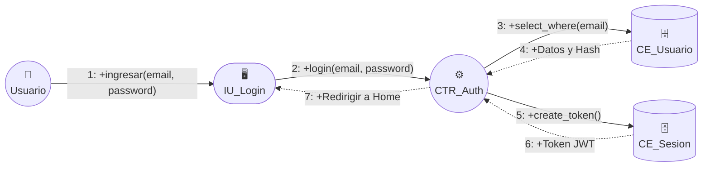

**Descripción:** El actor ingresa sus credenciales en la interfaz de login. La solicitud se envía al controlador de autenticación, el cual verifica el usuario en la base de datos y, tras validar el hash, genera un token JWT en la entidad de sesión, retornando el acceso.

---

### CU02: Cerrar Sesión

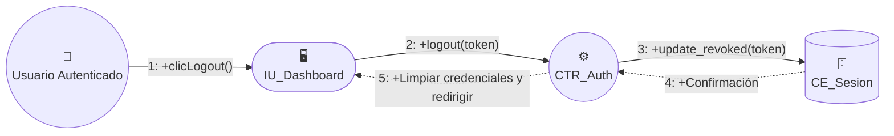

**Descripción:** El usuario autenticado solicita cerrar sesión. El controlador invalida el token activo en la base de datos y la interfaz limpia el almacenamiento local.

---

### CU03: Recuperar Credenciales

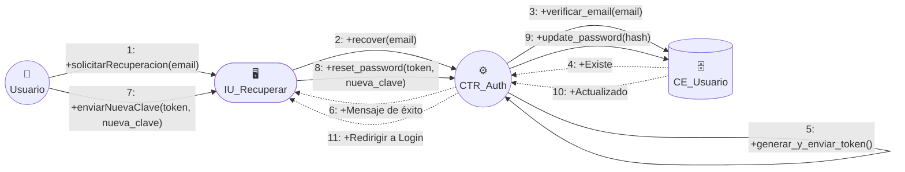

**Descripción:** Flujo en dos partes: primero se solicita un token al correo electrónico, y posteriormente se envía dicho token junto con la nueva contraseña para actualizar la entidad del usuario.

---

### CU04: Auto-registro de Cliente

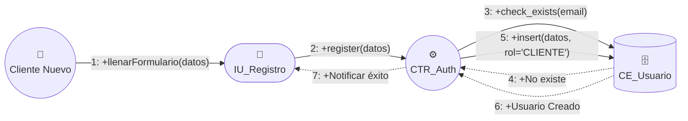

**Descripción:** Un usuario nuevo envía sus datos. El sistema verifica que el correo no esté duplicado, encripta la clave y crea el registro con el rol predeterminado de CLIENTE.

---

### CU05: Gestionar perfiles y roles

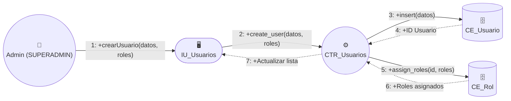

**Descripción:** El administrador da de alta un nuevo empleado, registrando su perfil y asignándole los roles correspondientes (ej. CAJERO, ENCARGADO).

---

### CU06: Gestionar sucursales

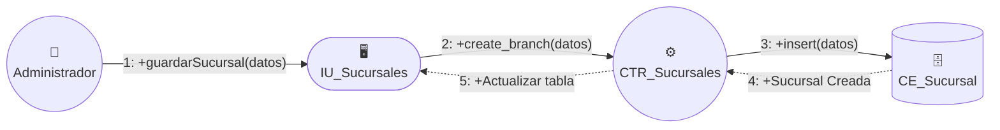

**Descripción:** Se envían los datos (nombre, dirección, teléfono) para registrar una nueva sucursal física en la base de datos.

---

### CU07: Gestionar catálogo

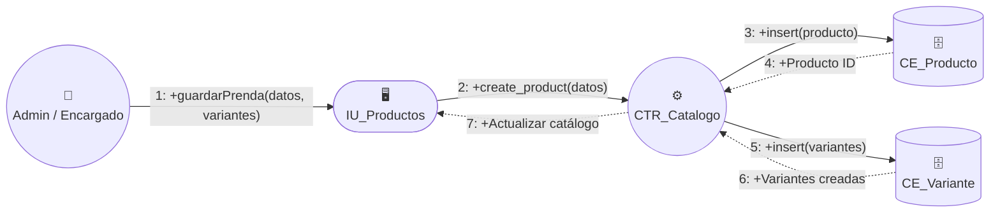

**Descripción:** Se crea un producto base (ej. Blusa) y se asocian sus distintas variantes de stock (Talla M, Color Rojo, etc.) en un solo flujo transaccional.

---

### CU08: Gestionar proveedores

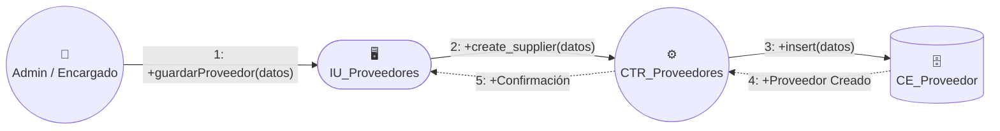

**Descripción:** Registro y administración de los proveedores (fabricantes o distribuidores) que suministran mercadería a la cadena.

---

### CU09: Gestionar empleados

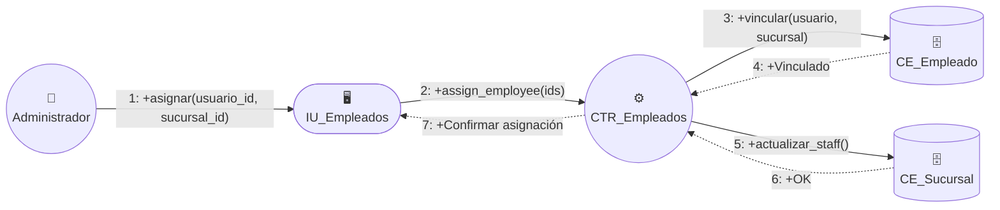

**Descripción:** Se vincula a un usuario administrativo (creado en CU05) como empleado formal de una sucursal específica (creada en CU06).

---

### CU10: Registrar compras/ingresos

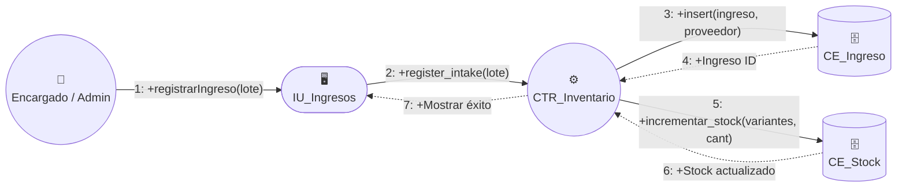

**Descripción:** Al recibir mercadería, se registra la entrada (Intake) vinculada al proveedor y se incrementa automáticamente el inventario (Stock) de la sucursal de manera atómica.

---

### CU11: Consultar catálogo (Público)

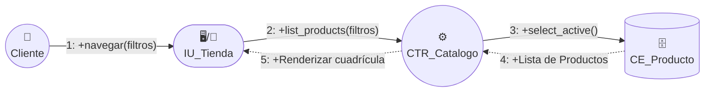

**Descripción:** El cliente explora la tienda virtual. El sistema consulta únicamente las prendas que están activadas para mostrar sus precios e imágenes.

---

### CU36: Consultar bitácora de auditoría

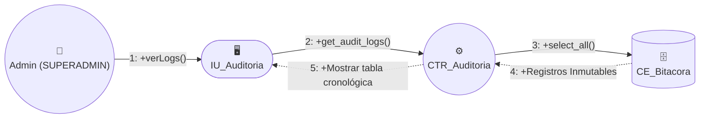

**Descripción:** El superadministrador solicita ver el historial de acciones del sistema. El controlador lee la tabla de logs y devuelve la información para su monitoreo.
