# Diagramas de Secuencia - Ciclo 1 (FashionStore)

A continuación se presentan los **Diagramas de Secuencia** para los 12 casos de uso del Ciclo 1. Siguiendo tus indicaciones, se ha utilizado la nomenclatura **DSC** (Diagrama de Secuencia de Caso de uso) para diferenciarlos claramente de los diagramas de comunicación.

---

### DSC001: Iniciar sesión

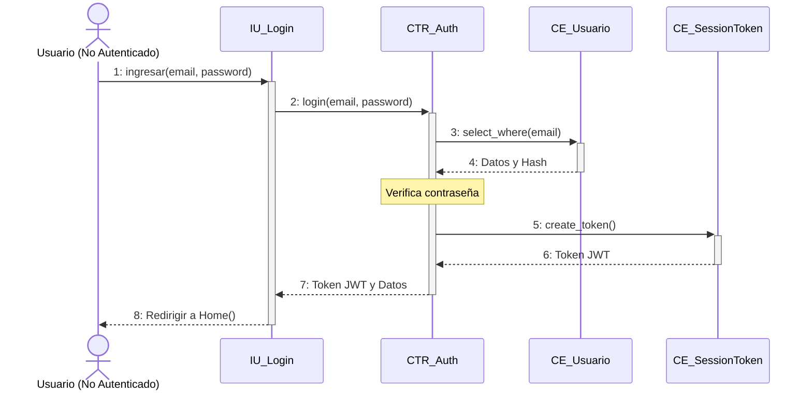

---

### DSC002: Cerrar sesión

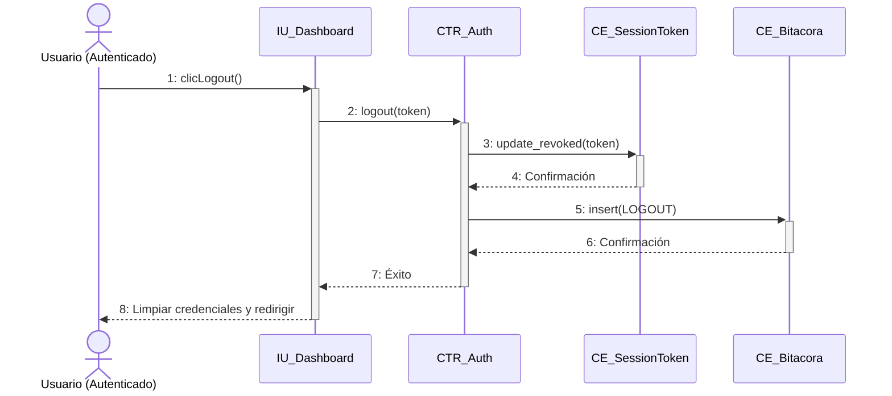

---

### DSC003: Recuperar credenciales

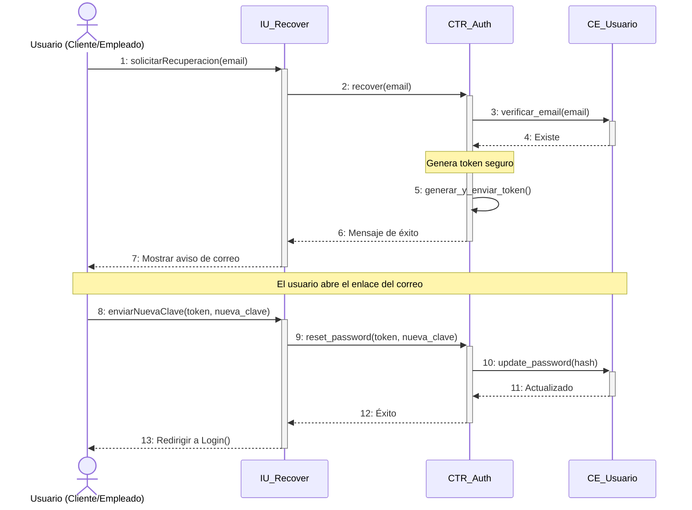

---

### DSC004: Auto-registro de cliente

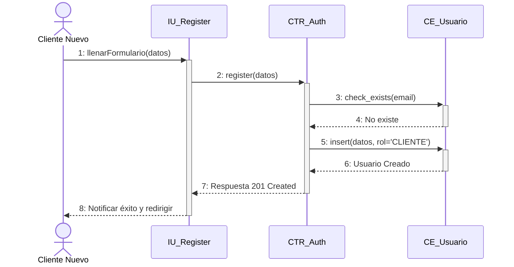

---

### DSC005: Gestionar perfiles y roles

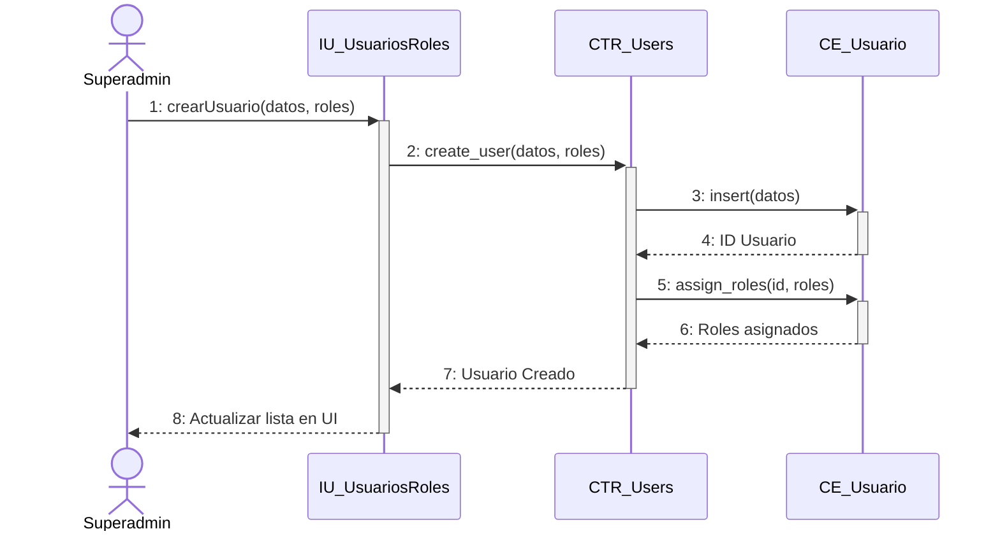

---

### DSC006: Gestionar sucursales

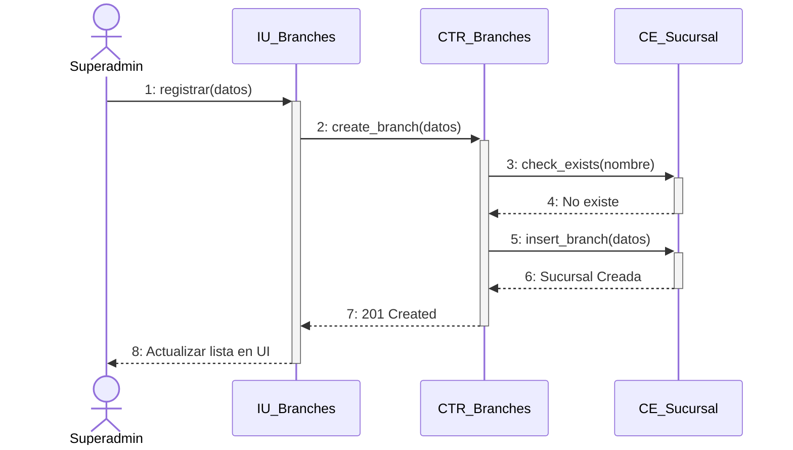

---

### DSC007: Gestionar catálogo

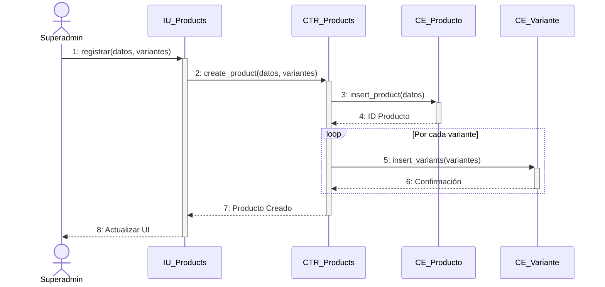

---

### DSC008: Gestionar proveedores

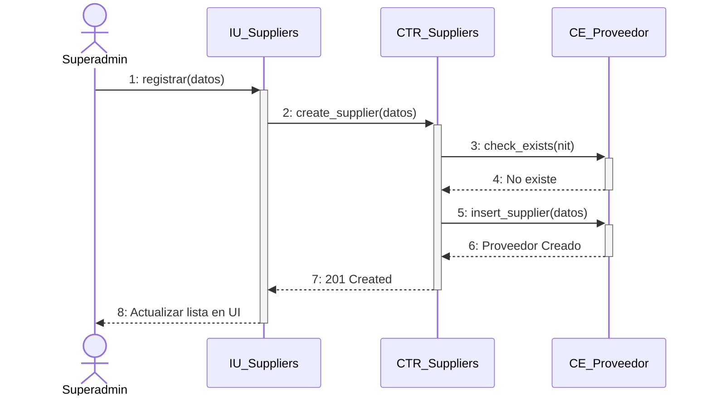

---

### DSC009: Gestionar empleados

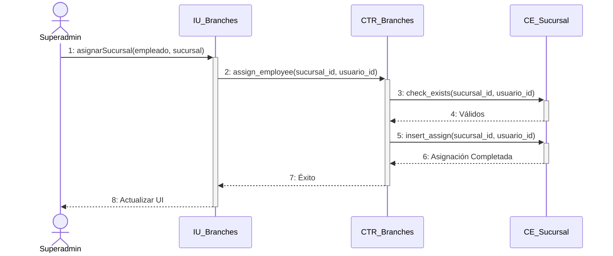

---

### DSC010: Registrar compras/ingresos

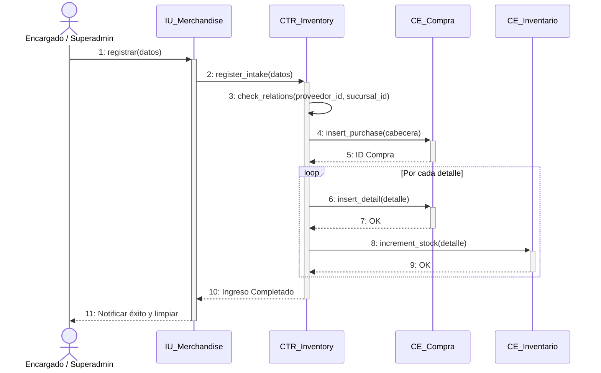

---

### DSC011: Consultar catálogo

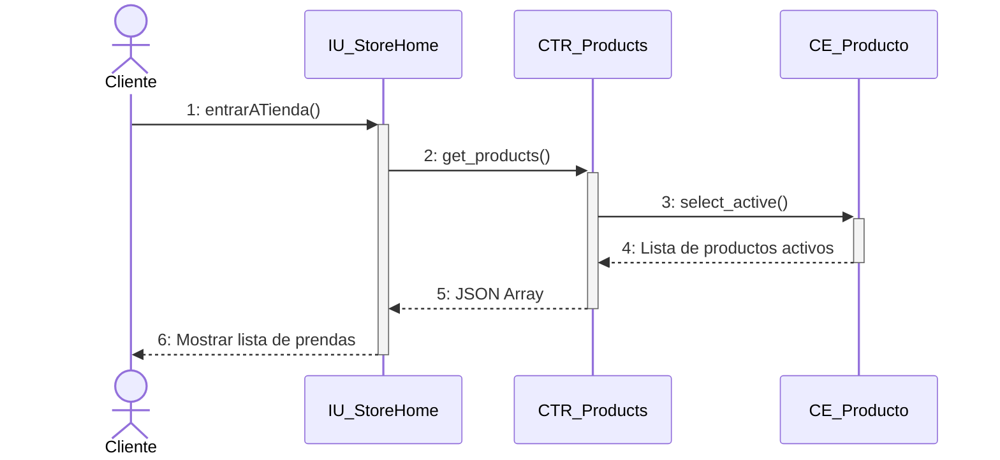

---

### DSC036: Consultar bitácora de auditoría

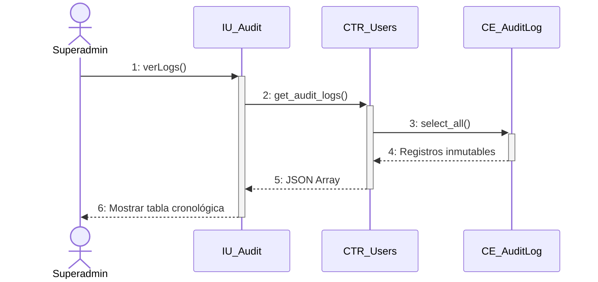
