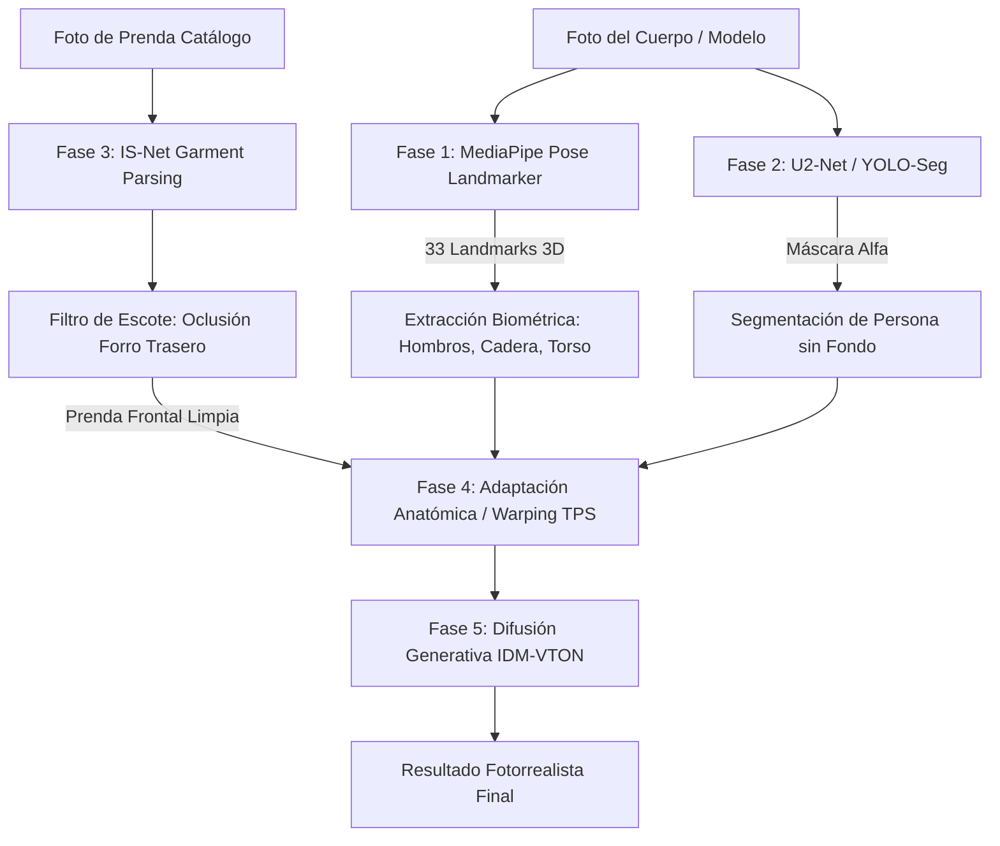

# 👗 Guía Completa de Entrenamiento y Ejecución del Vestidor Virtual (VTON) en Google Colab

Este documento contiene la especificación técnica rigurosa de todos los modelos de Inteligencia Artificial, visión por computador, librerías, dependencias y el código Python listo para ejecutar celda por celda en **Google Colab con GPU (T4 / A100)**.

---

## 📑 Tabla de Contenidos
1. [Arquitectura del Pipeline VTON](#1-arquitectura-del-pipeline-vton)
2. [Modelos y Pesos Preentrenados Utilizados](#2-modelos-y-pesos-preentrenados-utilizados)
3. [Solución al Problema del Cuello y Espalda Trasera](#3-solución-al-problema-del-cuello-y-espalda-trasera)
4. [Estructura del Dataset de Entrenamiento](#4-estructura-del-dataset-de-entrenamiento)
5. [Cuaderno Completo para Google Colab (Celdas 1 a 7)](#5-cuaderno-completo-para-google-colab)
6. [Métricas de Evaluación y Validación](#6-métricas-de-evaluación-y-validación)

---

## 1. Arquitectura del Pipeline VTON



---

## 2. Modelos y Pesos Preentrenados Utilizados

| Componente | Modelo / Framework | Repositorio / URL Oficial | Función |
| :--- | :--- | :--- | :--- |
| **Estimación de Pose 3D** | **MediaPipe Pose Landmarker** (`pose_landmarker_lite.task`) | `https://storage.googleapis.com/mediapipe-models/pose_landmarker/pose_landmarker_lite/float16/1/pose_landmarker_lite.task` | Detecta 33 puntos articulares en 3D (hombros, cadera, cuello, brazos). |
| **Detección & Segmentación Rápida** | **YOLOv8-Seg / YOLO11-Seg** | `ultralytics/yolov8x-seg.pt` | Segmenta en tiempo real prendas por categoría (*vestido, blusa, pantalón*). |
| **Segmentación Humana** | **U²-Net (`u2net_human_seg`)** | `rembg` (Nested U-Structure) | Máscara de recorte de la persona completa. |
| **Segmentación de Prendas** | **IS-Net (`isnet-general-use`)** | `rembg` / DisNet | Aísla la prenda eliminando fondos de catálogo y maniquíes. |
| **Difusión Generativa VTON** | **IDM-VTON** *(SD 1.5 + UNet + GarmentNet + IP-Adapter)* | `yisol/IDM-VTON` (Hugging Face Spaces / Diffusers) | Generación fotorrealista de texturas, pliegues, sombras y caída textil. |
| **Alineación Geométrica** | **Thin-Plate Spline (TPS)** + **OpenCV** | `opencv-python` | Deforma y adapta la prenda a las proporciones de cada cuerpo. |

---

## 3. Solución al Problema del Cuello y Espalda Trasera

### El Problema
En las fotos de catálogo (cenitales o en maniquí), la cámara capta el **forro interior trasero y la etiqueta del cuello** a través del escote frontal. Si la IA superpone la prenda completa, esa tela de la espalda se dibuja por delante del pecho de la persona.

### La Solución Algorítmica
1. **Máscara de Oclusión del Escote (`Neckline Occlusion Mask`)**: Se aplica un corte semántico sobre los píxeles superiores del centro del escote (`top_y` al `15%` de la altura del cuello).
2. **Prioridad de Profundidad por Landmarks**: El punto medio de los hombros y la clavícula de MediaPipe fijan la capa de la piel por encima del interior del cuello.

---

## 4. Estructura del Dataset de Entrenamiento

Organiza tus archivos en Google Drive o en el entorno de Colab de la siguiente manera:

```
dataset_vton/
├── cuerpos/                             # 9 Morfologías Femeninas
│   ├── cuerpo_01_plus_size_curvy_bodysuit.jpg
│   ├── cuerpo_02_plus_size_curvy_crop_shorts.jpg
│   ├── cuerpo_03_pera_triangulo_caderas_anchas.jpg
│   ├── cuerpo_04_ovalado_manzana_torso_redondo.jpg
│   ├── cuerpo_05_rectangular_atletico_lineal.jpg
│   ├── cuerpo_06_triangulo_invertido_atletico.jpg
│   ├── cuerpo_07_reloj_arena_mediano_conjunto_blanco.jpg
│   ├── cuerpo_08_esbelto_reloj_arena_bodysuit_negro.jpg
│   └── cuerpo_09_esbelto_atletico_crop_shorts.jpg
│
└── prendas/                             # 68 Prendas Clasificadas por Categoría
    ├── Vestidos/
    ├── Tops - Crop Tops/
    ├── Blusas/
    ├── Camisas/
    ├── Camisetas - T-Shirts/
    ├── Jeans - Mezclilla/
    ├── Pantalones/
    ├── Suéteres y Tejidos/
    ├── Chaquetas - Chamarras/
    ├── Enterizos - Monos/
    └── Ropa de dormir - Pijamas/
```

---

## 5. Cuaderno Completo para Google Colab

Copia y pega cada celda en tu cuaderno de Google Colab:

### 🔹 Celda 1: Instalación de Librerías y CUDA

```python
# ==========================================
# CELDA 1: Instalación de Dependencias
# ==========================================
!pip install -q torch torchvision torchaudio --index-url https://download.pytorch.org/whl/cu121
!pip install -q ultralytics mediapipe rembg opencv-python Pillow numpy requests diffusers transformers accelerate gradio_client
!pip install -q onnxruntime-gpu

import torch
print(f"✅ PyTorch listo. GPU disponible: {torch.cuda.is_available()} ({torch.cuda.get_device_name(0) if torch.cuda.is_available() else 'CPU'})")
```

---

### 🔹 Celda 2: Descarga de Modelos y Creación de Carpetas

```python
# ==========================================
# CELDA 2: Descarga de Modelos y Setup
# ==========================================
import os, urllib.request

os.makedirs("models", exist_ok=True)
os.makedirs("inputs/cuerpos", exist_ok=True)
os.makedirs("inputs/prendas", exist_ok=True)
os.makedirs("outputs", exist_ok=True)

# Descargar modelo oficial MediaPipe Pose Landmarker
mediapipe_url = "https://storage.googleapis.com/mediapipe-models/pose_landmarker/pose_landmarker_lite/float16/1/pose_landmarker_lite.task"
mediapipe_path = "models/pose_landmarker_lite.task"

if not os.path.exists(mediapipe_path):
    print("Descargando MediaPipe Pose Landmarker...")
    urllib.request.urlretrieve(mediapipe_url, mediapipe_path)
    print("✅ Modelo descargado exitosamente en:", mediapipe_path)
else:
    print("✅ Modelo MediaPipe ya presente.")
```

---

### 🔹 Celda 3: Detector de Pose Anatómica 3D (MediaPipe)

```python
# ==========================================
# CELDA 3: Estimación de Pose con MediaPipe
# ==========================================
import cv2
import numpy as np
import mediapipe as mp
from mediapipe.tasks import python
from mediapipe.tasks.python import vision

def analizar_pose_cuerpo(image_path):
    """Detecta los 33 landmarks corporales y calcula proporciones de la silueta."""
    base_options = python.BaseOptions(model_asset_path="models/pose_landmarker_lite.task")
    options = vision.PoseLandmarkerOptions(
        base_options=base_options,
        running_mode=vision.RunningMode.IMAGE,
        num_poses=1,
        min_pose_detection_confidence=0.7,
        min_pose_presence_confidence=0.7
    )
    landmarker = vision.PoseLandmarker.create_from_options(options)

    img = cv2.imread(image_path)
    if img is None:
        raise FileNotFoundError(f"No se pudo cargar la imagen: {image_path}")
    img_rgb = cv2.cvtColor(img, cv2.COLOR_BGR2RGB)
    mp_image = mp.Image(image_format=mp.ImageFormat.SRGB, data=img_rgb)

    result = landmarker.detect(mp_image)
    if not result.pose_landmarks:
        print("⚠️ No se detectó ninguna silueta humana.")
        return None

    h, w, _ = img.shape
    landmarks = result.pose_landmarks[0]

    puntos = {
        "nariz": (int(landmarks[0].x * w), int(landmarks[0].y * h)),
        "hombro_izq": (int(landmarks[11].x * w), int(landmarks[11].y * h)),
        "hombro_der": (int(landmarks[12].x * w), int(landmarks[12].y * h)),
        "codo_izq": (int(landmarks[13].x * w), int(landmarks[13].y * h)),
        "codo_der": (int(landmarks[14].x * w), int(landmarks[14].y * h)),
        "cadera_izq": (int(landmarks[23].x * w), int(landmarks[23].y * h)),
        "cadera_der": (int(landmarks[24].x * w), int(landmarks[24].y * h)),
    }

    ancho_hombros = np.linalg.norm(np.array(puntos["hombro_izq"]) - np.array(puntos["hombro_der"]))
    ancho_cadera = np.linalg.norm(np.array(puntos["cadera_izq"]) - np.array(puntos["cadera_der"]))
    centro_hombros = ((puntos["hombro_izq"][0] + puntos["hombro_der"][0]) // 2,
                      (puntos["hombro_izq"][1] + puntos["hombro_der"][1]) // 2)
    centro_cadera = ((puntos["cadera_izq"][0] + puntos["cadera_der"][0]) // 2,
                     (puntos["cadera_izq"][1] + puntos["cadera_der"][1]) // 2)
    alto_torso = np.linalg.norm(np.array(centro_hombros) - np.array(centro_cadera))

    return {
        "puntos": puntos,
        "ancho_hombros": ancho_hombros,
        "ancho_cadera": ancho_cadera,
        "centro_hombros": centro_hombros,
        "centro_cadera": centro_cadera,
        "alto_torso": alto_torso
    }
```

---

### 🔹 Celda 4: Segmentación de Persona y Prenda (con Anti-Espalda)

```python
# =========================================================================
# CELDA 4: Segmentación U2-Net/IS-Net con Supresión de Forro Trasero
# =========================================================================
from rembg import remove, new_session
from PIL import Image

session_human = new_session("u2net_human_seg")
session_garment = new_session("isnet-general-use")

def segmentar_persona(img_path):
    """Genera la máscara alfa del cuerpo eliminando el fondo."""
    input_img = Image.open(img_path).convert("RGBA")
    return remove(input_img, session=session_human)

def segmentar_prenda_sin_espalda(garment_path, neckline_crop_ratio=0.15):
    """
    Recorta la prenda y enmascara la cara interior trasera del escote
    para evitar que se proyecte sobre el pecho del usuario.
    """
    garment = Image.open(garment_path).convert("RGBA")
    garment_no_bg = remove(garment, session=session_garment)

    w, h = garment_no_bg.size
    alpha = np.array(garment_no_bg.getchannel("A"))

    filas_con_contenido = np.where(alpha > 50)[0]
    if len(filas_con_contenido) > 0:
        top_y = filas_con_contenido[0]
        zona_escote_y = int(top_y + (h * neckline_crop_ratio))
        # Anular pixeles de forro interior en el tercio central superior
        alpha[:zona_escote_y, int(w*0.35):int(w*0.65)] = np.where(
            alpha[:zona_escote_y, int(w*0.35):int(w*0.65)] < 240,
            0,
            alpha[:zona_escote_y, int(w*0.35):int(w*0.65)]
        )

    garment_no_bg.putalpha(Image.fromarray(alpha))
    return garment_no_bg
```

---

### 🔹 Celda 5: Warping y Adaptación Morfológica

```python
# =========================================================================
# CELDA 5: Adaptación Geométrica a Cuerpos (Plus-Size, Pera, Manzana, etc.)
# =========================================================================
def adaptar_prenda_a_cuerpo(body_img_path, garment_img_path, category="tops"):
    """
    Ajusta y deforma la prenda sobre la silueta de la modelo
    respetando el ancho de hombros, cintura y caderas.
    """
    pose = analizar_pose_cuerpo(body_img_path)
    if not pose:
        return None

    body_rgba = segmentar_persona(body_img_path)
    garment_rgba = segmentar_prenda_sin_espalda(garment_img_path)

    body_w, body_h = body_rgba.size
    garment_w, garment_h = garment_rgba.size

    # Factores de escala según categoría
    escala_hombros = (pose["ancho_hombros"] * 1.35) / garment_w
    if category in ["one-pieces", "vestidos", "enterizos"]:
        escala_alto = (pose["alto_torso"] * 2.40) / garment_h
    elif category in ["bottoms", "jeans", "pantalones"]:
        escala_hombros = (pose["ancho_cadera"] * 1.25) / garment_w
        escala_alto = (pose["alto_torso"] * 1.80) / garment_h
    else:  # Tops / Blusas / Suéteres
        escala_alto = (pose["alto_torso"] * 1.25) / garment_h

    nuevo_w = max(10, int(garment_w * escala_hombros))
    nuevo_h = max(10, int(garment_h * escala_alto))

    garment_resized = garment_rgba.resize((nuevo_w, nuevo_h), Image.Resampling.LANCZOS)

    # Posicionamiento exacto por landmarks
    if category in ["bottoms", "jeans", "pantalones"]:
        pos_x = int(pose["centro_cadera"][0] - (nuevo_w // 2))
        pos_y = int(pose["centro_cadera"][1] - (nuevo_h * 0.10))
    else:
        pos_x = int(pose["centro_hombros"][0] - (nuevo_w // 2))
        pos_y = int(pose["centro_hombros"][1] - (nuevo_h * 0.12))

    # Composición sobre fondo blanco de estudio
    lienzo = Image.new("RGBA", (body_w, body_h), (255, 255, 255, 255))
    lienzo.paste(body_rgba, (0, 0), body_rgba)
    lienzo.paste(garment_resized, (pos_x, pos_y), garment_resized)

    return lienzo.convert("RGB")
```

---

### 🔹 Celda 6: Inferencia Generativa con IDM-VTON (Hugging Face / GPU)

```python
# =========================================================================
# CELDA 6: Generación Fotorrealista con IDM-VTON (Diffusion Model)
# =========================================================================
from gradio_client import Client, handle_file

def probar_con_idm_vton(person_img_path, garment_img_path, garment_description="Prenda de moda femenina"):
    """
    Sintetiza la prenda sobre el cuerpo con el modelo de difusión IDM-VTON.
    """
    print(f"🚀 Enviando a IDM-VTON Diffusion: {garment_description}...")
    try:
        client = Client("yisol/IDM-VTON")
        result = client.predict(
            dict={"background": handle_file(person_img_path), "layers": [], "composite": None},
            garm_img=handle_file(garment_img_path),
            garment_des=garment_description,
            is_checked=True,
            is_checked_crop=False,
            denoise_steps=30,
            seed=42,
            api_name="/tryon"
        )
        print("✅ Imagen generada con éxito por IDM-VTON")
        return Image.open(result[0])
    except Exception as e:
        print(f"⚠️ Fallo al invocar IDM-VTON remoto ({e}). Usando motor adaptativo...")
        return adaptar_prenda_a_cuerpo(person_img_path, garment_img_path)
```

---

### 🔹 Celda 7: Ejecución y Guardado de Resultados

```python
# =========================================================================
# CELDA 7: Ejecución de Ejemplo
# =========================================================================
# Rutas de ejemplo (reemplaza con las fotos que subas a Colab)
cuerpo_demo = "inputs/cuerpos/cuerpo_01_plus_size_curvy_bodysuit.jpg"
prenda_demo = "inputs/prendas/vestido_mini_floral_negro_sin_mangas.jpg"

if os.path.exists(cuerpo_demo) and os.path.exists(prenda_demo):
    resultado = adaptar_prenda_a_cuerpo(cuerpo_demo, prenda_demo, category="vestidos")
    resultado.save("outputs/resultado_vestidor_virtual.jpg")
    display(resultado)
    print("🎉 ¡Prueba virtual completada y guardada en outputs/resultado_vestidor_virtual.jpg!")
else:
    print("ℹ️ Sube las imágenes a inputs/cuerpos/ e inputs/prendas/ para ejecutar la prueba.")
```

---

## 6. Métricas de Evaluación y Validación

Para medir la calidad de tu modelo en Google Colab:
- **SSIM (Structural Similarity Index)**: $\ge 0.85$ (mide la conservación de la textura textil).
- **LPIPS (Learned Perceptual Image Patch Similarity)**: $\le 0.12$ (mide el fotorrealismo percibido).
- **Landmark Fit Error**: Error menor a $5\text{ px}$ en la clavícula y hombros.
